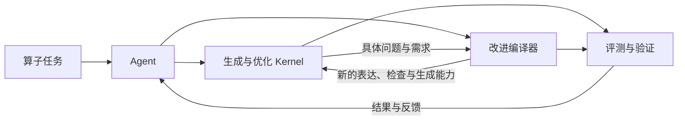

# open-cake-ir

[中文文档](docs/zh-CN/README.md) · [English](docs/en/README.md) · [全部中英文对照](docs/README.md)

**Agent 驱动的编译器与 GPU Kernel 协同进化。**

open-cake-ir 面向由 Agent 完成算子生产的工作方式。Agent 设计、生成、验证和优化 Kernel，
并根据实际任务暴露的问题改进 IR、检查规则、代码生成和分析能力；新的编译能力再用于后续 Kernel。
Python 前端、结构化执行计划、编译反馈与外部评测连接这两条演化路径。

Open-cake-ir is a research system for **agent-driven co-evolution of GPU kernels and compiler capabilities**.
Agents develop kernels, use compiler and GPU feedback, and improve the compiler when real workloads expose
representation, verification, lowering, or analysis gaps. The current distribution is a source-based research preview.

这里的 IR 是“中间表示”：它比最终机器代码好读，又比一句“把矩阵乘快一点”明确。
项目独立重建了 [CAKE 论文](https://arxiv.org/abs/2608.12629v1)中的部分思路，并非论文未公开实现的复制品。

## 从这里开始

- **第一次看项目：** [中文 Wiki](docs/wiki/README.md)，按问题找答案。
- **想马上试用：** [不需要 GPU 的入门教程](docs/GETTING_STARTED.md)。
- **想用代码编写执行计划：** [Python 前端](docs/zh-CN/PYTHON_FRONTEND.md)，支持检查与生成，并保留 JSON 接口。
- **想在 Apple M1 Pro 或 M2 上运行与测量：** [Metal 入门](docs/metal.zh-CN.md) · [English guide](docs/metal.md)，通过 TaskLab 优化 RMSNorm、LayerNorm 和残差 RMSNorm。
- **想在 B300 上用 CuTeDSL 编写与优化 GEMM：** [中文](docs/zh-CN/PAIRED_CUTE.md) · [English](docs/en/PAIRED_CUTE.md)。
- **想知道系统有什么用：** [系统全貌](docs/ARCHITECTURE.md)。
- **想看算子怎么算：** [算子图解](docs/wiki/operators.md)和 [IR 基本操作](docs/wiki/primitives.md)。
- **想看现在发布了什么：** [自动生成的当前状态](reports/current/STATUS.md)。
- **想了解 Agent、编译器与 Kernel 怎样协同进化：** [中文技术报告与完整 Python 示例](https://github.com/qhy991/open-cake-ir/releases/download/research-preview-2026-09-06/open-cake-ir-technical-report-zh-CN.zip)。

Metal 使用 `simd_program_tile`，由线程组的 32 个 lane 协同处理 tile；任务通过现有 TaskLab/Ralph 生成候选并调用公共评测。
测量分别记录主机构建、热调用和 GPU 命令缓冲区时间；加速结论以通过噪声控制的实际收据为准。

## 一条完整路径



编译器可以单独使用，负责读计划、检查规则和生成源码。
研究实验系统（Research Lab）负责让 AI 在固定任务和预算下提出候选方案。
Evaluation 核对答案与测量；Evidence 保存原始记录，让别人能复查。

“计划通过检查”“GPU 答案正确”“速度提高”是三个不同结论。
每个结论都应能找到对应记录，见 [怎样读结果](docs/wiki/results.md)。

## 研究路线与 Milestones

项目的长期目标是建设一个**开放、可复现、能够跨硬件演进的 Kernel–Compiler 协同设计平台，
逐步帮助 Agent 发现优化手段、设计高性能 Megakernel，并在真实模型与应用中验证端到端收益**。
开源实现、可复现迁移、优化方法的发现与跨后端传递、Megakernel 设计支持共同构成研究路线；
论文与公开产物围绕各阶段已经验证的结果组织。

下表是后续目标与验收条件，不表示这些能力已经完成。当前发布状态见[状态页](reports/current/STATUS.md)，
具体成果以绑定实验的报告与原始证据为准。

| 阶段 | 核心交付 | 验收条件与范围 |
| --- | --- | --- |
| **M1：可复现的开放平台** | 开放编译器、Agent 接口、评测流程与完整案例。 | 外部使用者能以明确的环境和有限预算，复现一次 Kernel 优化，以及一次编译能力变化的效果；保留成功、失败和能力边界。 |
| **M2：可复现的跨架构迁移** | 从现有非 NVIDIA 后端中选一个，整理完整迁移案例与可重复的步骤。 | 说明可复用的语义、必须重做的硬件决策、Agent 与人工的工作及成本；在目标设备上验证正确性，并相对该设备的合理基线测量性能。第二个迁移目标用于后续检验方法的可复用性。 |
| **M3：首个 Agent 设计的多阶段融合计划** | 为一个真实子图提供融合边界、数据驻留与调度的设计支持。 | 限定单 GPU、固定子图、静态依赖与有界调度；验证完整输出，对比合理的多 Kernel 基线，并以性能剖析解释收益和失败条件。案例包含实际的跨阶段依赖与资源协调。 |
| **M4：优化机制发现与复用** | 从 Kernel 与 Megakernel 实验中提炼优化机制，将可复用部分落实为变换、选择策略或编译能力，用于第二个不同任务或子图。 | 保留单一机制的前后程序、适用条件与反例；在未参与机制开发的任务上，对比相同模型与预算下的设计成功率、性能和开发成本，记录负收益、能力开发和审查成本。Megakernel 案例同时检查同步与资源生命周期。 |
| **M5：跨后端优化传递与 Megakernel 迁移** | 将已验证的优化方法传递到另一个编译后端或硬件架构，逐步扩展到 Megakernel 设计流程。 | 区分可复用的优化原理、必须重做的硬件实现与不支持的机制；在目标后端比较有无迁移经验的搜索结果与成本，验证正确性、性能和负迁移。各目标使用自己的基线、测量协议和校准。 |
| **M6：端到端接入与加速验证** | 将已验证的 Kernel 或 Megakernel 产物接入一个真实模型、推理框架或应用。 | 固定模型与精度、输入或 token 序列、硬件、框架配置和请求负载，检查完整输出；在相同条件下测量端到端延迟或吞吐，并验证代表性、边界和回退路径。 |

**推进方式：** 每阶段固定一个核心问题、主要工作负载和主要硬件目标，并约定投入上限。
新增能力应解除当前阶段的具体阻塞；动态任务队列、全模型执行和多 GPU 通信随任务证据逐步引入。
M1–M2 可先形成公开平台、迁移报告与论文材料，M3–M4 再形成 Megakernel 的核心研究结果。
M5 与 M6 在前置产物通过验证后按需求安排；已有合格产物可以先做端到端接入，无须等待所有迁移完成。

**优化方法的发现与传递：** 这条主线可从已有单 Kernel 任务开始，再扩展到 Megakernel。
每次围绕一个机制保留“瓶颈与假设 → 前后程序 → 正确性与性能剖析 → 适用条件与反例 → 新任务验证”的证据。
区分已有技巧的重新发现、新的适用条件或组合，以及经相关工作核对的新方法；单次加速不直接作为新颖性结论。
确定性的 Schedule 改写由 Compiler 变换负责，何时使用和如何选参数由 Lab 策略负责；
复用现有 Finding 与原始实验记录，不另建一套经验事实库。
跨后端传递优化原理及其前提，具体的指令、同步和资源分配按目标重新实现，收益重新测量。
在目标后端固定模型、任务、参考访问权限和搜索预算，对比从头搜索与使用迁移经验的结果；
另记来源机制的发现与适配成本，并保留无收益、退化和不适用案例。
先验证一个机制在两个后端上的传递；扩展到更多后端或 Megakernel 由后续证据决定。

**端到端收益单独验收：** 分开报告 Kernel 时间、完整子图或 GPU 执行区间、模型及服务时间，
区分编译初始化与稳态执行。生成式推理按负载报告首 token 延迟、后续 token 延迟和吞吐，保留重复测量与波动。
局部加速不自动代表端到端加速；无收益和回归同样保留，并说明收益被什么开销抵消。
接入通过已验证产物与目标框架的接口完成，Compiler 继续专注于编译，Lab 继续负责搜索与实验。

The roadmap progresses from an open, reproducible platform and documented cross-architecture porting,
through agent-designed multi-stage kernels, optimization discovery and reuse, to cross-backend transfer,
megakernel porting, and end-to-end validation in a real model or application. Transfer preserves an
optimization's rationale and preconditions while revalidating its implementation and benefit on each target.
Each milestone requires its own evidence; kernel speedups, portability, and end-to-end gains are evaluated separately.

## 安装与参与

从源码使用，Python 3.10 或更新版本：

```bash
git clone https://github.com/qhy991/open-cake-ir.git
cd open-cake-ir
python3 -m venv .venv
.venv/bin/python -m pip install -e '.[test]'
```

无 GPU 的检查与源码生成见[入门教程](docs/GETTING_STARTED.md)。GPU 编译、运行和历史实验重放需要各自声明的环境。
当前尚未提供脱离源码工作区的独立 Compiler 发行包；Python 安装不会替你配置 CUDA 或 GPU 评测环境。

[贡献说明](CONTRIBUTING.md) · [安全问题](SECURITY.md) · [开发分支](docs/DEVELOPMENT_BRANCHES.md) · [引用信息](CITATION.cff)

## 许可证

项目自有代码与文档采用 [Apache License 2.0](LICENSE)。第三方组件及引用材料保留原许可，
见 [NOTICE](NOTICE) 与[第三方说明](THIRD_PARTY_NOTICES.md)。本项目与 CAKE 论文及其作者不存在官方实现或背书关系。

## 给维护者

[文档维护](docs/wiki/maintaining.md)说明每类信息写在哪里，以及怎样检查示例和链接。
正式术语见 [GLOSSARY](docs/GLOSSARY.md)，执行流程见 [RUNBOOK](docs/zh-CN/RUNBOOK.md)，
设计决策见 [ADR](docs/adr/README.md)，代码职责见 [CONTEXT-MAP](docs/zh-CN/CONTEXT-MAP.md)。

当前版本只由下面两个文件决定，README 不另存一份版本表：

- [`compiler/revision.lock.json`](compiler/revision.lock.json)：Compiler。
- [`inventory/EXECUTOR_REVISIONS.json`](inventory/EXECUTOR_REVISIONS.json)：Executor。
