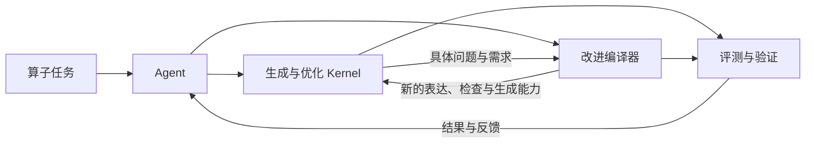

# open-cake-ir

[中文文档](docs/zh-CN/README.md) · [English](docs/en/README.md) · [全部中英文对照](docs/README.md)

**Agent 驱动的编译器与 GPU Kernel 协同进化。**

open-cake-ir 面向由 Agent 完成算子生产的工作方式。Agent 设计、生成、验证和优化 Kernel，
并根据实际任务暴露的问题改进 IR、检查规则、代码生成和分析能力；新的编译能力再用于后续 Kernel。
Python 前端、结构化执行计划、编译反馈与外部评测连接这两条演化路径。

Open-cake-ir is a research system for **agent-driven co-evolution of GPU kernels and compiler capabilities**.
Agents develop kernels, use compiler and GPU feedback, and improve the compiler when real workloads expose
representation, verification, lowering, or analysis gaps. The current distribution is a source-based research preview.

这里的 IR 是“中间表示”：它比最终机器代码好读，又比一句“把矩阵乘快一点”明确。
项目独立重建了 [CAKE 论文](https://arxiv.org/abs/2608.12629v1)中的部分思路，并非论文未公开实现的复制品。

## 从这里开始

- **第一次看项目：** [中文 Wiki](docs/wiki/README.md)，按问题找答案。
- **想马上试用：** [不需要 GPU 的入门教程](docs/GETTING_STARTED.md)。
- **想用代码编写执行计划：** [Python 前端](docs/zh-CN/PYTHON_FRONTEND.md)，支持检查与生成，并保留 JSON 接口。
- **想在 Apple M1 Pro 上运行与测量：** [Metal 入门](docs/metal.zh-CN.md) · [English guide](docs/metal.md)，通过 TaskLab 优化 RMSNorm、LayerNorm 和残差 RMSNorm。
- **想知道系统有什么用：** [系统全貌](docs/ARCHITECTURE.md)。
- **想看算子怎么算：** [算子图解](docs/wiki/operators.md)和 [IR 基本操作](docs/wiki/primitives.md)。
- **想看现在发布了什么：** [自动生成的当前状态](reports/current/STATUS.md)。
- **想了解 Agent、编译器与 Kernel 怎样协同进化：** [中文技术报告与完整 Python 示例](https://github.com/qhy991/open-cake-ir/releases/download/research-preview-2026-09-06/open-cake-ir-technical-report-zh-CN.zip)。

Metal 使用 `simd_program_tile`，由线程组的 32 个 lane 协同处理 tile；任务通过现有 TaskLab/Ralph 生成候选并调用公共评测。
测量分别记录主机构建、热调用和 GPU 命令缓冲区时间；加速结论以通过噪声控制的实际收据为准。

## 一条完整路径



编译器可以单独使用，负责读计划、检查规则和生成源码。
研究实验系统（Research Lab）负责让 AI 在固定任务和预算下提出候选方案。
Evaluation 核对答案与测量；Evidence 保存原始记录，让别人能复查。

“计划通过检查”“GPU 答案正确”“速度提高”是三个不同结论。
每个结论都应能找到对应记录，见 [怎样读结果](docs/wiki/results.md)。

## 安装与参与

从源码使用，Python 3.10 或更新版本：

```bash
git clone https://github.com/qhy991/open-cake-ir.git
cd open-cake-ir
python3 -m venv .venv
.venv/bin/python -m pip install -e '.[test]'
```

无 GPU 的检查与源码生成见[入门教程](docs/GETTING_STARTED.md)。GPU 编译、运行和历史实验重放需要各自声明的环境。
当前尚未提供脱离源码工作区的独立 Compiler 发行包；Python 安装不会替你配置 CUDA 或 GPU 评测环境。

[贡献说明](CONTRIBUTING.md) · [安全问题](SECURITY.md) · [开发分支](docs/DEVELOPMENT_BRANCHES.md) · [引用信息](CITATION.cff)

## 许可证

项目自有代码与文档采用 [Apache License 2.0](LICENSE)。第三方组件及引用材料保留原许可，
见 [NOTICE](NOTICE) 与[第三方说明](THIRD_PARTY_NOTICES.md)。本项目与 CAKE 论文及其作者不存在官方实现或背书关系。

## 给维护者

[文档维护](docs/wiki/maintaining.md)说明每类信息写在哪里，以及怎样检查示例和链接。
正式术语见 [GLOSSARY](docs/GLOSSARY.md)，执行流程见 [RUNBOOK](docs/zh-CN/RUNBOOK.md)，
设计决策见 [ADR](docs/adr/README.md)，代码职责见 [CONTEXT-MAP](docs/zh-CN/CONTEXT-MAP.md)。

当前版本只由下面两个文件决定，README 不另存一份版本表：

- [`compiler/revision.lock.json`](compiler/revision.lock.json)：Compiler。
- [`inventory/EXECUTOR_REVISIONS.json`](inventory/EXECUTOR_REVISIONS.json)：Executor。
