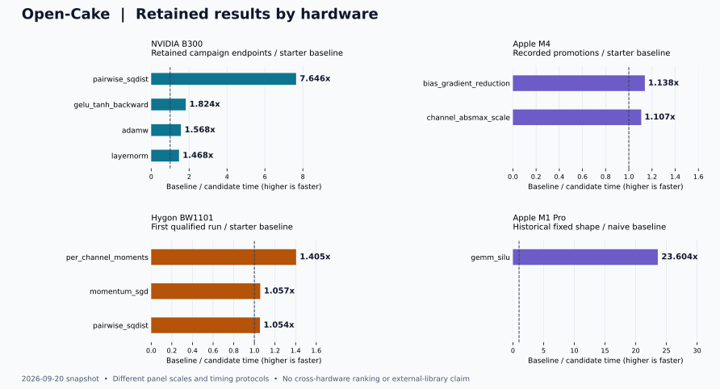

# open-cake-ir

**Agent 驱动的 GPU Kernel 搜索与 Compiler 演进。**

Agent 用 Python 编写显式执行计划，在固定任务与编译器版本下迭代 Kernel；
编译诊断和 GPU 评测帮助定位问题，维护 Agent 再将可复用的改进落实到编译器，供后续任务使用。
也支持从已有优秀实现出发，提取执行机制并用 Cake 改写。

A research system for agent-driven GPU kernel search and compiler evolution.

框架提出[跨硬件的可执行优化知识迁移](docs/OPTIMIZATION_TRANSFER.md)：将 Agent 发现的优化机制
沉淀为带前提的显式变换，在目标平台重新选择参数并验证；通过机制材料与变换调用的消融，
研究经验如何降低后续探索成本。已有有限 pass 作为基础，迁移效果仍待受控实验验证。

[技术报告 / Technical report](docs/README.md) · [中文文档](docs/zh-CN/README.md) · [English](docs/en/README.md) · [当前状态](reports/current/STATUS.md)

<!-- hardware-results:start -->
## 按硬件查看成果

各硬件分支独立维护发布数据，main 汇总已经合入的版本。**加速比 = 各自固定基线耗时 ÷ 候选耗时**，超过 1× 表示更快。
各平台的输入与计时协议不同，图中各面板使用独立刻度；不作跨硬件排名，也不将任务基线当作厂商最优库。



| 硬件 | 维护分支 | 已收录观察 | 独立数据与页面 |
|---|---|---:|---|
| NVIDIA | [nvidia](https://github.com/qhy991/open-cake-ir/tree/nvidia/docs/results/nvidia) | 119 | [B300 多任务与 CAKE 对照；B200 正确性记录](docs/results/nvidia/README.md) |
| Apple | [metal](https://github.com/qhy991/open-cake-ir/tree/metal/docs/results/metal) | 4 | [M1 Pro / M4 / M2；历史确认、晋升与稳定性边界](docs/results/metal/README.md) |
| Hygon DCU | [dcu](https://github.com/qhy991/open-cake-ir/tree/dcu/docs/results/dcu) | 32 | [BW1101；首个合格结果、后续运行与失败记录](docs/results/dcu/README.md) |
| AMD | [amd](https://github.com/qhy991/open-cake-ir/tree/amd/docs/results/amd) | 1 | [gfx1151；计时边界待解决](docs/results/amd/README.md) |

观察数包含同一任务的不同形状、实验集合与历史尝试，不是任务总数。平台页注明数据日期和验证边界。

[main 完整汇总](docs/RESULTS.md) · [交互目录源码 / 下载后打开](docs/results/index.html) · [平台更新与汇总流程](docs/RESULTS_MAINTENANCE.md)

目录区分 Campaign 内最佳合格候选、历史晋升、正确性记录与未合格结果，保留确认历史和固定来源链接。
NVIDIA 页面单列 [CAKE 对照与改写进度](docs/NVIDIA_CAKE_REPRODUCTION.md)；原始实验与端到端验证范围见该报告。
<!-- hardware-results:end -->

## 快速开始

需要 Python 3.10+，从源码安装：

```bash
git clone https://github.com/qhy991/open-cake-ir.git
cd open-cake-ir
python3 -m venv .venv
.venv/bin/python -m pip install -e '.[test]'
```

按[入门教程](docs/GETTING_STARTED.md)完成无需 GPU 的检查与源码生成。
GPU 构建、运行和测量需要对应目标的工具链与设备环境。

## 继续阅读

- [系统架构](docs/ARCHITECTURE.md)：Kernel 搜索与 Compiler 演进如何衔接。
- [Python 前端](docs/zh-CN/PYTHON_FRONTEND.md)：如何编写执行计划。
- [已有 Kernel 改写](docs/KERNEL_REPRODUCTION.md)：参考实现、实验输入与验证流程。
- [概念与算子导读](docs/wiki/README.md)：从任务理解 IR 和评测结果。
- [研究路线](docs/ROADMAP.md)：跨架构迁移、优化复用与端到端验证目标。

硬件指南、设计决策与历史材料见[文档目录](docs/README.md)。

## 参与与引用

[贡献说明](CONTRIBUTING.md) · [平台与分支维护](docs/DEVELOPMENT_BRANCHES.md) · [安全问题](SECURITY.md) · [引用信息](CITATION.cff)

现有中英文文档共同构成本仓库的技术报告，作者为秦海岩（Haiyan Qin）。
报告入口提供推荐引用和 BibTeX；引用具体章节时使用提交永久链接。
测量结果另注明其源码提交、精确硬件目标、工作负载和计时范围。
联系：Haiyan Qin <haiyanq@buaa.edu.cn>。

本项目独立探索 [CAKE 论文](https://arxiv.org/abs/2608.12629v1)的部分思路，属于源码研究预览，并非官方实现。
自有代码与文档采用 [Apache-2.0](LICENSE)；第三方许可见 [NOTICE](NOTICE) 与[第三方说明](THIRD_PARTY_NOTICES.md)。
