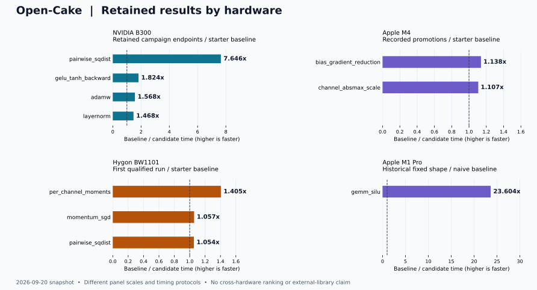

<p align="center">
  
</p>

<h1 align="center">open-cake-ir</h1>

<p align="center"><strong>面向跨硬件优化经验复用的 Agent–Compiler 框架。</strong><br />
An agent–compiler framework for reusable optimization mechanisms across hardware.</p>

<p align="center">
  <a href="docs/open-cake-ir-technical-report.pdf">技术报告 PDF</a> ·
  <a href="docs/open-cake-ir-technical-report.tex">TeX 源码</a> ·
  <a href="docs/GETTING_STARTED.md">快速开始</a> ·
  <a href="docs/RESULTS.md">实验结果</a> ·
  <a href="docs/en/README.md">English</a>
</p>

open-cake-ir 以 Compiler 为核心，研究如何把优化发现整理成带条件的可执行机制，
在目标硬件上重新选择分块、工作分配和资源配置，并确认正确性与性能。Agent 通过
Schedule / Program 编写执行计划；独立原生探索也可提供发现，经过审查与重新验证后
沉淀为变换、诊断或编译能力。项目独立探索 [CAKE](https://arxiv.org/abs/2608.12629v1)
的研究思路，属于研究预览。

**共同研究问题：这种经验复用能否减少后续任务的搜索成本，同时保持对强原生实现的性能竞争力？**
实现、局部设备结果与研究处理效果分别报告。各硬件分支遵循
[共同研究主题与实验约定](docs/RESEARCH_AGENDA.md)。

[中文阅读入口](docs/zh-CN/README.md) · [Wiki 阅读索引](docs/wiki/README.md) · [项目当前状态](reports/current/STATUS.md)

## 独立 Bench 与 Compiler 演进

Cake 的开发任务用于发现并修复 IR、Verifier、改写和 lowering 的不足；发布后的固定
Compiler 由各硬件的独立 Bench 检验。共同流程见[开发与评测标准](docs/BENCHMARK_PROTOCOL.md)。

| 分支 / 硬件 | 独立 Bench | 当前进步记录 |
|---|---|---|
| metax / C550 | [c550-bench](https://github.com/qhy991/c550-bench) | [单题正确性已有证据；Bench 性能尚未测](docs/results/metax/BENCHMARK_PROGRESS.md) |
| metal / Apple M4 | [metal-bench](https://github.com/qhy991/metal-bench) | [软件验证通过；GPU 资格与性能待测](docs/results/metal/BENCHMARK_PROGRESS.md) |
| dcu / gfx938 | [bw1100-bench](https://github.com/qhy991/bw1100-bench) | [正确性入口与开发 replay 已有证据；版本进步对照待测](docs/results/dcu/BENCHMARK_PROGRESS.md) |

每轮进步绑定 Compiler 与 Bench 两个版本，在同任务、参考和测量口径下展示前后时间、
正确性覆盖和失败。token 只记账。历史开发结果按原始协议保留，新的 Bench 成绩另行追加。

<details>
<summary>MetaX 历史开发实验与工程搜索（独立 Bench 成绩另见上表）</summary>

## MetaX C550：关键实验与当前结论

本分支维护 C550 的执行与验证。下面是**精选证据导览**，不合并不同基线、形状或计时协议的分数。
历史实验保留原始源码和判定；近期运行使用 Claude Code 2.1.226 / GLM-5.3，精确目标为 `xcore1002`。

| 实验 | 已得到的结论 | 证据与适用范围 |
|---|---|---|
| 80 次 E/P 经验／工具试点 | 全部终态；原预算口径 47/80 成功。按用户要求纳入 12 次超预算但确认有效的提升后，为 **59/80** | 单个 FP32 求差平方算子族、4 个固定形状；见下方四组明细。不能当成未见任务泛化或无限预算搜索 |
| N 输出分块 | 显式 pass 生成的候选通过独立确认，固定案例 **3.33×** | `R128 K256 N32`，相对该任务固定基线；[Finding](findings/2026-10-03-003-squared-distance-output-tiling.json) |
| 固定循环部分展开 | factor 2 在两形状确认约 **1.111× / 1.060×**；factor 4 反而变慢 | 有效机制需要目标选参，不能默认越展开越快；[Finding](findings/2026-10-04-005-metax-fixed-partial-unroll.json) |
| N/K/展开联动改写 | 共享候选构造与守卫已合入；是否改善搜索仍需实测 | [PR 306](https://github.com/qhy991/open-cake-ir/pull/306)；不把软件通过写成设备收益 |
| FP8 流式与有限输入分桶配方 | Cake K1 流式在固定 NT64 primary 上确认 **5.80×**；后续分桶／合并另有独立基线 | [流式与分桶证据](docs/metax-c550.md#显式-k1-流式-fp8-lowering)；是软件组合路线，不是原生 FP8 dot，分段加速比不连乘 |
| 数值原语与完整计算 | FMA、舍入等有有界数值证据；GQA、MLA、FP8 MoE 有完整原始 case 正确性记录 | [数值与矩阵](docs/metax-c550.md#编译与执行) · [完整计算](docs/metax-c550.md#完整-gqamla-和-fp8-moe-的正确性)；正确性与 profiler 时间不等于端到端加速 |
| 四卡并行资格 | 固定 N4 求差平方案例的 12 次串行 A/A、12 次并行 A/A、4 次 profile 通过 | 源码 `0c041d6d`，物理 GPU1–4；仅限这一案例和声明的本机锁范围，不代表整套任务面板通过 |
| 短 kernel 与采集边界 | Softmax 等部分案例未通过原计时质量门；一个大形状 Run 因零宽 L2 重置时间戳停止 | [当前采集 Finding](findings/2026-10-06-002-mcpti-default-reset-zero-interval.json)；保留失败，不改 CV 门槛，不把无效测量记成加速 |

<details>
<summary>展开 80 次试点：四组结果、统计口径和原始证据</summary>

E 是额外机制材料，P 是变换调用权。每组 20 Run；固定 K64 基线不是厂商最优库。

| 组别 | 原预算内成功 | 不按预算排除的已确认提升 | 缺失 |
|---|---:|---:|---:|
| E0P0 | 14/20 | 18/20 | 2/20 |
| E1P0 | 12/20 | 16/20 | 3/20 |
| E0P1 | 8/20 | 12/20 | 8/20 |
| E1P1 | 13/20 | 13/20 | 5/20 |

两种口径共用既有独立确认，不重跑、不改数值或测量门。59 次提升之外，仍有 18 次缺失与 3 次未成功。
相同材料下开放工具的差值从原口径的 +5 个百分点变为事后口径的 −15 个百分点。
这批数据支持“能找到本机优化”，**尚不支持工具整体提高成功率**。
四个形状已被协议先导探索，不能称为完全未见测试；未预注册置信区间。

来源源码：`5b588ceca20ee33f9a8bec3304af64fc069477c0`。
原始证据：`c550-2:/root/open-cake-experiments/c550-compaction-successor-20261002/`，
冻结分配 `study-v1/`、原审计 `study-audit.json`。本机审查投影位于
`c550-compaction-successor/final-analysis-20261004/` 的 `analysis-summary.json`、
`performance-without-budget-exclusion.json` 与逐 Run 确认导出。
本机串行测量未排除不遵守同一锁的外部活动。事后口径只移除预算排除，不模拟无限搜索。

</details>

### 2026-10-06 工程搜索复核

本轮固定源码 [`0c041d6d`](https://github.com/qhy991/open-cake-ir/commit/0c041d6dbecf7529384de9410a7c64d82c00a9d3)，使用已验收的同任务基线。
该源码属于独立验收分支，尚未合入当前 `metax`；[代码集成 PR 318](https://github.com/qhy991/open-cake-ir/pull/318) 与本页证据发布分别处理。以下为 2026-10-06 12:03（北京时间）收集的封存结果；
它们独立于上面的 80 次历史试点。

| Run / 物理卡 | 形状 R/K/N | 作者轮数 | 独立确认：候选 / 基线 | 状态 |
|---|---|---:|---|---|
| development-r1 / GPU1 | 128/512/64 | 42 | 8.448 / 8.192 µs，0.970× | 正常封存，无收益 |
| large-r1 / GPU2 | 256/1024/64 | 9 | 无确认结果 | MCPTI 重置记录零宽，`broker_fault`，保留缺失 |
| large-r2 / GPU3 | 256/1024/64 | 47 | 21.504 / 22.272 µs，1.036× | 正常封存；未达到原 1.05× 提升门槛 |
| large-r3 / GPU4 | 256/1024/64 | 43 | 21.504 / 22.272 µs，1.036× | 正常封存；未达到原 1.05× 提升门槛 |

三个完整 Run 的原审计均为 `protocol_adherence=adhered`，并记录搜索时间上限停止；
原终点为 `no_qualified_candidate`。上表只描述已通过共同确认的计时，不能据此改判成功。
本次配置相对较强 N4 起点只找到小幅变化，不能据此推定性能上限；它不推翻旧 K64 基线上的优化结果，
也不构成不同 Compiler 版本的因果对照。

**继续执行：**已在 GPU1 通过新的同基线 A/A，启动 `c550-distance-r256-k1024-n64-20261006-r4`。
仍使用 Claude Code / GLM-5.3、三小时总预算（含 1080 秒确认预留）、相同 N4 起点与原数值／计时门。
这是新的独立工程重复，不替换 large-r1，也不向作者提供前三次的搜索候选。
记录位于下述近期根目录的 `continuation-20261006-r4/`；运行状态以其事件和确认报告为准。
新 A/A 只支持这一次控制，不能消除已记录的偶发 MCPTI 缺口，因此暂不扩大新并行批次。

四卡控制证据：`c550-2:/root/open-cake-runs-reviewed/c550-device-parallel-20261005/outputs/parallel-controls-namespace/`。
近期工程 Run：`c550-2:/root/open-cake-runs-reviewed/c550-evolution-parallel-author-20261006/`。
新实验沿用[共同研究主题](docs/RESEARCH_AGENDA.md)与[数据采集／处理协议](docs/OPTIMIZATION_TRANSFER_ABLATION.md)。
每项默认 3 小时，包含最终确认；工程重复不回填为 H1/H2 科学对照。

</details>

## 快速导航

| 你想做什么 | 直接入口 | 能看到什么 |
|---|---|---|
| 第一次了解或运行项目 | [快速开始](#快速开始) · [入门教程](docs/GETTING_STARTED.md) | 安装、无需 GPU 的检查与源码生成 |
| 阅读或引用技术报告 | [PDF 正文](docs/open-cake-ir-technical-report.pdf) · [TeX 源码](docs/open-cake-ir-technical-report.tex) · [引用与配套专题](docs/README.md) | 设计、实例、方法、结果及其证据范围 |
| 查看 FlashInfer 改写与外部实现差距 | [逐任务实验综述](docs/results/nvidia/FLASHINFER_STATUS.md) | starter 身份、配对性能、正确性、失败边与未完成项 |
| 查看各硬件成果和使用方法 | [实验结果](#按硬件查看成果) · [硬件指南](#硬件指南) | 已收录观察、平台工具链和验收范围 |
| 编写 Kernel、发起优化或改写已有实现 | [Python 前端](docs/zh-CN/PYTHON_FRONTEND.md) · [Lab 任务流程](docs/wiki/experiments.md) · [改写指南](docs/KERNEL_REPRODUCTION.md) | 输入格式、任务用途、参考材料、预算与评测 |
| 修改实现或定位问题 | [源码结构](#源码与文档结构) · [系统架构](docs/ARCHITECTURE.md) · [开发流程](docs/DEVELOPMENT_BRANCHES.md) | 模块职责、扩展位置、分支与测试要求 |

**报告与当前状态：**PDF 由仓库中的 TeX 编译，封面标注它所读的源码快照；
[报告索引](docs/README.md)提供引用方式和持续维护的专题文档。当前实现见
[生成状态页](reports/current/STATUS.md)。具体实验仍按各自绑定的源码、硬件、Workload
和计时协议解释。

## 系统怎样工作

Workload 定义计算与标准答案；Agent 提交完整 Schedule / Program；Compiler 检查并生成源码；
Evaluation 核对输出、计时与 profiler；Evidence 保存原始观察，供审计和后续改进使用。
Compiler 可以独立使用，Research Lab 负责组织优化或受控研究。

| 核心部分 | 用途 | 进一步阅读 |
|---|---|---|
| Compiler | IR、合法性检查、显式变换、目标代码生成与静态分析 | [IR 导读](docs/IR_GUIDE.md) · [精确编写契约](compiler/AUTHORING_CONTRACT.md) |
| Research Lab | 组织 Agent、参考访问、材料与变换授权、预算和候选迭代 | [Lab 架构](docs/contexts/lab/CONTEXT.md) · [任务流程](docs/wiki/experiments.md) |
| Evaluation | 独立检查正确性、配对计时及性能归因 | [评测职责](docs/contexts/evaluation/CONTEXT.md) · [验收规则](docs/ACCEPTANCE_GATES.md) |
| Evidence | 保存原始产物、回放记录与支持结论的依据 | [证据职责](docs/contexts/evidence/CONTEXT.md) · [结果阅读](docs/wiki/results.md) |

机制设计见[跨硬件的可执行优化知识迁移](docs/OPTIMIZATION_TRANSFER.md)：把发现的机制提炼为带前提的显式变换，
在目标平台重新选择参数并验证。已有有限 pass 和研究流程作为基础，迁移收益仍按[受控消融](docs/OPTIMIZATION_TRANSFER_ABLATION.md)验证。

## 快速开始

需要 Python 3.10+。下面先离线检查 Softmax，再生成可阅读的 Triton 源码；这些步骤不需要 GPU：

```bash
git clone https://github.com/qhy991/open-cake-ir.git
cd open-cake-ir
python3 -m venv .venv
.venv/bin/python -m pip install -e '.[test]'
CAKE_DEMO_DIR=$(mktemp -d)
.venv/bin/open-cake-ir compiler assess --format text examples/python/softmax.py
.venv/bin/open-cake-ir compiler lower --format text examples/python/softmax.py \
  --output "$CAKE_DEMO_DIR/softmax.py"
```

检查结果中的“结构检查：通过”与“生成代码：允许”说明这份计划通过了当前软件门；
生成文件在 `$CAKE_DEMO_DIR/softmax.py`。[技术报告的 Softmax 实例](docs/open-cake-ir-technical-report.pdf)
逐项对照 Python Schedule 和生成的 Triton 代码。[完整入门教程](docs/GETTING_STARTED.md)
从更小的 FMA 示例解释诊断。设备正确性和性能还需对应工具链与 GPU 环境，见下方硬件指南。

<!-- hardware-results:start -->
## 按硬件查看成果

各平台维护自己的发布数据，main 汇总已合入的版本。观察条目包括形状、实验集合和历史尝试，**不是任务总数**。

| 硬件 | 维护分支 | 已收录观察 | 结果页面 |
|---|---|---:|---|
| NVIDIA | [nvidia](https://github.com/qhy991/open-cake-ir/tree/nvidia/docs/results/nvidia) | 134 | [B300 多任务与 CAKE 对照；B200 正确性记录](docs/results/nvidia/README.md) |
| Apple | [metal](https://github.com/qhy991/open-cake-ir/tree/metal/docs/results/metal) | 4 | [M1 Pro / M4 / M2；历史确认、晋升与稳定性边界](docs/results/metal/README.md) |
| Hygon DCU | [dcu](https://github.com/qhy991/open-cake-ir/tree/dcu/docs/results/dcu) | 32 | [BW1101；首个合格结果、后续运行与失败记录](docs/results/dcu/README.md) |
| AMD | [amd](https://github.com/qhy991/open-cake-ir/tree/amd/docs/results/amd) | 1 | [gfx1151；计时边界待解决](docs/results/amd/README.md) |

[完整结果与原始证据](docs/RESULTS.md) · [FlashInfer 逐任务对比](docs/results/nvidia/FLASHINFER_STATUS.md) · [CAKE 对照与改写](docs/NVIDIA_CAKE_REPRODUCTION.md)

[交互目录（下载后打开）](docs/results/index.html) · [发布数据维护流程](docs/RESULTS_MAINTENANCE.md)

**加速比 = 各自固定基线耗时 ÷ 候选耗时**，超过 1× 表示更快。正确性、计时质量与性能收益分别记录；各平台协议不同，不作跨硬件排名。

<details>
<summary>展开代表结果图（各平台独立刻度）</summary>



图表展示选定的历史观察；完整表格保留失败、无显著差异和未实测记录。各自任务基线不等于厂商最优库。

</details>
<!-- hardware-results:end -->

## 硬件指南

| 平台 | 运行与开发入口 |
|---|---|
| NVIDIA B200 / B300 | [B300 入门](docs/B300.md) · [原生 CUDA / PTX](docs/zh-CN/NATIVE_CUDA.md) · [Triton 配对](docs/PAIRED_TRITON.md) · [CuTe DSL 配对](docs/zh-CN/PAIRED_CUTE.md) |
| Apple Metal | [中文指南](docs/metal.zh-CN.md) · [English guide](docs/metal.md) |
| AMD | [任务入口与当前边界](docs/amd-task-entrypoints.md) |
| Hygon DCU | [设计与运行路径](docs/dcu-gfx938-design.md) · [设备结果](docs/dcu-gfx938-results.md) |
| MetaX C550 | [当前路径与验收范围](docs/metax-c550.md) |

指南说明各自的接入与验证范围。MetaX 的精选证据见本页前部；其数据尚未纳入上方四个平台的自动汇总表。

## 源码与文档结构

| 位置 | 内容与入口 |
|---|---|
| [compiler/](src/open_cake_ir/compiler/) · [Target 文档](compiler/targets/) | IR、Verifier、后端和精确硬件声明；[IR 指南](docs/IR_GUIDE.md) |
| [lab/](src/open_cake_ir/lab/) · [evaluation/](src/open_cake_ir/evaluation/) · [evidence/](src/open_cake_ir/evidence/) | 候选搜索、外部评测和运行证据；[职责地图](CONTEXT-MAP.md) |
| [tasks/](src/open_cake_ir/tasks/) · [contracts/](contracts/) | Workload、oracle 和任务实现；[任务目录](docs/wiki/workloads.md) |
| [examples/](examples/) · [corpus/](corpus/) · [tests/](tests/) | 可读示例、编译器语料和合同测试；[贡献说明](CONTRIBUTING.md) |
| [docs/](docs/README.md) · [findings/](findings/) · [reports/](reports/) | 报告索引、问题记录与[当前状态](reports/current/STATUS.md)；[完整目录](docs/catalog.md) |

更细的模块边界见 [Context map](CONTEXT-MAP.md)，平台操作与历史材料见[文档总目录](docs/catalog.md)，按主题阅读见[Wiki](docs/wiki/README.md)。

## 参与与引用

- **参与开发：** [贡献说明](CONTRIBUTING.md) · [平台与分支维护](docs/DEVELOPMENT_BRANCHES.md) · [设计决策](docs/adr/README.md) · [研究路线](docs/ROADMAP.md)。
- **引用报告：** [PDF 正文](docs/open-cake-ir-technical-report.pdf) · [TeX 源码](docs/open-cake-ir-technical-report.tex) · [B300 MoE 案例](docs/WEAVE_CASE_STUDY.md) · [推荐引用与 BibTeX](docs/README.md#引用--citation) · [机器可读引用](CITATION.cff)。引用具体论点请记录所读提交；实验结果还需注明各自的源码版本与测量范围。
- **问题与许可：** [安全问题](SECURITY.md) · [Apache-2.0](LICENSE) · [NOTICE](NOTICE) · [第三方说明](THIRD_PARTY_NOTICES.md)。

作者：秦海岩（Haiyan Qin），联系：<haiyanq@buaa.edu.cn>。
本项目是独立研究实现，不是 CAKE 论文的官方源码。
