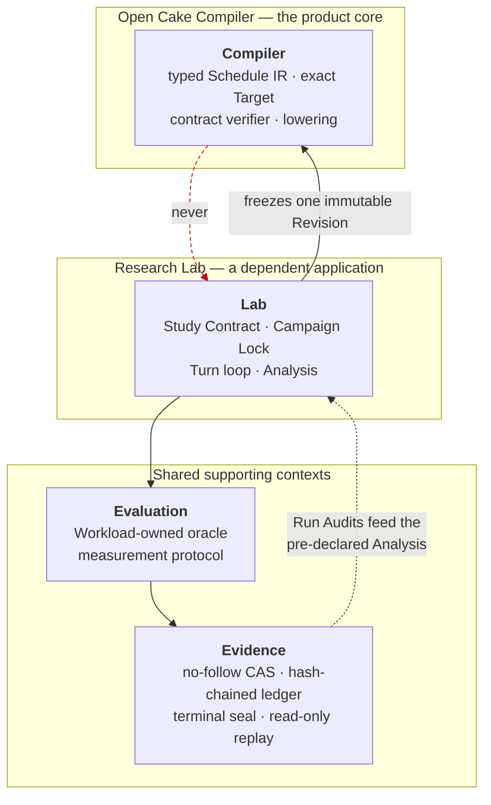
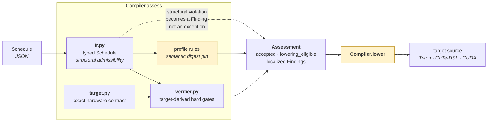
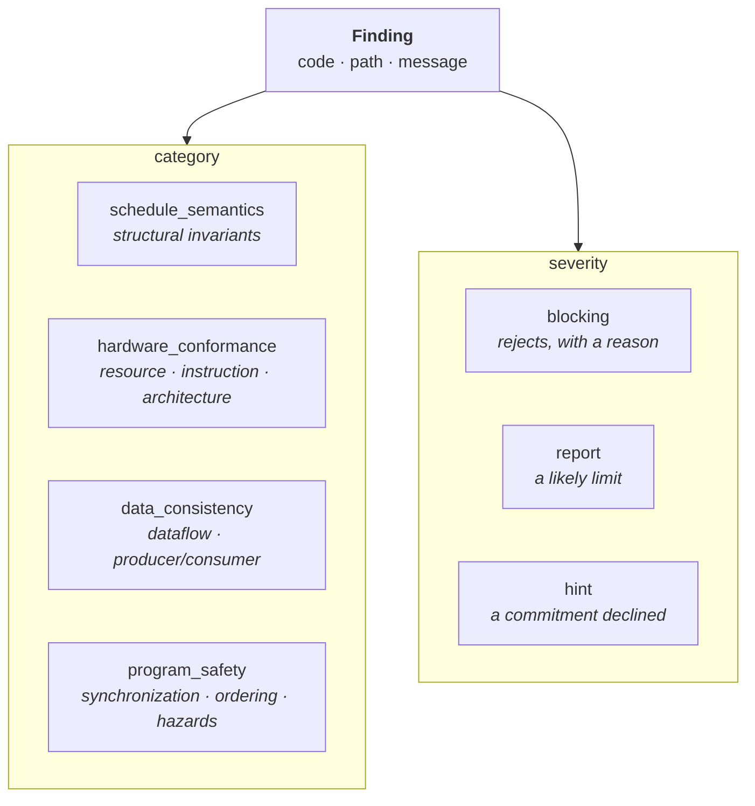
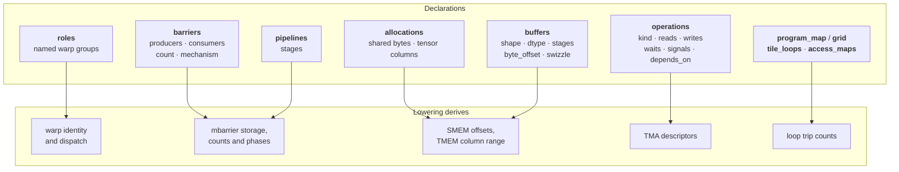
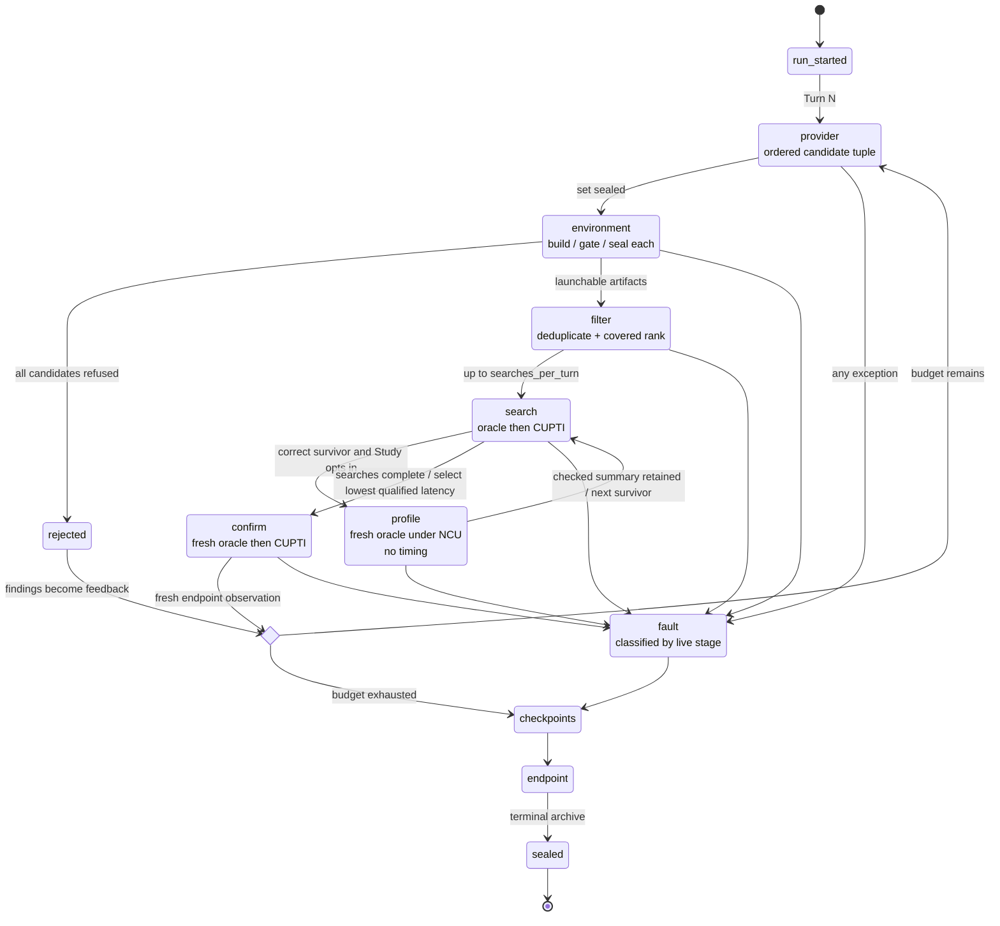
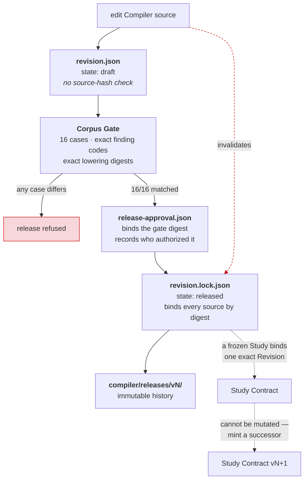
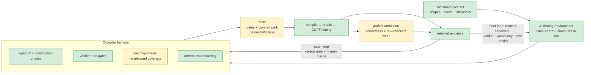

# Architecture

Six diagrams for the six things that are hard to see from the source tree. They describe
what the code does today, including where it falls short of
[`PAPER_CONTRACT.md`](PAPER_CONTRACT.md) — a diagram that flatters the implementation is
worse than none.

Vocabulary is defined in [`CONTEXT-MAP.md`](../CONTEXT-MAP.md); claim boundaries live in
[`ACCEPTANCE_GATES.md`](ACCEPTANCE_GATES.md).

---

## 1. Contexts and the dependency direction

The repository's central structural claim: the Compiler is usable on its own, and the
arrow never points back at it. Verified by a contract test that imports
`open_cake_ir.compiler` in a fresh interpreter and asserts no Lab, Evaluation or
Evidence module was loaded.

A runtime observation may motivate a compiler change, but only an external Corpus Gate
and a human merge can create the next Revision — see diagram 5.

---

## 2. The Compiler pipeline

`assess` composes three owners; `lower` is a fourth stage that has not caught up.

`lower` generates the warp-specialized profile from its Schedule — warp dispatch,
mbarrier storage and participants, TMA descriptors, TMEM custody, the loop nest and every
operation body — verified on a B200 at 128/128 exact assignments. The two remaining
profiles still stamp a checked-in file, which is why the box is amber; each will follow
once its Schedule carries the commitments emission requires. `profile rules` pin a
whole-document digest for those two, and that pin disappears with the file it protects.

### Findings

Every finding names the offending path and the violated contract. The four categories
are the ones the paper's harness reports; the three severities are its three
dispositions.

---

## 3. What a Schedule commits to

The paper has the agent write down five concrete hardware commitments. Each one the
Schedule declines is a decision the backend makes instead, invisibly.

For the retained warp-specialized Schedule the emitter derives all thirteen module
constants its hand-written artifact hardcodes, and generates a kernel that runs correctly
from those declarations alone. See
[`tests/contracts/test_emit_cutedsl.py`](../tests/contracts/test_emit_cutedsl.py),
which compares them directly.

---

## 4. A Study Run

The Lab owns every transition. The provider and the evaluator only return observations.

The four paper stages have one internal control path: the provider Interface can return an
ordered candidate tuple; every member is built and gated, equivalent programs are
evaluated once, released ranking coverage may order them, and `searches_per_turn` bounds
GPU work. Under the current attribution operation, every correctness-qualified search
survivor receives a separate no-timing NCU launch before search timing selects one
Candidate for a fresh confirmatory assay. All profiles remain Evidence; only the selected
Candidate's checked summary becomes next-Turn feedback.

That diagram is now also the bounded live candidate-set path. Successor
`CodexRunProvider` prompts, file lifecycle and normalizer seal one canonical envelope and
project its ordered members into the same build/filter/search path; frozen Studies retain
their singleton compatibility edge. ADR 0009 records that boundary, and the non-scientific
candidate-set v2 Campaign exercised it on B200, and the v3 successor exercised complete
correct-search-survivor attribution under Executor v18. Remaining breadth gaps are
released cost-ranking coverage and a preregistered scientific Campaign.

---

## 5. Compiler Revision lifecycle

Non-obvious and load-bearing: **any edit to a Revision-bound source invalidates the
released lock.** That is deliberate, and it is why wiring new code into the Compiler is
a gated event rather than a commit.

`tools/release_compiler_cycle.sh` drives the cycle end to end, because a single
Compiler-source edit requires all of it again. Frozen Study Contracts are consumed through
explicit successors rather than being re-stamped.

---

## 6. Alignment with the paper

Green is implemented and exercised; amber exists but is short of the paper; red is
absent. Sources: [`PAPER_CONTRACT.md`](PAPER_CONTRACT.md) and
[arXiv:2608.12629v1](https://arxiv.org/abs/2608.12629).

| Element | State |
| --- | --- |
| Workload Contract | implemented |
| Authoring Environment, both arms | implemented |
| Typed IR and construction checks | implemented, on the product path since Revision v4 |
| Verifier hard gates, four categories | implemented, on the product path since Revision v4 |
| Compile → external oracle → GPU timing | implemented, B200-verified on 5 emitted operators |
| Profiler evidence in the inner loop | partial relative to the paper — Executor v18 composes the canonical no-timing NCU assay after every correctness-qualified search survivor, retains raw/profile replay for all of them and feeds back the selected profile; a bounded live v18 two-arm successor covers selected and non-selected survivors, while a preregistered scientific Campaign is not yet covered |
| Retained evidence and the outer loop gate | implemented; stronger than the paper describes |
| Deterministic lowering | `lower` generates for 6 of the 7 admitted profiles: Triton for `flash_kmeans_b32_smoke`, `rmsnorm_b8_smoke`, `softmax_b8_smoke`, `layernorm_b8_smoke` and `gemm_bias_b1_smoke`, warp-specialized CuTe-DSL for `flash_kmeans_assignment_full`. `tinygemm2_stage4_split_k` still stamps a digest into a checked-in file |
| Live candidate-set authoring | implemented and bounded-live exercised — both Codex 0.144.4 policies pass two-arm envelope qualification, and candidate-set v2 produced three launchable Candidates and searched two in each arm on B200; the Campaign is system qualification only |
| The filter stage | partial — construction, verifier filtering and semantic deduplication are implemented and live exercised, but v8 exposes no calibrated cost order; eligible candidates retain provider order before `searches_per_turn` selects GPU work |
| Diagnosis routing | implemented — every rejection is routed to the candidate, the verifier, the IR vocabulary or the cost model, and each destination is inferred from a signal the loop already produces |
| Cost-model ranking | mechanism implemented but no released coverage — the structural hypothesis remains measurable, while public ranking declines every current profile |

The filter box is amber because its hard gates are active but its cost ranking has no
released calibration coverage. Missing coverage is an observable state, not a silent
fallback to an unvalidated order.

**What the filter does.** At the Lab Interface a provider Turn may submit a set. Every
candidate in it is built, gated and sealed — a rejected one is evidence, not a discard.
Two candidates that are the same program under different names are searched once. A
released profile-specific cost would order eligible candidates before GPU time; with v8's
empty coverage they retain provider order. Executor v17 applies that order only when every
launchable member is scored; if the model declines one member, the whole set retains
provider order because unknown is not slower. `searches_per_turn` bounds how many survive
to measurement; confirmatory evaluation stays single, because that one is the measurement
a claim rests on. Candidate-set v2 exercised this with three launchable members and two
GPU searches in each arm; older frozen Studies still use the singleton edge.

**What the ranking is worth.** The dormant hypothesis orders on device fill and declines
past saturation. It used to sort on wave count first; a sweep across four predicted wave
boundaries found latency linear in CTA count and no step, so that term is gone. Expanded
B200 domains then put device-fill top-1 regret at 1.72% in one non-preregistered GEMM
sweep and 19.43% on Flash-KMeans (`docs/ANALYSIS_CALIBRATION.md`). The former is
insufficient for promotion and the latter is negative evidence, so v8 publishes no cost
order rather than turning a coarse search hint into a claimed filter. A preregistered
successor then tested the Lab's actual three-to-two cut over all 2,300 eligible GEMM
triplets: two independent repeats failed the 5% boundary at 35.95% and 8.16%. This rules
out promotion even for that measured shape and shows why a deterministic `schedule_id`
tie-break is total ordering, not performance evidence.

That is why the loop routes a wrong order to the cost model rather than to the author, and
why a Study that searches more than one candidate has to declare how much faster counts as
wrong: on a loss surface where 24 of 37 candidates sit within 6% of the best, routing every
inversion would report mostly measurement error.

**What the analysis supplies.** Residency upper bounds and the resource that binds them,
which is the report the harness owes the agent. Both bounds held in the direction claimed
on five kernels across both backends, and the predicted binding resource was always among
the measured binders. Only three measurements identified one resource uniquely; registers
and shared memory tied on Flash-KMeans and GEMM, so naming either discriminated nothing.
Logical register storage is an optimistic lower bound and not ptxas allocation; no time is
estimated, because the Target declares no clock and no bandwidth.
