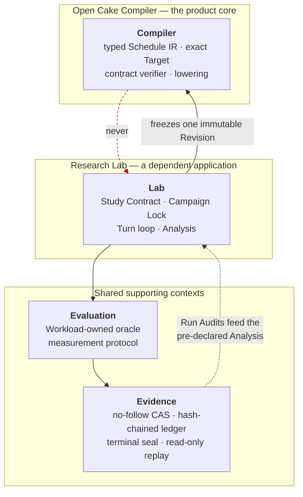
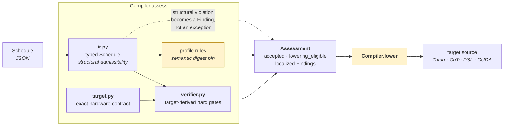
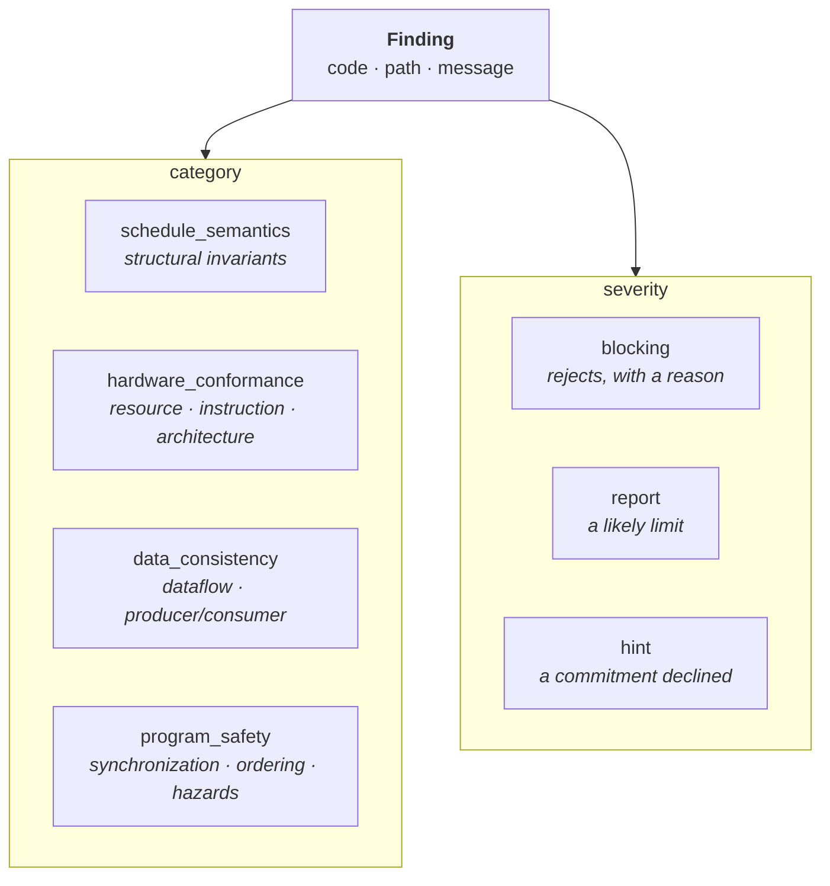
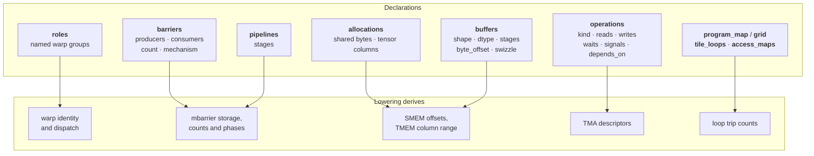

# Architecture

Six diagrams for the six things that are hard to see from the source tree. They describe
what the code does today, including where it falls short of
[`PAPER_CONTRACT.md`](PAPER_CONTRACT.md) — a diagram that flatters the implementation is
worse than none.

Vocabulary is defined in [`CONTEXT-MAP.md`](../CONTEXT-MAP.md); claim boundaries live in
[`ACCEPTANCE_GATES.md`](ACCEPTANCE_GATES.md).

---

## 1. Contexts and the dependency direction

The repository's central structural claim: the Compiler is usable on its own, and the
arrow never points back at it. Verified by a contract test that imports
`open_cake_ir.compiler` in a fresh interpreter and asserts no Lab, Evaluation or
Evidence module was loaded.

A runtime observation may motivate a compiler change, but only an external Corpus Gate
and a human merge can create the next Revision — see diagram 5.

---

## 2. The Compiler pipeline

`assess` composes three owners; `lower` is a fourth stage that has not caught up.

`lower` generates the warp-specialized profile from its Schedule — warp dispatch,
mbarrier storage and participants, TMA descriptors, TMEM custody, the loop nest and every
operation body — verified on a B200 at 128/128 exact assignments. The two remaining
profiles still stamp a checked-in file, which is why the box is amber; each will follow
once its Schedule carries the commitments emission requires. `profile rules` pin a
whole-document digest for those two, and that pin disappears with the file it protects.

### Findings

Every finding names the offending path and the violated contract. The four categories
are the ones the paper's harness reports; the three severities are its three
dispositions.

---

## 3. What a Schedule commits to

The paper has the agent write down five concrete hardware commitments. Each one the
Schedule declines is a decision the backend makes instead, invisibly.

For the retained warp-specialized Schedule the emitter derives all thirteen module
constants its hand-written artifact hardcodes, and generates a kernel that runs correctly
from those declarations alone. See
[`tests/contracts/test_emit_cutedsl.py`](../tests/contracts/test_emit_cutedsl.py),
which compares them directly.

---

## 4. A Study Run

The Lab owns every transition. The provider and the evaluator only return observations.

The paper's inner loop has four stages — generate several structurally distinct
candidates, **filter** them with construction checks, verifier gates and cost-model
ranking before spending GPU time, evaluate the survivors, then route the evidence. The
prompt here says *write exactly one candidate*, so there is no candidate set and the
filter stage has nowhere to exist. That is the largest remaining divergence; diagram 6
places it.

---

## 5. Compiler Revision lifecycle

Non-obvious and load-bearing: **any edit to a Revision-bound source invalidates the
released lock.** That is deliberate, and it is why wiring new code into the Compiler is
a gated event rather than a commit.

`scratchpad/release_v4.sh` in the branch history drives the cycle end to end, because a
single compiler edit requires all of it again.

---

## 6. Alignment with the paper

Green is implemented and exercised; amber exists but is short of the paper; red is
absent. Sources: [`PAPER_CONTRACT.md`](PAPER_CONTRACT.md) and
[arXiv:2608.12629v1](https://arxiv.org/abs/2608.12629).

```mermaid
graph LR
    W["Workload Contract<br/>shapes · oracle · tolerances"] --> AE
    AE["Authoring Environment<br/>Cake IR arm · direct CUDA arm"] --> CH

    subgraph CH["Compiler harness"]
        direction TB
        T1["typed IR + construction checks"]
        T2["verifier hard gates"]
        T3["cost model:<br/>attribution, no estimate"]
        T4["deterministic lowering"]
    end

    CH --> FIL["<b>filter</b><br/>rank and prune<br/>before GPU time"]
    EVD -->|"route: candidate · verifier<br/>vocabulary · cost model"| AE
    FIL --> EX["compile → oracle → CUPTI"]
    EX --> EVD["retained evidence"]
    EVD -->|inner loop| AE
    EVD -->|"outer loop<br/>corpus gate + human merge"| CH

    style T1 fill:#d4edda,stroke:#28a745
    style T2 fill:#d4edda,stroke:#28a745
    style T4 fill:#d4edda,stroke:#28a745
    style T3 fill:#fff3cd,stroke:#b8860b
    style FIL fill:#d4edda,stroke:#28a745
    style W fill:#d4edda,stroke:#28a745
    style AE fill:#d4edda,stroke:#28a745
    style EX fill:#d4edda,stroke:#28a745
    style EVD fill:#d4edda,stroke:#28a745
```

| Element | State |
| --- | --- |
| Workload Contract | implemented |
| Authoring Environment, both arms | implemented |
| Typed IR and construction checks | implemented, on the product path since Revision v4 |
| Verifier hard gates, four categories | implemented, on the product path since Revision v4 |
| Compile → external oracle → GPU measurement | implemented, B200-verified on three emitted operators |
| Retained evidence and the outer loop gate | implemented; stronger than the paper describes |
| Deterministic lowering | implemented for four of five profiles: `lower` generates Triton for `flash_kmeans_b32_smoke`, `rmsnorm_b8_smoke` and `softmax_b8_smoke`, and warp-specialized CuTe-DSL for `flash_kmeans_assignment_full`. `tinygemm2_stage4_split_k` still stamps a digest into a checked-in file |
| The filter stage | implemented — a Turn submits a candidate set, every candidate is built and sealed, the set is ordered before any of it runs, and `searches_per_turn` decides how much of it reaches a GPU |
| Diagnosis routing | implemented — every rejection is routed to the candidate, the verifier, the IR vocabulary or the cost model, and each destination is inferred from a signal the loop already produces |
| Cost-model ranking | partial, and narrower than it was — see below |

The filter box is green because the mechanism is there, and the cost model beside it is
amber because measurement said so. Both facts came from the same week's work and they are
worth stating together.

**What the filter does.** A provider Turn submits a set. Every candidate in it is built,
gated and sealed — a rejected one is evidence, not a discard — and the set is ordered by
`compiler/ranking.py` before any of it reaches a GPU. Two candidates that are the same
program under different names are searched once. `searches_per_turn` bounds how many
survive to a measurement; confirmatory evaluation stays single, because that one is the
measurement a claim rests on.

**What the ranking is worth.** It orders on device fill and declines past saturation, and
that is the whole model. It used to sort on wave count first; a sweep across four predicted
wave boundaries found latency linear in CTA count and no step at any of them, so the term
is gone (`docs/ANALYSIS_CALIBRATION.md`). What is left beat a blind pick on Flash-KMeans
and did not on RMSNorm — one kernel of support rather than a general capability. The
order is advice from a model that has been right about one kernel.

That is why the loop routes a wrong order to the cost model rather than to the author, and
why a Study that searches more than one candidate has to declare how much faster counts as
wrong: on a loss surface where 24 of 37 candidates sit within 6% of the best, routing every
inversion would report mostly measurement error.

**What the analysis supplies.** Residency upper bounds and the resource that binds them,
which is the report the harness owes the agent. Both bounds held in the direction claimed
on three kernels across both backends, and the binding resource was named correctly each
time — though on Flash-KMeans registers and shared memory tie, so naming one discriminated
nothing. Logical register storage is an optimistic lower bound and not ptxas allocation;
no time is estimated, because the Target declares no clock and no bandwidth.
