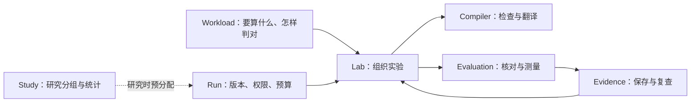
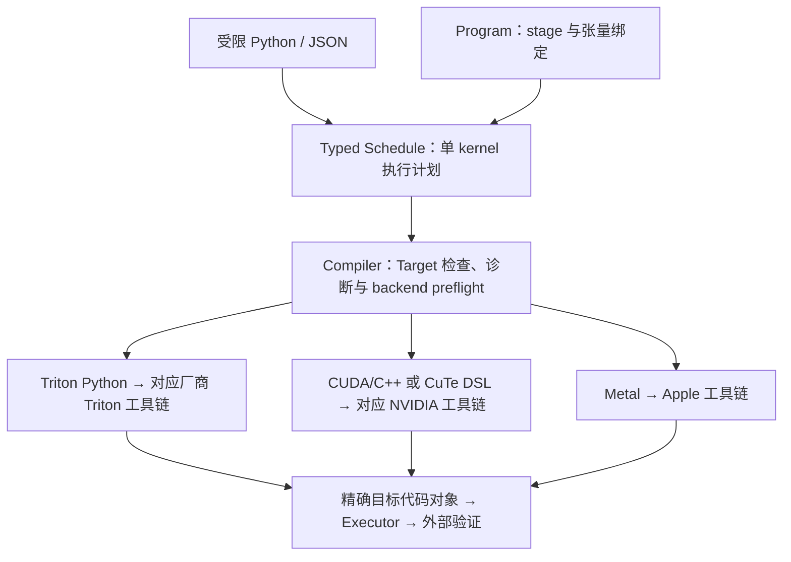

# 系统全貌：怎样把一个想法变成可验证的 GPU 程序

[中文首页](zh-CN/README.md) · [English](en/ARCHITECTURE.md) · [中英文对照](README.md)

open-cake-ir 解决的问题是：**让计算方法写得明确，让错误能定位，让改进有证据。**
这份文档解释稳定的职责；当前版本和数量只看 [发布状态](../reports/current/STATUS.md)。

[返回 Wiki](wiki/README.md) · [术语查询](GLOSSARY.md)

## 1. 为什么不直接让 AI 写最快的代码

比如把一张表的每行求和，数学很简单，GPU 上却有多种做法：一组线程处理一行，还是分成几块？
数据读一次后能否复用？两组线程会不会同时改一个答案？

只说“更快”没有给出这些选择。直接看最终机器代码，又很难发现改动的原因。
本项目在两者中间放一份执行计划（Schedule），把数据、分工、顺序和资源写出来。
编译器据此检查并生成代码；真实机器上的测量决定它到底对不对、快不快。

它的研究价值在于能复查的过程：哪项选择变了，为什么被接受或拒绝，哪个结果支持改进。
项目规模、AI 忙了多久、写了多少代码，都不是性能证据。

## 2. 四部分各做一件事

| 部分 | 用普通话说 | 输入与输出 |
| --- | --- | --- |
| Compiler，编译器 | 检查完整程序及叶子执行计划，执行显式改写并生成源码 | Program / Schedule → 检查与生成 |
| Research Lab，实验系统 | 按冻结权限和预算组织优化；Study 分配与分析研究条件 | Workload + RunSpecification → 一次 Run |
| Evaluation，评测 | 先核对答案，再按相同规则计时和分析瓶颈 | 固定候选 → 检查与测量记录 |
| Evidence，证据存储 | 保存事实，并让别人从记录重建结论 | 原始产物 → 审计 → 报告 |

编译器能独立工作。Lab 会调用编译器、评测和证据存储；编译器不反过来依赖 AI、实验或报告。



## 3. 任务、实现、执行与研究各有负责者

以“对每行数值做归一化”为例：

- **Workload，任务约定：** 输入有几行、每行几个数，怎样算标准答案，容许多少误差。
- **Schedule，执行计划：** 哪组线程处理哪一行，数据放在哪里，先做什么再做什么。
- **Program，完整程序：** 公共输入输出、各 Schedule 的顺序和张量绑定；融合可以改变 stage 数量。
- **Run，一次优化：** 固定版本、作者环境、材料与变换权限、预算及评测规则；普通工程优化不需要 Study。
- **Study，实验约定：** 比较哪些写程序的环境，每组运行几次，预算多少，怎样解释结果。

数学任务可以不变，而执行计划改变。实验约定也必须预先固定，否则结果出来后再换标准就失去可比性。
正式含义和负责者见 [术语表](GLOSSARY.md)。

## 4. 编译器怎样处理计划

### Cake IR、DSL 与 Triton 的层级

本项目的 Cake IR 是**带类型、显式硬件执行计划的领域专用表示**。受限 Python 前端是
它的 DSL 编写形式，JSON 是同一 Schedule 的文档形式；二者进入同一 typed IR，Python
前端不编译任意 Python 程序。整个 open-cake-ir 还包含 Compiler、Lab、Evaluation 与
Evidence，因此项目的范围大于一种 DSL。本项目独立探索 [CAKE 论文](https://arxiv.org/html/2608.12629v1)
的思路，下面描述本仓库实现，不把论文实现或性能归给本仓库。

新建的已知实现复现 Run 使用 `python_source_v1`：Agent 编写 Python Schedule，作者提交入口
拒绝手写的 Schedule/Program JSON；Compiler Pass 生成的 Program 文档仍是内部候选。
冻结 Run 的 `schedule_or_python_v1`、旧 Clean-start 的不完整 JSON 参考材料、Corpus 和回放
保持原有合同。新 Clean-start 的 Python 参考材料只含公开 ABI、目标、生成路线和 `...` 占位，
精确字节由 Lab 检查；当前 Provider 尚无可验证的读取隔离，实际启动被拒绝，见
[ADR 0077](adr/0077-python-clean-start-reference-and-read-isolation.md)。
新单候选、无 transform 的 `python_source_file_v1` Run 可直接写 `candidate.py`，见
[ADR 0078](adr/0078-python-source-file-provider-submission.md)。新默认多候选 Run 写一个
`candidate-set.py`：多个完整 Schedule 函数和获准的静态 transform 声明按源码顺序形成候选，
Lab 保存原始字节并确定性投影，见 [ADR 0079](adr/0079-ordered-python-candidate-bundles.md)。
静态 `cake.program` 还可把同文件的完整 Schedule 组合为一个多阶段候选；公共 tensor
及阶段读写由 typed Program 检查，不要求作者填写 Program JSON。
`candidate-set.json` 留给冻结合同的回放，不再是新已知实现复现任务的默认作者输入。
成对 Study 的 Cake 与原生臂分别固定 Python 和 JSON 提交及各自的 Provider 资格证明；
共同的模型、预算与测量合同仍相等，见 [ADR 0080](adr/0080-paired-studies-bind-provider-transport-per-arm.md)。
Compiler 内部文档往返继续收敛；每一步保留原提交，不原地改写历史证据。
每一步采用后继 Run 合同并保留冻结实验的原提交，不原地改写历史证据。

| 层级 | 表示与负责的决策 | 尚未决定的事情 |
| --- | --- | --- |
| 任务语义 | Workload 与外部 oracle 固定输入输出、数学和数值验收 | 如何分块、融合或调度 |
| 完整程序 IR | Program 固定公共张量、stage 顺序与绑定；每个 stage 包含完整 Schedule | 不是任意模型图的自动优化前端；当前组合是静态、同 stream 的程序 |
| kernel 调度 IR | Schedule 声明操作、Buffer、执行分组、访问坐标、循环、存储与同步承诺 | 不直接给出全部物理寄存器、最终机器指令与实测时延 |
| 生成源码 | backend 将合法 Schedule 翻译成 Triton Python、CUDA/C++、CuTe DSL 或 Metal | 生成成功仍需对应工具链编译 |
| 工具链与执行 | 对应工具链生成精确目标的代码对象，Executor 加载并评测 | 编译通过不能代替外部正确性与性能确认 |

所以 Schedule 是 **kernel 的调度级 IR**：比只写数学算子的图更具体，通常比最终机器码
更抽象。不能简单说它在所有维度上都比 Triton 更高层。Triton 路线将部分物理布局、
寄存器分配和指令选择交给 Triton；原生路线可以表达更细的目标指令、存储和同步承诺。
统一的是表示与验证接口，各路线接受的 Schedule 子集和硬件控制粒度不同。



**Triton 是可选的生成路线和下游编译基础，不是 Cake IR 的格式。**
`Compiler.lower()` 调用后端生成可检查源码；Triton 路线随后由 `compile_triton()` 使用
`ASTSource` 和 `GPUTarget` 编译，并不是把 Cake IR 直接交给 Triton 读取，也不是直接
生成 Triton 的 MLIR dialect。普通 NVIDIA 路线保留 TTIR、TTGIR、LLIR、PTX、CUBIN；
其他厂商保留其工具链实际提供的产物，不能假定均经过 PTX。

复用 Triton 的工程价值是让 CAKE 专注于显式计划、合法性、变换与诊断，利用下游已有的
block 运算实现、指令选择及机器代码生成。代价是这条路线的表达和优化空间受该版本
Triton/backend 约束：例如 `triton.dot` 的物理 placement 由下游决定，CAKE 不能承诺
它不会兑现的 placement。需要更细硬件控制时，应在有实际需求和验证的前提下完善相应
原生路线；当前四个后端不是可随意互换、能力等价的实现。

定义与实现分别见 [Python 前端](../src/open_cake_ir/compiler/frontend.py)、
[Program](../src/open_cake_ir/compiler/ir/program.py)、[Schedule](../src/open_cake_ir/compiler/ir/schedule.py)、
[后端清单](../src/open_cake_ir/compiler/backends/__init__.py)、
[Triton emitter](../src/open_cake_ir/compiler/backends/triton.py)和
[工具链](../src/open_cake_ir/compiler/toolchain.py)。国产卡接入、机制迁移与目标架构优化的
阶段和证据边界由[迁移章节](OPTIMIZATION_TRANSFER.md#国产卡迁移与目标架构协同优化)说明。

### 从计划到源码的检查

```text
检查格式与类型
  → 检查依赖、地址、资源和硬件规则
  → 给出 Assessment（检查结果）和 Finding（具体诊断）
  → 如果允许，生成目标源码
```

Finding 保留具体位置、四类合同中的 `category`、`severity`，以及是否阻止结构验收和生成。
`Assessment.findings` 保留现有 Corpus Gate 检查的阻塞诊断和报告；`Assessment.guidance`
单独携带 `hint` 提示。提示不改变验收结果。CLI、Lab 和 profile 报告都会展示这些提示，
但提示既不是 GPU 正确性证明，也不是测量结果。

当前计划通过原生 CUDA、Triton、CuTe DSL 或 Metal 生成源码，名字分别是 `native_cuda`、
`triton`、`cutlass_cute_dsl` 和 `metal`。专用的 `checked_cuda_asset` 路线已退役：原 TinyGEMM2
Schedule 留作结构拒绝用例，旧固定源码结果只能在绑定的历史 Git 版本中重放。
当前 `Lowering.generated` 为真；历史记录中该字段的原有含义保留。

### 编译器内部的负责位置

- `core.py` 连接公开接口并组合 lowering；`ir/program.py` 拥有程序结构与数据流约束，`program.py` 拥有 LoweredProgram 及代码绑定，`program_passes.py` 拥有完整程序改写；`revision.py` 加载版本，`corpus.py` 逐项对照预期。
- `diagnostics.py` 拥有诊断类型；`verifier/` 拥有四类通用规则。后端专属限制由后端报告，阻止生成，不把可表达的计划误判为结构错误。
- [backends](../src/open_cake_ir/compiler/backends/__init__.py) 的 `BACKENDS` 是唯一静态后端清单。每个后端实现 `requirements`、`preflight`、`emit`，注册项可声明原始输入检查；Triton 的 `pointer_type(DType)` 负责指针类型拼写。
- [performance](../src/open_cake_ir/compiler/performance/__init__.py) 归集工作量、驻留、profile、编译资源、经验成本和利用率。同一输入的分析结果计算一次并显式传递，不另设全局缓存。

新增后端时，先定义目标、输入、拒绝条件及上述三个方法，再在唯一清单登记。
给支持与拒绝的真实组合补测试；CLI 词汇表直接读取同一清单。
通过完整 Corpus Gate 和独立审查后才能发布后继。只增加后端名字不能代替实现或硬件验证。

`tools/profile_lowered_kernel.py` 的新报告使用 schema 2：不再输出
`predicted.registers_per_thread_lower_bound` 和 `verdict.register_floor_sound`。
实测占用限制中的物理寄存器项称为 `registers`。测量值、单位与估计范围不变，历史 schema 1 报告保留原样。

检查只覆盖模型中已经写明的规则。例如，声明了多少共享内存可以被检查；
后端后来额外分配多少寄存器或共享内存，需要看编译产物和实际机器。
因此，“结构合法”仍可能“后端无法生成”；“能生成”也不等于“已经编译或运行”。

## 5. AI 怎样参与

Lab 为每次独立尝试生成固定任务材料；CLI 作者收到两个文件：

- `TASK.md`：题目、输入输出、评测方法、预算和固定参考。
- `AGENTS.md`：工具与行为规则。

AI 提交候选，外部控制器 Ralph 记录预算和当前状态，再决定继续还是停止。
评测器单独核对候选；AI 自己说“通过”不能替代评测记录。
不同候选有各自固定的内容，旧结果不会被后来编辑覆盖。

当前唯一的 Study kind 是 `matched_search`。旧 `portfolio` Study 生命周期已退役，历史回放使用原提交（ADR 0071）。
普通优化直接准备 Run；研究通过 Study 预分配相同的 Run。旧 CampaignLock 只在输入边界适配，
两者共用搜索、预算、确认与审计。受限消息作者只接收冻结材料和本 Run 历史，用于控制消融的信息访问。
完整服务部署属于之后的接入与评测工作。见 [实验流程](wiki/experiments.md)。

### 面向 Agent 的设计如何起作用

这里的“Agent 友好”指**候选容易按明确合同修改，失败能定位到可行动的边界，昂贵评测有
前置筛选，下一轮收到可核对的反馈**；它不是某个模型必然获得更高性能的结论。
接口沿同一条候选路径协作：

| Agent 需要解决的问题 | 当前提供的接口 | 对下一步的帮助 |
| --- | --- | --- |
| 题目、可见参考和预算是什么 | Workload 固定语义与 oracle；RunSpecification 固定目标、参考权限、材料、可调用变换、评测和预算；[任务包](../src/open_cake_ir/lab/task_package.py)交付 `TASK.md`、`AGENTS.md` | 作者只在获准范围内构造候选，结果能对应同一题目与环境 |
| 哪个 GPU 决策可以修改 | 受限 [Python 前端](../src/open_cake_ir/compiler/frontend.py)生成 canonical Schedule；[Schedule IR](IR_GUIDE.md)显式声明执行组、分块、存储、地址、操作和同步；显式 pass 返回完整候选或拒绝原因 | 使一次改动及其适用条件可检查，不用从目标机器码反推原先的计划 |
| 为什么这个候选不能继续 | `Compiler.assess` 区分结构验收与 lowering 资格；[Finding](../src/open_cake_ir/compiler/diagnostics.py)给出稳定代码、字段路径、合同类别、严重度及阻断范围，Python 输入保留源码位置 | 先修指定数据边、资源或后端缺口；报告与 hint 不被误读为正确性或性能证明 |
| 哪些候选值得花设备时间 | 类型/语义、Verifier 和 backend preflight 先拒绝不适用方案；只有显式绑定且覆盖当前上下文的经验成本模型才参与排序，否则保持作者顺序 | 减少无效编译与 GPU 尝试，同时保留模型不覆盖时的未知状态 |
| 上一轮实际证明了什么 | 外部 Evaluation 分开返回完整判对、测量质量、基线比较和可用 profiler；[Ralph 反馈](../src/open_cake_ir/lab/execution.py)连同 Findings 与预算状态供下一轮使用，Evidence 留存候选、原始样本及实际交付材料 | Agent 可以根据数值错误、测量噪声、资源诊断或明确拒绝分别修改假设 |

例如 [FMA 反例](../corpus/schedules/fma-b8-smoke-arity-drift.json)把第三个输入从 `fma`
操作的 reads 中删掉。当前 `assess` 返回 `ELEMENTWISE_ARITY`，位置为
`operations[3].reads`，说明 FMA 需要三个操作数而候选只有两个；同份 Assessment 的
`RESIDENCY_BOUND` 是资源报告。Agent 应修复操作输入，不必把资源报告当作错误，也不用先
消耗一次 GPU 运行来发现这个数据流缺口。对通过检查的候选，生成源码还带有操作到
源码行的映射，便于追溯后续编译与 profiler 观察。[入门教程](GETTING_STARTED.md)
保留了这对正反例。

一份 C550 M17 的十轮 Agent Run 提供了运行时例子：在源码
`896e0887` 的冻结环境中，Evidence 记录十次作者回合、九次候选拒绝和最终封存终点。
第二轮的 `ACCESS_TILE_MISMATCH` 指向 `access_maps[2]` 并说明 tile 轴不一致；
第六轮来源的候选后来通过五类输入的独立前后正确性检查及本机 MCPTI 成对确认；
该次 Run 内固定基线/候选的确认中位数为 12.032/11.008 μs，测量质量门通过。
原始 `run_terminal` 为事件 157，报告与收据保存在 checkout 外的
`open-cake-ir-evidence/metax-m17-agent-run-20260923/`。这证明**一次实际 Run 的反馈、
筛选与确认路径可走通**，不证明反馈相对于别的作者环境带来因果收益。该运行容器的 MACA
锁未与宿主和其他容器共享，不能把其 `local_serialized` 结果扩写为整机独占资格；它也不
验收后继 PR #201 的精确源码或 NVIDIA 经验迁移。

当同类失败反复出现，维护者可依据保留的 Finding 和运行证据，在**冻结 Run 之外**补
Verifier、IR、后端或有前提的显式变换；后继提交和 Corpus 验证后再启动新 Run。
现有 [DCU Run 记录](dcu-gfx938-results.md)说明这条候选—诊断—确认路径能在一个目标上
运行并产生局部收益，但它不是在同一目标上与直接写 Triton/HIP 的同预算因果对照；
经验材料和 pass 是否额外提高 Agent 的跨硬件搜索效率，仍待
[预注册的 E/P 实机实验](OPTIMIZATION_TRANSFER_ABLATION.md)。

## 6. 结果怎样形成结论

```text
固定候选 → 答案与测量记录 → 保存原始文件 → 审计 → 按实验约定生成报告
```

正确率和速度是两件事。速度测量不稳定，也不能简单把正确候选说成“算错了”。
一个小算子更快，还不能说明模型生成文字更快：模型还有其他算子、数据搬运和调度开销。
见 [怎样读结果](wiki/results.md)。

## 7. 怎样改进系统

修改候选时，实验使用的编译器保持固定，避免每轮连“尺子”也变了。
遇到已有操作拼不出的真实需求，才讨论新的 IR 能力；对应的类型、规则、分析和代码生成一起完善。
最后运行完整语料检查，按发布流程生成新的 Compiler。

Executor 固定的是 Lab、评测、证据工具和机器环境。它与 Compiler 是不同版本。
已发布 Executor 的身份不重复使用，见 [ADR 0049](zh-CN/adr/0049-released-executor-descriptors-reserve-their-identities.md)。

文档、代码、合同与历史记录分别维护，具体做法见 [文档维护](wiki/maintaining.md)。

具体任务的代码现集中在 `src/open_cake_ir/tasks/`。任务层提供合同校验、参考实现和准备函数；通用 Lab 与 Evaluation 不导入具体任务。见[任务目录说明](TASKS.md)。

### 跨硬件的可执行优化知识

框架进一步提出将 Agent 在 fusion、tiling 和 memory hierarchy optimization 中发现的机制，
提炼为带适用条件的显式变换；目标后端承接硬件差异，Lab 重新选择参数并验证收益。
机制材料与变换调用分别作为可消融变量，底层编译能力、正确性与测量流程保持一致。
完整 Program、独立 Run、材料与变换授权和 E/P 研究分配已有软件实现；跨硬件收益仍待实测。见[机制与图示](OPTIMIZATION_TRANSFER.md)
及[实验设计](OPTIMIZATION_TRANSFER_ABLATION.md)。

## 8. Lab 内部怎样分工

`lab/core.py` 只连接公开接口。它仍保存原来的六项依赖：项目目录、时钟、工作负载读取、
计划准备、作者环境检查和启动描述读取。各阶段直接接收需要的依赖，不另建一套上下文状态。

模块职责统一见 [Lab 实现导航](../src/open_cake_ir/lab/README.md)。

执行记录“当时做了什么”，回放独立检查“原始证据是否支持它”，两者不能共用一个结果判断。
第一次作者调用失败时，回放先处理该故障，不提前加载任务包或经验模型。
只有执行权限和输入检查通过后，才创建 Evidence。报告按需调用回放，不提前执行它。
具体任务接线仍留在 `TaskLab`；公共导入仍使用 `open_cake_ir.lab`。

各 Python 后端声明自己的命名空间，公共检查器只实现检查算法。原生比较环境通过 `NativeAdapter` 绑定工厂、源码准入与启动参数投影；新增实现无需修改 Triton/CuTe 二选一分支。见 [ADR 0072](adr/0072-backend-owned-input-and-native-adapters.md)。

## 9. 平台能力与代表案例

下表是报告对各自历史运行记录的阅读投影。已声明 Target、能生成源码、设备算对、
计时有效和完成 Agent 优化闭环分别验收；表中的设备结果仍属于各自绑定的历史提交和
固定 Workload，不等于当前提交已在所有硬件重跑。具体能力与数值由链接的专题和原始记录负责。

| 平台 / 路径 | 已有执行与正确性证据 | 测量与优化证据 | 当前结论边界 |
| --- | --- | --- | --- |
| NVIDIA / CUDA、Triton、CuTe DSL | B300 单 kernel 与部分完整 Program；B200 另有各自记录 | 已有 Agent Run、配对确认和独立 NCU；部分比较仍未通过质量门 | 路线和任务分别准入，不概括为所有 CUDA/CuTe 程序均支持；见 [NVIDIA 综述](results/nvidia/FLASHINFER_STATUS.md) |
| Apple / Metal | 已验收设备上的固定算子 | 已有 TaskLab 优化记录，设备与计时口径分别保留 | 不外推到全部 Apple family；完整 Program 组合尚未接入；见 [Metal 结果](results/metal/README.md) |
| Hygon DCU / Triton、HSACO | 已有 BW1101 固定任务结果 | 保留确认加速、变慢、无显著差异与测量分辨能力待查的记录 | 多项短 kernel 不能给出可靠性能优劣；见 [DCU 结果](results/dcu/README.md) |
| AMD / Triton、HSACO | gfx1151 有设备调查与 smoke 记录 | 两种设备计时器的绝对时间未对齐 | 已发布记录不支持合格加速比或完整 Agent 闭环结论；见 [AMD 结果](results/amd/README.md) |
| MetaX / MACA Triton、MCFATBIN | 固定单 kernel，以及 GQA/MLA/MoE 和 indexed gather 的完整输出记录 | 单 kernel MCPTI 配对计时与 profiler、固定形状 tile 优化、一次十轮 Agent Run 的独立确认；完整 Program 有独立 attribution | Agent Run 只验收旧源码上的单 kernel 候选，容器私有锁不构成整机独占；完整 Program 的普通 Run 性能、后继 ABI 源码及 E/P 迁移效果仍待验收；见[上文实例](#面向-agent-的设计如何起作用)和 [C550 专题](metax-c550.md) |

下列案例各回答一个问题，不合并成跨平台成绩：

| 案例 | 已观察结果 | 支持的结论与限制 |
| --- | --- | --- |
| C550 FP16 GEMM，M17/N128/K2048 | 执行源码 `8c0cad53`：M tile 从 64 改为 32，独立确认 72.448 → 58.368 μs，1.241× | 显式 tiling 能在这个固定基线上产生通过质量门的收益；属于 `local_serialized` 范围的 authoring 对照，尚非完整 Agent Run 或迁移效果；[来源](metax-c550.md#m17-的一次显式-m-tile-优化) |
| C550 M17 十轮 Agent Run | 源码 `896e0887`：十轮作者尝试、局部 Verifier 反馈；第六轮候选经五类输入及独立 MCPTI 确认，基线/候选 12.032 → 11.008 μs，1.093× | 验证单 kernel 上候选—拒绝—确认流程可运行；私有 MACA 锁不证明整机独占，也不证明反馈或 NVIDIA 材料的因果收益；[来源](#面向-agent-的设计如何起作用) |
| B300 026 RMSNorm 的守卫式对齐 | 相同源码/常量/grid 的新对齐产物，相对固定 generic sliced-w8 对照取得合格 1.081×；新候选的 external 边未通过 CV | 支持这个编译/执行条件下的局部改善，仍需保留通用地址路径；不能据此声称追平外部参考；[来源](results/nvidia/FLASHINFER_STATUS.md)与 [Finding](../findings/2026-09-20-011-triton-aot-pointer-alignment.json) |
| B300 008 完整两阶段 Program | 完整输出检查通过，候选与对照的多条计时边未通过质量门 | 表达和运行完整程序，与证明性能收益是不同验收；保留失败而不以重测挑选代替判断；[来源](results/nvidia/FLASHINFER_STATUS.md) |

## 10. 当前限制与研究验证

平台接入和单次优化案例提供了实验基础，跨硬件的收益归因仍需要冻结的 E/P 对照、
独立重复和未参与机制开发的测试任务。当前没有实测结果证明“加入机制材料或 pass
即可普遍降低其他硬件上的搜索成本”；自动机制提炼也尚未实现。

Compiler 演进由运行之外的维护 Agent 或研究者根据具体诊断实施。候选写法错误先修候选；
缺少合法表达或 lowering 才进入对应能力改动，primitive、类型和分析共同验证后启动后继 Run。
已被 Cake IR 接受、仅因所选后端缺少指令或访问实现而拒绝 lowering 的候选，反馈归为
`backend_lowering`；缺少表达该物理决策的 IR 词汇才归为 `ir_vocabulary`。前者的维护 Agent
可在后继提交补该后端的 emission、preflight 与反例测试，或把缺口连同原候选和 Finding
留作待审议记录。两者都不能在冻结 Run 中热改 Compiler，也不能偷偷换目标或放宽 oracle。
发现性能差距本身不要求新增 pass；每轮保留 promotion disposition，`No promotion` 是有效结论。

待完成的边界包括各平台的完整 Program 测量、部分 dtype/指令及 profiler 指标、
更广形状和目标框架端到端验证。排队、模型调用成功、源码生成或组件通过不作为最终实验结果。
普通工程 Run 默认不限制 token，用量持续记录；研究比较的共同资源约束由 Study 预注册，
详见 [Lab 方法](wiki/experiments.md)及 [消融协议](OPTIMIZATION_TRANSFER_ABLATION.md)。
