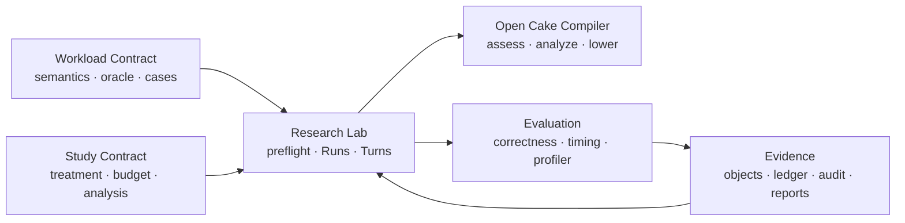
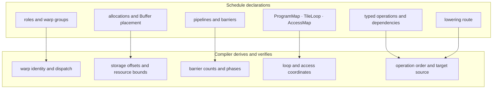
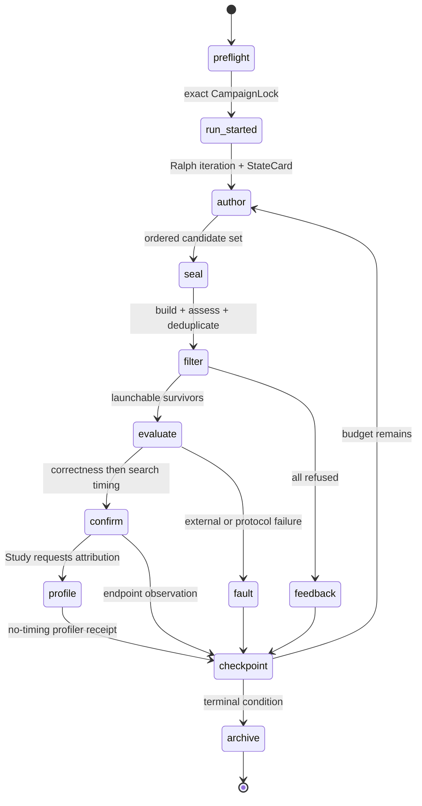
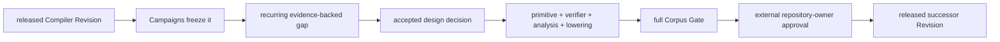

# Architecture

This document owns the stable system map. It describes supported boundaries and dataflow,
not the latest release id, migration checkpoint, or experimental result. Current released
authorities are projected in [`../reports/current/STATUS.md`](../reports/current/STATUS.md),
and canonical vocabulary lives in [`GLOSSARY.md`](GLOSSARY.md).

## 1. Product and dependency boundary

The Open Cake Compiler is independently usable. The Research Lab freezes a Compiler
Revision and coordinates Authoring Environments, Evaluation, and Evidence. No dependency
points back from the Compiler into experimental machinery.



The Workload Contract owns what must be computed. The Study Contract owns the question
asked about Authoring Environments. The Compiler owns Schedule meaning. Evaluation owns
observations after a Candidate crosses the sealed boundary. Evidence owns durable bytes
and replay.

## 2. Compiler pipeline

```text
Schedule + exact Target + Compiler Revision
                    |
                    v
             construction checks
                    |
                    v
       verifier rules + modeled analysis
                    |
                    v
               Assessment
          / eligible       \ blocked
         v                  v
 deterministic          localized
 Lowering               Findings
         |
         v
 inspectable target source or checked source asset
```

An Assessment can say that a Schedule is structurally accepted while a selected backend
cannot lower it. Backend preconditions therefore appear as lowering-blocking Findings
before source emission.

The generated lowering mechanisms are `triton` and `cutlass_cute_dsl`. The one retained
closed source-asset entry point is `cake_tinygemm2_stage4_split_k`. These are mechanisms,
not workload profiles: the Schedule declares its lowering route, while Workload semantics
and the oracle remain outside the Compiler.

Lowering produces source; it does not compile a CUBIN, allocate a GPU, run an oracle, or
measure latency. Those are later Evaluation boundaries.

## 3. What a Schedule commits to

A Schedule exposes performance-relevant hardware decisions while leaving mechanical
derivations to the Compiler.



Layout is deliberately not a first-class algebra. A Schedule records concrete storage and
access commitments; the Compiler checks their consistency. A missing primitive is added
only when a real supported Workload needs a fact that existing primitives cannot compose.

Static analysis blocks only within its modeled domain. Exact declared resources may
support hard capacity checks; compiler-created allocation and microarchitectural behavior
require compiled-artifact or on-device evidence.

## 4. One Study execution

Preflight resolves stable templates and released authorities into one exact CampaignLock.
The CampaignLock authorizes execution but does not redefine Workload or Study semantics.

New matched-search Runs use the `task_agents_ralph_v1` Agent interface. Before the first
Turn, Lab renders exactly two read-only files in each independent workspace:

```text
TASK.md    complete task, ABI, Workload, Evaluation, budget and frozen references
AGENTS.md  stable ownership, tool, evidence and single-writer rules
```

The provider invocation is a minimal instruction to read both files plus a derived
StateCard. The external Ralph Controller—not the Agent—owns provider-token, wall-time,
active-authoring, Turn, search, confirmatory and profiler budgets. Frozen schema-v1
Studies retain their embedded Prompt templates only for historical replay.



The primary author is the sole Candidate submission writer. Auxiliary investigation may
be read-only, but it cannot become a second Candidate authority. The external evaluator,
not provider narration or a local probe, owns correctness and measurement disposition.

The Lab has two closed Study variants:

- `matched_search` evolves fixed-shape Candidates under a declared Claim Scope;
- `portfolio` starts from a qualified fixed-cell KernelSeed and validates a predeclared
  exact-shape specialist/dispatcher domain.

Artifact optimization is a non-scientific Claim Scope on `matched_search`, not a third
execution mode. Serving is a later integration and evidence boundary, not a Lab runtime
mode.

Every Ralph iteration retains the exact TASK.md, AGENTS.md and StateCard bytes supplied to
the provider. Budget exhaustion is a normal terminal reason; Provider, Environment and
Evaluation failures retain their distinct fault classifications.

## 5. Evidence and claim flow

```text
Candidate bytes
  -> Evaluation Receipt
  -> Evidence Object + Event Ledger
  -> Terminal Archive
  -> Run Audit
  -> Study Report
  -> derived Claim View
```

Each arrow narrows interpretation rather than silently strengthening it:

- archive Integrity does not imply Protocol Adherence;
- Protocol Adherence does not imply Candidate correctness;
- correctness does not imply stable timing;
- timing does not imply profiler attribution;
- an operator or complete-Program result does not imply model-forward or serving behavior;
- a system qualification does not produce a treatment estimate;
- per-Run Artifact Promotion does not form an arm comparison.

Evidence and terminal outcomes are append-only. Run Audits, Study Reports, and Claim Views
are derived. A corrected interpretation creates an erratum or successor report; it never
rewrites the original observation.

## 6. Compiler evolution

Kernel and Compiler evolution occur on different timescales.



A campaign cannot mutate its Compiler Revision. A proposal may authorize implementation
and Corpus Gate preparation, but it is not a release. The release automation cannot write
its own approval. Expected Corpus output is never regenerated merely to make a proposed
change pass.

## 7. Documentation and experiment evolution

Stable architecture changes only when the supported system contract changes. Ordinary
experimental activity follows the append-only path:

```text
new experiment
  -> new CampaignLock outside the checkout
  -> new Evidence and terminal archive
  -> new Run Audit / Study Report
  -> regenerate current Claim View when accepted
  -X-> rewrite glossary, architecture, or prior snapshots
```

Current release status is generated from canonical locks and indexes. Historical surveys,
audits, and migration inventories are snapshots and must name their date or bound
revision. [ADR 0047](adr/0047-documentation-separates-stable-history-and-current-views.md)
defines this documentation lifecycle.

## 8. Relationship to the paper

This repository implements an independent Cake-like Compiler and research apparatus. It
uses the paper's public architecture and protocol as a source contract but does not claim
the unpublished implementation, raw trajectories, exact compiler, or reported result has
been reproduced.

A matched Cake IR versus direct CUDA/PTX claim requires the same Workload, oracle, shape,
Target, timing protocol, profiler policy, provider, scaffold, reasoning effort, budget,
reference-access policy, and stopping rule. Direct Triton source is neither a Cake IR arm
nor a substitute for that matched comparison.

See [`PAPER_CONTRACT.md`](PAPER_CONTRACT.md) for frozen paper-reported facts, explicit
unknowns, and local reconstruction boundaries.
