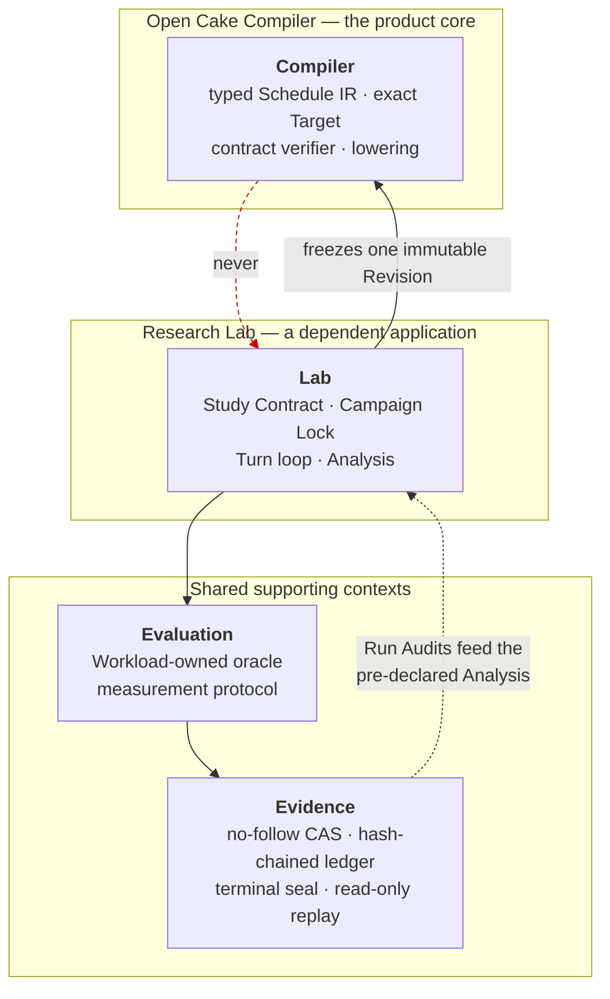
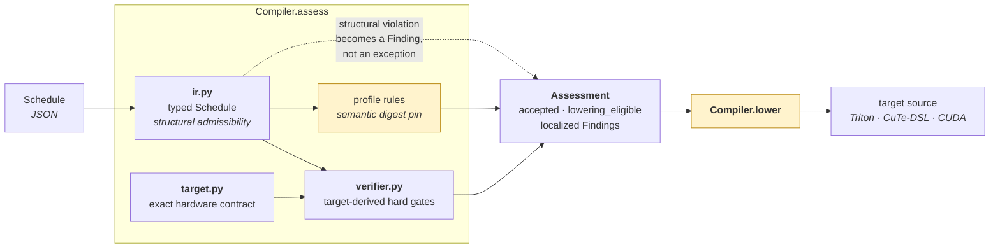
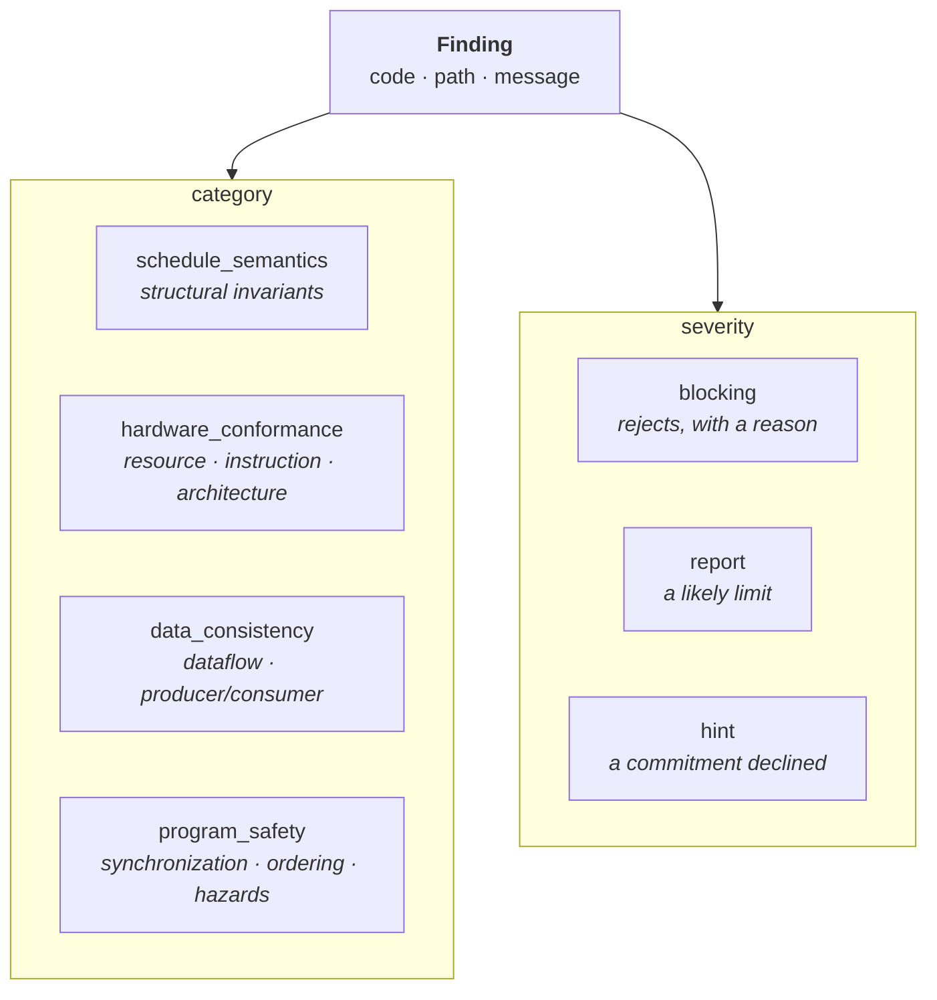
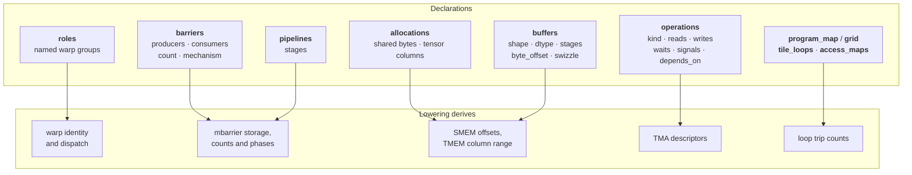
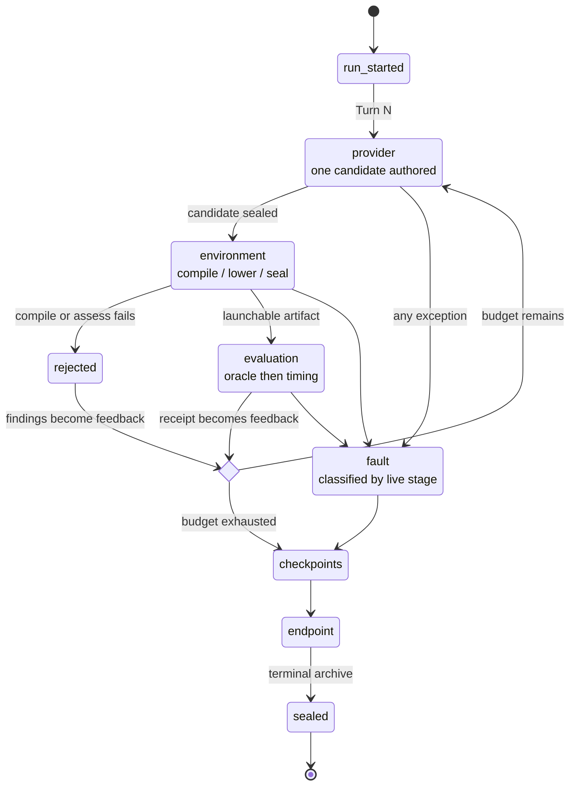
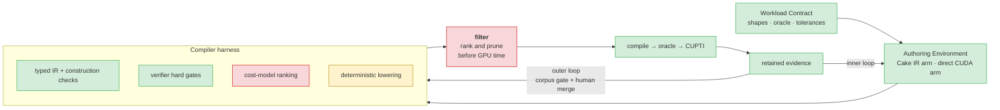

# Architecture

Six diagrams for the six things that are hard to see from the source tree. They describe
what the code does today, including where it falls short of
[`PAPER_CONTRACT.md`](PAPER_CONTRACT.md) — a diagram that flatters the implementation is
worse than none.

Vocabulary is defined in [`CONTEXT-MAP.md`](../CONTEXT-MAP.md); claim boundaries live in
[`ACCEPTANCE_GATES.md`](ACCEPTANCE_GATES.md).

---

## 1. Contexts and the dependency direction

The repository's central structural claim: the Compiler is usable on its own, and the
arrow never points back at it. Verified by a contract test that imports
`open_cake_ir.compiler` in a fresh interpreter and asserts no Lab, Evaluation or
Evidence module was loaded.

A runtime observation may motivate a compiler change, but only an external Corpus Gate
and a human merge can create the next Revision — see diagram 5.

---

## 2. The Compiler pipeline

`assess` composes three owners; `lower` is a fourth stage that has not caught up.

`lower` generates the warp-specialized profile from its Schedule — warp dispatch,
mbarrier storage and participants, TMA descriptors, TMEM custody, the loop nest and every
operation body — verified on a B200 at 128/128 exact assignments. The two remaining
profiles still stamp a checked-in file, which is why the box is amber; each will follow
once its Schedule carries the commitments emission requires. `profile rules` pin a
whole-document digest for those two, and that pin disappears with the file it protects.

### Findings

Every finding names the offending path and the violated contract. The four categories
are the ones the paper's harness reports; the three severities are its three
dispositions.

---

## 3. What a Schedule commits to

The paper has the agent write down five concrete hardware commitments. Each one the
Schedule declines is a decision the backend makes instead, invisibly.

For the retained warp-specialized Schedule the emitter derives all thirteen module
constants its hand-written artifact hardcodes, and generates a kernel that runs correctly
from those declarations alone. See
[`tests/contracts/test_ir_sufficiency.py`](../tests/contracts/test_ir_sufficiency.py),
which compares them directly.

---

## 4. A Study Run

The Lab owns every transition. The provider and the evaluator only return observations.

The paper's inner loop has four stages — generate several structurally distinct
candidates, **filter** them with construction checks, verifier gates and cost-model
ranking before spending GPU time, evaluate the survivors, then route the evidence. The
prompt here says *write exactly one candidate*, so there is no candidate set and the
filter stage has nowhere to exist. That is the largest remaining divergence; diagram 6
places it.

---

## 5. Compiler Revision lifecycle

Non-obvious and load-bearing: **any edit to a Revision-bound source invalidates the
released lock.** That is deliberate, and it is why wiring new code into the Compiler is
a gated event rather than a commit.

`scratchpad/release_v4.sh` in the branch history drives the cycle end to end, because a
single compiler edit requires all of it again.

---

## 6. Alignment with the paper

Green is implemented and exercised; amber exists but is short of the paper; red is
absent. Sources: [`PAPER_CONTRACT.md`](PAPER_CONTRACT.md) and
[arXiv:2608.12629v1](https://arxiv.org/abs/2608.12629).

| Element | State |
| --- | --- |
| Workload Contract | implemented |
| Authoring Environment, both arms | implemented |
| Typed IR and construction checks | implemented, on the product path since Revision v4 |
| Verifier hard gates, four categories | implemented, on the product path since Revision v4 |
| Compile → external oracle → GPU measurement | implemented, B200-verified |
| Retained evidence and the outer loop gate | implemented; stronger than the paper describes |
| Deterministic lowering | partial — `lower` generates the warp-specialized profile from its Schedule, verified on B200 at 128/128; the other two profiles still stamp a checked-in file |
| Cost-model ranking | absent — `calibration_coverage` is empty |
| The filter stage | absent — one candidate per Turn leaves nothing to rank |

The two red boxes are one problem. A cost model exists to order a candidate set; until a
Turn produces more than one candidate there is nothing for it to order, and the paper's
stated mechanism — *cheap analyses rank and filter candidates before they reach expensive
GPU runs* — has no place in the control flow.
