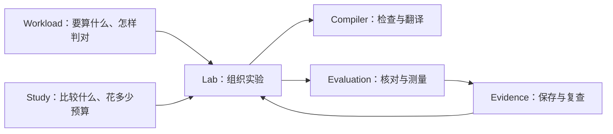

# 系统全貌：怎样把一个想法变成可验证的 GPU 程序

[中文首页](zh-CN/README.md) · [English](en/ARCHITECTURE.md) · [中英文对照](README.md)

open-cake-ir 解决的问题是：**让计算方法写得明确，让错误能定位，让改进有证据。**
这份文档解释稳定的职责；当前版本和数量只看 [发布状态](../reports/current/STATUS.md)。

[返回 Wiki](wiki/README.md) · [术语查询](GLOSSARY.md)

## 1. 为什么不直接让 AI 写最快的代码

比如把一张表的每行求和，数学很简单，GPU 上却有多种做法：一组线程处理一行，还是分成几块？
数据读一次后能否复用？两组线程会不会同时改一个答案？

只说“更快”没有给出这些选择。直接看最终机器代码，又很难发现改动的原因。
本项目在两者中间放一份执行计划（Schedule），把数据、分工、顺序和资源写出来。
编译器据此检查并生成代码；真实机器上的测量决定它到底对不对、快不快。

它的研究价值在于能复查的过程：哪项选择变了，为什么被接受或拒绝，哪个结果支持改进。
项目规模、AI 忙了多久、写了多少代码，都不是性能证据。

## 2. 四部分各做一件事

| 部分 | 用普通话说 | 输入与输出 |
| --- | --- | --- |
| Compiler，编译器 | 读懂并检查执行计划，再翻译成源码 | Schedule → Assessment → Lowering |
| Research Lab，实验系统 | 按约定安排 AI 修改候选、分配预算、决定何时停止 | Workload + Study → 一次实验 |
| Evaluation，评测 | 先核对答案，再按相同规则计时和分析瓶颈 | 固定候选 → 检查与测量记录 |
| Evidence，证据存储 | 保存事实，并让别人从记录重建结论 | 原始产物 → 审计 → 报告 |

编译器能独立工作。Lab 会调用编译器、评测和证据存储；编译器不反过来依赖 AI、实验或报告。



## 3. 三份说明不能混为一份

以“对每行数值做归一化”为例：

- **Workload，任务约定：** 输入有几行、每行几个数，怎样算标准答案，容许多少误差。
- **Schedule，执行计划：** 哪组线程处理哪一行，数据放在哪里，先做什么再做什么。
- **Study，实验约定：** 比较哪些写程序的环境，每组运行几次，预算多少，怎样解释结果。

数学任务可以不变，而执行计划改变。实验约定也必须预先固定，否则结果出来后再换标准就失去可比性。
正式含义和负责者见 [术语表](GLOSSARY.md)。

## 4. 编译器怎样处理计划

```text
检查格式与类型
  → 检查依赖、地址、资源和硬件规则
  → 给出 Assessment（检查结果）和 Finding（具体诊断）
  → 如果允许，生成目标源码
```

Finding 保留具体位置、四类合同中的 `category`、`severity`，以及是否阻止结构验收和生成。
`Assessment.findings` 保留现有 Corpus Gate 检查的阻塞诊断和报告；`Assessment.guidance`
单独携带 `hint` 提示。提示不改变验收结果。CLI、Lab 和 profile 报告都会展示这些提示，
但提示既不是 GPU 正确性证明，也不是测量结果。

当前计划通过 Triton、CuTe DSL 或 Metal 生成源码，名字分别是 `triton`、
`cutlass_cute_dsl` 和 `metal`。专用的 `checked_cuda_asset` 路线已退役：原 TinyGEMM2
Schedule 留作结构拒绝用例，旧固定源码结果只能在绑定的历史 Git 版本中重放。
当前 `Lowering.generated` 为真；历史记录中该字段的原有含义保留。

### 编译器内部的负责位置

- `core.py` 只连接公开接口；`revision.py` 负责加载版本，`corpus.py` 负责逐项对照预期。
- `diagnostics.py` 拥有诊断类型；`verifier/` 拥有四类通用规则。后端专属限制由后端报告，阻止生成，不把可表达的计划误判为结构错误。
- [backends](../src/open_cake_ir/compiler/backends/__init__.py) 的 `BACKENDS` 是唯一静态后端清单。每个后端实现 `requirements`、`preflight`、`emit`；Triton 的 `pointer_type(DType)` 负责指针类型拼写。
- [performance](../src/open_cake_ir/compiler/performance/__init__.py) 归集工作量、驻留、profile、编译资源、经验成本、排序和利用率。同一输入的分析结果计算一次并显式传递，不另设全局缓存。

新增后端时，先定义目标、输入、拒绝条件及上述三个方法，再在唯一清单登记。
给支持与拒绝的真实组合补测试；CLI 词汇表直接读取同一清单。
通过完整 Corpus Gate 和独立审查后才能发布后继。只增加后端名字不能代替实现或硬件验证。

`tools/profile_lowered_kernel.py` 的新报告使用 schema 2：不再输出
`predicted.registers_per_thread_lower_bound` 和 `verdict.register_floor_sound`。
实测占用限制中的物理寄存器项称为 `registers`。测量值、单位与估计范围不变，历史 schema 1 报告保留原样。

检查只覆盖模型中已经写明的规则。例如，声明了多少共享内存可以被检查；
后端后来额外分配多少寄存器或共享内存，需要看编译产物和实际机器。
因此，“结构合法”仍可能“后端无法生成”；“能生成”也不等于“已经编译或运行”。

## 5. AI 怎样参与

Lab 为每次独立尝试准备两个文件：

- `TASK.md`：题目、输入输出、评测方法、预算和固定参考。
- `AGENTS.md`：工具与行为规则。

AI 提交候选，外部控制器 Ralph 记录预算和当前状态，再决定继续还是停止。
评测器单独核对候选；AI 自己说“通过”不能替代评测记录。
不同候选有各自固定的内容，旧结果不会被后来编辑覆盖。

一次固定任务搜索叫 `matched_search`。从已验证的小范围方案组合成多个专用方案，叫 `portfolio`。
只想优化一个产物，可以在同一搜索路径中选择对应的声明范围，不需要第三套运行系统。
完整服务部署属于之后的接入与评测工作。见 [实验流程](wiki/experiments.md)。

## 6. 结果怎样形成结论

```text
固定候选 → 答案与测量记录 → 保存原始文件 → 审计 → 按实验约定生成报告
```

正确率和速度是两件事。速度测量不稳定，也不能简单把正确候选说成“算错了”。
一个小算子更快，还不能说明模型生成文字更快：模型还有其他算子、数据搬运和调度开销。
见 [怎样读结果](wiki/results.md)。

## 7. 怎样改进系统

修改候选时，实验使用的编译器保持固定，避免每轮连“尺子”也变了。
遇到已有操作拼不出的真实需求，才讨论新的 IR 能力；对应的类型、规则、分析和代码生成一起完善。
最后运行完整语料检查，按发布流程生成新的 Compiler。

Executor 固定的是 Lab、评测、证据工具和机器环境。它与 Compiler 是不同版本。
已发布 Executor 的身份不重复使用，见 [ADR 0049](zh-CN/adr/0049-released-executor-descriptors-reserve-their-identities.md)。

文档、代码、合同与历史记录分别维护，具体做法见 [文档维护](wiki/maintaining.md)。

具体任务的代码现集中在 `src/open_cake_ir/tasks/`。任务层提供合同校验、参考实现和准备函数；通用 Lab 与 Evaluation 不导入具体任务。见[任务目录说明](TASKS.md)。

## 8. Lab 内部怎样分工

`lab/core.py` 只连接公开接口。它仍保存原来的六项依赖：项目目录、时钟、工作负载读取、
计划准备、作者环境检查和启动描述读取。各阶段直接接收需要的依赖，不另建一套上下文状态。

| 模块 | 负责什么 |
| --- | --- |
| `contracts`、`_policies` | Study、Campaign 和报告类型，以及原有规则 |
| `bindings`、`preflight` | 选择准确版本，在执行前检查和准备输入 |
| `execution` | 调用作者，筛选、评测，记录预算与终态 |
| `replay` | 从原始记录重新检查作者、候选、选择和终态 |
| `archive` | 分开保存对象与读取核验收据 |
| `selection` | 共享纯排序、经验模型上下文和资格计算 |
| `reporting` | 汇总已审计的结果、缺失情况和阈值视图 |
| `_documents` | Lab 自己使用的少量文档解析函数 |

执行记录“当时做了什么”，回放独立检查“原始证据是否支持它”，两者不能共用一个结果判断。
第一次作者调用失败时，回放先处理该故障，不提前加载任务包或经验模型。
只有执行权限和输入检查通过后，才创建 Evidence。报告按需调用回放，不提前执行它。
具体任务和 portfolio 分派仍留在 `TaskLab`；公共导入仍使用 `open_cake_ir.lab`。
