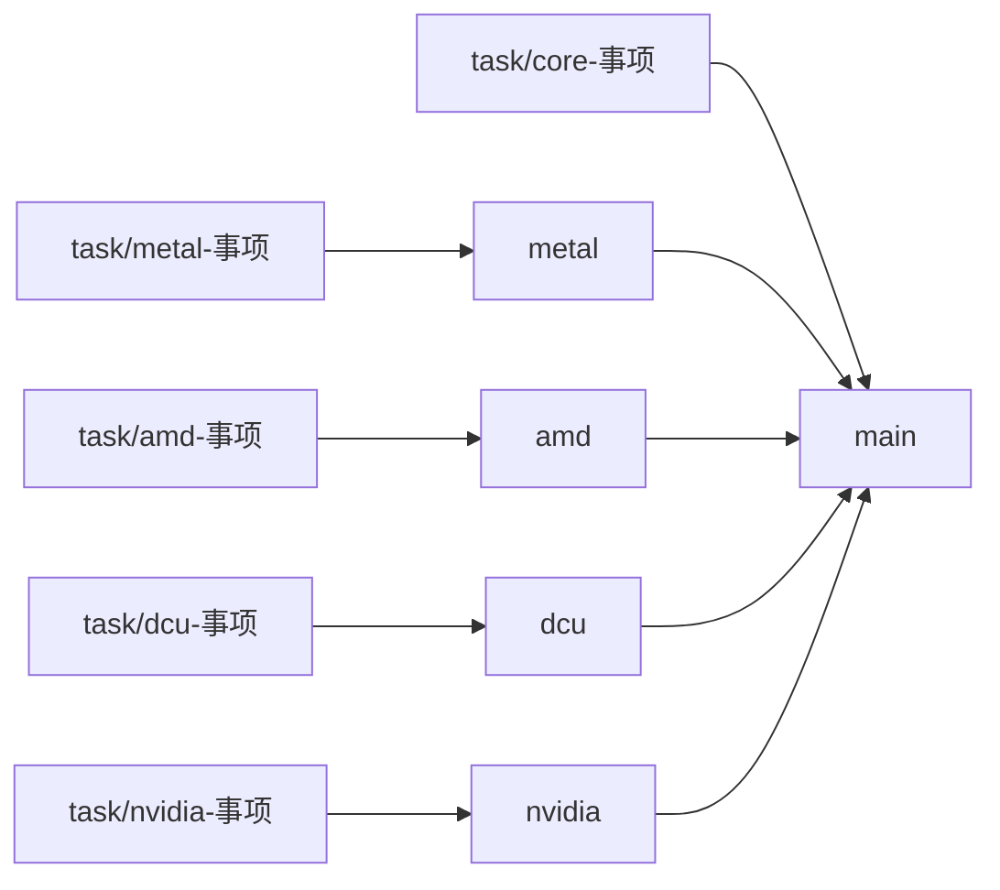

# 开发分支与平台维护 / Development branches

本页维护分支职责、任务流向和工作目录约定。实际分支位置、未合入提交与 PR 状态以
Git 和 GitHub 为准；硬件能力与测量结论仍由各自的 Target 和验证证据负责。

The maintained branches are `main`, `metal`, `amd`, `dcu`, and `nvidia`. Platform tasks
merge into their platform branch, then into `main`; shared changes go through `main`.
Every branch contains the complete repository. Platform names describe maintenance
responsibility, not separate copies of the Compiler or a hardware qualification.

## 五条长期分支

| 分支 | 职责 | 任务分支示例 | 任务 PR 的目标 |
| --- | --- | --- | --- |
| `main` | 所有平台的统一集成版本；共享 IR、Verifier、Compiler 接口、Lab 与证据协议 | `task/core-instruction-contract` | `main` |
| `metal` | Apple Target、Metal 生成与运行、Apple 设备验证 | `task/metal-row-reduction` | `metal` |
| `amd` | AMD Target、ROCm 适配与 AMD 设备验证 | `task/amd-gfx1151-reduction` | `amd` |
| `dcu` | Hygon Target、DTK/HCU 适配与 DCU 设备验证 | `task/dcu-wave64-reduction` | `dcu` |
| `nvidia` | NVIDIA Target、CUDA/CuTe 及 NVIDIA 的 Triton 路径与设备验证 | `task/nvidia-b300-mma` | `nvidia` |

新分支不使用 `codex/` 前缀。任务使用 `task/<平台或core>-<事项>`；已有 `metal` 分支时，
Git 不能同时建立 `metal/<事项>`，其他平台同理。任务完成后合入表中的目标，平台成熟改动
再通过平台到 `main` 的 PR 集成。`main` 的公共更新在需要时同步回平台分支。

GitHub 的长期分支只有这五条；临时分支只在任务或 PR 尚未完成时保留。合并完成后自动
删除任务的远端分支。五条长期分支由仓库规则禁止删除和改写历史，所以平台到 `main`
的合并不会自动删除平台分支。仍有独有提交的旧工作先保留为归档标签，再删除远端分支；
本机其他任务正在使用的分支与 worktree 不随远端清理移动。



平台分支只接收可独立说明、已完成相应验证的任务；未完成的试验留在任务分支。
平台分支有多个尚未进入 `main` 的任务时，合入者必须检查整个待合入差异。部分内容
尚未就绪，就先完成相应任务，不能因为其他任务已经通过而整批合入。

## 代码职责保持统一

代码目录按机制与职责组织，分支按维护方向组织。现有 lowering backend 是
`native_cuda`、`metal`、`triton`、`cutlass_cute_dsl`；Triton 跨 NVIDIA、AMD 和 Hygon。
AMD 与 DCU 可以共用适用的 HIP/HSACO 实现，但各自声明目标、工具链与设备事实。

| 代码位置 | 负责的事实或机制 | 改动归属 |
| --- | --- | --- |
| `compiler/targets/`、`runtime/hosts/` | 精确目标声明与主机捕获 | 对应平台；通用 schema 变化先走 `main` |
| `src/open_cake_ir/compiler/ir/`、`compiler/verifier/`、公共 Compiler 接口 | IR 语义、类型、通用验证与接口 | `task/core-*` → `main` |
| `src/open_cake_ir/compiler/backends/` | 各生成机制的 admission、preflight 与 emission | 平台专属实现走平台；跨平台机制变化走 `main` |
| `src/open_cake_ir/evaluation/` 中的 Metal、CUDA、HIP 实现 | 目标运行、正确性检查、计时与归因 | 对应平台；共享 HIP 行为与公共协议走 `main` |
| `src/open_cake_ir/lab/`、`evaluation/platforms.py`、`evidence/` | 统一实验流程、平台接入边界与证据协议 | 共享部分走 `main`，设备适配走平台 |
| `src/open_cake_ir/tasks/`、`contracts/workloads/` | 算子语义、oracle、任务组织 | 共享任务走 `main`，平台专属 authoring 改动走平台 |

表中省略公共前缀的源码路径均相对于 `src/open_cake_ir/`。具体代码依赖边界见
[系统架构](ARCHITECTURE.md)和 [Context map](../CONTEXT-MAP.md)。

平台任务发现共享层缺陷时，先将通用修复拆成 `task/core-*`，在 `main` 验收，再让受影响的
平台分支吸收。一个改动同时影响 AMD 与 DCU 的 HIP 行为，也走这条路径。不要在多个平台
分支分别维护同一公共修复；不要为了与分支名称对应而复制 IR、Verifier、Lab 或 Triton。

## 创建任务与隔离工作目录

长期分支用于集成，每个任务使用自己的 worktree。不要在其他任务正在编辑、测试或运行
实验的 checkout 中切换分支。以下命令从本仓库根目录执行，路径可以按本机布局调整；
示例任务名和路径需替换为本次任务的名称。

```bash
git fetch origin
git worktree add -b task/metal-row-reduction \
  ../open-cake-ir-workspaces/tasks/metal-row-reduction origin/metal
# 在任务 worktree 完成修改、验证并提交后，再推送和创建 PR。
git -C ../open-cake-ir-workspaces/tasks/metal-row-reduction \
  push -u origin task/metal-row-reduction
gh pr create --base metal --head task/metal-row-reduction
```

共享任务将起点换成 `origin/main`，名称换成 `task/core-事项`，PR 目标换成 `main`。
创建新任务分支时检查同名分支是否已存在；存在就先检查其所有者和用途，不覆盖。

每个长期分支在本机至多由一个普通 worktree 检出：先用 `git worktree list` 找到已有目录，
已有则复用它的集成入口，不通过强制检出绕过限制。运行测试使用另外的 detached worktree，
固定到待验证 commit；实验同样固定 commit，不跟随移动中的平台分支。

## 合入与同步

1. **任务进入平台。** 对照任务相对于平台的完整差异，执行受影响的合同测试。
   Compiler 改动运行完整 Corpus Gate；硬件相关改动保留对应目标、工具链、正确性、
   计时或 profiler 的实际验证范围。静态检查通过不代表设备验证通过。
2. **平台进入主线。** 从已验证的平台提交创建到 `main` 的 PR。检查当前 `main` 上的
   合并结果，解决冲突后在固定提交上验证；Compiler 改动在进入 `main` 前取得独立评审。
   不沿用旧分支针对旧接口的通过结果来代替当前集成验证。
3. **主线回到平台。** 需要公共修复、接口适配或开始下一轮集成时，把 `main` 合入平台。
   有冲突时在独立同步任务分支处理，再合入平台。平台之间通过 `main` 交换成熟改动。
4. **保留共同历史。** 平台与 `main` 之间使用保留双方祖先的 merge 或可行的 fast-forward；
   不用 squash/rebase 合并反复流动的长期分支，不改写已共享的长期分支历史。

例如，在需要同步且目录未被其他任务使用时，从最新平台分支创建同步任务：

```bash
git fetch origin
git worktree add -b task/dcu-sync-main \
  ../open-cake-ir-workspaces/tasks/dcu-sync-main origin/dcu
git -C ../open-cake-ir-workspaces/tasks/dcu-sync-main merge origin/main
```

提交冲突修复、验证并通过目标为 `dcu` 的 PR 集成。同步任务 PR 同样使用 merge 或
fast-forward，不能 squash/rebase，否则会丢失同步带来的祖先关系。平台到 `main` 的 PR
也应保留合并祖先。
长期分支推送遵循普通 fast-forward 规则，不使用 force-push。

CI 的触发范围由 [CPU contracts](../.github/workflows/ci.yml) 和
[Offline Triton compilation](../.github/workflows/triton-compile.yml) 两份 workflow 负责。
五条长期分支的 push 以及任务 PR 均进入适用的现有检查；Triton 编译仍按路径筛选。
它们不自动提供每个平台的 GPU 资格，也不授权启动新的硬件实验。

## 历史工作与迁移

2026-09-20 建立五条维护分支后，owner 进一步要求清理 GitHub 的历史分支。
已在主线祖先中的旧远端分支直接删除；仍有独有提交的旧远端分支先发布同提交的
`archive/branches-20260920/<原分支名>` 标签，再删除分支。删除前另保留完整 Git bundle
和分支到提交的清单。标签是历史定位点，不表示其内容已通过当前版本验收。

| 旧入口 | 保留位置与后续去向 |
| --- | --- |
| 原 `metal` | 同名归档标签 `archive/metal-before-platform-20260920`；需要继续的部分从新 `metal` 创建任务，逐项迁入。原有 M1 Pro 集成见 [PR #76](https://github.com/qhy991/open-cake-ir/pull/76)。 |
| `codex/amd-gfx1151-consolidated` 及未合入的 AMD 同步分支 | `archive/branches-20260920/<原分支名>` 标签；后续工作迁入 AMD 任务，公共改动走 `main`。 |
| `dcu-amd-support`、`dcu-amd-support-r11` | `archive/branches-20260920/<原分支名>` 标签；本地原分支与工作目录继续保留，后续工作从新 `dcu` 创建任务。 |
| 已合入的 `codex/b300-*`、`codex/native-*`、`codex/cute-*` 等 | 已有提交保留在主线历史中，远端旧分支删除；仍在本机使用的工作目录保留。 |
| `codex/kda-decode-cake-vs-internal-r1` | `archive/branches-20260920/codex/kda-decode-cake-vs-internal-r1` 标签；继续时先检查当前接口、Corpus 与证据边界。 |
| `history` | 同名不可变标签保留退役材料，`git show history:<path>` 的读取方式不变；见 [ADR 0067 的后续约定](adr/0067-retired-release-outputs-live-on-the-history-branch.md)。 |

需要在新 clone 中读取退役材料时，先取得命名标签：

```bash
git fetch origin tag history
git show history:runtime/executors/open-cake-ir-b200-v6.json
```

`docs/history/identities.json` 的历史字段名 `history_branch` 保持兼容，值现在解析到同名标签。
记录中的原始提交、路径与内容不变。新的历史归档使用新的版本标签，不移动已发布标签。

未合入的开放 PR 保留临时分支，处理完成后再删除；远端删除不会自动删除本地分支或
worktree。是否已经集成以祖先关系、实际补丁与 PR 为准；`git branch --merged main`
不能识别所有经过 squash 或重写的等价改动，不能据此丢弃独有内容。
