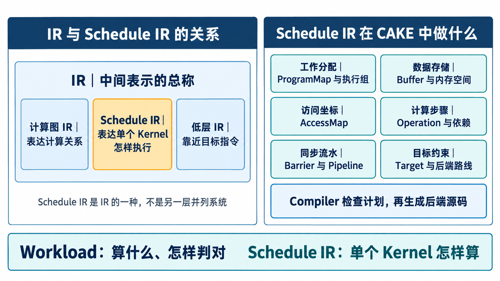
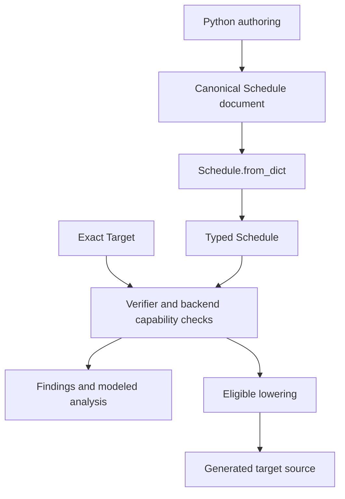

# 当前 IR 详解：结构、语义与代码组织

[中文首页](zh-CN/README.md) · [English](en/IR_GUIDE.md) · [文档总目录](README.md)

本文面向需要阅读、编写或扩展 IR 的开发者。先说明一份 Schedule 如何描述计算，再说明这些概念在代码中的负责位置。精确字段以 [typed IR](../src/open_cake_ir/compiler/ir/__init__.py)、生成的 [JSON Schema](../src/open_cake_ir/compiler/schema.py) 和 [Authoring Contract](../compiler/AUTHORING_CONTRACT.md) 为依据；术语定义见 [Glossary](GLOSSARY.md)。本文是它们的阅读说明，不承担发布状态或实验成绩的记录职责。

## 阅读前：IR、Schedule IR 与 Cake IR

**IR（中间表示）是类别名，Schedule IR 是其中一种表示。** 计算图 IR 可以表达算子之间的计算关系，
低层 IR 可以接近目标指令；这里的例子只帮助比较抽象层级，不表示本仓库各实现一套这样的 IR。
本仓库的 `compiler/ir/` 是定义类型的代码包；其中的 canonical `Schedule` 描述**单个 GPU kernel
怎样执行**。另一个 `Program` 类型绑定多个完整 Schedule 的公共张量与 stage 顺序，不与
Schedule 争夺单 kernel 调度的所有权。`Assessment` 是检查结果，`Lowering` 是生成源码的结果，
它们都不是另一种作者需要填写的 IR。



*图：左侧是一般 IR 的分类示意，不是本项目实现清单；右侧对应本仓库的
`ProgramMap`、`Role`、`Buffer`、`AccessMap`、`Operation`、`Barrier`、`Pipeline`、`Target`
与 lowering route。字段的精确定义见下文，图不替代 schema。*

CAKE [原始论文](https://arxiv.org/html/2608.12629v1)称 agent 编写的表示为 **Cake IR**：
它以带类型、显式硬件决策的 machine schedule 为核心，声明角色、存储、访存与同步，
由 lowering 推导机械细节，不引入独立的 layout algebra。本仓库沿用这一设计方向，
并在工程实现里明确区分 `Program` 组合层、单 kernel 的 `Schedule`、精确 `Target`、
Verifier、后端源码生成与下游工具链。论文主要陈述 NVIDIA 到 CUDA/PTX 的路径；本仓库的
Schedule 可选择 Triton、原生 CUDA、CuTe DSL 或 Metal 后端，各路径能力不等价。
具体层级见[系统架构](ARCHITECTURE.md#cake-irdsl-与-triton-的层级)。

**Schedule IR 的作用**是保留影响正确性与性能的执行选择，让 Compiler 在编译前对已建模
的规则定位诊断，并从通过后端准入的计划生成可检查源码。它不是“把所有 GPU kernel 写成
同一种机器指令”的承诺。IR 能描述某个操作，并不保证所选后端能兑现；后端不支持时，
assessment 应给出相应拒绝。即使源码生成成功，工具链编译、设备正确性与性能仍分别验证。

## 1. 整理的目标与约束

IR 的代码由 `open_cake_ir.compiler.ir` 包统一提供。拆分只改变实现文件的职责分配：已有导入路径、类型与字段、枚举值、参数默认值、JSON 格式、拒绝规则和生成的 kernel 源码保持一致。每个类型、词汇和解析规则只有一个定义。

本次整理不引入新原语、操作注册框架、布局语言或另一套 Schedule，也不修改 Workload、Target 或 Corpus 期望。Compiler 继续独立于 Lab、Evaluation 和 Evidence；公共入口只重导出对象，不重新包装、继承或复制它们。

P1–P8 在这里对应具体约束：Python 编辑方式不变；性能承诺仍显式可见；同一操作保留一种规范表示；构造检查与语义验证保持原有职责；分析所读的字段不变；完整 Corpus Gate 检查拒绝与接受结果；解析、验证和分析使用同一组类型；指令、内存和同步承诺继续由 Target 与后端检查。

验收检查公共导入、typed Schedule、生成 Schema、诊断、分析和源码输出的一致性，并运行相关合同测试与完整 Corpus Gate。源码拆分触及冻结 Compiler 的闭包，因此需要后继草稿；正式发布与合并仍遵循 [独立审查规则](adr/0052-independent-agent-release-review.md)。这类静态验收不产生新的 GPU 正确性或性能结论。

## 2. 一份 Schedule 描述什么

Schedule 是一个具体 GPU 计算计划：谁参与、数据放在哪里、每个操作做什么、按什么坐标访问、怎样同步和重复执行。它不是只列出加法、矩阵乘等数学操作的图，也不承担“这道算子题的标准答案”这一职责；后者由 Workload 与 oracle 负责。



[Python frontend](../src/open_cake_ir/compiler/frontend.py) 是编辑入口，最终也产生同一份 Schedule 文档。它支持受限的 Python AST，不能据此推断任意 Python 控制流都可编译。JSON 和 Python 最终经过同一 Compiler；源码位置是用于展示诊断的附加信息。
多阶段作者可使用 [Program Python 前端](../src/open_cake_ir/compiler/program_frontend.py)
静态组合这些完整 Schedule；张量绑定与阶段顺序仍由同一个 typed `Program` 检查，
不需要手写 Program JSON。

顶层对象由以下部分组成。列表字段即使没有条目也需要保留，标为可选的字段除外。

| 部分 | 字段 | 负责的事实 |
| --- | --- | --- |
| 身份与目标 | `schema_version`、`schedule_id`、`target` | 文档版本、计划名称和精确目标 |
| 生成路线 | `lowering` | 后端和入口函数名 |
| 工作分配 | `grid` 或 `program_map` | 显式三维网格，或从 Buffer 维度推导工作网格；二选一 |
| 参与者与存储 | `roles`、`allocations`、`buffers` | warp 分工、物理存储区域、数据视图 |
| 同步 | `pipelines`、`barriers` | 分阶段复用与角色间交接 |
| 执行 | `operations` | 有类型的操作及其读写、依赖和参数 |
| 重复与访问 | 可选 `tile_loops`、`access_maps` | 循环体、迭代步长及每条内存边的地址 |
| 资源承诺 | 可选 `residency` | 驻留 CTA 目标与编译寄存器上限 |
| 外部可见结果 | `outputs` | 导出的输出 Buffer 及其顺序 |
| 关联信息 | `metadata` | 受限的合同与历史来源关联；不是任意扩展字段 |

`Schedule` 是 frozen dataclass；其成员包括 tuple 和具名对象。`frozen=True` 阻止重新给字段赋值，不等于递归冻结 `metadata` 中的一切对象。接收外部文档时使用 `Schedule.from_dict` 或 Compiler API，不能用直接调用 dataclass 构造器替代解析与验证。

## 3. 文件组织与依赖方向

```text
src/open_cake_ir/compiler/ir/
├── __init__.py    统一导入入口
├── _parse.py      共用结构检查与 ScheduleParseError
├── vocabulary.py  闭合枚举和共享常量
├── resources.py   角色、存储、Buffer、同步与驻留承诺
├── mapping.py     程序坐标、循环与访问映射
├── operations.py  操作参数、参数解析与 Operation
└── schedule.py    顶层组装、文件读取和派生查询
```

`vocabulary.py` 与 `_parse.py` 只依赖标准库。`resources.py`、`mapping.py`、`operations.py` 使用这两个基础模块，彼此不互相导入。`schedule.py` 组装前三者；`__init__.py` 对外导出同一批对象。包内部直接从定义模块导入，避免经由尚未初始化完成的公共入口形成循环。

| 想找的内容 | 定义位置 | 主要使用者 |
| --- | --- | --- |
| dtype、内存空间、操作种类、指令相关枚举 | [vocabulary.py](../src/open_cake_ir/compiler/ir/vocabulary.py) | 解析、Schema、Target、Verifier、后端 |
| 缺字段、多字段、整数与枚举值检查 | [_parse.py](../src/open_cake_ir/compiler/ir/_parse.py) | 各对象的 `from_dict`、Target 解析 |
| `Role`、`Allocation`、`Buffer`、`Pipeline`、`Barrier`、`Residency` | [resources.py](../src/open_cake_ir/compiler/ir/resources.py) | 资源与同步验证、分析、后端 |
| `ProgramAxis`、`ProgramMap`、`TileLoop`、`AccessIndex`、`AccessMap` | [mapping.py](../src/open_cake_ir/compiler/ir/mapping.py) | 网格推导、地址与形状验证、循环生成 |
| `Operation`、各类 `*Parameters`、指令承诺 | [operations.py](../src/open_cake_ir/compiler/ir/operations.py) | 数据流验证、工作量分析、操作生成 |
| `Schedule`、`LoweringRoute`、顶层字段规则 | [schedule.py](../src/open_cake_ir/compiler/ir/schedule.py) | `Compiler.assess`、frontend、工具 |

调用方继续使用：

```python
from open_cake_ir.compiler import Compiler
from open_cake_ir.compiler.ir import Schedule, OperationKind, Buffer, DType
```

这里没有两个 `Schedule` 类型；包入口和定义模块导出的是同一个类。实现类型的 `__module__` 与源码位置会反映其定义模块。维护者可以追到定义文件，普通调用方无需跟随内部文件重排。

## 4. 数据类型、存储和参与者

`DType` 包含 `bf16`、`fp16`、`fp32`、`fp8_e4m3`、`int32`。枚举提供 `itemsize`；一种 dtype 能被解析，不表示每个操作与后端都接受它。

`MemorySpace` 区分 `global`、`shared`、`tensor` 和 `register`；`BufferMode` 区分 `input`、`output`、`state` 和 `scratch`。空间回答“在哪里”，mode 回答“由谁提供、如何对外可见”，两者不是同一个维度。

- `Role` 用连续的 warp 编号区间描述参与者，可声明该角色的寄存器预算。角色寄存器分配与整个 CTA 的预算需要相容。
- `Allocation` 描述一个存储区域的空间与字节容量。TMEM 还具有 column 数和分配角色，因为分配与释放具有硬件协议。
- `Buffer` 描述数据的形状、类型和用途；通过 `allocation`、`byte_offset`、`stages`、`swizzle` 指向具体存储视图。
- `Buffer.elements`、`size_bytes`、`byte_extent` 从声明推导，不另存一套可独立修改的容量。
- `Residency.registers_per_thread` 是给编译后端的寄存器上限，`ctas_per_multiprocessor` 是驻留承诺。真实寄存器分配、spill 和未显式建模的 shared memory 仍需工具链或设备证据。

两种 Buffer 关系表达已有数据间的联系。`ScaleRelation` 通过 `scale_of` 说明缩放系数对应哪个数据 Buffer、分组粒度和轴排列。`ValidExtentRelation` 通过 `valid_extent` 说明某个固定容量轴的实际有效前缀来自哪个设备端长度 Buffer，以及如何用数据坐标索引该长度。它们仍以已有 Buffer 和 AccessMap 为坐标依据，不是新的布局代数。

## 5. 工作网格、循环与地址

这三类对象回答不同问题：`ProgramMap` 分配不同程序负责的工作；`TileLoop` 描述一个程序内按块重复的工作；`AccessMap` 指定某个操作实际访问的位置。

### ProgramMap 与 ProgramAxis

`ProgramAxis(name, axis, buffer, dimension, tile)` 把程序网格的一个轴绑定到某个 Buffer 维度。覆盖该维度需要的逻辑 tile 数从 `ceil(extent / tile)` 推导。

`tile=1` 对应标量程序坐标；更大的 tile 对应向量偏移。`persistent=True` 表示固定数量的 CTA 遍历逻辑工作，启动数量由 Target 与已有 residency 承诺确定。可选的 `traversal` 用轴名称声明最快变化的轴在前；它只适用于 persistent walk。

### TileLoop、RangeOptions 与 LoopStop

`TileLoop` 用 Buffer 维度、tile 大小、iterator 名称及非空 `body` 描述循环。`body` 有序列出操作 id 或内层循环名，因而可以表达嵌套。它不是把 Python 循环展开成多份操作。

`RangeOptions` 显式记录 `num_stages`、`loop_unroll_factor`、`flatten`、`warp_specialize`、`disallow_acc_multi_buffer`、`disable_licm`。这些是后端需要检查和兑现的安排，不是普遍有效的加速承诺。

`LoopStop` 把排他的循环上界关联到一个程序坐标，并记录 `add` 与 `floor_div`。它只描述已支持的边界关系，不提供任意运行时条件或 while 语言。

Schedule 提供 `tile_loop`、`loop_parent`、`loop_depth` 等派生查询。`mma_accumulates_over` 根据访问映射判断循环是否遍历收缩 K 轴，从而决定跨迭代累计还是计算新的输出块；不另设容易与地址漂移的 accumulate 模式。

### AccessMap 与 AccessIndex

`AccessMap` 绑定 `(operation, buffer)`，列出对应 Buffer 各维度的坐标，并声明 `boundary="mask_tiled_axes"`。坐标有五类：

| `source` | 含义 |
| --- | --- |
| `program` | 一个程序轴的标量位置 |
| `program_tile` | 一个程序轴负责的向量 tile |
| `loop_tile` | 某个循环 iterator 对应的 tile |
| `dimension` | 整个维度，或以 `offset`、`extent` 指定的连续子范围 |
| `buffer` | 来自已存在 INT32 Buffer 的运行时索引 |

多个 buffer-valued 索引在共同索引域上逐项配对，不能按笛卡尔积解释。load 的寄存器结果形状必须等于实际访问域：标量程序坐标消去相应维度，向量坐标保留取出的范围，全标量访问以 `[1]` 表示单值结果。

例如输入 `a` 的形状是 `[8,128]`，每个程序负责一行。`program(batch)` 指定行，`dimension(1)` 读取这一行的 128 项，因此 load 的结果是 `[128]`。同样的第一维配合 `dimension` 子范围可以读取半行，但不能继续把结果标成 `[128]`。

边界掩码不提供写入唯一性证明。普通 `state` 写入需要可验证的单写入者分工；运行时索引写入目前需要从原子预留等已支持的机制证明独占。参见 [访问域规则](adr/0051-load-values-follow-the-access-domain.md) 和 [索引写入规则](adr/0036-atomic-reservation-proves-indexed-store-ownership.md)。

## 6. 操作与参数

`Operation` 统一保存 `op_id`、`kind`、`role`、`reads`、`writes`、`waits`、`signals`、`depends_on`、`pipeline` 和 typed `parameters`。JSON 中 id 的拼写是 `id`。参数类型由 `kind` 选择；一个 kind 不能夹带另一类操作的参数。

`depends_on` 表示依赖关系；跨角色的硬件同步仍须通过 waits、signals、Barrier 和 Pipeline 表达。仅在列表里把生产者写在消费者前面不能替代同步。

当前 `OperationKind` 的闭合词汇如下。下表说明语义类别；精确类型、形状、指令和后端支持仍以完整 Schedule 的 assessment 为准。更多小数字例子见 [基本操作](wiki/primitives.md)。

| `kind` | 参数对象 | 语义与显式选择 |
| --- | --- | --- |
| `load` | `LoadParameters` | 从指定地址取数；`global` / `tma` 搬运、TMA descriptor box、`reused` / `streamed` 复用意图 |
| `store` | `StoreParameters` | 写回 output 或有合法所有权的 state；显式 `coalesced` |
| `elementwise` | `ElementwiseParameters` | 同位置算术；选择 `op`，按规则使用 scalar、broadcast 或 instruction |
| `cast` | `CastParameters` | 转换到声明的 dtype；不改变索引空间 |
| `mma` | `MmaParameters` | `a[M,K]` 与 `b[N,K]` 的收缩、FP32 累加、指令与 tile 承诺 |
| `epilogue` | `EpilogueParameters` | 已支持公式的收尾计算，含 subtile、copy atom 等安排 |
| `reduce` | `ReduceParameters` | 用 `sum` 或 `max` 折叠声明轴；scope 与跨循环累计规则 |
| `reduce_argmin` | `ReduceArgminParameters` | 选择最小值位置，声明并列与 NaN 策略，可跨循环累计 |
| `top_k` | `TopKParameters` | 同时给出最大值与索引，固定降序及确定性并列规则，可声明跨循环和合并节奏 |
| `scan` | `ScanParameters` | 沿轴保留每一步的包含式前缀和，方向为 forward 或 reverse |
| `index_expand` | `IndexExpandParameters` | 根据 scale、extent、sentinel 把来源组索引展开成位置序列 |
| `online_softmax` | `OnlineSoftmaxParameters` | 逐 tile 累积稳定的 softmax 加权归约，显式最大值、归一化量与累加状态 |
| `atomic_rmw` | `AtomicRmwParameters` | 原子更新并返回更新前的值；现有词汇为 add、relaxed、device |

`ElementwiseOp` 包含 `square`、`rsqrt`、`exp`、`relu`、`tanh`、`add`、`sub`、`mul`、`div` 和 `fma`。一元、二元和三元输入数量来自同一个枚举属性。

几个容易误读的边界：

- `fma` 必须显式绑定 `ptx.fma.rn.f32`，使用三个同形状 FP32 寄存器输入，不接受 scalar 或 broadcast。它对乘加整体做一次 RN-even 舍入，不能替换成先乘再加。
- `tanh` 也要求显式 instruction，以免由后端暗中选择不同的数值与性能合同。
- `MmaInstruction` 的 operand placement 只适用于相应的硬件指令合同；`triton.dot` 的操作数布局由后端处理，不能随意添加它不会兑现的 placement 字段。
- `reduce` 的历史默认是跨循环累计；文档中省略 `across_loop` 表示该默认，显式 `true` 被拒绝，`false` 表示不跨循环累计。`top_k` 与 `reduce_argmin` 的默认则是 `false`，不能照搬。
- `top_k` 保留所选维度并返回 values 与 indices；它不是 argmin 加一个开关。驻留 signed INT32 top-k 与跨循环 FP32 top-k 也有不同后端边界。
- `FenceProxyParameters` 是保留的 Python 参数类型，但 `OperationKind` 中没有可提交的 fence kind；不要把类型列表当成可编写操作清单。

## 7. 同步与硬件承诺

`Pipeline` 声明复用阶段数。`Barrier` 声明交接计数、生产者、消费者、关联 pipeline 与机制；机制枚举包含 `mbarrier` 和 `barrier.sync`。

`Operation.produced_pipeline_kind` 从生产者语义派生协议：TMA load 对应 `TMA_TO_UMMA`，MMA 对应 `UMMA_TO_THREAD`。作者声明需要怎样交接，Verifier 与后端共同检查能够兑现的组合。

`Swizzle`、TMEM column、copy atom、MMA atom shape 与 operand placement 都是具体的硬件承诺。它们让存储和执行决策可检查，但不构成另一套可自由变换的 layout IR。一个后端缺乏某种组合时应在 assessment 阶段说明，不能自动转到另一个架构或忽略该字段。

## 8. 从读取计划到生成代码

### FMA：同一公式，两种不同的信息

在固定示例 `fma-b8-smoke` 中，输入 `a`、`b`、`c` 与输出 `y` 都是 FP32 的 `[8,128]`。
数学关系是 `y[i,j] = fma(a[i,j], b[i,j], c[i,j])`；现有 Schedule 的
`ptx.fma.rn.f32` 指令合同明确要求一次融合舍入，不能改成先乘后加的两次舍入。
Workload/oracle 负责结果是否符合任务约定，Schedule 则给这次计算指定执行计划。


*图：高亮的 `batch=4` 只是八行中的一行；右侧五项均来自
[完整 Schedule](../corpus/schedules/fma-b8-smoke.json)。矩阵只画出每行前几列以便阅读，
实际一行有 128 列。*

`program_map` 将输入第 0 维按 `tile=1` 分成八份工作：`batch=4` 的程序负责索引为 4 的那一行。
`compute` 角色声明四个 `execution_groups`。三个 `load` 通过各自的 `AccessMap` 读取
`[batch, 0:128]`，生成形状为 `[128]` 的逻辑 register Buffer；`fma` 消费三个 tile，
`store_y` 将结果写回相同坐标。全局 Buffer `a,b,c,y` 的 shape 仍是 `[8,128]`。
本例的 `tile_loops`、`pipelines` 和 `barriers` 为空；它们是其他 Schedule 可使用的能力，
不是这个 FMA 所必需的步骤。逻辑 register tile 的 128 个元素**不表示每线程占用
128 个物理寄存器**；实际分配要看 Triton 编译产物。

`target=sm_100a` 与 `lowering.backend=triton` 指定了此计划的目标和源码生成路线。
`Compiler.assess` 检查结构、语义、目标和后端条件；只有具备 lowering 资格时，
`Compiler.lower` 才生成 Triton 源码。以下代码从仓库根目录、带有 `src` 的 Python 路径
读取并检查同一示例，不执行 GPU kernel。开发 worktree 使用 draft 描述；已发布运行
使用与源码闭包一致的 release lock。

```python
from open_cake_ir.compiler import Compiler
from open_cake_ir.compiler.frontend import read_schedule
from open_cake_ir.compiler.ir import Schedule

authored = read_schedule("examples/python/fma.py")
schedule = Schedule.from_dict(authored.document)
assert schedule.buffer("a").shape == (8, 128)
print([(op.op_id, op.kind.value) for op in schedule.operations])

compiler = Compiler.load()
assessment = compiler.assess(authored.document)
assert assessment.accepted and assessment.lowering_eligible, assessment.findings
lowering = compiler.lower(assessment)
assert "fma.rn.f32" in lowering.source
```

这个例子只读取 [FMA Python](../examples/python/fma.py)；[JSON 版本](../corpus/schedules/fma-b8-smoke.json) 留作 Corpus 回归和查看规范序列化，不是编写算子的必需输入。三个 load 产生寄存器 tile，FMA 读三个 tile 并生成结果，store 按 `y` 的 AccessMap 写回；角色、地址与数据流相互独立又必须一致。

各检查层的边界如下：

| 层 | 能说明什么 | 不能据此推出什么 |
| --- | --- | --- |
| `Schedule.from_dict` | 字段、词汇与参数结构可接受；失败抛出带路径的 `ScheduleParseError` | 所有跨对象语义或后端条件均正确 |
| `schema.schedule_schema()` | 给作者和工具使用的结构约束投影 | 代替 Compiler 或证明 GPU 正确性 |
| `Compiler.assess` | 语义、硬件、数据一致性、安全与后端能力检查的诊断及建模分析 | 实际设备已运行通过 |
| `Compiler.lower` | 对可生成的计划产生可检查源码；已退役路线明确拒绝 | 工具链编译、数值正确性、性能提升 |
| Evaluation | 对固定合同进行实际正确性、计时与 profiler 检查 | 自动推广到其他形状、目标或完整服务 |

`accepted`、`lowering_eligible`、`findings`、`analysis` 是不同的信息；调用方应读取对应字段。分析只覆盖建模的资源与行为，不能将逻辑寄存器压力写成真实寄存器占用，也不能把成本估计当成实测结果。

## 9. 扩展时沿着哪个负责位置修改

先判断需求能否由现有操作、Buffer 关系、循环和 AccessMap 组合。可以组合的新算子通常需要新的 Workload 与 Schedule，不需要新 `OperationKind` 或后端名字分支。

若确有缺失能力，先定义其输入输出、效果、数值顺序、地址关系、硬件行为和失败条件，再沿已有职责实现：

1. 在定义模块补最小 typed 结构与解析规则。词汇属于 `vocabulary.py`，资源关系属于 `resources.py`，地址与循环属于 `mapping.py`，操作与参数属于 `operations.py`；仅顶层组装需要改 `schedule.py`。
2. 从公共入口导出需要给调用方使用的类型；生成 Schema 和 authoring 文档应与同一规范相符，不另加一套注册表或旧新 parser 路径。
3. 同步更新 [Verifier](../src/open_cake_ir/compiler/verifier/__init__.py)、相关 [residency](../src/open_cake_ir/compiler/performance/residency.py) / [work](../src/open_cake_ir/compiler/performance/work.py) 及目标后端。不能先接受字段，再让 lowering 默默忽略它。
4. 对稳定接口或已复现错误补聚焦测试，并通过完整 Corpus Gate。期望变化需要单独审查，不能为了变绿而重写期望。
5. 新文件提交即属于 Compiler：源码身份就是这次检出的 git 提交（[ADR 0065](adr/0065-source-identity-is-the-commit.md)），没有另一份源码清单要登记，评审在合并到 main 时进行一次。历史 release、Executor 与实验固定的源码使用原 Git 版本回放。

查看代码中的现行词汇可以运行 `tools/ir_vocabulary.py`。它从公共 IR 对象投影枚举和结构，因此文件拆分不会使这份工具清单变成第二份手工维护的事实来源。是否真的可用，仍对目标 Schedule 执行 assessment。
