# B300 KDA prefill：Cake IR 与 native CUDA lowering 的设计及证据

本页记录从 KDA prefill 性能差距导出的 **IR 语义、Verifier 合同、native CUDA/PTX 映射**。它是设计和证据索引，不替代 [Workload Contract](../contracts/workloads/cake-kda-prefill-b300-v1.json)、[Finding F-2026-09-24-003](../findings/2026-09-24-003-kda-prefill-b300-chunk-state-lowering.json) 或 [技术报告](open-cake-ir-technical-report.pdf)。下列 K32/K128 数值试验都是两 chunk 的合成 Target 原型；完整 KDA 的输出、全部六形状、框架验收及超过 CAKE 的性能仍未实现。

## 1. 问题和比较边界

Workload 的状态是 BF16、V-first 的 `[sequence, head, V128, K128]`。每个 token 先衰减旧状态、用 K 做预测，再以 beta 缩放残差更新状态并 **逐 token 舍入到 BF16**，最后用 Q 从更新后的状态产生输出。完整验收比较所有输出和最终原位状态元素，固定与 packed 序列均须覆盖；B300 计时指定 CUPTI、每样本冷 L2、计时前恢复初始状态。只比较某个投影或最后状态，不能宣称完成该 Workload。

原始 CAKE 的 B200 导出实现仅改目标检查及编译架构后，成为这里的 B300 适配参考；它不是原论文的 B300 结果。固定 H64/T8192 的完整参考在同机配对作业中约 **456.260 µs**。可见的参考发射使用 32-token 分块、TMA、`tcgen05`、TMEM 状态以及 producer/compute/epilogue 流水。当前最快的另一路完整 H64 固定输入候选为 **1,444.107 µs**，同作业比值 **3.165× 慢**；其两-token 入口状态近似在 T257 常规输入只有 19/20 组通过，并在高保留输入失败，不能推广为正确的六形状实现。

| 路线 | 已测事实 | 从中得到的设计要求 |
| --- | --- | --- |
| 现有 Triton chunk32/V64 | 96,080.520 µs；每线程静态 176 字节 stack | 大 live tile 映射的寄存器/本地存储是风险，需要让 TMEM 和转移相位成为可检查的承诺。 |
| 缩小后的 Triton chunk16/V32 | 83,264.993 µs；静态 stack 与 local SASS 消失 | 消除静态 stack 信号并未解决串行块遍历与重复工作；两次实验还同时改变了 tile，不能把差值全归因于 spill。 |
| 直接逐 token native CUDA | 16,979.920 µs；正确的固定 H64 结果 | CUDA 语言能够实现语义，但每 token 重读写大状态过慢，必须减少状态搬运。 |
| 两次 MMA 的独立预处理 | 389.507 µs 组件中位数；七个中间输出 | 它单独已接近完整参考的 456 µs；继续物化全部中间值并另启状态 kernel，缺少可信的超过 CAKE 的余量。 |

这里的“现有 CUDA/Triton 路径无法实现”特指 **仓库当时的后端准入和映射**，并非 CUDA 或 Triton 语言不具备这些指令。原始 CAKE 的 CUDA/PTX 已证明硬件路线存在；新增 lowering 的任务是用 Cake IR 表达同样关键的状态、指令、地址和同步合同，并寻找可测的进一步收益。Triton 可写自定义 asm，但当前 `triton` 后端没有这套 TMEM 状态生命周期及相位证明；直接把 backend 名字改为 Triton 不会创建它们。

## 2. 从算子语义到设备指令

可编辑源图是 [kda-b300-native-lowering.mmd](figures/kda-b300-native-lowering.mmd)。图中准备阶段到状态 kernel 的连线表示 **当前物化的输入接口**，不表示已经融合成一个生产 kernel；输出与状态路径只对应 H64、两或 256 chunk 的合成准备值原型。

### 2.1 严格下三角前代入，而非展开矩阵逆

`OperationKind.FORWARD_SUBSTITUTE` 的一个规范语义是 BF16 `P[C,C]`、FP32 `RHS[M,C]` 到 FP32 `U[M,C]`；对每行、每个 token `t`，从 `RHS[t]` 开始，按 `i=0..t-1` 次序做 `float(P[t,i]) * U[i]` 的 FP32 FMA，跳过对角线及上三角。C32 每行有 496 项 FMA，后续 BF16 表示由独立 `cast` 承担。这一语义归 [IR](../src/open_cake_ir/compiler/ir/operations.py)、[类型验证](../src/open_cake_ir/compiler/verifier/data_consistency.py)及 [native emission](../src/open_cake_ir/compiler/backends/native_cuda.py) 各自负责。

选择前代入的原因是 state-dependent RHS 无法提前逆掉；原先五步逆矩阵预处理需要 21 个 BF16 MMA，B300 上该准备组件为 637.606 µs，而独立两 MMA + P 准备组件为 389.507 µs。这是 **不同作业、不同计算范围** 的诊断，不能直接当作端到端加速比。native root 发射用一个 copy warp 将 P 放入 2 KiB、64B swizzle 的 shared memory，以一个 `mbarrier` 交给四个各自负责 128 行中一部分的 compute warp，后者发射具名 `__fmaf_rn` 更新。具名值替换临时数组后，root AOT 从 256 字节 stack 降为 0，使用 119 寄存器；这只是 root 子问题的资源证据。

### 2.2 BF16 TMEM 状态、两次收缩与相位

每个 head/CTA 的有界原型将 `[128,128]` BF16 状态放在 TMEM。四个 compute warp 用 `tcgen05.st.sync.aligned.32x32b.x8.b32` 把两个 BF16 值显式打包为一个 32-bit word；各 warp 等待 store 完成后，由每组一个 leader 向 count=4 的 `state_ready` mbarrier 到达。基础 MMA 的 issuing warp 等待当前 phase，再对 TMEM-A 和 shared-B 发出 `tcgen05.mma`。基础投影读出 FP32 RHS 后，前代入产生 U；U 显式 BF16 舍入并写到另一块 TMEM，再通过独立的 `u_ready` 交给校正 MMA。校正结果有自己的 completion barrier，状态发布必须排在它之后。

`TileLoop.carried_buffers` 只承认一个静态外层循环、一个 BF16 TMEM tile、循环前初始化和循环内一次更新。`analyze_carried_tmem` 证明所有读取发生在更新之前、读者等待相同 barrier、写者角色及相位一致。原始 state 生产者发布 phase 0，第 `trip` 次读取等待 `trip & 1`，该次更新发布下一 phase；无声明的第二写者仍报 `BUFFER_MULTIPLE_WRITERS`。native 的 `NATIVE_TWO_PHASE_ORDER` 另要求基础 MMA → solve → U 发布 → 校正 MMA。这样，一个偶然被其它规则拦住的错误不会冒充真正的同步证明。

### 2.3 K128 的 B 方向和标量块坐标

`tcgen05` 的 K-major shared B 行最多由本路由的 128B swizzle 表达；直接将 BF16 K128 放进 `[N32,K128]` 行需要 256B，原路径以 `NATIVE_SMEM_LAYOUT` 拒绝。B300 PTX 探针和独立设备乘积检查支持精确的 **MN-major B** 子集：物理 B `[K128,N32]`、64B swizzle、M128/N32/K128、每个 K16 atom 的 shared descriptor 前进 1024B。native 后端只在 `sm_103a` 为此几何/方向开放 `_TMEM_A_MN_B_EVIDENCE`，其它组合以 `NATIVE_MN_MAJOR_B_UNQUALIFIED` 拒绝；校正 MMA 则用 K-major B `[N128,K32]`。这些是 Target 及后端自己的硬件词汇，不是共享布局代数。

每个 chunk 的真实 B 输入还有 chunk 轴：`[chunks,K128,N32]` 或 `[chunks,N128,K32]`。原有 `loop_tile` 即使 tile=1 仍产生一个长度为 1 的 **向量** 轴，不能悄悄挤掉后假装得到二维 shared tile。新增 `AccessIndexKind.LOOP` 明确取单元循环当前块号作 **标量** 坐标；Verifier 检查作用域、unit tile、源维度上界和 load 的局部结果形状。native 发射三级 TMA 坐标时，chunk 是第三个标量坐标，其余两个轴匹配 declared shared box。无对应循环/形状的访问被 `ACCESS_LOOP_*`、`LOAD_ACCESS_SHAPE_MISMATCH`、`NATIVE_CARRIED_MMA_DOMAIN` 或 `NATIVE_TMA_COORDINATES` 定位拒绝。

### 2.4 BF16 TMEM 回读与衰减状态合并

完整 chunk 状态转移包含 `old_state * prefix_end + correction`，不能仅用校正 MMA 覆盖旧状态。已有 TMEM load 只准 FP32 累加器；共享 IR 现在也准许 BF16 TMEM tile 到同形同 dtype 的 BF16 register tile。每个 32-bit TMEM word 对应两个相邻 BF16 列，`source_atom` 的重复数按 word 计，列宽须容纳完整重复。native 发射 `tcgen05.ld.sync.aligned.32x32b.x16.b32`，先等待 carried state's 当前 mbarrier phase，再用 `__ushort_as_bfloat16` 原样解包位模式；不把 BF16 数据假设为 FP32 累加器。这个 bounded admission 名为 `NATIVE_TMEM_BF16_STATE`。

合成 K128/C32 两 chunk Schedule 随后将旧状态显式转 FP32，乘 FP32 `prefix_end`，加 FP32 校正结果，最后显式舍入 BF16 并发布下一 phase。它在 `sm_103a` 编译为 255 寄存器、0 stack、0 spill；B300 三组完整状态对照各覆盖 16,384 元素、0 超差，最大绝对误差不超过 `1.1920928955078125e-07`。255 寄存器是紧迫的资源信号，但没有 CUPTI/occupancy 测量可证明它对完整 KDA 延迟的贡献。

### 2.5 两组投影、两组校正与延迟 TMEM 回读

有界后继 `3ce392dc` 将基础 pipeline 增为两次 K128 投影：`state @ base_key` 供 solve，`state @ base_query` 供输出；U 发布后的 pipeline 也增为两次 K32 收缩：`U @ final_key` 更新状态，`U @ output_coupling` 修正输出。每条 TMA load 仍有自己的 shared B view，两条 load 共用 count=2 的 ready barrier；每个 MMA 有独立 completion barrier，输出路径显式 FP32 相加、scale 与 BF16 舍入。所需 TMEM view 在 512-column 分配内互不重叠。此前 `NATIVE_TWO_PHASE_ORDER` 只准每条 pipeline 一次 MMA，这个后继将上限有界扩成两次，并要求首组都读 carried state、第二组都读 BF16 U；错误的 tensor-A owner 有专门反例。

首个四 MMA 排列过早将 base-query FP32 `[V128,C32]` 从 TMEM 读到寄存器，穿过全部 496 项/行的顺序 solve 才用于输出。`sm_103a` AOT 使用 255 寄存器、112 字节 stack，报告 108 字节 spill 读写；SASS 的 `STL` 出现在 `subtract_base` 源码附近。后继 `fbafa719` 只把这个 query 回读移到输出合并前，保留同一 TMEM accumulator、输出公式与 BF16 边界，AOT 仍用 255 寄存器但 **0 stack、0 spill**。这给出一个明确的 lowering 原因：跨顺序求解保留早期 FP32 结果会制造寄存器活跃区间；延迟具有独立 completion barrier 的 TMEM readout 可缩短该区间。在完整适用 CPU 合同与 Corpus Gate 通过后，`fbafa719` 的 broker-shared B300 抓取完成了 3 组检查：每组 8,192 个 BF16 chunk 输出和 16,384 个 BF16 最终状态均为 0 超差，输入未改写，作业终结后才运行 host oracle。这证明有界合成 RHS 的输出/状态发射正确；尚无配对延迟或公共 pass 收益证据。合成 RHS 仍未接入公开 V/beta，因此不能当作完整 KDA 输出。

公开输出的物理方向仍是独立缺口：当前 CTA 按 V 行拥有寄存器，合成输出是 `[chunk,V128,token32]`，而 Workload 以 token 为前轴。`59855c8b` 的合同探针在共享 IR 中显式加入 `transpose` 与 token-major store，通过通用 Verifier 和 Target 检查；当前 native CUDA 后端以 `BACKEND_OPERATION_UNEMITTABLE` 拒绝。不能在 CUDA store 地址里私下转置、却让 Schedule 继续声称旧形状。下一步可以为严格限定的 transpose→store 链实现正确的行线程写回，也可以由另一阶段显式承担转换，但必须同一 Workload 测量额外流量与启动成本。原始 V 输入的 `[token,V]` 到行拥有者 `[V,token]` 也需同等显式映射，尚未完成后端准入。

### 2.6 显式 transpose 后的 token-major 直接写回

`59855c8b` 首先证明共享 IR 的 BF16 `[V128,C32] → [C32,V128]` `transpose` 与对应 global `store` 可通过 Verifier/Target，而原 native emitter 报 `BACKEND_OPERATION_UNEMITTABLE`。`42b78a5d` 仅准入一条紧邻且独占的 transpose→store 链：transpose 在 IR 中保留语义，但物理数据仍由 128 个 V 行线程持有；store 在每个 token 列迭代时，把相邻线程的 V 行值写到连续的 `[chunk,token,V]` 地址。没有额外全局中间张量，也没有让作者暗中接受另一种输出布局。多一个读取者、错误形状/类型/AccessMap 或不在同一 carried scope 都被 `NATIVE_TRANSPOSE_STORE_DOMAIN` 拒绝。

该固定源码通过 Corpus Gate 179/179、适用 CPU 合同 2610 passed，以及 exact-B300 AOT（255 寄存器、0 stack/spill）。broker-shared 三组数值试验各对照 8,192 个 token-major BF16 输出与 16,384 个 V-first BF16 最终状态，全部 0 超差并保持输入不变。这是**合成 RHS** 的物理输出映射资格；原始 V 输入 `[token,V]` 到行拥有者 `[V,token]` 的读取和公开 beta 仍需单独实现，性能更未比较。这个限定也解释了为什么不能把 Triton 的通用 `tl.trans` 或原始 CAKE CUDA 地址拼写直接当作本 backend 的合法性证明。

### 2.7 原始 V/beta 到行拥有 RHS 的有界映射

公开 V 输入按 `[chunk,token32,V128]` 存储，而四 MMA 状态 kernel 的 128 个 compute 线程各自拥有一个 V 行。`ac102f0e` 的 Schedule 使用已有的 BF16 `load` `[token32,V128]`、显式 `transpose` `[V128,token32]` 和 BF16→FP32 `cast`；后端在有且只有这个紧邻读者、unit chunk 轴及精确 AccessMap 时，直接让每个 V 行线程对每个 token 从 `[chunk,token,V]` 读取连续线程地址。没有隐式寄存器 reshape，也不新增全局转置张量。第二条 FP32 beta-gate `[chunk,token]` load 在每行形成 32 值列向量，`RHS = beta * (V - base_prediction)` 仍由两个有类型 FP32 elementwise 操作显式承担，再交给 strict-lower solve。额外读取原始 `[token,V]` register tile 时由 `NATIVE_TRANSPOSE_LOAD_DOMAIN` 拒绝。

这条输入映射与 §2.6 的 token-major 输出写回构成方向相反、但相互独立的两个有界规则。定向合同与 Corpus Gate 179/179 已通过；精确 B300 AOT 为 255 寄存器、0 stack/spill。本机完整 CPU 套件因复制历史/Lab 夹具时磁盘空间耗尽而失败；随后在远端固定 `ac102f0e` 的隔离检出、标准 `umask 0022` 下重新运行，得到 2,601 passed、16 skipped，另有 1 项 Apple MLX 实机测试不适用而取消选择，退出码为 0。远端默认 `umask 0002` 曾使 `test_author_home` 的私有目录权限检查失败，故两次运行及环境差异均保留在 Finding 中，没有改写夹具或期望。broker-shared B300 作业 `gpuq-c841e1995072` 在 3 组输入上分别检查 8,192 个 BF16 token-major 输出和 16,384 个 BF16 最终状态，均为 0 超差、无非有限值、输入未改写；最大绝对误差分别为 `1.1920928955078125e-07` 和 `3.0517578125e-05`。这证明合成准备值接入**公开 V/beta 的有界输入/输出映射**；真实上游 Q/K/G/prefix、逐 token BF16 状态舍入、64-head/256-chunk 及完整 Workload 尚待验收。它不能靠一句“CUDA 或 Triton 无法转置”来解释：缺口是当前 native 后端此前未兑现已存在的 IR `transpose`，而让 Triton 另起转置 kernel 则必须把额外启动和读写算进同一 Workload。

### 2.8 H64 的标量 head 所有权与 rank-4 TMA

原有合成设备证明只绑定一个 head、两个 chunk。真实准备输出以 `[chunk256,head64,...]` 组织，V/输出沿 `[token,head,V]`，初始/最终状态还多一个 head 轴。只读探针先证实共享 IR 的 `ProgramMap` 标量 head、`AccessIndexKind.PROGRAM` 与 `AccessIndexKind.LOOP` 可以无阻塞地表达这些轴；当时的 native preflight 分别以 `NATIVE_CARRIED_MMA_DOMAIN`、`NATIVE_TMA_DESCRIPTOR`、`NATIVE_TRANSPOSE_LOAD_DOMAIN`、`NATIVE_TRANSPOSE_STORE_DOMAIN` 拒绝，而随后的 register-layout/store-role 报告是转置未准入的连带诊断。这些是具体 backend 缺口，不是 CUDA 或 Triton 语言的不可表达性。

后继 `d5a9648a` 不把 `[chunk,head]` 私自 flatten：一个 `ProgramMap` 标量 head 坐标选定一个 CTA，循环标量 chunk 选定当前块；四个 `[chunk2,head64,K/N,C]` BF16 B 输入以 rank-4 `CUtensorMap` 描述，shared box 仍为原 `[K/N,C]`，高两维 box 均为 1。native helper 把二维块坐标、head、chunk 按 TMA 的内到外顺序送入 `cp.async.bulk.tensor.4d`；P 的普通 global→shared 地址、初始/最终状态、prefix 与 beta 的地址也都显式带 head。公开 V 的 `[chunk,token,head,V]` load 和相同方向的输出 store 沿用独占转置规则，让 128 个 V 行线程直接访问正确的 token-major 地址，不生成全局转置缓冲。NVIDIA 的 [PTX tensor copy 指令](https://docs.nvidia.com/cuda/parallel-thread-execution/index.html)与 [tensor-map 编码合同](https://docs.nvidia.com/cuda/cuda-driver-api/cuda_driver_api/group__CUDA__TENSOR__MEMORY.html)允许这类 4D 坐标；具体组合仍由本 Target 的离线编译及设备数值证据限定。

准入只覆盖 head64、unit chunk、一个标量 head CTA 轴与上述精确映射。错误 head 选择、rank-5 TMA、H32 直接沿用 H64 规则、漏掉输出 head 所有权都有专门反例。最初将 `cake_tma4` helper 无条件加入所有 native 源码，改变了旧 Corpus 的发射源快照；后继仅在有 rank-4 TMA 的 Schedule 发射该 helper，固定源码的 Corpus Gate 恢复为 179/179。远端隔离完整适用 CPU 套件在标准 `umask 0022` 下为 2,672 passed、16 skipped、1 项 Apple MLX 实机测试取消选择，退出码 0。精确 `sm_103a` CPU-only AOT 为 255 寄存器、0 stack/spill。第一次 broker 作业 `gpuq-337fef5a99a0` 在 kernel 加载前因 CPU-only 链接漏掉 `libcuda` 而失败；只修正链接后，同一源码的 `gpuq-ad57c793c89c` 完成，租约释放后独立 host oracle 对三组各 **1,048,576 状态元素和 524,288 输出元素** 均检查为 0 超差，所有不可变输入未改写。最大绝对状态误差 `6.103515625e-05`，输出误差 `3.814697265625e-06`。这证明 H64 两 chunk 的地址及发射路径；长循环继承性由 §2.9 单独验证，准备值仍是合成的。

### 2.9 256 chunk 的相位复用与完整固定形状地址

`61892f81` 将同一 H64 Schedule 的 chunk 轴从 2 精确扩展为 256，保留一个 head/CTA、标量 chunk、rank-4 TMA 与 token-major V/输出地址。后端仍拒绝未资格化的 3-chunk 形状；这并非硬件不能运行 3 chunk，而是资格证据目前只覆盖 2 和 256。carried state 与 P 的 mbarrier 按 `trip & 1` 重复使用相位，两个 MMA 流水的 ready/free/completion barrier **每 chunk 重新初始化与失效**；AOT 源码保留 `#pragma unroll 1`。不能从两次迭代推断其跨偶奇相位循环正确。固定提交通过 Corpus Gate 179/179 和远端完整适用 CPU 合同 2,674 passed、16 skipped、1 项 Apple MLX 实机测试取消选择；精确 `sm_103a` AOT 为 254 寄存器、0 stack/spill。

broker-shared 作业 `gpuq-1f1423e7d3da` 完成并释放 GPU1 后，独立 host oracle 用一组各 head 不同的合成准备值检查完整固定 H64/T8192 地址范围：**67,108,864 个 BF16 token-major 输出和 1,048,576 个 BF16 最终状态**均为 0 超差、无非有限值，所有不可变输入未改写。最大绝对输出/状态误差分别是 `3.814697265625e-06` / `6.103515625e-05`。这是 256 次 chunk 循环、相位及输出地址的设备证明，**不是完整 KDA 的外部 oracle 通过**：Q/K/G/prefix/P/query/coupling 等准备值仍为合成输入，状态仍在 chunk 边界而非逐 token 舍入，packed、六形状与框架 ABI 尚未验收。

首次独占 CUPTI 组件诊断因 Python 环境缺失已安装的 `cupti-python` 路径而被严格封装拒绝，不能使用其 CUDA event fallback。补齐依赖后，两次作业分别在 GPU0、GPU1 启动前发现外部计算进程并退出；broker 均已终结释放，外部进程未被干预。新作业 `gpuq-95ff801f95c4` 在干净的独占 GPU1 上取得 5 轮各 25 个 CUPTI 冷 L2 样本、无 graph，计时后输出/状态与已资格化抓取逐位一致：组件中位数 **7,678.607 µs**，轮中位数 7,677.390–7,681.713 µs，轮内变异系数均小于 0.13%。这比适配 CAKE 完整参考约 456 µs 还慢很多；两者不是同作业、同计算范围的 speedup 比较，但已足以否决“再加独立准备阶段即可追平”的想法。准备阶段单独 389.507 µs 的旧诊断也已接近完整参考；超越 CAKE 需要改变求解/流水与准备/状态间的物化边界，再做完整 Workload 的配对实验。

### 2.10 为什么长循环数值通过仍不能证明逐 token BF16 语义

[Workload oracle](../src/open_cake_ir/tasks/kda_prefill/oracle.py) 在每个 token 计算衰减、预测、beta 残差及状态外积后，立刻把**整个状态**舍入到 BF16，再用该状态计算输出和下一个 token。[chunked algebra](../src/open_cake_ir/tasks/kda_prefill/chunked.py) 将同一 chunk 内的旧状态保持不变，用预先算好的前缀/P 耦合及 FP32 前代入推出 U，只在 chunk 末尾舍入新状态。它减少状态搬运并使 TMA/MMA 可分块，但量化算子 `Q` 不与线性组合交换。例如从已量化的 `s=0.10009765625` 出发，两步均取 `d=0.99`、`u=0.01`：`Q(Q(s·d+u)·d+u)=0.11767578125`，而只在末尾舍入得 `Q(s·d²+u·d+u)=0.1181640625`。这个两步差值本身低于 Workload 的 0.01 容差，却证明块级恒等式**并非精确的 BF16 递推**；真实 KDA 的下一步 U 还会读取已量化状态，误差可以随高保留轨迹累积。

Finding `F-2026-09-24-003` 的 event 40 给出算子级反例：同一高保留输入下 chunk1 的最终状态与独立 oracle 完全一致，chunk2/4/8/16/32 均出现超容差状态元素；常数 gate 试验从 `g=-4`（decay 约 0.914）通过，变为 `g=-6`（decay 约 0.988）时有 123 个失败元素。它未给出可证明的分流阈值。当前 `61892f81` 的 67,108,864 输出检查只与**同一块级代数的合成 host oracle**比较，不能覆盖这个缺陷。原始 CAKE CUDA 在冻结 Workload 的完整输入上通过外部 oracle；不能因此推断它对任意高保留输入也完全逐 token 精确。既有 Triton 路线可以写循环与 BF16 cast，但当前实测的 chunk16/32 映射仍有昂贵串行/重复工作；既有 native 路线尚无逐 token 状态舍入的有界同步与存储合同。这些是具体实现与资格差距，不是 CUDA 或 Triton 语言的表达上限。

可验证的后继有两条：在片上保留 BF16 状态并**每 token 更新和舍入**，用外部 oracle 与高保留反例先证明正确，再测其顺序成本；或为快速块级路径推导能在运行前检查的误差上界，并为不满足条件的输入提供已验证的精确 fallback。前者不能退回每 token 全局读写状态（该已正确的 direct CUDA 路线为 16,979.920 µs）；后者不能用一次通过的普通随机输入猜 guard。两者都需要把 IR 可见的舍入位置、状态所有权、phase 和读写分析同时补齐，然后在完整六形状及配对计时下决定是否保留。

### 2.11 测量驱动的 barrier 生命周期修订及其限度

`61892f81` 每个 chunk 为两条 TMA/MMA 流水重新执行 ready/free 与四个 completion mbarrier 的 `init`、CTA 同步、`inval`。为了定位耗时，保留 P stage 和 wait、但故意把 `forward_substitute` 改成 `U=RHS` 的**不正确**独立消融，在另一独占作业测得 7,232.558 µs；与有效组件的 7,678.607 µs 相差约 446 µs，但这两个数字跨作业、跨设备，只能削弱“496 项顺序 FMA 单独解释 7 ms”的假设，不能当作正式消融加速比。生成源码还有每 chunk 多次 `__syncthreads`；原始 CAKE 导出的 B300 适配源码则使用五槽 shared 流水、分开的 producer/compute/MMA/epilogue 角色，以及每 head 两个 M64 value slice。它并不靠缩短一个 solve 函数得到完整的约 456 µs。

目标专属后继 `92994711` 在**同一 H64、256 chunk、两条单槽流水且每条恰好两次 MMA** 的结构域，将两条 ready/free 和四个 completion barrier 的初始化/失效移到 carried loop 两端；循环内 producer/consumer 使用 `trip & 1`，每次重新到达前仍等待上一 phase 完成，保留每 chunk 的 CTA drain。其它两 chunk 路径保持原发射，专门合同固定这组前后条件与反例。[NVIDIA PTX mbarrier 生命周期](https://docs.nvidia.com/cuda/parallel-thread-execution/index.html)说明 phase 完成后自动重新就绪、下一 phase 的 arrive 之前须有成功的 wait；这支持该映射的硬件意图，设备验证仍不可省略。固定后继通过 Corpus Gate 179/179、远端完整适用 CPU 合同 2,676 passed、16 skipped、1 项 Apple MLX 实机测试取消选择；AOT 为 255 寄存器、0 stack/spill。broker-shared `gpuq-072c72413d0e` 释放后，独立 host oracle 对同一固定 H64/T8192 合成输入的全部 67,108,864 输出及 1,048,576 最终状态元素均为 0 超差，输入未改写。

随后 `gpuq-259eacb16124` 在**同一独占 GPU0、同一输入、交替顺序**比较两个固定 cubin：五轮每臂各 25 个 CUPTI 冷 L2 样本、无 graph，两臂末次输出/状态均与先前抓取逐位相同、后检查无其它计算 PID。旧版 pooled 中位数 **7,611.606 µs**，复用版 **7,228.691 µs**；五轮比值 1.05218–1.05306，pooled 比值 **1.05297×**，轮内变异系数均低于 0.16%。这是同范围组件的约 5.3% 收益，但 **7.23 ms 仍无法作为追赶 CAKE 的主体路线**。当前 disposition：保留 NVIDIA 任务分支的有界机制，不提升为共享 pass 或完整 KDA 候选。后继需要使 B 输入预取与状态消费跨 chunk 重叠，并考虑原始 CAKE 的多槽/多角色分工与准备阶段片上融合；每一项仍须保留完整数值和配对计时证据。

### 2.12 末态写回：把每块的死覆盖缩成最后一次

测过 barrier 后再检查生成源码，发现 `store_final` 位于 256 次 carried loop **内部**，但它的全局目的地 `[head64,V128,K128]` 与 chunk 无关，且无内核内读者；每次都完整覆盖前一次结果。全局目的地每轮约 2 MiB，其中前 255 轮是约 510 MiB 的逻辑死写回。直接把 `store_final` 移到 Schedule 的循环外时，通用 Verifier 以 `BUFFER_ESCAPES_LOOP` 拒绝循环内 register `next_state` 的越界读取。这是正确的生命周期门禁，不应为优化而绕开；未来的共享 IR 若要表达循环出口值，应连同生存期和别名分析一并设计。

有界 NVIDIA 后继 `5ac55ad4` 保留可验证的 Schedule 结构，只在精确 H64/256 carried 路径中，确认最终 STORE 是 loop 末操作、紧随使用同一 register 状态的 TMEM 发布、目的地 BF16 `[64,128,128]` 完整写入、AccessMap 只含标量 head 与本地 row/column、唯一 writer 且没有任何 reader，才发射 `if (it0 == 255)`。其他形状与读者存在的反例不走此映射，两个 chunk 的控制版本保持原发射。这个规则使性能决定可在 emitter 源码里检查，但尚未将 loop-exit 值推广成共享 IR 的新语法。固定源码通过 Corpus Gate 179/179、远端完整适用 CPU 合同 2,680 passed、16 skipped、1 项 Apple MLX 实机测试取消选择；精确 `sm_103a` AOT 为 255 寄存器、0 stack/spill。broker-shared `gpuq-4548098ec2d4` 释放设备后，独立 host oracle 对 H64/T8192 的 67,108,864 输出和 1,048,576 最终状态元素均为 0 超差，所有不可变输入未改写。

同一独占 GPU0、同一输入、交替顺序的 `gpuq-5dee2913c2e2` 做五轮每臂各 25 个冷 L2 CUPTI 样本、无 graph。两臂计时后均与各自先前设备抓取**逐位相同**，且没有其它计算 PID。原版 pooled 中位数 **7,217.556 µs**，仅末块写回版 **2,999.349 µs**，五轮比值 2.40552–2.40744，pooled **2.40637×**，轮内变异系数均低于 0.1%。这是同范围的真实组件收益，也定位了重复的行线程全状态写回是主要成本之一；它仍不能与适配 CAKE 的完整约 456 µs 非配对地称作加速比。当前 disposition：保留在 NVIDIA 任务分支，尚不推广共享 pass 或完整 KDA 候选。下一轮先分辨 token-major 输出交通与 TMEM/MMA 相位成本，再决定 TMA store、更多并行 CTA 或多槽流水的设计。

### 2.13 输出 epilogue 的上界诊断与下一种流水

为了判断剩余约 3 ms 是否主要耗在 token-major 输出，保留 `5ac55ad4` 的状态递推、故意去掉最终输出 STORE 的独立源码消融；其输出**不正确**，且编译器可能连带删除仅供输出使用的寄存器计算，因此不能把时差归到 store 指令。`gpuq-98fa41502e4e` 在同一独占 GPU0、同一输入、交替顺序五轮每臂各 25 个 CUPTI 冷 L2 样本中，得到有效版 pooled **2,997.653 µs**、消融版 **2,846.931 µs**，比值 1.05294；有效版输出与状态逐位复核、消融版的状态逐位复核均通过，后检查无外部计算 PID。最大轮内变异系数为 0.10%。这给输出 epilogue 与写回合计约 151 µs 的**诊断上界**，不支持优先把直接 token-major store 换成更复杂的 TMA store 来追赶 CAKE。

剩余成本主要落在 256 次依赖串行的状态转移、TMEM/MMA 相位与未重叠的 B 输入准备上，具体份额仍需同作业阶段探针或有效硬件计数器才能归因。可见的原始 CAKE CUDA 用五槽 shared ring 和分开的 producer/compute/MMA/epilogue 角色，当前 native 仅有单槽、每 head 一个 CTA 且在两条流水及 chunk 边界做完整 CTA drain。下一种 lowering 应先明确多槽 B 预取的所有权、phase、free/ready 反例和 carried-state 依赖，保证同一 chunk 的状态语义；再考虑准备值片上融合与 M64 价值行切分。现有输出消融的 disposition 是 **No promotion**，它只选择下一步工作，不能成为候选或性能结论。

### 2.14 阶段时钟证据与分角色多槽预取的设计边界

针对 `5ac55ad4` 的独立阶段探针只给 CTA0 在每个 chunk 写五个 `clock64` 值，trace 放在**显式扩容**的输出末尾，逻辑输出和最终状态在设备后检查仍与未插桩版本逐位相同。第一次作业把 trace 错接到未扩容的 V 输入，发生 illegal access 并由 broker 终结释放；修正为输出指针后的 `gpuq-3dcb525965c7` 完成且释放。修正探针的 AOT 比原 kernel 多 8 字节 stack、4 字节 spill store/load，因此它只用于**粗粒度、单 CTA 的阶段占比**，不用于接受延迟。在稳态 chunk 1–254，单块四段 clock 中位数依次为 142、13,567、91、6,609 cycles，合计的中位数约 20,487 cycles；第二段占各段中位数之和约 66.5%，第四段约 32.4%。前两段的分界是基础流水发射结束而非 MMA 完成，异步完成的等待可能落在第二段；校正流水同理。更细的 11 点和前半段五点探针分别造成 1,016 与 488 字节 stack/spill，已在 CPU-only AOT 门禁停止，没有引用它们的设备计时。这些数据支持改变相位重叠，但不支持把某条 TMA、MMA、V load 或 FMA 单独定为瓶颈。

下一种 **尚未实现或资格化** 的映射应让 copy warp 在独立循环中预取未来 chunk 的四个 B box，计算/MMA warp 仍按 carried state 的顺序消费当前 chunk。Schedule 已能声明 Pipeline 的 `stages` 与 Role 所有权，但 native 的 `NATIVE_CARRIED_PIPELINE_STAGES` 当前只准单槽；新发射需先保证每槽两条 `ready` 各自在对应两次 TMA 完成后供 MMA 等待、生产者在复用槽前等待对应 `free`、`phase=(chunk//stages)&1`，最后排空所有槽才失效。state 的 `ready` 仍按 chunk 顺序发布，禁止下一块 MMA 越过前一块的 BF16 状态更新。四个当前 B box 合计约 26 KiB/槽，五槽的 shared 存储与 mbarrier 控制须由精确 `sm_103a` Target 资源检查和 AOT 实证；不能只因为原始 CAKE 有五槽就自动准入。缺 `free`、错 parity、过早重用 shared box、遗漏最终 drain、错误 carried-state 相位都应有各自的拒绝，而非靠另一个规则偶然拦截。

原始 CAKE 的 B300 适配 CUDA 可见五槽生产/消费/epilogue 分工、每 head 两个 M64 value slice，并在同一 kernel 内准备因子；当前 native 是单槽、每 head 一个 CTA，输入因子单独物化。二者语言都能发射 TMA/PTX，差别是 **IR 可见的所有权、相位及 emitter 的并行循环**。上述多槽设计先验证完整 H64/256 chunk 的合成输出/状态，再接真实 Q/K/G 和原位状态、逐 token BF16 舍入及 packed/tail，最后用完整 Workload 与适配 CAKE 在同一独占作业配对测量。当前提议没有性能数字，也不授权 Target 扩表或公共 pass。

### 2.15 两槽 B 超前预取：已资格化的局部重叠

`671b2a90` 把 §2.14 的第一步落为有界 native 发射：两条 Pipeline 各显式声明 `stages=2`，base/query 与 correction/output 的四个 shared B view 分别占两槽，RangeOptions 也声明两槽。共享 IR 构造与 Verifier 在不改词汇的情况下通过；旧 native 仅以 `NATIVE_CARRIED_PIPELINE_STAGES` 拒绝。新 backend 只在精确 H64/256、两条 Pipeline 都两槽且每条两次 TMA/两次 MMA 时准入，先把 chunk0 装入槽0，然后 copy warp 在 MMA 消费 chunk `j` 时将 `j+1` 的 B 装到另一槽。槽复用前生产者等相同槽上一轮的 `free`，消费者按 `(j//2)&1` 等 `ready`；carried BF16 state 仍按 `j&1` 严格顺序发布。三槽和不匹配的两条 Pipeline 有明确拒绝。可编辑[两槽时序图](figures/kda-b300-prefetch-ring.mmd)及其[SVG](figures/kda-b300-prefetch-ring.svg)只展示这条已测路径，不代表完整原始 CAKE 的五槽流水。

固定提交的 Corpus Gate 为 179/179，远端完整适用 CPU 合同 2,683 passed、16 skipped、1 项 Apple MLX 实机测试取消选择。精确 `sm_103a` AOT 使用 **55,424 字节 dynamic shared、255 寄存器、0 stack/spill**，比单槽版多约 26 KiB shared。broker-shared `gpuq-a64939fffae5` 结束并释放 GPU1 后，独立 host oracle 对同一 H64/T8192 合成输入的 67,108,864 个 BF16 输出和 1,048,576 个最终状态均为 0 超差，输入未改写。`gpuq-8e520f65c628` 在同一独占 GPU0、同一输入、交替顺序下五轮每臂各 25 个 CUPTI 冷 L2 样本、无 graph，两臂计时后输出/状态逐位复核、无其它计算 PID：单槽 pooled **2,997.654 µs**，两槽 **2,835.220 µs**，五轮比值 1.05682–1.05797，pooled **1.05729×**，最大轮内变异系数约 0.114%。原始 raw 的 `scope` 文字沿用了上一个 harness 名称，arm/commit/样本及后检查无歧义；Finding `F-2026-09-24-003` event 154 指向独立的分析记录，保留 raw 不作修改。

这个约 5.7% 的组件收益证明一块超前 B 预取有效，却仍留下 **2.835 ms**；只增加槽深不等于原始 CAKE 的五槽生产、计算和 epilogue 并行。当前 disposition：保留目标专属任务分支，**No promotion** 到共享 pass 或完整 KDA 候选。下一轮需决定是否将 copy、MMA、compute、epilogue 发射为各自持续的 loop，并验证 `free/ready` 相位、state 依赖和最终排空；上游准备值融合与逐 token BF16 状态语义仍独立缺失。

### 2.16 原始 CAKE M64 与 M128 在 B300 的同形状控制

冻结的原始 CAKE 导出同时有 M64、M128 两条 CUDA 路径；其 B300 端口只把 exact target 检查从 `sm_100a` 改为 `sm_103a`。原始 H64/T8192 路由选 **M64：每 head 两个 CTA、128 个 CTA、219,136 字节 dynamic shared/CTA**；M128 使用每 head 一个 CTA、64 个 CTA、227,328 字节 dynamic shared/CTA。为确认几何选择，`gpuq-33d167583f48` 在同一冻结输入上运行 M128，broker 释放后由独立 Workload oracle 检查全部 67,108,864 输出及 1,048,576 原位状态元素，0 超差；其它输入保持不变。M128 的 BF16 输出/状态还与先前资格化的 M64 抓取**逐位相同**。这使两条原始实现成为可配对的硬件控制，但没有资格化我们的 native emitter。

`gpuq-a9ad7fc9ec06` 在同一独占 GPU0、同一输入、两臂各用 512 个独立初始状态槽、五轮交替顺序且每轮每臂 25 个 CUPTI 冷 L2 样本下，得到 M64 pooled **456.578 µs**、M128 **493.923 µs**，M128/M64 为 **1.08179×**。两臂每轮末次输出及原位状态均与独立 oracle 资格化抓取逐位相同，输入不变、后检查无其它计算 PID。代码、CTA 数、角色映射和 shared 占用同时变化，因此不能把约 8.18% 差距单独归因于 M 值；但在这个 B300 固定形状上，直接把 M64 替换为 M128 **不会**超过原始 CAKE 路线。更早的 native M64 消费者还因重复 B 转移与半 lane 使用而比其 M128 控制慢（Finding event 90），说明几何结论不可脱离 lowering 实现继承。当前 disposition：这个对照只作为 Lab 硬件选择证据，不提升原始实现代码为 Open-Cake Compiler 结果。

### 2.17 分角色 carried loop：把块边 CTA 会合移到 kernel 边界

两槽 B 超前预取仍让 copy、MMA、compute 跟随同一块循环，base/correction 流水及每块末尾各做 CTA 会合。后继 `db979435` 不扩大 IR 词汇：在精确 H64/256、两条两槽 B Pipeline、四个 compute warp、一个 MMA warp、一个 copy warp 的结构域，把 `P` 的 2 KiB shared stage 所有权从 copy warp 改为 MMA warp。共享 IR/Verifier 接受这项 Role 与 `p_ready` producer 变更；native 的专门 `NATIVE_ROLE_PIPELINE_DOMAIN` 要求 P 只有 solve 一个读者、同作用域和发布 barrier，否则拒绝这条分角色发射。copy warp 在自己的 256 块循环用 ready/free 槽相位预取 B；MMA warp 在另一循环等 carried state、消费 base B、发布 base 完成、装 P 并发布 `p_ready`，再等 U、消费 correction B；compute warps 在第三循环做 V/beta、solve、输出与 BF16 状态更新。块内无全 CTA `__syncthreads`，三条循环结束后才共同排空、失效 barrier。可编辑[分角色时序图](figures/kda-b300-role-pipeline.mmd)及其[SVG](figures/kda-b300-role-pipeline.svg)将 B ready/free、P、U 与 carried state 的依赖分开显示。

固定提交通过 Corpus Gate 179/179 和远端完整适用 CPU 合同 2,686 passed、16 skipped、1 项 Apple MLX 实机测试取消选择；`sm_103a` AOT 为 **55,424 字节 dynamic shared、255 寄存器、0 stack/spill**。broker-shared `gpuq-77d31d7028e7` 释放设备后，独立 host oracle 在一组普通 H64/T8192 合成准备值上对全部 67,108,864 BF16 输出及 1,048,576 BF16 最终状态检查为 0 超差，输入未改写。重复启动时相对该一次抓取并不逐位稳定：频繁有 head40 从 chunk17 起出现约 66,270 个输出位值及 637 个状态位值差异，另有少数不同计数；首个保留快照对独立合成 oracle 的全部元素仍为 0 超容差，最大绝对输出/状态差分别约 `3.814697265625e-06` / `6.103515625e-05`。首个以**逐位相同**作为计时后条件的独占作业据此拒绝成绩，失败原始记录保留。此差异未定位到具体异步指令，也不能据普通输入容差通过推断高保留输入安全。

后继测量先在 CPU-only 阶段独立保存完整合成 oracle 期望值，再由 `gpuq-d399ee7aa697` 在同一独占 GPU0、同一输入、交替顺序进行五轮每臂各 25 个 CUPTI 冷 L2 样本、无 graph；每轮两臂的完整输出/状态快照均保留，租约释放后由 host **逐轮逐元素**用比 Workload 更紧的输出 `atol=0.00005`、状态 `atol=0.0005`、共同 `rtol=0.01` 复核，十份快照均为 0 超差/无非有限值、输入未改写、设备无其它计算 PID。两槽单循环 pooled **2,833.908 µs**，分角色 pooled **2,462.161 µs**，五轮比值 1.15050–1.15162，pooled **1.15098×**。这是受外部数值 oracle 约束的同范围约 15.1% 组件收益，不是位确定性或完整 KDA 资格。当前 disposition：保留有界 NVIDIA 任务分支，**No promotion** 到共享 pass 或平台；原始 CAKE 有更深的生产/计算/epilogue 重叠和片上因子准备，当前六 warp 两槽路径仍有约 2.46 ms，且逐 token BF16 舍入、原位别名与六形状未验收。

### 2.18 分角色流水后续消融与 P 暂存的发布反例

`db979435` 后的三项同卡诊断把下一轮优化范围缩小了。故意把 V 全局读取换为零的**错误**消融保留其余计算，五轮每臂 25 个冷 L2 CUPTI 样本中，有效版 2,461.426 µs、错误版 2,450.896 µs，仅相差约 10.53 µs；它只是 V 读取/地址/寄存器压力的诊断上界。故意把 496 项前代入 FMA 和 P 系数读取去掉、令 `U=RHS` 的**错误**消融，则得到有效版 2,488.402 µs、错误版 2,231.568 µs，约 257 µs 的上界；这个差别不能解释剩余约 2.2 ms。低扰动 MMA warp `clock64` 探针在 CTA0 的稳态 chunk 1–254 观察到：carried state-ready 等待 5,473 cycles，base B-ready 等待 72，base/query MMA 至完成 1,646，跨 P shared 装载的区间 9,793，U-ready 等待 172，correction B-ready 等待 76，correction/output MMA 至完成 625。区间可包含 warp 调度干扰，不是 P 指令的纯耗时；但 B-ready 等待很短，继续盲目加深 B ring 缺少依据。这三项分别由 Finding event 163、166、167 索引，均 **No promotion**。

另一种改变把输出 STORE 排在 carried state 发布后，让下一块 MMA 有机会与本块写回重叠。`efa8bbad` 通过 Corpus Gate 179/179、适用 CPU 2,688 passed、AOT 255 寄存器/0 spill、完整合成输出和状态 oracle；同 GPU 纯净配对 `gpuq-8673c413e6a4` 却从原分角色版 2,461.235 µs 变慢到 2,624.436 µs，五轮均回退 6.63%。新增的 `NATIVE_CARRIED_OUTPUT_READ_BEFORE_PUBLICATION` 禁止在 query/output TMEM 读出之前发布 state；先前的受其它 PID 干扰的配对记录只保留而不用于结论。此路线 **No promotion**，说明仅移动 publication 顺序没有获得足以抵消排程/活跃范围成本的重叠。

`fbd64306` 针对时钟探针中的 P 区间，只在精确 H64/256、MMA warp 唯一生产 P、compute warp 唯一消费 solve、BF16 32×32/B64 swizzle 的域内，把每 lane 四次 16B `uint4` 全局读取和 shared 写入替代标量路径；源地址不满足 16B 对齐时回退标量。`test_native_kda_vector_p_stage.py` 锁定准入、未对齐回退及额外读者/错误角色反例。固定提交的 Corpus Gate 为 179/179、适用 CPU 2,689 passed，B300 AOT 255 寄存器/0 spill，SASS 实际出现 `LDG.E.128` 和 `STS.128`。单独的 swizzle 往返及在 MMA warp 发布前的集成 P 回显，对抽查的三个 chunk/head 全部 1,024 个 P 位模式均正确；H64/256 全部合成输出和最终状态也对独立数值 oracle 0 超差。

但是这条发射**尚未通过 P 生命周期资格**。独占、同 GPU、交替五轮各 25 个 CUPTI 样本的 `gpuq-df9355066ce1` 测得基线 2,481.104 µs、向量版 1,950.861 µs（诊断比 1.27180×），十份完整输出/状态快照均通过独立数值 oracle、输入未改写、无其它计算 PID。向量版跨轮 BF16 输出位模式约 66.9% 不同；消费者在 `cake_wait(p_ready)` 后直接回显，首块 head0 的 P 元素 128–255 已等于下一块相同位置，而发布前回显与输入逐位相同。相同消费者探针在标量基线的三处抽查全部逐位正确。这个反例证明当前向量发射存在 P 发布/复用时序风险；不能把 1.95 ms 当成已资格化的正确性稳定性能，也不能仅凭普通输入容差推广。一个显式四 compute warp `p_free` 的源码探针通过一次完整合成数值检查，但后继消费者回显在相同位置仍有 96 个错误元素；**仅增加消费完成 barrier 没有修复它**。下一步须在同一次启动同时回显发布前、等待后、复用前的 P，定位是共享写入可见性、barrier 相位还是源码重排，再把确证的所有权、phase、合法性和反例一并纳入 Cake Schedule/Compiler。Finding event 168–171 保留原始路径和失败作业。

原始 CAKE CUDA 已写出具体的 shared ring 及生产/消费同步，现有 native CUDA 对 P 只靠 `p_ready` 和后继 U barrier 的隐含约束；本轮直接观测说明向量化会暴露该约束的不足。Triton 语言原则上也能表达向量读取和同步，但仓库现有 Triton lowering 没有这条 carried TMEM、B TMA、P 所有权与 solve 发射路径；因此差别是**现有实现的表达与分析范围**，不是宣称 CUDA 或 Triton 在原则上做不到。后续设计须同时给出 P stage 的生产、消费完成、重用和 phase 合同，不能把更宽的访存指令单独视作创新或性能保证。

### 2.19 双槽 P：把生产与消费的地址承诺写回 Schedule

单槽向量化失败后，两种只强化发布的消融都没有修复消费者所见的 P：`0c2f522f` 在向量写入后加入 `__threadfence_block` 与第二次 warp 会合，单次回显通过，但五次重复的第 5 次又有 128 个首块 P 位值错误；把 `p_ready` 改成 32 个 MMA lane 分别到达，五次重复第 5 次仍有 96 和 248 个错误元素。显式 `p_free` 探针也失败（§2.18）。这些结果不允许把某条 fence、barrier 计数或指令宽度单独称为修复。它们共同指向应优先隔离相邻 chunk 的 P 存储：在两次复用之前让当前 compute warp 完成 solve。独立源码双槽探针用 chunk parity 选择不同 2 KiB shared 槽，五次启动的 15 个消费者 P 瓦片均逐 bit 正确，末次全部合成输出/状态通过 oracle；这仍只是设计依据，Finding event 172–174 保留其失败与成功记录。

`5974e33e` 将这个地址承诺做成 Cake lowering。Schedule 中 `p_stage` 的 `stages` 从 1 变为 2，其独占 `p_smem` Allocation 从 2,048 扩为 4,096 字节；第 (j) 块的 MMA warp 将 P 写到 `p_stage + (j&1)·2048`，compute warp 在 `p_ready` 的相同 parity 等待后，从**同一槽**执行 496 项前代入读取。全局 P 仍是 BF16 `[256,64,32,32]`；16B 对齐时用 `uint4` 装载/写入，未对齐时保留标量路径。这个双槽只适用于已有的精确分角色 H64/256 域、唯一 P 生产者和 solve 读者、两个两槽 B Pipeline 以及顺序 carried state；第 (j+2) 块复用 P 槽前，MMA loop 已等第 (j+1) 块四个 compute warp 完成 `u_ready`，而每个 compute warp 的 chunk 循环仍按序执行，因此第 (j) 块的 solve 已结束。它不是允许任意异步 P producer 的通用环形缓冲合同。

共享 IR 的 `Buffer.stages` 与 Allocation 容量分析负责声明两个具体存储槽；不足 4,096 字节的反例由 `BUFFER_ALLOCATION_OVERFLOW` 拒绝。native 的 `_role_carried_domain` 只准此域内 1 或 2 槽，三槽反例由 `NATIVE_ROLE_PIPELINE_DOMAIN` 拒绝；发射器用相同 parity 选择 P 写入和 solve 读取，仍保留 `p_ready` 相位、未对齐 fallback 与 B ready/free 的旧顺序。`test_native_kda_p_double_slot.py` 固定这些正反例。没有增加共享 IR 原语、layout algebra、Target 常数或跨任务 pass；优化选择仍由 NVIDIA 任务分支负责。

固定提交通过 Corpus Gate **179/179**、远端适用 CPU 套件 **2,692 passed、16 skipped、1 项 Apple MLX 实机测试 deselected**；精确 `sm_103a` AOT 为 **57,472 字节 dynamic shared、255 寄存器、0 stack/spill**，比单槽 P 多 2 KiB shared。broker-shared `gpuq-f94f83ce1d44` 结束释放后，Cake **实际发射源码**在同一租约内五次启动，对三组 chunk/head 的 15 个消费者 P 瓦片回显全部逐 bit 相同；末次 67,108,864 个输出及 1,048,576 个最终状态对独立合成 oracle 均为 0 超差。未对齐 P 指针 mod16=2 的 broker-shared `gpuq-71bd8643bebd` 走标量 fallback，释放后完整输出/状态仍 0 超差、P 输入位模式未变。第一次未对齐 worker 因自身 shape copy 错误在 kernel 前失败并保留，不作设备结论。

`gpuq-683ba77be918` 在同一独占 GPU1、交替顺序五轮、每臂每轮 25 个 CUPTI 冷 L2/no-graph 样本中，对固定分角色单槽基线 `db979435` 与双槽后继 `5974e33e` 配对。租约释放后的独立 host replay 对十份完整输出/状态快照均 0 超差、无非有限值；输入未改写、后检查无其它计算 PID。pooled 中位数分别为 **2,481.231 µs** 与 **1,953.451 µs**，组件比 **1.27018×**，五轮均胜出，最大轮内 CV 约 0.11%；两臂第 1 与第 5 轮的 BF16 输出和最终状态都逐 bit 相同。这个合格收益归于**双槽地址隔离与向量 P 暂存的组合**，不能把 27% 全归因于多一个槽或 16B 指令。当前 disposition：保留并资格化这个精确 NVIDIA 组件映射，**No promotion** 到共享 pass、完整 KDA 候选或六形状 dispatcher。

同一固定源码的低扰动八点 MMA warp 时钟探针 `gpuq-76a9173f4e7c` 结束释放后，插桩完整输出/状态仍由独立 host oracle 检查为 0 超差；AOT 仍为 255 寄存器、0 stack/spill。在 CTA0 的稳态 chunk 1–254，七段中位数依次为 carried state-ready **5,503**、base B-ready **72**、base/query MMA 至完成 **1,648**、跨 P 暂存 **5,416.5**、U-ready **174.5**、correction B-ready **77**、correction/output MMA 至完成 **625 cycles**；段中位数之和的占比分别为 40.71%、0.53%、12.19%、40.07%、1.29%、0.57%、4.62%。相对 §2.18 的单槽向量化前探针，P 区间从 9,793 降到 5,416.5 cycles，而 state-ready 仍约 5.5k cycles。插桩区间包含 warp 调度，不是指令级归因，也不与未插桩延迟直接相减。B-ready 仍很短，下一步优先验证 carried state 的发布依赖与 P/compute 重叠；继续加深 B ring 缺少这份证据的支持。Finding event 178 保留 trace 与 host 报告。

一个顺着这份探针作出的**独立源码排程试验**把双槽 P 装载移到本 chunk 等 `state_ready` 和发射 base/query MMA 之前，试图与上一个 chunk 的 state 更新重叠；它不改变任何 P 地址、数学操作或 B Pipeline。AOT 为 255 寄存器/0 spill，单独设备抓取及同机配对中的十份完整输出/状态均通过独立合成 oracle。`gpuq-a864742ae1ac` 将固定 Cake 双槽版与这个提前 P 源码在同一独占 GPU4 上交替五轮、每臂每轮 25 个冷 L2 CUPTI 样本，pooled 中位数 **1,907.338 µs** 对 **1,897.003 µs**，提前版只快约 **10.3 µs / 0.54%**；五轮比值稳定在 1.00523–1.00550，首末轮 BF16 输出位模式逐 bit 相同。这个同范围差值比 1.9 ms 剩余差距小得多，且源码尚未由 Schedule 表达；当前 disposition：**No promotion**，不为这一个形状的半个百分点收益增加 Compiler 排程分支。Finding event 179 保留完整配对路径；它也不反证其它针对 state 依赖的结构变化。

原始 CAKE CUDA 已有更深的 shared 槽、角色流水和片上准备值；本后继仍把准备值预先物化、每 head 一个 CTA、256 次状态依赖串行，并且只在块末舍入 BF16 状态。原始 CAKE 适配的 H64/T8192 完整 kernel 在另一作业约 **456.578 µs**，不能与本组件的 1.953 ms 做同范围加速比；数值上仍有明显追赶空间。现有 native CUDA 的单槽 P 在向量化后暴露跨块混值，双槽合同把地址与相位显式留给 Schedule 和检查；现有 Triton lowering 缺 TMEM carried state、两条 B TMA 流水和这条 P/solve 发射，不是 Triton 语言原则上无法表达双槽。下一步先在真实上游 Q/K/G、原位 state、逐 token BF16 舍入与高保留输入上建立完整 Workload 候选，再与适配 CAKE 同机同范围配对；单凭本组件不能声称追上或超过 CAKE。

### 2.20 从合成准备值到真实 KDA：固定 H64 的设备直连和完整配对

双槽组件以前只吃按 Shape 人工生成的 P/B/prefix/V/beta，因此即使全输出通过合成 oracle，也不能判断它与真实 Q/K/G 准备是否耦合正确。现有两 BF16 MMA Cake 准备 Schedule `a6dc8c6d` 已在独立 broker 作业 `gpuq-ff08a5f50d21` 上生成完整 H64/T8192 的七项值：`p`、`b`、`base_key_mn`、`base_query_mn`、`final_key_mma`、`beta_gate`、`prefix_end`，全部元素经独立准备公式检查为 0 超差。它们与 native 双槽消费者的对应边分别是 `p`、`output_b`、`b_base`、`query_b`、`b_correction`、`beta_gate`、`prefix`。冻结 Workload 的 V 可按连续 `[256,32,64,128]` 视图供给，初始 BF16 状态可按 `[64,128,128]` 视图供给；两者没有数值转换。

第一条 CPU-only ABI 适配把准备输出的 `beta_gate` 从 `[chunk,head,token]` 转为旧 native 输入 `[chunk,token,head]`，对每个文件核对 dtype/shape，对冻结 V/状态核对 BF16 低位为零，且不修改任何冻结输入。`gpuq-dc7242edf640` 在 B300-M4 用这组**真实准备值**启动固定 `5974e33e` 消费者；GPU5 租约释放后，独立 host 直接与冻结 `h64_fixed8192` Workload 的每个输出和最终状态比较：**67,108,864 输出、1,048,576 状态均 0 超差/无非有限值**，最大绝对误差 **0.00048828125 / 0.00390625**，九项不可变准备输入均未改写。这是固定形状的真实上游到下游**数值兼容**，但 CPU 转置和不同的初始/最终状态指针仍在公共 callable 之外；不能据此写“完整 KDA 已资格化”，更没有可相加或可与 CAKE 配对的延迟。Finding event 180 保留输入适配、设备抓取及完整 host 报告。

准备 kernel 本身已经输出 `[chunk,head,token]`，因此额外的 CPU 转置不是算法需求。后继 `4dc1561e` 只改变 Cake Schedule 的 `beta_gate` 具体全局视图和 `load_beta` AccessMap：`chunk*2048 + head*32 + token` 直接读取准备输出。共享 IR/verifier 和 native preflight 离线均接受，聚焦合同 5/5、Corpus Gate 179/179；将旧 `[chunk,token,head]` 形状误接到新 AccessMap 会被 `ACCESS_PROGRAM_EXTENT_MISMATCH` 与 `ACCESS_TILE_MISMATCH` 拒绝。它不增加 layout algebra 或 backend 指令，属于把生产者的真实存储承诺传给消费者。恢复 SSH 后的精确 `sm_103a` AOT 为 **57,472 字节 dynamic shared、243 寄存器、0 stack/spill**；此前双槽版为 255 寄存器，静态差异尚无设备性能归因。七项准备输出与 native 参数形状的 CPU-only 对接检查通过。

第一次远端完整适用 CPU 套件保留 **2,689 passed、16 skipped、1 项 Apple MLX 实机测试 deselected、2 failed、3 errors**：失败全在历史回放夹具用 `git clone --shared` 再克隆固定 checkout 时。独立 CPU 重现捕获 Git `ignoring alternate object stores, nesting too deep`，旧提交对象在上游 checkout 中存在；这是连续共享克隆造成的对象库环境错误，不是 beta AccessMap 的断言。后继从较浅的完整源建立**另一干净固定检出**，先在临时克隆中确认两个旧提交均能检出，再以 `umask 0022`、仓库外日志重跑同一适用套件，得到 **2,694 passed、16 skipped、1 项 Apple MLX 实机测试 deselected**，退出码 0；Corpus Gate 179/179。失败与合格结果各自保留，没有改写测试、期望或历史对象，Finding event 185–186 指向两次检出。

`gpuq-94c0353bcca5` 在 broker-shared GPU3 上让两 MMA Cake 准备与 native `4dc1561e` 消费在**同一 CUDA stream**直接传递七个设备张量；beta 保持准备输出 `[chunk,head,token]`，没有 CPU 转置，`initial_state` 和 `final_state` 为**相同设备指针**。作业完成、GPU3 租约释放后，独立 host 与冻结 `h64_fixed8192` Workload oracle 比较全部 **67,108,864 输出及 1,048,576 最终状态：0 超差、无非有限值**，最大绝对误差分别 **0.00048828125 / 0.00390625**；原位 BF16 状态中 1,048,344 个位模式发生更新，其余公开输入及两个 mask 保持不变。这是固定 H64 的完整数值和原位别名证明，仍不覆盖六形状、packed/tail 或高保留反例。Finding event 187 保留设备抓取与 host 检查。

`gpuq-6992cec5fb2a` 在**同一独占 GPU2**将适配原始 CAKE M64 的单 kernel 与上述 Cake 准备+native 消费的两 kernel 路线交替五轮、每轮每臂 25 个严格 CUPTI 冷 L2/no-graph 样本，使用两臂各自的 512 槽初始 BF16 状态池。租约释放后的 host 检查对两臂共十份**全部输出和原位最终状态**快照均报 0 超差/无非有限值；不可变 Q/K/V/G/beta/A_log/dt_bias、offset/order 与 mask 未改写，后检查无其它计算 PID。五轮参考中位数为 **456.100/456.420/456.036/456.035/456.227 µs**，两 kernel 候选为 **2374.065/2374.672/2374.482/2373.553/2374.096 µs**；候选/参考轮比值的中位数 **5.20476×**，最大轮内 CV **0.1231%**。这是真实固定 H64 的同范围**自定义诊断**，不是六形状或正式 Program Evaluation；此前跨作业的准备 389.507 µs 与消费者 1953.451 µs不能当作本次同作业分段归因。Finding event 188 保留 raw 与全量复核。

原始 CAKE CUDA 把准备和状态递推放在一个 kernel 与更深的角色流水中；目前两阶段 Cake 路线承受准备值约 480 MB 的写回/重读和两次 kernel 活动。Triton 能生成准备值，native 已能直接消费；本机结果证明**正确性接通不等于性能追平**。5.20× 的完整差距要求缩短消费者 256 次状态依赖串行路径，并在同 CTA 片上衔接准备、MMA、状态更新与 epilogue；只改 beta 地址、再加 B ring 或把两项跨作业组件时间简单相加都不足以解释收益。下一轮 lowering 须给每条融合边明确生产者、消费者、槽与同步合同，并以同一完整 Workload 重新测量。

当前 promotion disposition：保留 `4dc1561e` 作为**正确但慢的固定 H64 两阶段种子**与 beta 存储方向的资格化组件，**No promotion** 为六形状 dispatcher、共享 pass 或“超过 CAKE”的性能结果。下一轮先用原始 M64 两 value slice 的具体 CTA/寄存器/TMEM 所有权作受限设计对照；在新 Schedule 和 native 发射上证明资源、state-ready、P/compute 与 epilogue 的时序，再测同一完整 Workload。不要把原始 M64 的常数、五槽或 PTX 片段脱离这些前提直接复制。

### 2.21 原始 CAKE CUDA 的机制对照：下一轮 lowering 应承诺什么

冻结的[原始 CAKE M64 绑定](../experiments/flashinfer_rewrites/references/027_cake_kda_prefill/csrc/kda/flashkda_bf16_fused_m64_binding.cu)声明 **1,024 threads/CTA、219,136 字节 dynamic shared**，固定 H64 单序列时以每 head 两个 M64 value slice 发射 **128 个 CTA**；这些是源码与适配 B300 的已测几何，不是根据 native 计时反推。[CUDA kernel](../experiments/flashinfer_rewrites/references/027_cake_kda_prefill/csrc/kda/flashkda_bf16_fused_m64.cu)可见不同的 compute、epilogue、MMA、load 和 preparation 分工：compute warp0–3 持续递推，epilogue warp4–7 等 `final_ready` 后从 TMEM 读输出，用 `stmatrix` 写双槽 shared，再由 TMA store 写 token-major 输出；MMA warp9 与 load warp10 分别持有发射和装载，preparation 角色在后续 warps 中用五槽 shared 流水。可见的 `setmaxnreg.dec/inc` 把部分角色的寄存器预算让给 compute，且多个 mbarrier phase、`free/ready` 和末尾 drain 明确规定槽的重用。源码中这些机制共存；没有逐项消融，不能把约 456.578 µs 的完整 H64 延迟单独归因于任一机制。

当前 native `5974e33e` 是 **192 threads/CTA、57,472 字节 dynamic shared、64 CTA**：四个 compute warp 自己完成 solve、状态更新和 token-major 输出写回；一个 MMA warp、一个 B copy warp，P 与 B 分别有两个槽。它没有独立 epilogue/TMA 输出角色，也没有在同 CTA 内形成 Q/K/G 的两 MMA 因子准备；两阶段候选必须写回、重读七项值。双槽 P 的设计原因是本机观测到单槽向量化的跨块混值，它只关闭这条数据生命周期缺口；当前 1.953 ms 组件仍不能等同原始 CAKE 的融合 kernel。现有 Triton 准备 emitter 能计算七项值，先前单独的 Triton 状态消费者也能算出固定 H64，但其配对完整诊断比原始 CAKE 慢得多（Finding event 68）；因此“现有 Triton 方案没有追上”是本仓库实测实现的结论，不能写成 Triton 语言无法生成共享槽、同步或 PTX。

七项准备值的容量可以直接由冻结 ABI 核算：每个 `(chunk,head)` 的三块 `[128,32]` BF16 B 各 8,192 字节、P 与输出 B 两块 `[32,32]` BF16 各 2,048 字节、FP32 beta 128 字节、FP32 prefix 512 字节，合计 **29,312 字节**；H64/T8192 的 256×64 份约 **480.25 MB（458 MiB）**。两 kernel 方案至少在全局地址空间形成一写一读共约 960.50 MB 的逻辑准备值交通；这**不是**实测 DRAM 传输量，L2/TMA 命中与排队仍由 profiler 决定。把这七项全放进五槽 shared 需 146,560 字节，再放五槽 `[32,128]` BF16 V 需 40,960 字节，总计 187,520 字节；`sm_103a` Target 声明的 CTA shared 上限为 232,448 字节，纸面还剩 44,928 字节给其它资源，原始 CAKE M64 实际声明 219,136 字节。这个算式说明片上融合在**容量层面值得实现和验证**，不能证明地址 swizzle、bank、barrier 或占用率合格。更关键的是同作业消费者单独仍约 1,974 µs，高于原始 CAKE 完整约 456 µs：只删除准备物化不足以追平；必须连同 carried-state 关键路径与角色重叠一起改。Finding event 212 保留直接读取固定 Schedule/Target 的 CPU 算式与限定范围。

原始 [M128 CUDA 准备角色](../experiments/flashinfer_rewrites/references/027_cake_kda_prefill/csrc/kda/flashkda_bf16_fused_m128.cu)在片上用 `ldmatrix.sync.aligned.m8n8.x4.shared.b16` 加 `mma.sync.aligned.m16n8k16.row.col.f32.bf16.bf16.f32` 完成耦合乘法，注册/Target 已分别在 `instruction_contracts.py` 与 `sm_103a.json` 声明这个 warp MMA。每个 32×32×128 耦合可按 2 个 M16、4 个 N8、8 个 K16 分成 64 个 warp atom；两项 prediction/output coupling 需要各自的分块与 FP32 累加。现有 `cutedsl_register` 只资格化**独立单 warp register GEMM**，没有 shared 槽、carried state 或多角色 CTA；现有 native CUDA 只发射当前有界的 `tcgen05` 收缩，不能把这两个准备 `mma.sync` 接进同一状态循环。所以下一个 Compiler tick 的具体候选是为精确 B300 的 `[M16,N8,K16]` lane fragment、`ldmatrix` shared 视图、FP32 累加、准备值 shared 发布和每槽 free/ready 建**同一份** native 发射与合法性合同，先以一 chunk 的两个耦合结果比对冻结准备 oracle，再验两 chunk 槽复用。指令名已存在不等于此混合角色路线已受 Target 资格化；需要本卡 AOT/设备和错误 fragment、漏到达、提前复用反例。它是片上融合的首个可实现切片，而非把原始 CUDA 的地址算式直接当作 Cake IR 的语义。

第一层**寄存器片段设备 witness**已完成：按照 [NVIDIA PTX ISA](https://docs.nvidia.com/cuda/parallel-thread-execution/) 的 warp `mma.sync.m16n8k16` 片段映射，32 个 lane 分持 BF16 A 的 4 个 `.b32`、B 的 2 个 `.b32` 及 FP32 C 的 4 个元素。仓库外固定源码精确 `sm_103a` AOT 为 **21 寄存器、0 spill**；broker-shared `gpuq-5c59b9026da0` 在 GPU4 完成、释放。独立 host 在释放后以 BF16 输入的 FP32 矩阵乘法检查随机有符号、行编码与交替符号三组各 128 个结果，全部零超差，最大绝对误差分别为 `5.96e-8`、0、`2.38e-7`，A/B 均未改写。作业记录其它计算 PID `2094101`，因此**没有计时结论**。Finding event 214 保留源码与完整报告。这仅证明寄存器片段的数值映射；共享 `ldmatrix`、32×32×128 多 atom 累加、KDA 准备值发布和 carried-state 融合仍需各自验证。

第二层**shared→warp MMA 设备 witness**复用同一三组 BF16 输入：A 从 shared 经 `ldmatrix.m8n8.x4` 装载，B 经转置形式的 `ldmatrix.m8n8.x2.trans` 装载，再由同一 `mma.sync.m16n8k16` 消费。静态 shared 768 字节，精确 B300 AOT **32 寄存器、0 spill**。broker-shared `gpuq-0a04a2c0db18` 在 GPU7 完成释放，设备期间未观测到其它计算 PID；独立 host 对三组各 128 个结果均零超差，最大绝对误差与第一层相同，A/B 未改写。首份 host 派生报告把输入生成器的旧 `scope` 字段写到报告中；它的设备 `scope` 核对与全部数值判断正确。保留首份报告，`host_report_v2` 只从同一设备快照读取正确的设备 scope，没有重跑 GPU。Finding event 215 指向修正报告。该 witness 资格化单个 shared 片段和 warp MMA 的组合，不资格化 64 个 atom 的 K128 累加、KDA 准备值共享、同步重用或任何性能。

第三层将**完整 32×32×128 耦合矩阵**分给 `grid=(4,2)` 的八个单 warp CTA，每 CTA 持有一个 16×8 FP32 输出 tile、从 6,144 字节 static shared 读取 A/B、沿 K 方向执行八个 `ldmatrix`+warp MMA，合计 64 个 atom。这个独立 kernel 的精确 B300 AOT 为 **32 寄存器、0 stack/spill**。broker-shared `gpuq-024a00102199` 在 GPU5 完成释放，四种输入（随机有符号、单位行编码、交替符号、只在最后 K16 非零）各 **1,024 个**输出对 BF16 操作数的 CPU FP32 矩阵乘法均零超差，最大绝对误差分别为 `4.77e-7`、0、`9.54e-7`、0；A/B 未改写，设备期间未观测到其它计算 PID。Finding event 216 保留源码和报告。它使原始 CAKE 的 64 atom **形状分解在本卡有了数值证据**，但当前拆成八个独立 CTA、输入预先在全局内存，尚无两项真实 KDA coupling、同 CTA 五槽生产/消费、同步或带状态的完整 kernel，更没有性能证据。不能把 64 atom 正确性当作融合 lowering 已实现。

真实输入切片先暴露了两个**数值合同**。冻结 `a6dc8c6d` 的两项耦合分别是 `key_forward @ key_backward.T` 与 `query_forward @ key_backward.T`，前者乘行 beta、取负并保留严格下三角，后者保留下三角含对角。CPU 首次从 Q/K/G 重建三个 `(chunk,head)` 因子时，未在比较前拒绝非有限值，且把 P 被掩码区域写成正零；报告虽显示容差通过，却不能作为正确性证据，保留在 `inputs`。继任 `inputs_v2` 显式检查因子、掩码后耦合与比较项的有限性，按原发射在 P 被掩码处使用**负零**；与先前 `gpuq-ff08a5f50d21` 留存的 Cake 准备值相比，三份 P/B 各 1,024 项均在 Workload 容差内，P 仅 0–4 个 BF16 位差，B 2–6 个，最大绝对差分别 `7.63e-6`/`2.44e-4`。上三角在掩码前可因前后指数因子相乘而溢出；正确的判断域是**掩码后的输出**，不是把未使用的上三角非有限数当作有效结果，也不是让 NaN 比较静默通过。Finding events 217–218 保留两次 CPU 筛查。

第四层把两个真实耦合放到**同一个四 warp CTA**：每 warp 持有一个 16×16 P/B tile，因子从全局装到总计 24,576 字节 static shared，warp 片段沿 K128 累加并在 tile 所有者处应用三角掩码、行 beta 与 BF16 舍入。精确 B300 AOT **36 寄存器、0 spill**；broker-shared `gpuq-f1b643fb5eef` 释放 GPU3 后，首/中/末三组真实 H64 因子各产出 1,024 项 P 与 B，对独立 CPU 重建及留存 Cake 准备快照均零超差，掩码位置的**负零 P/正零 B** 逐 bit 正确，输入未改写。最大绝对差对留存 P/B 分别为 `7.63e-6`/`2.44e-4`；有少量 BF16 位差，不能宣称与 Triton 准备逐 bit 等价。Finding event 219。该步骤消除了八个 CTA 分拆带来的准备值跨 CTA 发布，但其三项因子仍是外部输入，不等于 Q/K/G 准备融合。

第五层在同一 CTA 中从真实 BF16 Q/K/G/beta、FP32 A_log/dt_bias 开始：四 warp 按 token 做 Q/K 的 D128 归一化及 BF16 舍入；CTA 同步后，128 个线程各持有一条特征维度的 32-token 门控前缀，形成 `key_forward/query_forward/key_backward` 的 BF16 shared 因子；再同步，由四 warp 的 `ldmatrix`+warp MMA 计算两项耦合并写 P/B。精确 B300 AOT **48 寄存器、41,088 字节 static shared、0 stack/spill**；静态 SASS 中 32 条 HMMA、32 条 LDSM 和两条 CTA BAR 对应这个已展开的单 CTA 程序，**不是**动态延迟或性能归因。broker-shared `gpuq-c123e19bd8ef` 在 GPU1 完成释放；首/中/末三个冻结 H64 位置的 P/B 均对独立 CPU 公式与留存 Cake 准备快照零超差、无非有限值、所有输入未改写、掩码零位正确，最大绝对差对留存 P/B 分别为 `6.10e-5`/`2.44e-4`。Finding event 220。这个设备结果使**真实 Q/K/G→片上因子→两耦合**在 B300 上成立，但它仍只运行一个 chunk、只产出 P/B；其它五项准备值、五槽复用、state-ready、逐 token 状态舍入、epilogue 和完整 H64 延迟尚未实现。现有 Triton emitter 已能算准备值，CUDA 语言也能写本 witness；缺口具体在 Cake IR/Verifier 对片上生产消费及 phase 的表达、native CUDA 对该混合 warp-MMA/carried-state 路线的发射和整段性能资格。

第六层把同一特征维度的门控前缀再用于 `base_key_mn/base_query_mn/final_key_mma`，并写 `beta_gate/prefix_end`，从而由一个 CTA 生成冻结准备 ABI 的**全部七项值**。精确 B300 AOT **56 寄存器、41,088 字节 static shared、0 stack/spill**。第一份 CPU 筛查 `raw-attempt2/inputs` 的七项数值均与留存 Cake 准备快照零超差，但报告漏写 `case/target`，broker-shared `gpuq-16b636300139` 在输入门禁处失败、未执行 kernel。第二份报告补了字段，设备门禁却沿用旧字段名 `prep_capture` 而非 `captured_prep_job`；`gpuq-a6e6ff1e0898` 同样在 kernel 前失败。两份失败和空设备输出均保留。继任设备脚本把**自身的冻结身份检查**复用于 CPU-only `--cpu-preflight`，先验证同一报告、DSO/ABI 和输出路径，随后独立作业 `gpuq-f2d43cdf9c5d` 在 GPU1 完成释放。首/中/末三个冻结位置的七项输出对独立 CPU 重建及已验证的 Cake 准备快照均零超差、无非有限值，全部 Q/K/G/beta/A_log/dt_bias 输入未改写；P/B 的掩码正负零位逐 bit 正确。各位置每份包括 P/B 各 1,024 项、三项 BF16 `[128,32]` 各 4,096 项、FP32 beta 32 项与 prefix 128 项，合计 29,312 字节；P/B 相对 Cake 的最大绝对差分别为 `6.10e-5`/`2.44e-4`，其余五项也各自通过 `atol=0.001,rtol=0.01`。Finding events 221–225。**设备通过只覆盖三个独立单 chunk CTA**；没有完整 H64 全位置、状态消费者同 CTA、配对 CUPTI 或性能提升证据。

将现成的完整 `kda-b300-h64-fused-upstream-factor-coupling` Schedule 只改为 `native_cuda` 路线做 CPU-only 审查，当前 Compiler 在七处报 `BACKEND_OPERATION_UNEMITTABLE`：`scan/coordinate/compare/select` 四类操作无 native 发射。为看清后续边界，一个**只在进程内、只用于诊断**的 preflight 暂把这四类加入词汇集合；它仍报 50 项 `NATIVE_REGISTER_LAYOUT`，以及行广播/规约、角色宽度、MMA 合同/operand writer/pipeline/completion 等拒绝。没有发射或授予能力，实际门禁仍是七项阻断。Finding event 226 保留分层报告。这说明可运行的 PTX 片段离 Cake-emitted 同 CTA lowering 还有**操作语义、warp tile 所有权、shared→register 装载和同步**四处成套工作；不能在 native backend 只放宽 `MMA` 名称或靠硬编码 Schedule id 越过 P1–P8。可用现有 register MMA 指令合同，但 `LoadMovement` 目前没有 shared→warp fragment 的类型，native domain 则硬限定 M128/TMEM 的行布局。下一次 Compiler tick 应让该搬运原子、角色/fragment 所有权、生产消费边与反例同一变更链演进；性能是否值得推广仍须完整 H64 的冻结 oracle、独占同卡计时决定。

#### 完整 H64 七项准备：PTX 算术与 CTA 宽度的性能筛选

把上述七输出 CTA 映射到 256×64 个 `(chunk,head)` 后，精确 B300 AOT 为 **64 寄存器、41,088 字节 shared、0 spill、128 threads/CTA**。broker-shared `gpuq-52fcbd14bd8e` 完成释放后，host 与此前经独立准备 oracle 验证的 Cake 快照逐元素比较全部七项约 **480.25 MB**：P/B 各 16,777,216 项，三项 BF16 因子各 67,108,864 项，FP32 beta 524,288 项、prefix 2,097,152 项，全部零超差/无非有限值，掩码零位逐 bit 正确，输入未改写。五轮、每臂每轮 25 次、冷 L2 CUPTI、无 graph 的同 GPU6 配对 `gpuq-df79e778a3b9` 两臂快照又全量通过：Triton 准备 **390.243 µs**，这个 source-only native 准备 **1,694.541 µs**，成对轮比值中位数 native/Triton **4.34139×**，最大轮内 CV 0.1935%。它比原始 CAKE 的完整约 456 µs 还慢，不能因“已融合七项准备”而推广当前单 CTA 计算顺序。Finding events 227–228。

静态 SASS 显示该 native 发射的 sigmoid 路径有 33 条 `CALL`。单独把 `expf` 换成无 FTZ 的 `ex2.approx.f32` 后，AOT 从 64 降至 56 寄存器但 **CALL 仍为 33**；再把 sigmoid 的 FP32 倒数换成无 FTZ 的 `rcp.approx.f32`，CALL 降为 **0**，HMMA/LDSM 仍各 32 条，且无 spill。[NVIDIA PTX ISA](https://docs.nvidia.com/cuda/parallel-thread-execution/)给 `ex2.approx.f32` 最大 2 ULP、`rcp.approx.f32` 最大 1 ULP 的误差界；本机实际数值仍必须由 Workload 证据决定。最终 `ex2+rcp` 版本 broker-shared `gpuq-4caaaf10f697` 在完整七项输出上零超差、beta 与 Cake 快照逐 bit 相同；共享 GPU5 的外来 PID 只记录，不作计时。三臂同 GPU6 `gpuq-8b187515b962` 的五轮冷 L2 配对及三臂全量快照均通过：Triton **390.018 µs**，原 native **1,694.508 µs**，`ex2+rcp` native **1,344.809 µs**，新/原中位轮比值 **0.79348×**，即当前映射的准备组件约 **20.65%** 净降；但仍比 Triton 慢 **3.44730×**，且未验证高保留及六形状。Finding events 229–230。这个 PTX 算术映射是可复用的**候选 tactic**，不是 blanket Compiler rewrite。

为缩短每特征维度串行 32-token 前缀，另做 warp shuffle 并行扫描：32-warp CTA 先按 token 并行归一化，再让每 warp 对 4 个特征维度执行 5 步 inclusive scan，最后前四 warp 做两项 MMA。完整 H64 七项输出 `gpuq-4f0ab1258a93` 零超差；同 GPU0 三臂 `gpuq-cab90839ff04` 反而为 Triton **390.403 µs**、串行 `ex2+rcp` **1,345.546 µs**、32-warp scan **1,722.253 µs**。再把宽度收成 8 或 16 warp/CTA，分别经 `gpuq-2e341bf325ab` 与 `gpuq-95ee4eea326f` 完整 oracle；四臂同 GPU5 `gpuq-7c646b09ca6c` 的五轮冷 L2 样本及四臂快照全部通过，轮中位数的中位数为：

| 完整七项准备路线 | µs | 相对 Triton |
| --- | ---: | ---: |
| Cake Triton `a6dc8c6d` | 389.092 | 1.000× |
| 128-thread 串行前缀 PTX `ex2+rcp` | 1,352.043 | 3.475× |
| 256-thread、8-warp shuffle scan | 1,579.276 | 4.059× |
| 512-thread、16-warp shuffle scan | 1,556.813 | 4.001× |

32-warp/1,024-thread 的先前同卡对照为 1,722.253 µs，作为独立作业而不混入表中四臂比例。四臂最大轮内 CV 0.2180%，各输入未改写；所有 scan 版本对七项输出与 Cake 快照均零超差。增宽降低每 warp 静态 EX2/RCP 和串行 scan 工作，却也让未参与最终 MMA 的 warp 增多；**哪个资源使时间倒退尚无硬件计数器证明**，不能把静态指令数或 CTA 线程数直接当成占用率测量。Finding events 231–235。当前 disposition：**No promotion** of any standalone native preparation mapping to maintained `nvidia`/Compiler；`ex2+rcp` 的条件性 PTX tactic 留作后续同 CTA carried-state 融合的一个数值已筛选部件。下一轮不再仅调准备 warp 数，而要让准备与状态消费者复用片上因子、消除七项约 480 MB 的物化，并减少 256 次 carried-state 转移的同步关键路径；完整 H64 输出、原位状态与同卡相对 CAKE 延迟仍是接受条件。

融合不能通过把两边 shared 数组直接相加来实现。新的固定源码容量筛查读取 `4dc1561e` 消费者的 **57,472 B** dynamic shared、单 chunk 准备 AOT 的 **41,088 B** static shared 和 Target 声明的 **232,448 B/CTA**：one-chunk 直加 **98,560 B**，纸面余 **133,888 B**，适合先做带真实 P/B/其它因子的单 chunk producer→consumer witness；把五槽七输出加 V ring 的 **187,520 B** 直接叠到现有消费者则需 **244,992 B**，超上限 **12,544 B**。后一算式会重复计算一部分现有 B/P 槽，说明真正五槽设计必须让准备生产者与消费者**共用这些具体 shared 字节及其 swizzle/phase 所有权**，并对 barrier、TMEM、寄存器驻留重新验证；它不是融合不可行的证明。原始 CAKE M64 实际 219,136 B 进一步给出可行几何对照，但不能把其隐式地址直接导入新 IR。Finding event 237 保留计算脚本及来源。性能主线先实现 one-chunk 合体与外部 oracle，再设计跨 chunk 槽复用，而不提升上述慢的 standalone 准备路线。

#### 真实 one-chunk shared 生产／消费与状态别名

新的冻结 H64 前 32 token 及全部 64 heads 的独立 CPU 递推 oracle 有 **262,144 个 BF16 输出**和 **1,048,576 个 BF16 最终状态**，保留原始 Q/K/V/G/beta/A_log/dt_bias 与初始状态位型。第一个**真正同 CTA** 源码 witness 在四 warp 中从原始 Q/K/G 归一化并生成七项因子，用 `ldmatrix`+warp MMA 生成 P/B；barrier 后每个线程独占一个 V 行，从 shared 直接读 P/B/base/final 因子、计算 RHS/严格下三角 U/输出/下一状态。它还把七项因子写到全局，只作诊断快照。精确 B300 AOT **56 寄存器、103,040 B shared、0 spill、448 B/thread stack**；broker-shared `gpuq-04d2327d61dc` 完成释放后，外部逐 token oracle 检查全部输出和原位状态零超差/无非有限值，最大绝对差 `0.000488/0.003906`，七项准备快照也对先前 Cake 准备证据零超差，公开输入未改写。它证明的是 one-chunk 数据流与别名，不是完整 256-chunk 性能。Finding events 238–239。

四组按 V 行索引的 `base_prediction/query_prediction/U_fp/U_bf` 临时数组解释了上述局部栈。继任源码把这四组行独占数组放到显式 shared，AOT 变为 **64 寄存器、160,384 B shared、0 stack/spill**；`gpuq-9ed48260a00d` 完成外部 oracle，全部输出/状态及七项准备值与前版设备快照逐 bit 相同。第一次栈版对 shared 版的独占配对 `gpuq-f876b10714a7` 在预启动外来 PID 门禁处失败，**无有效计时**，不得凭静态 stack 变化推断收益。Finding events 240–242。

第三版移除七项诊断性全局写回与 ABI 参数，状态消费者仍直接读同 CTA shared；精确 B300 AOT **48 寄存器、160,384 B shared、0 stack/spill**。broker-shared `gpuq-d3dc514d7ea0` 的全部公开输出/原位状态再过独立 oracle，且对上一版设备快照逐 bit 相同。与有诊断写回版的同 GPU7 五轮、每轮每臂 25 次冷 L2 CUPTI 配对 `gpuq-24322b2e090a` 中，两臂各用 512 个独立初始 BF16 状态槽；首次 host 派生分析因沿用旧臂名报 `KeyError`，保留失败。修正的 host_v2 只重读同一设备样本/快照，完整输出与最终状态均零超差，轮中位数的中位数为**诊断写回 574.662 µs、无物化 567.718 µs**，成对轮比值 `0.98797×`，净收益约 **1.2%**，最大轮内 CV 0.0734%。Finding events 243–244。去掉全局因子写回确有 bounded 收益，但当前消费者用标量 FP32 FMA 做四组矩阵乘法，且这只是 T32 one-chunk，不可与原始 CAKE 的 H64/T8192 完整延迟跨范围比较。**No promotion** to Compiler or完整 KDA；下一步把该已证明的片上边扩成两个 chunk 的状态传递，再把标量消费者换成有类型和 barrier 所有权的 TMEM contraction。

#### 两 chunk 与完整 H64：正确的数据流、错误的计算映射

独立 CPU 逐 token oracle 从同一冻结 H64 取前 64 token，给出 **524,288 输出、1,048,576 最终状态**。无物化合体源码将 `state_shared` 初始化一次，在同 CTA 内循环两个 chunk：每 chunk 重算真实 Q/K/G 因子、复用同一 shared 存储、生成 P/B，128 个 V 行各自产出输出并把 BF16 下一状态写回 `state_shared`，CTA barrier 后才允许下一 chunk 覆盖因子；只有第二块末尾把状态写到与初始状态同一设备地址。精确 B300 AOT 保持 **48 寄存器、160,384 B shared、0 stack/spill**；broker-shared `gpuq-4515dc19dacb` 完成释放后，T64 输出与状态对独立 oracle 零超差、无非有限值，最大绝对差分别 `0.000488/0.003906`，输入未改写。Finding events 245–246。这个证明关闭了**两次 producer→consumer shared 槽复用与 chunk 边界状态传递**的数值缺口，但没有证明 256 次循环的时序或速度。

把同一 source loop 的界从 2 扩到 256，`gpuq-f705e63e27b4` 在 broker-shared GPU0 完成释放后，冻结 H64 的 **67,108,864 输出及 1,048,576 原位最终状态**全部通过外部逐 token oracle、零超差/无非有限值，最大绝对差仍为 `0.000488/0.003906`；公开输入保持不变。随后同 GPU1 的五轮三臂 `gpuq-71b11efe6982` 每轮每臂 25 次冷 L2 CUPTI、无 graph、各自 512 个 BF16 初始状态槽，十五份完整输出/状态快照均经释放后外部 oracle 零超差，最大轮内 CV **0.3251%**。轮中位数的中位数与成对比值：

| 完整 H64/T8192 方案 | µs | 相对原始 CAKE |
| --- | ---: | ---: |
| 适配 B300 的原始 CAKE M64 | 456.131 | 1.000× |
| Cake Triton 准备＋native TMEM 消费者 | 2,359.598 | 5.173× |
| 单 kernel 无物化准备＋标量 row-owned 消费者 | 145,400.808 | 318.815× |

Finding events 247–248。这是**完整同范围结果**：片上融合与原位状态数值成立，但标量消费者不是可接受性能种子。源码每个 V 行、每 chunk 明确做 base/query 两个 `32×128` 点积、严格下三角 496 个更新项、输出 `32×32` 与状态 `128×32` 校正，约 **13,808 次标量 FP32 FMA/行**；固定 H64 的 128 行×64 heads×256 chunk 约 **28.96B 个源码 FMA 项**，不是实测 SASS 动态指令数。当前 `4dc1561e` native 消费者用 TCGEN05/TMEM 承担这四项收缩，而该融合 witness 把它们退成标量循环；这给 145 ms 的方向性解释，**不能单凭计数精确归因**。Promotion disposition：**No promotion of scalar fused consumer**。下一项 NVIDIA lowering 不是再减少准备值全局写回，而是把已验证的 Q/K/G→P/B/base/final 片上生产者写入现有 TMEM 消费者的**确切 B64/P shared 视图**，由生产者发布 ready、MMA 角色消费并在读完后归还槽；IR/Verifier 要验证 source register/shared→TMEM 的物理区域、相位与所有权，而不是通过调用原来指向全局准备值的 TMA 来伪装融合。先在 one-chunk 契约证明四收缩和原位状态，再扩到两 chunk、256 chunk 并重做完整配对。

#### 同 CTA 准备因子进入 B64 shared，交给 TCGEN05/TMEM

先隔离消费者第一阶段的物理边，避免把标量融合的 145 ms 当成无法片上融合的证据。固定 `4dc1561e` native 消费者把 BF16 state `[M128,K128]` 放 TMEM 列 0–63，用 B64 shared 的 `[K128,N32]` 因子按八条 K16 `tcgen05.mma` 分别生成 base/query FP32 `[M128,N32]`。独立源码 witness 由四个 warp 把 A 写 TMEM，第五 warp 按精确 B64 XOR 地址把**全局 BF16 B**写入 CTA shared，经 `fence.proxy.async.shared::cta` 与 warp 同步后发八条 MMA；A 的四次到达、MMA 一次完成及 TMEM 分配/释放都有各自 mbarrier/warp owner。精确 B300 AOT **40 寄存器、9,216 B shared、0 stack/spill**。broker-shared `gpuq-1062c59f631d` 在 GPU1 完成释放；随机有符号、行编码、交替符号及真实冻结首块四组各 **4,096 FP32 输出**对 BF16 操作数的独立 CPU 乘法零超差，最大绝对误差不超过 `4.77e-7`，A/B 未改写。并发 PID 只记录，**无性能结论**。Finding event 249。这证明 B64 手写发布视图能由 TCGEN 消费，不等于原始 Q/K/G 因子已片上生产。

第二层让 CTA 的四个 prep warp 从真实冻结 K/G 归一化、门控前缀并在 B64 shared 中生成 `base_key_mn`，MMA warp 直接消费该 shared 槽；global B 写回仅是诊断，MMA 不从那里读取。AOT **53 寄存器、17,408 B shared、0 spill**；broker-shared `gpuq-5eaa18b5ef8b` 释放后，首/中/末三个冻结 `(chunk,head)` 的 base 因子对独立 CPU 与留存 Cake 准备值各零超差，每组 `state @ base_key` 的 **4,096 FP32 输出**对独立乘法零超差，最大绝对误差 `3.73e-8`。Finding event 250。第三层同时从 Q/K/G 生成相互独立的 base-key/base-query B64 shared 槽；同一 TMEM state 经两组各八条 K16 MMA 写两个不重叠 FP32 TMEM 列区，单个完成 barrier 后四 compute warp 读取两份结果。AOT **78 寄存器、33,792 B shared、0 spill**；broker-shared `gpuq-ab0d1c2b2ca8` 完成释放，三组每组**两份各 4,096 FP32 输出**及两项 BF16 因子都对 CPU 与 Cake 快照零超差，输出最大绝对差不超过 `3.73e-8`，输入未改写。Finding event 251。它验证了真实 Q/K/G→两个 B64 槽→TMEM-A base/query 的**确切本卡单 chunk 指令/物理地址合同**，尚无 P/solve、U 后两收缩、256 次槽 phase 或延迟。

该边在现有 Cake IR/native 路线上还有两个明确所有者：prep 侧 `ldmatrix` 的 shared→warp fragment 搬运和四 warp tile 所有权需要 IR/Verifier 明确；消费侧 `native_cuda` 当前要求每个 MMA B 的 writer 是 TMA `LOAD`，须允许被审查的**同 CTA shared 生产者**，并证明所有写者在 ready 到达前完成、MMA commit 后才 free，同一槽相位不能被下一 chunk 覆盖。不得把已通过的 standalone PTX 函数按 Schedule 名字插进 backend。下面的后继以同一外部 output/state oracle 和原位别名为门禁，继续验证 P/strict-lower solve、U 后 correction/output 两收缩及 256 次相位复用。

#### 四项 TCGEN 收缩的融合后继：对齐缺陷、完整数值与性能拒绝

求解后的 U `[M128,K32]` 先写 TMEM 列 64–79，状态校正的 B 是 K-major BF16 `[N128,K32]`，输出校正的 B 是 `[N32,K32]`；两者不是前两条 `[K128,N32]` MN-major B 的同一地址解释。独立源码让 CTA warp 把这两个 K-major B 以 B64 XOR 地址发布到 shared，MMA warp 各发两条 K16 TCGEN05，结果写互不重叠的 FP32 TMEM 列区。精确 B300 AOT **40 寄存器、11,264 B shared、0 stack/spill**；broker-shared `gpuq-f677064c3448` 释放后，随机、行编码、交替符号及真实冻结分布四组的 **128×128 状态校正**与 **128×32 输出校正**全部对 BF16 操作数的独立 CPU 乘法零超差，最大绝对误差不超过 `1.79e-7`。Finding event 252。它资格化**手写 K-major B64→U TMEM-A 两收缩**，未证明与完整 KDA 的生命周期融合。

在已正确的真实 Q/K/G→base/query TCGEN 和 warp-MMA P/B 的 one-chunk 源码上加入 U 发布与两项后半收缩，首份 exact-B300 AOT **80 寄存器、128,656 B shared、0 spill**，但 `gpuq-5769688eaab3` 的外部 oracle 对输出 **23,047 项**、状态 **749,905 项**判超差；保留失败快照。新增两个 B64 shared 视图用的是**相对 byte offset XOR**，却只声明 128 B 基址对齐；先前单独通过的 B64 witness 基址为 1,024 B 对齐。只把这两项视图提高到 **1,024 B 对齐**的继任源码 AOT 为 **80 寄存器、129,040 B shared、0 spill**，`gpuq-31cb79a742fb` 的全部 **262,144 T32 输出与 1,048,576 原位状态**对独立逐 token oracle 零超差，最大绝对差 `0.000488/0.003906`；相比前一正确两 TCGEN 合体仅有 2 个输出、7 个状态 BF16 位差。**有界推断**：本手写相对 XOR 映射对 shared 基址相位敏感，1024 B 对齐在这个 B300 映射上关闭了错误；不能从一次修复推出所有 B64 硬件指令都要求 1024 B。Finding events 253–254。今后 native shared view admission 必须说明**物理基址相位**，而非只声明“B64 swizzle”名称；错误对齐反例由拥有该发射的规则拒绝。

同一修正版保留 state TMEM 分配，在两个 chunk 上让 A-ready/C-ready/U-ready/post-done 四个 mbarrier 按奇偶 phase 复用；P、B 和因子 shared 每块只在全部读者完成后的 CTA barrier 后覆盖。精确 B300 AOT **157 寄存器、161,920 B shared、0 stack/spill**，低于 `sm_103a` 每 CTA 232,448 B 限额；`gpuq-21aefe517c09` 的前 64 token **524,288 输出及 1,048,576 状态**对独立 oracle 零超差。把循环上界扩到 256，`gpuq-29171a9c5e0f` 的完整固定 H64 **67,108,864 输出与 1,048,576 原位状态**全部零超差/无非有限值，最大绝对差仍为 `0.000488/0.003906`，公开输入未改写。Finding events 255–256。这是完整固定形状的 source-only 硬件正确性，不是 Cake-emitted Program，也没有六形状资格。

第一次完整四臂独占作业 `gpuq-5795c92be77d` 在第一轮两阶段臂计时期间发现外来 PID，broker 释放 GPU5 后保留失败与局部样本，**整作业没有可接受延迟**。新三臂 `gpuq-2aa5ffefd517` 在同 GPU5 对原始 CAKE M64、两阶段 Cake/native 与四收缩无物化合体做五轮交替、每轮每臂 25 次冷 L2 CUPTI、无 graph；每臂 512 个独立 BF16 初始状态槽，十五份完整输出及最终状态快照在释放后均过冻结外部 oracle，最大轮内 CV **0.1324%**：

| 完整 H64/T8192 | µs，轮中位数的中位数 | 相对原始 CAKE |
| --- | ---: | ---: |
| 原始 CAKE M64（适配 B300） | 456.260 | 1.000× |
| Cake 准备＋native TMEM 消费者 | 2,372.627 | 5.201× |
| 四 TCGEN＋warp-MMA 片上准备／消费 | 15,879.295 | 34.803× |

Finding events 257–258。相对 145.401 ms 全标量融合，硬件四收缩把同范围延迟大幅降低，但这两个融合数来自不同有效配对作业，不能当作同 GPU 成对加速比。剩余 `forward_substitute` 的严格下三角仍有每行每块 496 个源码 FP32 FMA 项，固定 H64 约 **1.040B 项**；prep warp 每块串行门控前缀、64 CTA 持有 256 次同步循环也都可能影响时间，**仅凭该时间与静态循环数不能归因**。Promotion disposition：**No promotion** of this slow complete seed。下面用不改数学或 barrier 拓扑的时钟诊断选择下一项数据放置实验。

#### 严格下三角 U 的寄存器所有权：阶段证据与完整收益

首份 `clock64` 源码在现有 CTA 同步边写时间戳，broker-shared `gpuq-0a0da161a9b6` 的完整 H64 外部 oracle 仍零超差；每 `(head,chunk)` 的四段中位周期约 **4,482 Q/K 归一化与 state TMEM、3,151 门控／因子、12,493 base/query 加 P/B、124,528 U 求解加后半收缩**，最后一段占观测 phase 周期约 **86.1%**。该插桩 AOT 从 157 改为 128 寄存器，不能把绝对周期直接移给未插桩 kernel。继任 `gpuq-13d531ce4bdc` 在 row0 完成严格求解处再留一个时间戳，AOT 恢复 **157 寄存器、161,920 B shared、0 spill**、外部 oracle 仍通过；五段中位周期约 **4,587／1,809／12,414／118,303／6,162**，严格求解到 row0 完成占这份插桩观测周期 **82.57%**，余下求解等待、U→TMEM 与后半收缩／状态发布约 **4.30%**。两份是 broker-shared 上的**同 SM phase-cycle 诊断**，不含正式 CUPTI 延迟，thread0 打点也会扰动调度；但它把下一次源码实验明确指向 U 前值的存放位置。Finding events 259–260。

旧混合 kernel 的每 V-row 线程把 FP32 `U[0..31]` 写到 shared，内层 `i<t` 每次从 shared 取前值；即使数学 FMA 数为 496，依赖链仍串接动态 shared 读取。一个 CPU-only 后继生成 **32 个显式 FP32 寄存器标量**和固定 `t=0..31, i=0..t-1` 次序的全部 496 条 `fmaf`，BF16 `U` 仍由同一行写入 shared 后进 TMEM；P 的读取、BF16 舍入、四项 TCGEN、barrier 和 Workload 均未改变。精确 B300 AOT 从 **157 寄存器、161,920 B shared** 变为 **132 寄存器、145,536 B shared**，两者都是 0 stack/spill。broker-shared `gpuq-ee32aefef366` 的 67,108,864 输出和 1,048,576 原位状态全部过冻结外部 oracle；独立 host 对两份 GPU 快照逐 bit 比较均为 **0 差异**。Finding events 261–262。这里需要在未来混合 lowering **保留**已有 `FORWARD_SUBSTITUTE` 的逐行寄存器所有权，而不是给 IR 增加另一种数学 solve。

同 GPU1 的 `gpuq-a0476ed07efa` 五轮交替、每轮每臂 25 次冷 L2 CUPTI、无 graph，四臂各用 512 个独立 BF16 初始状态槽；二十份完整输出与最终状态快照释放后均过外部 oracle，最大轮内 CV **0.1192%**：

| 完整 H64/T8192 | µs，轮中位数的中位数 | 相对原始 CAKE |
| --- | ---: | ---: |
| 原始 CAKE M64（适配 B300） | 456.131 | 1.000× |
| Cake 准备＋native TMEM 消费者 | 2,360.974 | 5.176× |
| 旧四 TCGEN 合体：FP32 U 在 shared | 15,864.360 | 34.780× |
| 后继四 TCGEN 合体：FP32 U 在寄存器 | 4,754.015 | 10.423× |

寄存器版与旧合体的成对轮比值中位数 **0.29967×**，约 **3.34×** 提升；仍比两阶段慢 **2.014×**、比原始 CAKE 慢 **10.423×**。Finding event 263。这是实测的结构性收益，**不是**完整任务达标或 Compiler 资格。当前 disposition：保留 source-only 寄存器 U 后继作为强种子，**No promotion** 到默认 native emitter/平台，因为完整路径仍落后且没有高保留、六形状、正式 Program alias 的验收。下一轮对该后继重做同样有界的 phase 诊断，若前缀／MMA／barrier 成为主因，再设计精确 B64/P shared 字节共用、双槽或五槽 producer-ahead；若 U 依赖仍主导，再筛选数值有据的并行求解及精确 fallback，始终以完整输出与最终状态验收。

#### 寄存器 U 后的相位重定位与双槽容量前提

继任 `clock64` 源码只在现有 CTA barrier 和寄存器 solve 结束处打点，`gpuq-d6d03b95d94b` 的完整冻结 H64 外部 oracle 仍零超差；AOT **136 寄存器、145,536 B shared、0 spill**，相对未插桩寄存器版的 132 寄存器仍有扰动。五段中位周期分别为 **4,500**（state→TMEM/QK norm）、**3,076**（门控／因子）、**12,081**（base/query TCGEN 与 P/B warp MMA）、**11,893**（row0 严格求解）、**6,410**（其余 solve 等待／U→TMEM／后半两 MMA／状态发布）；在这份插桩中约占 **11.8/8.1/31.9/31.3/16.9%**。Finding event 264。与旧共享 FP32 U 版本的 82.6% 求解相位相比，寄存器所有权关闭了先前单一主导路径；但这些不是 CUPTI 计时，且阶段重叠使各占比不能作为删除某一段的因果加速上限。后继应尝试**准备 j+1 与计算 j 的角色重叠**，同时保护 carried state 的单一写入次序。

双槽不能只复制一个 B64 名字。对固定 `sm_103a`，当前寄存器 U 源码 AOT shared **145,536 B**，准备七项值每额外槽 **29,312 B**（base-key/query 各 8,192；final-key 8,192；output B 2,048；P 2,048；beta 128；prefix 512）。朴素双槽 **174,848 B**，Target 上限 **232,448 B**，纸面余 **57,600 B**。本 source-only 的相对 XOR B64 视图要保持与已通过 witness 相同的 1,024 B 基址相位，额外槽 stride 应从 29,312 填充到 **29,696 B**（384 B padding）；加到现有 AOT 为 **175,232 B**，在新 barrier/实际分配前纸面余 **57,216 B**。同样直接加四个填充槽的五槽为 **264,320 B**，未放 V ring 已超上限 **31,872 B**，必须重构共享区域才可谈五槽。Finding events 265–266 保留读取 AOT/Target/ABI 的 CPU 算式；它既非实际 AOT，也不证明双槽吞吐收益。

下一项具体 CUDA 排程先给 prep warps5–8 与 compute/MMA warps0–4 分开循环：准备角色写 `slot=j mod 2` 的两个 B64 base 槽、P、final/output B、beta、prefix，完成自身 proxy fence 后各到达一次 `prep_ready[slot]`（四到达）；MMA 发射角色和四个 compute warp 分别等当前槽 phase。生产 `j+2` 前，准备角色等 `prep_free[slot]`；该 free 必须在四个 V-row warp 完成当前块输出/状态读者、且 MMA warp 完成后半 TCGEN 对槽 B 的读取后收齐 **五到达**。slot 的第 `j/2` 次复用有自己的奇偶 phase；A/C/U/post 四条 state/TMEM barrier 仍按 chunk 奇偶 phase。反例包括：slot 在任何 V-row 读 P/prefix 前覆写、缺一个 compute 到达、MMA 在 post-U B 读取完成前归还 free、或第二槽 B64 基址不满足本相对 XOR 物理相位。共享 IR/Verifier 需以具体字节区间与生产／消费操作证明这些条件，NVIDIA emitter 才发 mbarrier/PTX；不引入 layout algebra，也不把独立 witness 的通过当作自动调度授权。

下一种大幅下降所需的 lowering 不是单纯添加 `setmaxnreg` 或五槽常数，而是先在 Cake Schedule 中给**同 CTA 准备→MMA→状态递推→epilogue**的每条存储边指定生产者、消费者、槽数、release/acquire 和读完后的复用条件；共享 IR/Verifier 维护值和别名语义，NVIDIA backend 负责 TMA/TMEM/PTX 发射，Target 检查真实 1,024-thread/约 219 KiB 路线资源，Lab 才选择何时采用。先以真实固定 H64 的完整输出、最终原位状态和同机计时比较，再看 packed/tail 与高保留反例。没有完整候选前，原始 CAKE 的代码只能作为**已知实现的设计证据**，不能把它的隐含机制直接当成新 Compiler pass。

### 2.22 完整候选的 Program 与 Evaluation 别名边界

冻结 Workload 要求 `final_state` 与 `initial_state` **完全同址**，后者在调用中被改写；其余输入必须保持不变。当前单独的 native Schedule 在源码顺序上先把初始状态装入 TMEM，最后一块才写回 final state，host ABI 也没有拒绝把这两个参数设为同一地址，所以可以做有界设备别名试验。但当前通用 [Program IR](../src/open_cake_ir/compiler/ir/program.py) 的 `Program.from_dict` 明确拒绝输入/输出同一公共 tensor 及同一 stage 中两个绑定指向同一 tensor；[LoadedProgram](../src/open_cake_ir/evaluation/program.py) 又拒绝任何 Program tensor 的物理存储重叠。[通用 tensor 输入装载](../src/open_cake_ir/evaluation/torch_tensor_inputs.py)为所有 output 分配新缓冲，并把全部 input 的逐字节保持作为后检查。因此，把 `initial_state` 与 `final_state` 虽命名为两个公共 tensor、却在手写 wrapper 中传同一指针，尚无法在当前 Program/Evaluation 中作为有证据的 Workload 候选提交；只检查两个张量的形状/dtype 会遗漏别名合同。

另一个已复现的适配缺口在公共 ABI 入口：冻结 KDA `cake-kda-prefill-b300-v1` 把 `semantics.candidate_abi` 声明为有序的 12 项列表，而通用 `WorkloadContract.tensor_abi('h64_fixed8192')` 要求 `{"inputs": ..., "outputs": ...}` 对象，当前会直接拒绝并报 `explicit workload tensor ABI must be an object`。不能把这个拒绝误记为 GPU kernel 错误，也不能为跑通门禁而原地改写冻结 Workload。未来正式 Evaluation 应由任务/公共 ABI 适配层明确投影这份既有次序、输入/输出角色与 `alias_of`，并验证投影仍指向同一冻结 Workload；若必须改变合同本身，应作为审查过的新 Workload identity，而非静默更新旧记录。

公共 ABI 的类型边界还包括冻结 Workload 的 `cu_seqlens:int64`：[Cake IR 的 `DType`](../src/open_cake_ir/compiler/ir/vocabulary.py)目前没有 `INT64`，[Tensor launch admission](../src/open_cake_ir/evaluation/core.py)与 Torch dtype 映射也没有 `int64`。固定 H64 独立脚本只在 host 核对单序列长度并把已定的 256 chunk 作为 Schedule 常数，不能由此声称设备消费了完整 12 参数公共 ABI，更不能将该方法迁移到 packed/tail 六形状。正式支持需在 IR typing、AccessMap/Verifier、适用后端与 Executor tensor 装载同时承认精确的 int64 元数据访问；或者给经审查的元数据专用执行边界及等价证明，不能把 int64 静默缩成 int32。

两阶段路径还有另一个作者环境边界：[Lab Program admission](../src/open_cake_ir/lab/environments.py)要求同一 Program 的所有 stage 使用该 arm 的一个 backend；目前两 MMA 准备由 Triton emitter 发射，状态消费者由 native CUDA emitter 发射。Evaluation 的 ordered Program 在 CUBIN 上可绑定各自已编译 stage，但这不自动授予 Lab 跨 backend 的作者权限或状态 alias。现有**独立设备直连脚本**只用于先证明数值、地址和性能范围，不能伪装成正式 Program 或完整 Evaluation。

若直连通过，需另立共享 core/Executor successor：在 Program 声明输出到输入的**精确全范围别名**与读先于写，构造时拒绝形状/dtype 不同、部分重叠、过早覆盖和其它读者；Evaluation 为别名输出复用输入存储，按 Workload 区分可变状态与不可变输入，每次计时恢复初始状态，并在同一外部 oracle 下验证两个名称确实同址。共享 IR、静态分析、LaunchManifest、loader、计时与反例测试必须同一变更链演进；NVIDIA backend 只负责已验证的两阶段发射。是否让 Lab authoring 接纳经过审核的混合 backend Program 是另一项策略决定，不由本次 KDA 性能数字自动扩大权限。

### 2.23 M64 双 value slice 的表达边界与最小 PTX witness

完整配对的 5.20476× 差距使 M64 拆分值得独立筛选，但不能把 `grid.x` 从 64 改为 128 就称作原始 CAKE M64。一个 CPU-only Schedule 可行性探针从 `4dc1561e` 克隆固定 H64 输入，给 `ProgramMap` 增加物理 `blockIdx.y∈{0,1}`、tile=64 的 `value_slice`，把状态/V/输出的 V 行 AccessMap 改为 `program_tile(value_slice)` 并把对应局部张量与 MMA 的 M 改为 64。这个**向量 program tile** 让全局地址同时带 `slice*64+local_row`，避免最初错误使用标量 `program` 时的四项 load/store 形状不一致。原始两 compute-warp/旧 atom 探针被共享 verifier 拒绝 13 项、native preflight 拒绝 87 项。改用原始 CAKE 的四 compute warp、count-four barrier 和精确 M64 atom 后，提交 `29148390` 的共享 verifier 对这个有界探针报 0 项阻断；native preflight 仍有 56 项 128 行寄存器/TMEM、输入转置和输出所有权特化拒绝。两份探针及逐项诊断均在仓库外；**verifier 通过不是可发射 M64 kernel**。原来减少为两个 compute warp 的假设也未获得硬件资格。

原始 CAKE M64 CUDA 仍用**四个** compute warp：每 warp 负责 16 个 V 行，以 `lane/4` 和 `lane&3` 分配两行及列片，再用 `tcgen05.st/ld.sync.aligned.16x256b.x8.b32` 在寄存器和 TMEM 间搬运。NVIDIA [PTX ISA](https://docs.nvidia.com/cuda/pdf/ptx_isa_9.2.pdf)把 `.16x256b` 列为独立的数据搬运形状；`.x8` 每 lane 使用 32 个 32-bit 寄存器，warp 内线程必须一致执行且指定相同 TMEM 基址。[CUTLASS tcgen05 API](https://docs.nvidia.com/cutlass/latest/media/docs/pythonDSL/cute_dsl_api/cute_nvgpu_tcgen05.html)也将单 CTA MMA 的 M=64 列为支持的指令形状，但它不证明本 Schedule 的 operand major、TMEM 列、同步或数值语义。这是**具体 lane/row/column 所有权**，不是可由现有 `St32x32b` 重命名得到的 tile 常数。它需要共享 IR 的 CopyAtom 类型、数据一致性、程序安全和 carried-state 分析同 native CUDA 发射一起扩展；若要把新指令名声明到 Target，也须由已有的指令注册表持有合同并经本卡 AOT/设备证明，不能从原始 CAKE 的 B200 资格自动继承。

为了先隔离这个未知量，仓库外生成了两项四 warp BF16 逐 bit 往返 witness；它们不调用 KDA oracle，也不计入完整延迟。64×128 state 的 `St16x256b.x8`→`Ld16x256b.x8` 首次 AOT 因手写 `cvta.to.shared` 参数宽度不匹配被 ptxas 拒绝并保留；改用 native backend 已有的 `__cvta_generic_to_shared` 后，精确 `sm_103a` AOT 为 **40 寄存器、16 字节 shared、0 stack/spill**。broker-shared `gpuq-ca97529e05dd` 完成并释放 GPU2；独立 host 对三组各 **8,192 个**随机原始 BF16 位、特殊位（包括 signed zero/Inf/NaN payload）和行列编码逐 bit 检查，输出零位差、输入未改写。64×32 U 的 `St16x256b.x2`→`Ld16x256b.x2` 最初因内联 PTX 占位符编号错误而 AOT 失败并保留；修正后 AOT 为 **28 寄存器、16 字节 shared、0 stack/spill**。broker-shared `gpuq-8c871f33ee0c` 完成并释放 GPU5；相同三类各 **2,048 个**BF16 位全部零位差、输入未改写。Finding events 190–191 保留 device/host 报告。两项只资格化精确 B300 的**数据搬运原子与 lane 映射**，并未证明 M64 MMA、两 CTA/head 的 B 盒重复、64 行 state-ready 关键路径、P 生命周期、完整 KDA 或延迟。

共享 core 原型 `29148390` 把 `St16x256b.x8` 限定为 BF16 64×128 state，把 `.x2` 限定为 BF16 64×32 U，把 `Ld16x256b.x8` 限定为 BF16 64×128 回读；错误形状、旧 atom 和不匹配的 barrier count 有反例，旧 M128 路线保持通过。固定提交的 Corpus Gate 179/179、相关合同 20/20 已通过。远端完整 CPU 套件为 **2,700 passed、16 skipped、1 Apple MLX 实机 deselected、1 failed**；唯一失败是 `test_author_home` 在远端 `umask 0002` 下新建的 `skills` 目录有组写权限，被预期的 custody 规则拒绝。失败日志和启动时缺少 pytest `PYTHONPATH` 的首次环境错误均保留；没有改权限、改期望或补跑全套使其变绿。相同固定提交的本地 `test_author_home.py` 3/3 通过。这个 commit 暂承接 NVIDIA 探针祖先，**还不能直接作为 core→main PR**；须按 `docs/DEVELOPMENT_BRANCHES.md` 拆分共享改动和平台祖先、完成独立评审。下一步在 NVIDIA 任务分支实现精确四 warp M64 native emission，以 one-chunk、two-chunk、完整 H64 oracle 和同卡冷 L2 配对逐级判断净收益；若完整候选仍远慢于 CAKE，再量化两 CTA B 重复和准备阶段物化。

性能优先级须受已有配对控制约束：同 GPU 的原始 CAKE M64/M128 完整 H64 仅差 `493.923/456.578 = 1.08179×`（§2.21），而当前两 kernel 路径比原始 CAKE M64 慢 `5.20476×`（§2.20）。**推论**：仅把当前每 head 一 CTA 改成两个 M64 CTA，不足以作为追平差距的主要假设；两种实现的其它映射不同，这个 8.18% 不是当前 native M64 的收益预测。native 发射还必须让每 warp 的 16 个 V 行在四个 lane/row 间分摊列片，协调 strict-lower solve 的跨 lane 值；直接把现有 `row = threadIdx.x`、128 行 register 数组和 `.32x32b` 发射门禁放宽会产生错误的所有权。M64 atom 因而暂是有根据的表达能力工作，性能主线先量化准备 kernel 与 carried-state 消费者的同作业分段时间，再围绕片上生产/消费与关键路径设计可完成的融合候选；分段时间之和不当作可加的因果归因。

### 2.24 同卡分段诊断与 P 双槽回压原型

第一次分段作业 `gpuq-7389dc37a0ac` 虽获 broker-exclusive GPU0，却在第一项 CUPTI 测量前失败：启动环境只加入了固定源码目录，漏掉已有的 `cupti-python` 路径。FlashInfer 发出回退 CUDA event 的 warning，`StrictCuptiBenchmark` 正确拒绝；作业退出后 broker 标为 failed，GPU0 释放，无有效延迟样本。失败及依赖缺口保留，没有将 event 回退称作 CUPTI。CPU-only 阶段验证现成 `cupti-python 13.0.1` 的导入、严格 helper 表面和 native 动态库装载后，独立继任作业 `gpuq-f324d5a4677f` 在同一 B300-M4 的 GPU1 完成并释放：固定 `4dc1561e`、冻结 H64/T8192、五轮交替顺序、每臂每轮 25 次冷 L2 CUPTI、无 graph。三臂轮中位数的中位数分别为**准备 389.507 µs、消费者 1,973.835 µs、完整两 kernel 2,360.238 µs**；分段和 2,363.342 µs，与完整路径差 3.104 µs，最大轮内 CV 0.2161%。消费者占两段独立计时和的 **83.52%**。消费者单独运行与完整路径的十份输出/状态快照全部通过冻结外部 oracle：每份 67,108,864 输出和 1,048,576 状态均零超差，最大绝对误差 0.000488/0.003906。这证明当前固定输入上的主要时间在消费者；分段在不同调用中测量，不能把 83.52% 当作去掉消费者后的因果加速上限。

基于 §2.19 的双槽 P，仓库外构造了一个**尚未准入 Cake IR** 的 native CUDA 源级候选：把 16B 向量化 `load_p` 从 MMA warp 移到已有 copy warp，在其两槽 shared P 上加入每槽 `p_ready`（copy warp 一次到达）和 `p_free`（四个 compute warp 各一次到达）。copy 在写 chunk `j` 的槽前等待 `j-2` 的四次 free；compute 等对应槽的 ready、完成本 chunk strict-lower solve 后才发布 free。这样规定槽的**生产、读取、复用顺序**，而非仅改变代码块位置。原单一 `p_ready` 若让 copy 领先两个 chunk，无法区分槽及 phase，会允许旧 P 在读完之前被覆盖。源级 attempt1 首次 AOT 误用 `-arch=sm_103a`，PTX 实际退到 `sm_103` 并拒绝 `tcgen05`；attempt2 用明确 `compute_103a`/`sm_103a`，AOT 243 寄存器、0 stack/spill。attempt2 的共享库漏链接 CUDA Driver，在 broker-shared `gpuq-4d5ccff3f910` 加载阶段因 `cuTensorMapEncodeTiled` 未解析而失败，未执行 kernel。attempt3 显式链接 `libcuda`/`libcudart` 并在 CPU-only 阶段通过 `ctypes.CDLL` 和 ABI 符号检查，AOT 仍为 243 寄存器、0 spill；broker-shared `gpuq-5f1244cb31ba` 运行完成并释放。独立 host 对冻结 H64 的全部输出和最终状态给出零超差，最大绝对误差 0.000488/0.003906，输入未改写、初末状态同一地址。

同 GPU1 的完整两 kernel 配对 `gpuq-953e035179c4` 随后在五轮交替顺序、每轮每臂 25 次冷 L2 CUPTI、无 graph、独立 512 槽原位状态下比较**相同准备 kernel**加原 `4dc1561e` 消费者与加仓库外 P copy-role 消费者。broker 完成并释放；两臂十份完整输出/状态快照全部通过冻结 oracle，最大轮内 CV 0.1094%。原路径轮中位数的中位数 **2,362.286 µs**，原型 **2,351.215 µs**；成对轮比值中位数 `1.004873×`，五轮均小幅领先，净差约 11 µs。它是有界真实收益，但距约 456 µs 的原始 CAKE 完整参考仍约 5.15 倍（跨作业仅作量级参照）。**Promotion disposition：No promotion。** 为固定 H64 的约 0.49% 净收益引入新的共享 barrier/phase 规则和后端特化，当前缺少跨形状及更大性能意义；不要把 source-only 变换偷偷塞进 native emitter。继续从消费者的 carried-state/MMA 依赖和片上准备入手，待能产生显著完整收益的候选再推进对应 IR、Verifier 和 CUDA lowering。

### 2.25 预计算 BF16 三角逆因子与 K32 tensor-core 求解

分段诊断表明消费者约占当前两段独立计时之和的 83.52%，而 P 角色搬移只节省约 11 µs；继续调整 P 搬运时序不是主要追赶手段。当前 `forward_substitute` 对每个 V 行严格顺序完成 32 个 token 的代入。准备阶段已输出严格下三角的 BF16 `P[t,i] = -beta[t]·coupling[t,i]`，因此在实数代数上 `(I-P)^{-1} = I + P + ⋯ + P^{31}`。一个**数值筛选而非精确等价变换**在准备阶段用五轮 doubling 构造 FP32 逆因子，每次乘法先把两个操作数舍入 BF16、FP32 累加，末尾再舍入 BF16；消费者也把 RHS 舍入 BF16 后用矩阵乘法求 U。逆因子转置为物理 `[K=32,N=32]`，直接满足 TN 形式的 shared B 访问。旧 CPU 筛查在 T65/T257 和同分布 H64/T8192 通过；新 CPU-only 作业把**精确冻结 B300 H64 输入**带入同一公式，与已存外部逐 token oracle 比较全部 67,108,864 输出和 1,048,576 最终状态，均零超差，最大绝对误差分别为 0.000488/0.003906。这是当前输入上的数值可行性，不能推断高保留或全部六形状也通过。

硬件路线先拆成两项独立 witness。第一项四 compute warp 将 BF16 `[M128,K32]` 以 `tcgen05.St32x32b.x8` 写 TMEM，另一 warp 用 B64-swizzled shared `[K32,N32]` 发两条 K16 `tcgen05.mma`，再以 `Ld32x32b.x32` 回读 FP32；精确 `sm_103a` AOT 为 40 寄存器、3,072 字节 static shared、0 spill。broker-shared `gpuq-a2c29cecab03` 完成释放后，三组各 4,096 个 FP32 输出对独立 BF16-operand CPU 矩阵乘法零超差，最大绝对误差 `1.19e-7`。这资格化当前 Target 的**M128/N32/K32、TMEM-A/MN-major B、两条 K16 原子与描述符组合**，不替代 B200 或其它 K/N 组合的资格。第二项 standalone Triton 从真实准备 P 生成逆因子转置；`gpuq-7e9d6deaffad` 完成释放后，独立 CPU doubling 对全部 16,777,216 个 BF16 元素零超差、最大绝对差 `1.91e-6`，单位对角精确、转置后的下三角为零。首份 host 派生报告误把转置结果按下三角检查而失败，保留原报告；修正方向的 v2 只重读同一 GPU 快照，没有重跑设备。Triton 能表达这一准备阶段的五个矩阵乘法；现有缺口在 native CUDA 消费者的 K32 TMEM-A 发射、跨角色同步和完整数值资格，不能说 Triton/CUDA 语言本身无法实现。

仓库外 native CUDA 原型沿用 `4dc1561e` 的 256 次 carried-state 循环、原位状态和四条 base/query/correction/output MMA，只替换逐行代入：四 compute warp 把 BF16 RHS 写入原 512 列 TMEM allocation 的第 304–319 列，`rhs_ready` 要求四次到达；MMA warp 在 P 双槽 shared 中读取逆因子 `[K,N]`，把两条 K16 结果累加到 TMEM 第 320–351 列，通过 `inverse_done` 发布；compute warp 等当前 phase 后读出 FP32 U，再沿原 BF16 舍入、校正和状态发布路线前进。额外两个 mbarrier 占 16 字节 dynamic shared。精确 AOT 为 **241 寄存器、57,488 字节 dynamic shared、0 spill**。broker-shared `gpuq-982a93410f49` 完成释放，真实 Cake 准备→逆因子→native 消费者在同一流执行；冻结 H64 的全部输出/最终状态均对外部 oracle 零超差，最大绝对误差 0.000732/0.003906，不可变输入未改写，初末状态同址。这是**三 kernel 的有界数值资格**，尚无速度结果或正式 Cake Schedule。要进入 Compiler，需使逆因子生成、BF16 RHS TMEM 写入、K32 MMA、`rhs_ready/inverse_done` 的读写与 phase、TMEM 列和 P 双槽生命周期成为可检查的 Schedule/Verifier 合同，并用旧 K128 与错误 K32 描述符、漏到达和槽复用反例作门禁；不能把源级 PTX 改写直接标作已晋升的 lowering。

三臂独占配对 `gpuq-92adb0eb2600` 虽获得 GPU4，**首轮前**的未改动计算 PID 隔离门禁发现另一用户进程并拒绝，broker 记 failed exit1；没有 CUPTI 样本，不存在可接受的三臂延迟。该进程与 broker 租约由各自所有者管理，不能放宽门禁或丢弃此失败后立即重跑同一作业。CPU-only Schedule 探针则说明表达边界更窄：用已有 `CAST`、`TMEM_STORE`、`MMA`、TMEM `LOAD` 和两项显式 barrier 组成逆因子消费者，**schema 与共享 verifier 零阻断**；同 warp 生产/消费逆因子 shared 不需要另一个 ready barrier。native preflight 剩 11 项，集中在第三条 carried MMA 流水、K32 MN-major 资格、shared inverse staging 与发射顺序。它们是具体 NVIDIA backend 的待实现能力，不能把这一探针误写为可发射 Schedule；是否推广仍需设备隔离合格的完整配对和多输入反例。

### 2.26 Cake 生成的 K32 逆因子路径：发射所有权与寄存器活跃期

NVIDIA 任务提交 `8debfb25`/继任 `38288646` 将 §2.25 的操作图接到 native backend；这仍是**未合入平台的实验任务分支**。公共 IR 不添加 inverse 原语：逆因子的计算属于先行准备 Schedule，消费者以一个 BF16 `[chunk,head,K,N]` 输入、FP32 RHS→BF16 CAST、`St32x32b.x8` TMEM 发布、M128/N32/K32 MN-major `tcgen05.mma`、FP32 TMEM 回读显式表示。公共 schema/verifier 对这份完整 H64/256 Schedule 零阻断；NVIDIA preflight 用精确 `sm_103a`、两条原有双槽 B 流水加一条单槽 inverse contraction、四 compute warp 的 RHS 到达、同一 MMA warp 写/读逆因子 shared、`inverse_done` 单发行者、TMEM 第 304–351 列及不重叠视图作为**带前提的准入**。测试从正确 Schedule 改错 `rhs_ready` 计数、K32 B major、TMEM 列、逆因子额外读者、跨角色信号和完成 barrier，让预期的 `NATIVE_INVERSE_MMA_DOMAIN` 拒绝；旧 K128 路径仍通过。此处的 K32 准入由 §2.25 的本卡 MMA witness 支持，不能从 K128 或其它 Target 推断。

发射把 RHS 的 CAST 与 TMEM_STORE 在同一 compute warp 上合并为**一次可见的 BF16 舍入加打包**，保留两项 `CAKE_OP` 来源注释；MMA warp 发两条 K16 并发布 `inverse_done`，compute warp 按 chunk phase 等结果。一个受控 AOT 回退揭示 barrier 生命周期也影响代码质量：提交 `8debfb25` 的同一 Schedule 若在角色循环内初始化/失效 `inverse_done`，精确 B300 AOT 为 **255 寄存器、128 字节 stack、136 字节 spill store/load**；继任 `38288646` 将这个跨 256 chunk 的完成 barrier 交给 kernel 根作用域初始化/失效，生成源码除这一处位置和来源注释外保持原发射，AOT 变为 **241 寄存器、0 stack/spill**。这表明正确的生命周期所有权同时避免当前 ptxas 的活跃期/分配回退；不能把 14 个寄存器的变化推断为运行延迟收益。固定 `38288646` 隔离 checkout 的定向合同 17/17、Corpus Gate 179/179、完整适用 CPU 套件 **2,701 passed、16 skipped、1 Apple MLX 实机 deselected** 均通过；同提交 Cake-emitted CUDA 已在 CPU-only exact `sm_103a` AOT 重现 241 寄存器、0 spill。

broker-shared `gpuq-dd76e0c72685` 完成释放后，**Cake 真正发射的 kernel** 接在真实准备→逆因子后，对固定 H64 的全部 67,108,864 输出及 1,048,576 原位状态元素通过冻结外部 oracle，最大绝对误差为 0.000732/0.003906。随后三臂独占 GPU3 配对 `gpuq-362b7594e4dc` 五轮交替、每臂每轮 25 次冷 L2 CUPTI、无 graph、独立 512 槽 BF16 初始状态，十五份完整输出/状态快照均零超差，最大轮内 CV 0.1295%。原始 CAKE M64、现有两 kernel native、Cake 逆因子三 kernel 的轮中位数的中位数分别为 **456.100、2,360.022、2,393.655 µs**；候选/原始参考轮比值中位数 **5.24872×**，两 kernel 基线/候选比值 **0.98572×**，五轮候选均慢约 33–35 µs。**Promotion disposition：No promotion of this three-kernel mapping to maintained `nvidia`/`main` or a default Compiler rewrite.** K32 指令/生命周期的准确表达与有界数值证明保留在实验任务分支；额外逆因子阶段及消费者同步没有带来净收益，正式 Program ABI/原位 alias、多输入与六形状也仍未验收。这种边界不是 CUDA 或 Triton 的语言限制：Triton 已用于逆因子准备，native CUDA 承担跨 warp TMEM 和 mbarrier 目标特化；是否能追上原始 CAKE，需要减少 256 次状态依赖的关键路径并把准备值保留在片上角色流水，再以相同完整 Workload 和匹配计时证明。

为分清额外逆因子 kernel 与求解替换的贡献，六臂分段作业 `gpuq-77c47b84298d` 保留了前四轮完整 CUPTI 样本，但第五轮 `variant_consumer` 之前检测到外来计算 PID 而**整作业失败**。broker 释放后，一个明确标记 `timing_admissible=false` 的 CPU 派生视图逐份复核前四轮 16 个有状态输出/最终状态快照，均通过冻结 oracle；这些数值只作诊断，不是获接纳的五轮实验。前四轮轮中位数的中位数显示额外逆因子阶段约 **65.184 µs**，逆因子消费者相对基线消费者少约 **35.328 µs**，两者的差额约 **29.856 µs**，方向与独立有效三臂配对的完整候选慢约 33.6 µs 一致。由此可判定这个物化逆因子阶段在当前映射下抵消了求解收益；即便在算术上删除所见全部逆因子阶段，消费者仍远高于原始 CAKE 的完整 456 µs，这只是方向性推论，**没有**被测为融合后的延迟。继续向 256 次状态依赖与片上准备/消费联合流水推进，而不通过重跑受外来 PID 干扰的同一分段作业制造可接受样本。

### 2.27 成对 FP32 PTX：保留 RN 与次正规语义的有界状态算术

另一个与原始 CAKE CUDA 的具体差别位于每个 value 行的 128 列状态更新。适配参考 M128 在状态缩放、残差和校正中使用 `mul/sub/add.rn.ftz.f32x2` 等成对 FP32 PTX，当前 Cake native 发射则对 `scale_state` 与 `combine_state` 分别逐列调用 `__fmul_rn`、`__fadd_rn`。NVIDIA [PTX ISA](https://docs.nvidia.com/cuda/parallel-thread-execution/index.html)规定 `.f32x2` 的每个 64-bit 操作数独立装入两个 FP32 lane，`.rn` 为就近偶数舍入；带 `.ftz` 会把次正规输入与结果冲成带符号零。因而不能只因参考 CUDA 更快就复制 `.ftz`：Cake IR 的两个 FP32 elementwise 运算承诺了独立的 RN 乘法与加法，未声明次正规冲零或融合 FMA。实验映射选择**不带 `.ftz`** 的 `mul.rn.f32x2` 再 `add.rn.f32x2`，保留每一步舍入及两个相邻列互不依赖的数学结构；它也不把 MUL+ADD 偷换成一次 FMA。

独立精确 B300 witness `gpuq-edb81ceb749d` 先编译 `sm_103a` 为 24 寄存器、0 spill，再比较随机有限位、符号零、最小/最大次正规、正常值和大幅值的 **16,384 个 FP32 结果位**：成对 PTX 与同核标量 `__fmul_rn` 后 `__fadd_rn` 逐 bit 相同，输入未改写，broker 完成并释放。该 witness 检验了此卡和这些位模式，不能无限外推到所有 FP32 编码。仓库外固定 `4dc1561e` 源级 attempt1 仅将 `scale_state` 与 `combine_state` 的 128 列循环改为每次处理两个相邻列；其余准备、TMEM、barrier、输出和原位状态路径保留。CPU-only exact B300 AOT 为 **242 寄存器、0 stack/spill**，broker-shared `gpuq-1ee9e054ad9b` 完成释放后，冻结 H64 的 67,108,864 个输出与 1,048,576 个最终状态对外部 oracle 均零超差，最大绝对误差 0.000488/0.003906。与早先原 native 同一冻结输入的抓取相比，**全部输出和状态逐 bit 相同**。同一 SM103a 产物的静态 SASS 显示原版 192 条 `FMUL`、192 条 `FADD`，原型保留各 64 条标量并发射各 64 条 `FMUL2`、`FADD2`。这是对 PTX 真正落到成对机器指令的静态验证，不能当作运行收益。

这仍是**未获 Compiler 准入**的源级候选。独占三臂 `gpuq-9e1a33ea220a` 虽获 GPU2，却在第一轮原始参考调用前因另一用户计算 PID 被未改动的隔离门禁拒绝；broker 标为 failed exit1、任务进程终止、GPU2 归还，**没有 CUPTI 延迟样本**。该失败与其它两次外来 PID 拒绝分别保留，不能靠丢弃或改门禁获得一个看似合格的配对。若后续在真实隔离的设备窗口得到显著完整净收益，才考虑把下述实验 backend 路线推进维护分支；其 FP32、偶数列宽、逐行独占连续列及无 `.ftz` 前提和错 dtype、奇尾、广播或非独占写者的标量控制不可省略。当前 disposition 是 **No promotion pending performance**。现有 Triton 与 CUDA 语言均能表达成对 PTX，当前未解问题是 native row-owned lowering 是否产生经完整 Workload 验证的净收益。

实验任务分支 `task/nvidia-kda-f32x2-state` 的固定提交 `5e0ebd68` 已把这一映射写入 native emitter，但**未合入平台**。它不靠 `scale_state` 等名字决定：准入要求精确 B300 H64 carried 角色路线、一个 FP32 `[128,128]` 行拥有矩阵与 FP32 `[128]` 列向量按 `broadcast_axis=1` 相乘、产物仅由同角色 FP32 `[128,128]` ADD 使用、其结果仅由 BF16 CAST 读取后发布到 carried TMEM；两个相邻列各自 RN 舍入，发射不带 `.ftz` 的 `FMUL2` 和 `FADD2`。条件不满足仍保留原逐列标量 lowering，而不是拒绝本来合法的 Schedule；定向测试覆盖错误 broadcast、非 ADD 读者、共享中间值与非 carried 路线。固定检出定向合同 16/16、Corpus Gate 179/179、完整适用 CPU 套件 **2,700 passed、16 skipped、1 Apple MLX 实机 deselected**；精确 `sm_103a` Cake-emitted AOT 为 **242 寄存器、0 stack/spill**，静态 SASS 也确实发出各 64 条 `FMUL2/FADD2`。broker-shared `gpuq-ac3126c0ee62` 虽获 GPU7，却在首个 kernel 前因另一计算 PID 被原门禁拒绝，broker failed exit1，后观察 GPU7 idle、任务进程已退出；**没有 Cake-emitted 设备数值证据**。当前运行的公共 Target 文档仍未声明 `forward_substitute`，这条完整 KDA Schedule 的资格依赖实验测试 Target；因此不能把源级 bit/完整 oracle 和 Cake AOT 合并成正式 Program/Target 资格。Cake 生成版的设备正确性、同卡配对、六形状、高保留输入及 Target/ABI 审查均仍是明确门禁。

## 3. 对照：谁拥有哪个拒绝

| 合同/硬件选择 | 共享 IR/Verifier 的职责 | native CUDA 的职责 | 最小反例与证据 |
| --- | --- | --- | --- |
| `forward_substitute` | 形状、dtype、strict-lower 顺序、舍入边界 | P shared stage、barrier、128 行 FP32 FMA 发射 | `test_forward_substitute_ir.py`、`test_native_forward_substitute.py`；错误 stage/wait 被 `NATIVE_SOLVE_P_STAGE` 等拒绝。 |
| carried BF16 TMEM | 一个 initializer、一个 updater、读先于写、同 barrier phase | `tcgen05.st` 打包、四 warp 到达及循环 phase | `test_tmem_state_contract.py`、`test_native_two_phase_carried.py`；缺 wait/多写者不准入。 |
| 标量 `loop` 地址 | unit tile、作用域、地址范围和局部结果维度 | rank-3 TMA 坐标与两个 staged B 域 | `test_scalar_loop_access.py`、`test_native_two_phase_k128.py`；错误首轴由 `NATIVE_CARRIED_MMA_DOMAIN` 拒绝。 |
| BF16 TMEM 回读 | 同 dtype、32-bit word/双 BF16 packing、carried read-before-update | 当前 phase 等待、word load、位模式解包 | `test_tmem_state_contract.py`、`test_native_bf16_tmem_read.py`；错误 atom/wait/非 carried 源被拒绝。 |
| 旧状态衰减 | FP32 cast/mul/add 与 BF16 cast 保持独立语义 | 行拥有者逐列计算并发布下一 TMEM phase | `test_native_kda_decayed_state.py`；去掉 prefix producer 触发 `BUFFER_UNPRODUCED`。 |
| H64 标量 head / rank-4 TMA | `ProgramMap` 和 AccessMap 明示 head、chunk 与本地二维 tile | 只为 H64 两或 256 chunk 发射 4D tensor-map、TMA4 与直接 V/输出地址 | `test_native_kda_head_address.py`、`test_native_kda_chunk256.py`；错误 head、rank-5、H32、未资格化 chunk 数与漏 store 所有权各有拒绝。 |
| carried barrier 生命周期 | carried TMEM 与 producer/consumer 的 phase、读先于写保持原分析 | H64/256 的两条单槽 TMA/MMA 流水在 loop 两端初始化/失效，块内按 parity 等待 | `test_native_carried_barrier_reuse.py`；两 chunk 控制仍保留旧生命周期；B300 全输出设备证明及配对 CUPTI 见 §2.11。 |
| 无读者的末态写回 | 保持 `BUFFER_ESCAPES_LOOP`，循环出口 register 值不能暗中越界 | 仅对 H64/256、每轮同址完整覆盖的最终 STORE 发射最后一次写回 | `test_native_terminal_state_store.py`；内部 reader、错误地址与两 chunk 控制均不准入；设备及配对证据见 §2.12。 |
| 两槽 B 预取 | Pipeline.stages、四个 shared B view 和 RangeOptions 同时声明两槽，carried state 顺序不变 | 在 copy warp 中预取 `j+1`，MMA 消费 `j`；槽复用等 free、消费等 ready，各自用两轮 parity | `test_native_kda_two_stage_prefetch.py`；三槽和两条 Pipeline stage 不匹配均由 `NATIVE_CARRIED_PIPELINE_STAGES` 拒绝；设备及配对证据见 §2.15。 |
| 分角色 carried loop | P shared stage 唯一读者为 solve，Role 与 `p_ready` producer 明示 MMA warp，原 carried state 顺序不变 | copy/MMA/compute 各自推进块循环，以 ready/free、P、U、state barrier 同步，块内无 CTA 会合 | `test_native_kda_role_pipeline.py`；额外 P 读者由 `NATIVE_ROLE_PIPELINE_DOMAIN` 拒绝；重复启动与逐轮 oracle 见 §2.17。 |
| 向量 P shared 暂存 | H64/256、唯一生产/消费、BF16 32×32/B64 swizzle、对齐条件及标量 fallback | MMA warp 用 16B 全局读取和 shared 写入，后接 `p_ready`；消费者发布/复用仍有失败反例 | `test_native_kda_vector_p_stage.py`；§2.18 的等待后 P 回显失败，当前 No promotion。 |
| 双槽 P 地址隔离 | `Buffer.stages=2`、`p_smem` 4 KiB，单一 P 生产者/solve 读者与顺序 carried loop；不足容量由共享分析拒绝 | MMA 写槽 `j&1`，compute solve 读同槽；三槽由角色域拒绝，B ready/free 和 U/state 顺序维持 | `test_native_kda_p_double_slot.py`；§2.19 的五次 P 回显、未对齐 fallback 和配对 CUPTI；只资格化该 NVIDIA 组件。 |
| 准备 beta 直连 | `beta_gate` 明示 `[chunk,head,token]`，AccessMap 逐轴对应真实准备输出 | native 使用 `chunk*2048+head*32+token` 普通全局加载，无额外转置指令 | `test_native_kda_prepared_beta_bridge.py`；旧形状误接被 `ACCESS_PROGRAM_EXTENT_MISMATCH` / `ACCESS_TILE_MISMATCH` 拒绝；§2.20 的固定 H64 GPU 直连和完整配对已通过。 |
| M64 BF16 TMEM atom | `St16x256b.x8` 限定 64×128 state，`.x2` 限定 64×32 U，`Ld16x256b.x8` 限定 64×128 回读；四 warp/count-four carried barrier 不变 | 需实现每 warp 16 行的寄存器打包、TMEM 地址与 M64 MMA/转置/输出所有权；当前 preflight 仍拒绝 | `test_kda_m64_tmem_copy_atoms.py` 与 §2.23 两项 B300 位级 witness；错误形状/旧 atom 被共享合同拒绝，完整 native M64 尚未发射。 |
| P copy-role 双槽回压（源级待准入） | 需声明两槽 `p_ready/p_free`、每槽 phase、四个 solve 读者全部释放后方可复用，维持原来的 strict-lower 顺序 | copy warp 先写 P 并发 ready，compute 四 warp 读完 P 发 free；现有 native 只让 MMA warp 生产 P | §2.24 的完整 oracle 与同卡配对通过，但只快约 0.49%；当前 **No promotion**，缺对应 IR/Verifier 反例与多输入资格。 |
| BF16 逆因子 K32 contraction（实验任务分支） | 现有 CAST/TMEM_STORE/MMA/TMEM LOAD 及 `rhs_ready/inverse_done` 明示读写、四到达、单发行、TMEM 列不重叠；同 warp inverse B 无伪 ready | 准备端 Triton 生成 `[K,N]` 逆因子；native 四 warp 发布 BF16 RHS，MMA warp 发两条 K16，compute 等完成后读 FP32 U；完成 barrier 根作用域持有避免 AOT spill | §2.25–2.26：固定 H64 Cake-emitted oracle 与同卡三臂配对均通过，完整候选 2,393.655 µs 慢于两 kernel 基线 2,360.022 µs，**No promotion**；高保留/六形状及正式 Program 未验收。 |

### 一次没有推广的 lowering 尝试

`task/nvidia-kda-fused-state-epilogue` 试图在后端把“BF16→FP32、乘前缀、加校正、转 BF16”四个 **相邻且独占中间值** 的操作映射为一轮逐列计算，仍使用 `__fmul_rn`、`__fadd_rn` 和 `__float2bfloat16_rn`。额外读者存在时，它回到原始逐操作发射，测试固定这个反例。AOT 与未融合版均使用 **255 寄存器、0 stack、0 spill**；`cuobjdump` 均列出 3,376 条 SASS 指令，但发射内容并非逐条相同。这些静态观察没有证明降低资源或提升完整 Workload 性能，**当前 disposition：No promotion**。不能因为源代码看起来更短，就将此特化自动加入 Compiler pass 或声称加速。

## 4. 证据与尚未完成的证明

| 固定源码 / 作业 | 已证明 | 没有证明 |
| --- | --- | --- |
| `2e365222` / `gpuq-f0aeefc31e6b` | K32/C32 两次 MMA + solve，三组每组 4,096 BF16 最终状态全部通过；119 寄存器，0 spill | K128、完整 KDA 输出或延迟 |
| `a81a6948` / `gpuq-2eac9e60295d` | K128/C32 两阶段，三组每组 16,384 最终状态全部通过；230 寄存器，0 spill | 旧状态衰减、beta、查询输出或延迟 |
| `d579e917` / `gpuq-85485a66ccbf` | K128/C32 加 BF16 TMEM 回读和 FP32 prefix 衰减，三组每组 16,384 最终状态全部通过；255 寄存器，0 spill | 逐 token BF16 舍入、高保留输入、完整输出或延迟 |
| `5bd8e2c1` / CPU-only AOT | 独占四操作的后端融合可编译，仍为 255 寄存器、0 spill | 设备数值、动态成本或任何可推广收益 |
| `3ce392dc` → `fbafa719` / `gpuq-1b12eb3b5932` | 同一四 MMA 合成输出/状态图，延迟 query TMEM 回读将 stack 112B、spill 108B 降到 0；两版均 255 寄存器。后版三组各 8,192 输出及 16,384 状态均通过 B300 检查 | 公开 V/beta ABI、逐 token BF16 状态舍入、六形状及配对延迟 |
| `42b78a5d` / `gpuq-7177fb25c220` | 显式 transpose→直接 token-major store；三组各 8,192 输出、16,384 状态在 B300 均通过，AOT 0 spill | 原始 V/beta RHS、完整 Workload 与性能胜出 |
| `ac102f0e` / `gpuq-c841e1995072` | 公开 V/beta 输入到行拥有 RHS；远端完整适用 CPU 合同 2,601 passed、Corpus Gate 179/179，B300 三组各 8,192 输出及 16,384 状态均通过，AOT 255 寄存器、0 stack/spill | 真实上游准备值、逐 token BF16 状态舍入、64-head/256-chunk、六形状和配对延迟 |
| `d5a9648a` / `gpuq-ad57c793c89c` | H64 两 chunk 的 rank-4 TMA、公开 V/beta 与 token-major 输出；完整适用 CPU 合同 2,672 passed、Corpus Gate 179/179，B300 三组各 524,288 输出及 1,048,576 状态均通过，AOT 255 寄存器、0 stack/spill | 256 chunk、真实准备值、逐 token BF16 舍入、完整六形状和配对延迟 |
| `61892f81` / `gpuq-1f1423e7d3da`、`gpuq-95ff801f95c4` | H64/256 chunk 的长循环相位和地址；完整适用 CPU 合同 2,674 passed、Corpus Gate 179/179，B300 一组 67,108,864 输出及 1,048,576 状态均通过；单组件 CUPTI 中位数 7,678.607 µs，AOT 254 寄存器、0 stack/spill | 真实准备值、逐 token BF16 舍入、packed/六形状和完整 Workload 配对延迟 |
| `92994711` / `gpuq-072c72413d0e`、`gpuq-259eacb16124` | ready/free/completion barrier 生命周期跨 256 chunk 复用；适用 CPU 合同 2,676 passed、Corpus Gate 179/179，全输出/状态设备检查通过；同 GPU 配对组件比 1.05297×，AOT 255 寄存器、0 stack/spill | 准备阶段融合、逐 token BF16 舍入、六形状、相对 CAKE 的完整配对性能 |
| `5ac55ad4` / `gpuq-4548098ec2d4`、`gpuq-5dee2913c2e2` | 最终状态只在第 256 个 chunk 写回；适用 CPU 合同 2,680 passed、Corpus Gate 179/179，全输出/状态设备检查通过；同 GPU 配对组件比 2.40637×、中位数 2,999.349 µs，AOT 255 寄存器、0 stack/spill | 原位状态别名、真实准备值、逐 token BF16 舍入、packed/六形状、相对 CAKE 的完整配对性能 |
| `671b2a90` / `gpuq-a64939fffae5`、`gpuq-8e520f65c628` | 两槽 B 预取，适用 CPU 合同 2,683 passed、Corpus Gate 179/179，H64/256 全输出及状态设备通过；同 GPU 配对组件比 1.05729×、中位数 2,835.220 µs，AOT 255 寄存器、0 spill | 完整角色级流水、原位别名、真实准备值、逐 token BF16 舍入、六形状及 CAKE 配对性能 |
| 原始 CAKE B300 端口 M64/M128 / `gpuq-a9ad7fc9ec06` | 同一 H64/T8192 输入上两版均通过独立 Workload oracle、输出/状态逐位相同；同 GPU 配对 M64 456.578 µs、M128 493.923 µs | 我们的 native M64 资格、任何 Compiler 收益或六形状迁移 |
| `db979435` / `gpuq-77d31d7028e7`、`gpuq-d399ee7aa697` | copy/MMA/compute 独立循环；适用 CPU 合同 2,686 passed、Corpus Gate 179/179；合成 H64 全输出/状态及十份配对快照均通过独立数值 oracle；同 GPU 组件比 1.15098×、中位数 2,462.161 µs，AOT 255 寄存器、0 spill | 位确定性、高保留及逐 token BF16、原位别名、真实准备值、六形状及相对 CAKE 的完整配对性能 |
| `efa8bbad` / `gpuq-8673c413e6a4` | state 提前发布后的数值正确性；纯净配对相对 `db979435` 回退 6.63%，2,624.436 µs；No promotion | epilogue 与下一块产生净重叠收益 |
| `fbd64306` / `gpuq-df9355066ce1`、`gpuq-d51bfab6a37f` | 精确域内 16B P 暂存 AOT/数值 oracle；诊断中位数 1,950.861 µs；等待后 P 回显首块 128 个元素被下一块值覆盖，位结果跨轮不稳；No promotion | P 的发布/复用正确性、正式性能收益及完整 KDA |
| `5974e33e` / `gpuq-f94f83ce1d44`、`gpuq-683ba77be918`、`gpuq-71bd8643bebd` | 双槽 P 实际 Cake 发射五次消费者回显全部逐 bit 正确；适用 CPU 2,692 passed、Corpus Gate 179/179，AOT 255 寄存器/0 spill；对齐与未对齐完整合成输出/状态通过 oracle；同机配对组件中位数 1,953.451 µs、相对 `db979435` 为 1.27018×，十份快照通过且首末轮逐 bit 稳定 | 真实准备值、逐 token BF16、原位 alias、高保留、六形状与完整 CAKE 同范围胜出 |
| `5974e33e` + 准备 `a6dc8c6d` / `gpuq-dc7242edf640` | CPU 转置 beta 后真实 H64 准备值喂入双槽消费者；冻结 Workload 的完整输出/状态 0 超差，九项不可变输入未改写 | 设备内 beta 直连、原位状态 alias、两 kernel 完整计时及六形状 |
| `4dc1561e` / `gpuq-94c0353bcca5`、`gpuq-6992cec5fb2a` | 准备 beta 直读；适用 CPU **2,694 passed**、Corpus Gate 179/179，B300 AOT 243 寄存器/0 spill；固定 H64 真实准备值在设备内直连、原位 state 与冻结 Workload 全输出/状态 0 超差；同机完整配对候选 **2374 µs** 对 CAKE **456 µs**，候选慢 **5.20476×** | packed/tail、H96 和其余形状、高保留、正式 Program/Executor 别名资格、性能胜出；先前深层共享克隆失败另有保留记录 |

表中带 `gpuq-` 的数值作业使用 exact `sm_103a` 与 broker 分配；设备输出在作业终结、租约释放后由独立 host oracle 比对，输入保持性也经检查。只有 CPU-only AOT 的行不含设备结论。`d579e917` 的 full applicable CPU contracts 为 2,607 passed、5 skipped，另有 1 项本机 Apple MLX 实机测试因缺 `device_info` 接口而未作为 NVIDIA 门禁；Corpus Gate 为 179/179。GPU 程序正确仅覆盖本表对应的合成 Schedule，**不是** Workload Contract 的全形状验收。

## 5. 下一步性能闭环

| 完整 KDA 的数据边 | 当前最低证据 | 尚缺的工作 |
| --- | --- | --- |
| Q/K 归一化、decay、beta 与 32-token 耦合 | 独立准备组件在 B300 通过 H64 元素检查；两 MMA 版本单独计时 389.507 µs | 与状态/输出 CTA 融合或有证据地选择物化边界，避免七个中间张量往返。 |
| `state @ base_key` 与 P 前代入 | `61892f81` 的 H64/256 chunk 地址、公开 V/beta 到 RHS 映射在完整适用 CPU 门禁和 B300 全输出设备数值检查均通过；准备值仍为合成输入 | 接入真实上游 Q/K/G/prefix，并验证完整状态语义。 |
| `state * prefix_end + U @ final_key` | BF16 TMEM 回读/FP32 合并的两 chunk 合成状态在 B300 三种输入通过 | 接入准备组件的真实 FP32 prefix/final-key，并检验更多 chunk、尾块及原位状态别名。 |
| `state_after_update @ query` 与输出耦合 | `61892f81` 已在 B300 固定 H64/T8192 合成输入上通过公开 V/beta、token-major 输出及最终状态，AOT 0 spill | 真实准备值、逐 token 状态舍入、packed/tail 与完整 Workload 写回仍未证明。 |
| 逐 token BF16 状态舍入 | 独立 Workload oracle 和高保留失败反例 | 当前块代数只在块边界舍入；需精确路径或有证明且含 fallback 的输入 guard。 |
| 跨 chunk 流水与最终状态写回 | `92994711` barrier phase 复用获约 5.3% 配对收益；`5ac55ad4` 去掉死写回降到 2,999.349 µs；`671b2a90` 两槽 B 超前预取降到 2,835.220 µs；`db979435` 分角色循环再降到 2,462.161 µs；`5974e33e` 双槽 P 加向量暂存，在合成组件同机配对降到 1,953.451 µs；输出 sink 消融最多降约 151 µs | 优先准备值片上衔接与逐 token BF16/原位状态正确性，再检验 epilogue 重叠；以完整 Workload 的相同范围决定最终收益。 |
| 六形状、packed/tail、框架 ABI | Workload 与 guardrail 已冻结 | 完整候选、Target admission、正式 Evaluation、CUPTI 配对和 profiler 均未完成。 |

1. 把准备阶段的 base/query、P、beta、prefix、final-key 接到同一状态/输出路径，明确哪些值留片上、哪些必须物化；核算额外 CTA、TMA 和 global traffic。原先七输出准备的 389.507 µs 是组件成本，不可与完整 CAKE 456 µs 非配对相减后宣称剩余预算。
2. 增加更新后状态的 query 输出和 in-place 最终状态效果；同一外部 oracle 检查 H64/T8192 全部 67,108,864 输出与 1,048,576 状态元素，并覆盖 T65/T257、packed 边界和六个 benchmark 形状。
3. 块级代数省略了逐 token BF16 状态舍入，高保留反例已失败。需要可证明的精确路径或有完整 fallback 的 guard；一组固定输入的通过不能授权 dispatcher。
4. 在完整可启动 Schedule 和 Target admission、固定 Executor 源码、适用门禁之后，同机同作业使用 CUPTI、冷 L2、状态重置及 profiler 做配对测量；静态寄存器数、WorkBound 和单个组件延迟只筛候选，不决定接受。
5. 将复现性语义归共享 core，硬件方向/相位/发射归 NVIDIA 后端，何时采用某种映射归 Lab recipe。只有跨候选反复受益且有反例保护的改写才提升为 pass；当前四操作融合没有这类证据。

这里的原始 CUDA、现有 Triton、native CUDA 是三个不同的证据层级。要声称“追上或超过原始 CAKE”，还需要在相同 B300 Workload、完整输出和状态、同一配对计时合同下测得稳定的胜出，而不是从某一个已通过的 PTX 指令或合成状态原型外推。

## 6. 后续 lowering 的记录单位

每次后续 tick 在相应小节补齐五项：**触发它的失败或性能证据**、**与原始 CAKE CUDA / 既有 native CUDA / 既有 Triton 的具体差别**、**IR 与 Target/后端各自承担的合同及反例**、**固定源码下的 CPU/AOT/设备/计时证据**、**promotion disposition**。尚未测量的硬件假设直接写作假设；一次合成形状的成功不填补完整 Workload 的格子。重复缺口才考虑公共 pass，目标专属的地址和指令位继续归 NVIDIA lowering，实验中的参数选择归 Lab recipe。这样后继优化能沿同一论证和证据链继续，而不是重新发明一个看似相近的 CUDA kernel。

## 7. 硬件依据与源码入口

- [NVIDIA PTX ISA](https://docs.nvidia.com/cuda/parallel-thread-execution/index.html)：`tcgen05.mma` 的 A/B 来源与 major mode、shared descriptor、`tcgen05.st`/`tcgen05.ld` 的形状和同步语义。这里的指令参数还必须经本机 `sm_103a` AOT 与设备试验限定；读到 ISA 说明不自动扩大 Target 资格。
- [CUDA Bfloat16 数据移动 API](https://docs.nvidia.com/cuda/cuda-math-api/cuda_math_api/group__CUDA__MATH____BFLOAT16__MISC.html)：`__bfloat16_as_ushort` / `__ushort_as_bfloat16` 是位解释，`__float2bfloat16_rn` 是显式舍入。状态 bit 模式搬运与数值转换不能混用。
- [B300 Target 文档](../compiler/targets/sm_103a.json)、[native CUDA backend](../src/open_cake_ir/compiler/backends/native_cuda.py)、[core carried-state analysis](../src/open_cake_ir/compiler/verifier/carried_tmem.py)、[共享 IR 指南](IR_GUIDE.md)：分别持有硬件事实、发射、合法性和作者可见语义。
