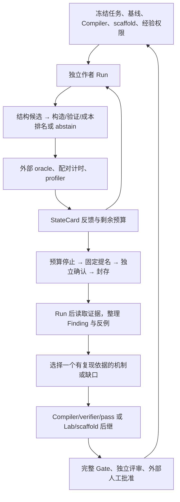

# Metal：先验证可重复的 Kernel–Compiler 演进闭环

状态：设计草案；尚未满足正式实验执行门。用户选择先验证可重复闭环，再扩展
FP16/BF16、矩阵指令和真实推理子图。早期离线探针基点为 `metal@a2e62b08`。

2026-10-06 后继验收已恢复：用户选择现有 Xcode 16 / SDK 15，仅通过子进程
`DEVELOPER_DIR` / `SDKROOT` / 编译器路径绑定，不修改全局 xcode-select。
固定 `b3375d63` 的独立环境完成 54 项 CPU 合同、1 项跳过；archive 与 observer helper
编译通过。现有 Metal 本地 broker 下的零 dispatch 检查和后继 host capture 通过，
观察到 Apple M4 / macOS 27.0 (26A428) / family9，counter 能力可用。
`runtime/hosts/apple_gpu_family9.json` 现记录该后继环境；旧提交及旧失败保持原状。
上述零 dispatch 检查本身不证明数值或计时；随后真实结果见下文。外部记录目录为
`~/.local/share/open-cake-ir/planning/metal-xcode16-20261006/`。

[PR #342](https://github.com/qhy991/open-cake-ir/pull/342) 已合入 `main@5b4be89d`，
包含 #340/#341、资格复用与完整运行入口的证据准入。固定 head `59a15feb` 的
CI `37389739785` 三个 Python 版本各 **2816 passed、35 skipped**，完整 Corpus
181/181；定向后继回归 56 项、238 个子测试通过。完整测试此前暴露的 Executor/arm
夹具缺字段、非隔离 Codex 路径的局部 import 和旧 mock 参数均已修正，旧失败保留。
共享修复已同步到本 Metal 任务分支，平台 PR #344 的整合 CI 另行验收。

prepare、provider 构造、Run/Campaign、factory 与回放按真实环境类别验证 anchor 的
实际归档和两轮包内正文；缺失、旧版、fixture 收据、材料/配置错配与零轮早退均有覆盖。
成功两轮 CPU 夹具经过真实 invocation builder、子进程 adapter、输入采集、反馈和
完整回放，验证历史进入第二轮请求；它不是实际模型的学习证据。
共享 CLI 后继 [PR #347](https://github.com/qhy991/open-cake-ir/pull/347)
在固定提交 `f8621d06` 允许显式选择技能包的请求进入既有资格路径；材料、配置、归档、
custody 和真实两轮输入检查仍保留。专项验收 **58 项、95 个子测试通过**，全量 CI 待完成。
用户已明确授权该限定变更，以及软件检查通过后一次无 GPU 的真实
Codex `gpt-6.1-sol / xhigh` initial/resume 资格；当前 Metal 分支尚未吸收该 PR。
该资格只验证作者接入与技能输入，不证明 kernel 优化或经验迁移；性能 Run 仍必须通过
测量与设备 phase 门。

已准备完整技能材料 `author-material-3d430a13/author-skills.tar`，包含主技能与 AIR
参考，现有 NativeSkillPackage reader 通过。独立 quick validator 因缺 PyYAML 未运行，
没有修环境重跑。新包尚未安装或交付真实 Run，不沿用旧材料的资格。
后续明确绑定 `/Applications/ChatGPT.app/Contents/Resources/codex-cli/CodexCLI.app/Contents/MacOS/codex`
（已观察 0.159.2）；PATH 上 Homebrew Codex 为 0.149.0，不是先前发现探针的 executable。

此前验收停在外部服务边界：2026-10-05 20:16 UTC 查询的
[GitHub 官方状态](https://www.githubstatus.com/api/v2/summary.json) 将 Actions 列为性能下降，
事件 `3q1yb5m7ltvb` 正在调查 hosted runner 分配延迟，覆盖本次 CI 失败时段。
状态摘要保留在 `github-actions-incident-3q1yb5m7ltvb-201637/`。确认外部恢复后，使用不改
CI 配置的新整合提交进行后继验收；旧失败保持终态，不重跑、替换 runner 或重新标注。
其后整合提交的完整差异已通过上述 CI 并进入 main；旧 runner 失败仍保持原判定。

采集前失败如实记为技能输入未验证，保留诊断和可见费用，不授权候选；不要求为缺失输入
制造证明。本机工具链、资源分配和测量门分别待验收，不因回环网络已通过而放行。

旧证据保留在原提交回放，不自动升级为当前资格。本页是开发计划，不是实验报告；
模板与观察边界见 [TASK / AGENTS 规划](METAL_EVOLUTION_AUTHORING.md)。

## 1. 产品定位与当前判断

建设一个让 Agent 在 Mac 上编写、解释、验证和优化执行计划的 Python 工具。
可借鉴 CuTe DSL 的 Python 编写体验、显式硬件决策和可检查生成结果；继续遵守本仓库不引入
layout algebra 的原则。Schedule 记录具体数据访问、线程分工、存储和同步承诺，Compiler
验证这些承诺；用户不需要学习另一套布局代数。

**当前 Compiler 适合作为受限 FP32 闭环的候选基础；本机环境和 Lab 反馈尚未达到正式实验起点。**
这里的“足够”是能在选定任务上表达不同机制并得到可信反馈，不是全面覆盖 Metal。
所有状态要分开：可构造、可 lowering、原生可编译、设备正确、计时可信、框架可用。

| 能力 | 当前实现边界 | 第一阶段决定 |
| --- | --- | --- |
| Python 前端、类型与定位诊断 | 已有公共前端和 Compiler；不是从零实现 DSL | 直接复用 |
| Metal 组合 lowering | `backends/metal.py` 支持 FP32 load / elementwise / reduce / store；一个 role，可含连续 SIMD groups | 选择此子域中的任务 |
| 并行与存储 | 标量 ProgramMap、lane 条带、归约和部分跨 group 标量广播；显式 allocations / tile_loops / pipelines / barriers 被拒绝 | 不把 group 数量调参当作全部搜索空间 |
| 收缩计算 | 能以乘法与归约组合小型 GEMM 类程序；当前不是 Metal 矩阵指令路线 | 作为存储压力和结构搜索探针 |
| 数值 | 当前 Metal 后端只接纳 FP32；不沿用旧分支 BF16 特例 | 第一阶段保持 FP32 |
| 资源解释 | 有逻辑 lane 存储量和局部拒绝；不是物理寄存器、spill 或 occupancy | 报告建模域及缺失域 |
| 搜索和证据 | 同会话 Ralph、独立 Evaluation、拒绝反馈、确认、终态和回放已有实现 | 不新建第二套 Ralph |
| 计时和 profiler | 配对批量 command-buffer 时间/dispatch 数；compute-stage 时间戳归因 | 声明测量区间和热缓存；不声称裸 kernel 延迟、缓存命中或占用率 |
| 成本模型 | 没有已校准 Apple 性能排名模型 | 明确 abstain，使用冻结的候选次序；不借用 NVIDIA 模型 |
| 框架集成 | 单任务/Program 证据不等于模型前向验收 | 内环通过后单独接入实际框架 |

源码事实由 `src/open_cake_ir/compiler/backends/metal.py`、`lab/metal_build.py`、
`lab/task_package.py`、`lab/execution.py`、`lab/ralph.py`、`lab/knowledge.py` 和
`tasks/workloads.py` 持有。架构继续遵守 [Compiler / Lab 边界](../CONTEXT-MAP.md)。

## 2. 第一组任务：六个发现任务，另留迁移与边界检查

先使用现有 Workload factory、oracle 和五类输入，不复制语义，也不按搜索结果放宽容差。
下面是**已通过离线构造、assess 和 MSL 生成的形状草案**，不是已原生编译或 GPU 验证的清单。
六个发现项、三个形状验证项和三个留出项合计十二项通过；未使用留出项做优化。冻结前任一形状不可用，就公开
记录原因并修改草案；冻结后失败保留在预分配中，不删除难题来提高成功率。

| 角色 | 现有任务名 | FP32 主形状 | 想观察的能力 |
| --- | --- | --- | --- |
| 发现 D1 | `silu` | R=128, C=1024 | 元素级运算、复用和工作划分；作为简单对照 |
| 发现 D2 | `rmsnorm` | R=128, C=1024 | 归约、广播、活跃中间值与重算 |
| 发现 D3 | `softmax` | R=128, C=1024 | max/sum 两次归约、数值稳定性与中间值复用 |
| 发现 D4 | `bias_gradient_reduction` | R=128, C=256 | 列方向归约及已有梯度累加，避免只研究行归约 |
| 发现 D5 | `adamw` | R=128, C=256 | 多输出、状态输入、公共子表达式和数值约束 |
| 发现 D6 | `gemm_silu` | R=128, K=256, N=32 | 收缩与融合 epilogue、列分工和私有存储压力 |
| 形状验证 V1 | `rmsnorm` / `softmax` | R=31, C=1009 | SIMD 尾部与奇数维度；分别建立 Workload |
| 形状验证 V2 | `bias_gradient_reduction` | R=127, C=257 | 不同归约轴和输出尾部 |
| 留出 H1 | `layernorm` | R=128, C=1024 | 同类未参与开发的算子：中心化方差 |
| 留出 H2 | `residual_rmsnorm` | R=128, C=1024 | 同类未参与开发的算子：残差舍入与融合 |
| 留出 H3 | `pairwise_sqdist` | R=64, K=64, N=16 | 同为收缩但不同算术语义：先舍入差再平方 |

H1/H2 是同类算子迁移，H3 是不同收缩语义；这些不能声称是完全未见算子族。
发现任务已包含 activation、normalization、reductions、optimizers、contraction，真正跨族
泛化需在后继协议中另外留出整族。留出集只做必要的基础可运行性检查，不进行优化诊断回流；
如果维护过程已经利用某个留出案例改进实现，就把它移入开发集并重新预注册测试集。

每个 Run 只优化一个固定形状。尾部与新形状作为独立评价，不先做 dispatcher，也不把
“覆盖全部形状”作为第一次搜索的目标。大 GEMM / attention / BF16 暂为后继能力目标，
不靠朴素基线的高倍数宣称可竞争生产库。

## 3. 判断基础是否足够：按顺序过门

| 门 | 验收内容 | 失败后去向 |
| --- | --- | --- |
| G0 主机与冻结权限 | 精确 M4、OS、SDK、Swift/Python、helper 一致；干净固定提交；provider 身份、权限与实际网络路由明确；确认 GPU 使用规则 | 环境/Executor，停止本次准入，不现场修好重跑制造通过 |
| G1 任务与 Compiler | 六个 starter 构造、assess、lower、原生编译；已有 Corpus Gate 与适用合同测试通过；oracle 覆盖完整输入 | 区分 frontend、verifier、lowering、任务 ABI；按 owner 修复后作为后继验证 |
| G2 可搜索性 | 每任务至少两个非改名、非纯 group 调参的结构策略可表达；至少两个代表任务验证完整策略对 | 若只有一种实现可走，先补关键表达能力，不能通过奖励调参掩盖 |
| G3 设备与测量 | 封存基线全部输入正确；A/A 对照、已知慢化对照、配对顺序、时间戳与独立确认通过 | 无可信计时就只报正确性/覆盖，不能开启性能研究 |
| G4 两轮系统验收 | 候选绑定的结果与 MSL/operation 对应实际交付并可回放；作者探索 Cake 并核对低层机制；受保护文件、预算、确认预留正确；经验摘要可追溯 | 结果归因、源码投递和预算入口已集成；待真实作者、skill 输入和设备资格 |
| G5 冻结 | Workload、固定基线、提交、每任务 scaffold/资料、Codex gpt-6.1-sol/xhigh、作者环境、参考权限、预算、经验和 pass grants 完整 | 独立 Run 目录与状态；技能发现按实证范围声明；不使用浮动 main 或自动更新 incumbent |

G1 要覆盖所有发现任务的 starter；G2 先以 D2、D6 做完整机制对演练，其他任务再逐项扩展。
只验证组数可改并不足以通过 G2。至少覆盖一种数据流/活跃存储改写和一种输出工作划分改写。
已有 output-column specialization 可用于能力验证，但不能预先喂给不授予该 pass 的对照组。

正式 provider / GPU 工作必须在适用门通过之后开始。这里的 G3/G4 是独立、受审查的系统
资格步骤，不能用尚未合格的正式研究 Campaign 去兼任它们。运行前按仓库要求读取已安装
GPU lease skill；若该 skill 不可用，停在执行边界。

门的依赖不能成环：先做 G0、G1 和 G2 的离线部分，再在相应设备执行准入满足后进行
G1/G2 的原生与设备资格、G3 测量资格。具备所选作者路径的既有 provider 准入后，才能执行
G4 的 D2/D6 两轮接入验收；G4 不自行授予 provider 资格。最后 G5 冻结发现批次。
每次资格工作也有自己的固定输入、有限预算与外部证据路径；不能把“准备验收”当作无限执行权。

G0/G1 的准备需按实际调用划分，不能把一个 launcher 开关当作“离线”：

| 阶段与现有 owner | 设备边界 |
| --- | --- |
| Compiler assess/lower、Corpus、CPU shim | 纯 CPU；本机 shim 的旧工具链失败仍保留 |
| `MetalArchiveHost.build`、`metal_runtime.compile_observer` | Swift helper 编译；尚未执行 helper |
| `capture_executor_host` → `inspect_metal_host` | 创建 Metal device 并检查精确目标/counter 能力；无 MSL 编译或 dispatch |
| `MetalToolchainBuilder.build/reload` | 创建设备、编译 MSL、生成与严格重载 archive；无 dispatch |
| `tasks.evaluate` → `metal_runtime.observe` | 通过既有 broker 进入设备执行；observer 编码并提交 command buffer |

capture 和 archive 构建自身不申请 Evaluation lease；GPU Infra 的 submission 又要求已有
封存产物，不能用它引导首次 archive。后继环境必须明确这些接触设备阶段的既有资源绑定，
不能声称 Evaluation 的 allocator 自动覆盖全过程。Metal 目前也在取得 lease 后准备 CPU
oracle/input；若调整这个边界，须在 Executor/source 后继中实现并验证原测量合同。
后继 `task/metal-device-phase@7e548840` 已为 archive build/reload 与 host inspection
实现短生命周期子进程准入：请求在租约外准备，子进程取得既有本地 broker 租约后 exec
原生 helper，退出后父进程处理报告；合法已有 Evaluation 租约只借用，不另开或提前释放。
五项真实 CPU 子进程测试覆盖正常退出、争用、继承、超时/失败和非法身份，均通过。
整批结果为 29 passed、46 subtests passed、1 failed；误包含的 Darwin 原生 archive 测试
使用默认 CLT/SDK 27，编译失败。该次验收停止，未修环境重跑；不能作为后继设备资格。
完整 CI 与固定 Xcode 的原生资格仍待完成。该修复还未改变正式 Evaluation 的 oracle
准备及后处理阶段，不能据此宣布整个 phase 门已通过。

本次同步的 `LOCAL_DEVICE_LEASES.md` 所述按设备编号并行和分配前 CPU 准备不适用于当前
Metal 路径；Metal 不支持 `--local-lock-scope device`。其中编译不占用 lease 的说明也
不代表 Metal archive 编译无需设备资源准入。
capture CLI 会写入所选 checkout 的 `runtime/hosts/<target>.json`，既不是只读盘点，也不是
默认写到外部报告。只指定另一份 `swiftc` 不能保证 SDK 一致：archive helper 可显式接收
SDK，observer 编译和 host capture 还依赖各自工具链选择。`--baseline-only` 会访问设备和
编译 MSL；`--preflight-only` 会走到 provider qualification，均不能作为纯 CPU G0 命令。
上述来自固定平台源码的只读调用检查，见 `metal-phase-boundary-audit-20261005/report.json`；
没有执行后继环境验收。顺序为环境选择与绑定、CPU 准备、设备资源准入与 host capture、
archive/build/reload、G3 设备测量、provider/G4，再冻结正式批次。

G3 冻结具体 assay，不能只写“Metal latency”。当前 `evaluation_policy` 的 Metal v2 默认
每个 command buffer 编码 64 次 dispatch；10 个交替 AB/BA pair，每个 arm/cohort 3 次预热
加 25 次计时，实质收益阈值 1.05、要求至少 6 对胜出。质量门使用 relative IQR ≤0.05，
不能把仍保留的 `maximum_cv` 字段当作 v2 的质量决策依据。计时值为 command-buffer GPU
区间除以 dispatch 数，设备状态声明为 `warm_no_explicit_flush`，不是冷缓存裸 kernel 延迟。
本地序列化也不排除桌面或其他外部 GPU 客户端；保留干扰/不稳定结果。
A/A 应落入预注册的零差异范围并得到 `close_null`，已知慢化应正确判定方向；
`measurement_quality_failed` 不能算性能成功。compute-stage timestamp 仅作归因，
不能混入计时样本或替代这一质量门。

一次完整 search 或 confirmation 的计时部分含 500 个样本、560 个 command buffer
（含预热）、35,840 次批量 dispatch，另有正确性与归因开销。24 次搜索加一次确认仅这一
部分就有 896,000 次 dispatch；60 分钟是待资格检验的预算，不是耗时承诺。现有 receipt
的 `kernel_calls` 在 Metal 路径计 command buffer，物理 dispatch 数要从原始
`command_buffer.dispatches` 读取。G3 保留配对顺序、原始时间、正确性输入、profile、
observer/snapshot 成本和封存 archive 的严格重载结果；编译源码成功不能代替产物重载。

旧 `a2e62b08` 的离线检查执行了当时完整 Corpus Gate，178 个案例全部匹配既定预期；其 Apple 覆盖
只有 family8 的 15 个案例，family7 / family9 明确未检查。不能把 Gate 通过写成 M4 覆盖通过。
十二项 M4 任务准入只是正例。另一次离线探针已检查 M4 的两个正例和十类拒绝：非连续 groups、
不支持的 coalescing 承诺、CUDA load policy、未建模 residency、缺失 access map、错误 backend、
非标量 program tile、遗漏变化中的 store 轴、BF16 与 store 形状不符。十类均由预先指定的
规则命中，并在公共 lower 入口拒绝；不是依赖无关规则碰巧拦截。这些尚未被采纳为 Corpus
案例，也没有原生/GPU 数值证据；未修改 Corpus expectations。
本机会话环境失败与后续离线验证分别保留在 checkout 外，不用后来结果覆盖早期失败。
后续只读盘点发现 `/Applications/Xcode.app` 的 Xcode 16.0 / macOS 15.0 SDK 可作为独立
后继候选；当前选中的仍是 CLT。文件存在不证明它能在当前系统编译或通过设备验收，尚未
切换、编译或重跑旧门。后继环境选择待确定，原 host 声明与失败记录保持原样。元数据范围见
`successor-environment-inventory-20261005/report.json`；它不是资格报告。
仓库指定的远程 GPU lease 规则已读取，但尚未定位本机 active gpu-infra checkout / kernelctl。
管理器的 GPU Infra 节点路径与单任务入口的 Metal local-broker 路径是不同执行绑定；不能仅凭
缺少 kernelctl 断言所有 Metal 路径不可用，也不能因此宣称已有可用租约或设备资格。

同步后的固定提交 `d3967a0d` 已重新检查：181 项 Corpus 匹配、12 个任务形状可构造并生成
MSL；Corpus 仍没有 family9 案例，新增的 synthetic family10 案例不构成 M4 资格。三版本
完整 CPU CI 各 2687 通过、35 跳过，离线 baseline/successor 编译与发布边界检查也通过。
本机局部合同测试在 38 项通过后遇到 Evidence custody 的 `mkdir(dir_fd)` EPERM，按首错
停止；没有修环境后重跑，剩余本机测试保持未验证。以上均不代替原生或 GPU 验收。

两个代表任务已验证结构表达范围：RMSNorm 可以从保留输入改为归约后重读输入、延后加载
权重（2 次 load → 3 次 load）；GEMM-SiLU 可以通过现有列特化，从行程序变为行×列程序
（grid `[128,1,1]` → `[128,32,1]`）。四个候选都通过静态准入并生成 MSL，group 宽度均为 32。
其余四项也已完成结构表达探针，六项现在均有 starter 与一个替代程序可静态生成 MSL：

| 任务 | 替代机制 | 离线观察与尚未解决的问题 |
| --- | --- | --- |
| D1 SiLU | 行程序改为每个输出标量一个程序 | grid 从 128 个变成 128×1024 个；可能严重浪费 lanes，只作为结构/慢化探针，不能冒充有用搜索空间 |
| D3 Softmax | sum 后重新加载输入并重算 exp | load 1→2，操作 7→10；逻辑峰值槽位 65→66，已不支持“这个改写降低峰值槽位”的假设 |
| D4 Bias gradient | 两个有限输入切片分别求和后合并 | load 2→3，reduce 1→2；逻辑峰值不变；FP32 求和顺序改变，必须过原 oracle |
| D5 AdamW | 提前写状态输出，延后加载参数 | 逻辑峰值槽位 48→40；尚不知道原生编译是否保留这一差异 |

这证明可表达性，不证明更快、物理寄存器更少或 GPU 数值正确。G2 的表达子门已有六项覆盖，
完整 G2 仍待设备语义和可用搜索空间验证。D1 若只有明显劣化策略，则保留为负对照，不能
算入“六个都有优化余量”的分母；正式冻结前另行确定发现任务数，冻结后不据结果换题。
逻辑槽位可反驳一个静态假设，但不能据此排除设备上可能更快的程序或宣称寄存器节省。

## 4. Ralph 实际上做了什么，哪里还缺一环

`task_package.py` 从冻结权威派生不可变 TASK.md / AGENTS.md。当前默认 Metal 作者只修改
`candidate-set.py`；Lab 保留完整原文件，再无执行地投影有序 Schedule/Program/transform。
显式单源码模式才写 `candidate.py`，且是一个候选、一次 search 的不同 treatment。旧 JSON
envelope Run 继续按旧提交运行，不能沿用其资格解释默认 bundle。
`execution.py` 延续同一个 provider thread，每轮先处理整个候选集合、过滤和编译，再对可行
候选按冻结的 `searches_per_turn` 上限运行外部评测。当前下一轮反馈包含每个已评测候选的
身份、数值和 profile，以及构建拒绝、语义折叠和未评测原因；超过上限不自动得到评价。
`ralph.py` 管理 token、轮次、编译、评测、作者时间和墙钟；搜索结束后才进入预留确认。

旧 `a2e62b08` 的记忆探针证明 Python 假设注释经过 envelope 投影仍保留，去掉注释后的 Schedule 相同；
`selection._matched_search_plan` 会把同轮相同程序折叠为一次 search。但原始提交字节不同，
且 `candidate_filter` 先构建整组候选，再做评测计划；这一去重不节省前面的构建额度，
也不跨轮记忆。相同程序下一轮仍可进入 search。当前 `d3967a0d` 的独立 bundle 探针又
验证了函数体注释进入逐候选源码、函数外/transform 注释仅留原文件；两份笔记不同的
候选仍解析为相同 Schedule。该探针没有重新证明全链 search 去重或作者学习。
必须记录重复构建/跨轮重测的成本，
不能把“有会话上下文”当作已经有自动经验积累或全程去重。

**旧 Metal 审阅基点的 G4 曾有确定的反馈归因缺口。** 在共享 Lab 的两轮 CPU fixture 中，每轮三个普通
submit 候选、两个被搜索，第二个候选更快。六个 fixture Run 的日志均记录它胜出，第二轮
也收到其数值与 profile；但反馈和 StateCard 都没有胜出 candidate 身份。现有 semantic
replay 仍通过，因为它验证了当前投影，而当前投影本身就缺少这项信息。这是共享控制流
的离线复现，不是六个独立设备实验，也不证明真实作者已经犯错。

当时未胜出的已评测候选，其 correctness/计时/profile 留在 Evidence 中，却没有交付作者；
`rejected_peer_feedback` 只涵盖构建阶段拒绝。维护者不能把作者没有利用这些反证计为
“不会学习”。下面的共享后继已经修复这个软件缺口，仍须在同步后的固定提交与真实作者
路径验收；不能借改 Metal Compiler、新 primitive 或收紧到单候选来避开。

共享修复现已在 `task/core-feedback-binding` 的本地提交 `5453a4f5` 实现，
零 provider 依赖修正在 `6a646140` 完成，71 项相关 CPU 合同通过。
广泛回归的 165 项中，两项软件/fixture 问题已由后继验证关闭，另有一项工作树写权限
前置条件未满足，保留未验证；没有调整环境后重跑。完整结果见外部
`feedback-binding-successor/report.json`，不能把这些重叠套件相加成独立样本数。
新增 `source_turn`、`selected_candidate_sha256` 和按原动作位置排列的 `candidate_results`，
每项分别标记 `evaluated`、`build_rejected`、`duplicate` 或 `not_evaluated`；
错误、不稳定和未胜出的结果不会被胜出结果覆盖。全部拒绝时的 selected 仅指诊断对象，
不是可执行或 qualified；变换未产出候选时仅通过 `author_actions` 解释，不能伪造候选。
原始过滤事实保留有界 Findings，独立回放从此前动作、过滤、拒绝与 Receipt 重建下一轮
及终态反馈，不把终态确认/profile 借给先前搜索。篡改反例同时覆盖可自洽重渲染的 bundle。

这补上信息交付的软件前提。[PR #313](https://github.com/qhy991/open-cake-ir/pull/313)
已合入 `main@af1b18ba`，三个 Python 版本的完整 CI 通过；集成记录见外部
`feedback-main-integration.json`。本计划分支同步 `354a670f` 后已包含该实现；这不等于
真实 provider、GPU、作者学习或 Compiler 收益结论。旧 fixture 与旧 Run 保持原样，不修写历史使其通过新规则。
Finding `F-2026-10-05-007` 仍为 proposed；测试事实不会自动批准协议或 Compiler 演进。

**任务新增明确要求：探索 Cake，并核对低层实现。** 每轮以一个可证伪机制为中心，读取
相关 frontend/API 和合法性约束，尝试已有 primitive 的 canonical 组合，保留所用 API、
operation/region、预期 lowering、实际可见证据和下一步。改变算法/数据流或归约/复用结构
才是有效结构探索；不以 API 数量衡量，也不把 starter 当作 Compiler 的表达上限。
Cake 表达能力、lowering 实现和设备收益必须分别判断，负结果进入既有 Finding 路径。

低层参照分为 MSL 源码、Metal IR/AIR 中间表示、Apple GPU 机器指令；MSL 不等于 PTX。
首轮以候选绑定的生成 MSL 为代码检查层；更低层能力按精确工具链的实际证据增加。
源码与 logical slots 不能证明最终指令、寄存器、spill 或 occupancy。
[PR #320](https://github.com/qhy991/open-cake-ir/pull/320) 已在 `main@473f8cad` 补齐显式
启用的候选源码反馈及独立回放，本计划任务分支已吸收；默认和旧 Run 权限不变。
投递完整 stage 的 MSL、原始行号和既有 `CAKE_OP` 标记，超限时明确省略，不能声称看过
未交付区域。固定实现的三版本 CI 各 2698 通过、35 跳过；这证明软件合同，不证明真实
作者阅读、设备正确或收益。G4 继续要求实际作者引用区域并检验假设，任务文字不授予额外工具。
分层依据、短任务文案及交付正反例见 [authoring 合同](METAL_EVOLUTION_AUTHORING.md)。

当前有四种不同的“记忆”：

1. **同 Run 会话上下文**：可帮助接续，但不是稳定的跨 Run 知识库，也不证明作者理解了反馈。
2. **Run 内 `optimization_history`**：PR #316 已加入 StateCard，保留近期已评测候选、拒绝、
   变换与最佳合格 search；报告数量/字节截断。live 与独立 replay 都从先前事件和收据派生，
   包括非胜出者；它没有 MSL 正文，也不含其他 Run 的经验。最佳 search 仍需新鲜确认。
3. **Evidence 与确定性投影**：保留完整候选、原始作者文件、拒绝、收据、usage、动作和终态，
   是有界历史之外的维护回放来源；作者不能因此自行扩大读权限。
4. **Finding / OptimizationKnowledge / passes**：可承载跨 Run 经验，但需要整理、审查与明确授予。

`tools/summarize_diagnoses.py --compiler-gaps` 已能统计保留诊断，并给出当前码表的缺口
提示与单列的 transform-refusal triage。这些是维护线索，不重判旧事件、不证明根因或独立
复现，也不批准晋升。`knowledge.py` 已支持冻结材料和变换权限。缺少的是稳定执行的“Run 后提炼—
复现—决定是否晋升”的维护工作及其质量验收；再加一个不受约束 MEMORY.md 无法补齐它。

旧 Metal 基点的 routing 把特定 backend vocabulary 拒绝分给 `ir_vocabulary`，其他 blocking Finding
通常分给 candidate。当前共享后继已有 `backend_lowering` / `backend_triage` 归属，
但维护者仍要检查实际拒绝码和适用域；`METAL_DECLARATION_UNSUPPORTED` 之类可能是后端能力
边界，不能只按汇总计数判断作者写错。旧事件保持原分类。

任务组织也要区分三个范围：任务文件夹、Codex 状态目录、作者实际可见的 skill/参考材料。
旧 Metal 基点只已有第一项；已同步的 auth-only home 后继补了部分状态隔离，仍未证明
宿主/祖先/admin skill 来源受控。PR #317 的 schema v2 已按 cell 保存、投递各自完整规范和
参考资料；v1 保留历史共享语义。独立 judge、冻结 Compiler 和证据权限继续由原 owner 管理。
执行绑定、KDA 当前实现的可借鉴范围与目录约定见 [authoring 规划](METAL_EVOLUTION_AUTHORING.md)。
这些属于先固定的 authoring treatment，不能把新增技能或目录改造的收益记到 Compiler。

## 5. 内环与外环分工



作者不编辑 Compiler，不调整测量协议，不因一次失败主动发明 IR primitive。
维护者在封存后整理：观察域、原候选与对照、错误路径/收据、失败类型、适用条件、反例、
重复出现的独立来源、建议 owner、建议改动及 No promotion 理由。

常规能力晋升优先要求在两个独立 Run 或两个不同实例出现，而不是同 Run 重复三次。
这是第一阶段的筛选规则，不是“所有正确性修复都必须等两个事故”：单个确定性错误也可
修复，但要与可推广性能机制分开记录，并用最小反例和原证据验证。

经验按现有 owner 落地：候选策略留在材料/Lab recipe；确定性重写进 Compiler pass；漏检进
verifier；真实表达缺口进 IR/lowering；测量缺口进 Evaluation；反馈交付缺口进 Lab。
先确定缺的是现有 primitive 的 Metal 实现还是 IR 语义，不新增“算子名 → 实现”的分发表。

冻结作者输出的经验仅是建议。维护记录不代替收据，不把同一事件复制为多个独立发现，
不自动批准自己的 Compiler 改动。当前用户约束仍要求完整 Corpus Gate 与自动化之外的
人工批准；不得创建或修改 `compiler/release-approval.json`。新版代码以 clean commit
作为身份，不能为了套旧流程复活已退役的 release 文件。正式发布前先确认适用流程。

## 6. 如何判断“越来越好”，避免四个因素一起变化

按用户选择固定 `Codex / gpt-6.1-sol / xhigh`，保持相同 provider/scaffold、任务、硬件和预算；
每任务独立目录，再按 Compiler treatment 与重复编号分层；每个独立 Run 新会话，
同 Run 内延续 Ralph。维护会话和作者会话隔离，当前分析上下文不得当作无经验组的起点。

**第一步：工程重复性先导。** 在 G4 完成 D2、D6 各一个至少两轮接入验收，再过 G5，
然后启动已冻结的发现任务批次，每任务三个独立 Run。资格 Run 不混入发现批次统计。
先导只报逐任务结果、范围和故障，不声称群体因果效应。
建议每 Run 最多 8 轮、150k provider tokens、每轮至多 3 个候选、最多 24 次原生编译、
显式 `searches_per_turn=3`、24 次 search 和 24 次 attribution、1 次最终 confirmation；墙钟 60 分钟，其中搜索 50、
确认预留 10，主动生成 30 分钟。此为待资格验证的有限预算，不是已提交 RunSpecification。
确认预算包含实际 paired cohort 成本；若先导显示不够，在正式冻结前重新规划，不能运行中加额。
这只是上限，不承诺跑满八轮：CLI 默认每轮搜索两个，不能沿用；控制器按一整轮配额决定
是否继续，3 个搜索配合旧的 16 次额度会在五个满额轮次后停止，并剩下 1 次无法凑满下一轮。
原生编译按实际 source-to-artifact 入口计数，失败/内部变体也计入，24 次不等于保证 24 个
可执行候选。当前 `task_run_inputs` 生成的 confirmatory 配额为 `turns`，执行逻辑最终只确认
一个提名；冻结时核对实际 RunSpecification，不能把“执行一次”误写成“配额字段已设为一”。

**管理预算入口已补齐。** [PR #321](https://github.com/qhy991/open-cake-ir/pull/321) 已合入
`main@08e89422`，本页配套提交已集成。schema v2 在原有预算之外，独立接纳
`max_candidates`、`searches_per_turn`、`max_compilations` 与 `confirmation_seconds`；
省略项仍由固定提交的单任务 CLI 决定，v1 保持原语义。准备快照、节点参数和实际
`task_run_inputs` 的 CPU 检查已证明下面的输入映射；它不是正式 Run 或执行资格：

```json
{"turns": 8, "token_budget": 150000, "wall_seconds": 3600,
 "max_candidates": 3, "searches_per_turn": 3,
 "max_compilations": 24, "confirmation_seconds": 600}
```

完整参数关系由既有 Run budget owner 在 provider qualification / GPU 评测前验证；
prepare 成功不表示已冻结或必能启动。独立覆盖与 CLI 默认冲突时，运行入口会拒绝。
原始和集成检查、完整 CI 记录见外部 `experiment-budget-7a74fa2c/report.json`。
不能从 scaffold 文字推断实际预算，仍需在正式冻结时核对 RunSpecification。

**第二步：只改变 Compiler。** 冻结 C0 后发现一个重复缺口，审查实现 C1。以相同任务、
同一 scaffold、无额外经验、相同 pass grants（第一轮建议均为空）分别运行 C0/C1，每格
至少三个工程重复。维护者根据 D 集开发 C1，H 集用于检验迁移；D 上提升只能叫开发集改善。
不把 C1 的新 benchmark helper 或新增提示词一起变化后统称“Compiler 提升”。冻结材料
审查覆盖 scaffold、references 和完整技能包，不仅是 `knowledge.materials`；C0/C1 使用
相同材料，后续 E0/E1 的额外经验也不能经技能脚本或引用资料隐式跨组进入。

**第三步：在同一 Compiler 上分离经验与工具。** 复用已有
[E/P 消融设计](OPTIMIZATION_TRANSFER_ABLATION.md)的方法：E0P0、E1P0、E0P1、E1P1。
每个测试 cell 至少五个独立 Run，按任务/重复分块随机化顺序，材料和 pass 在测试前冻结。
E0 的含义是无额外材料；P1 的 API 自带机制描述，不能称 E0P1 完全没有机制知识。现有
默认 Python bundle 可在 Schedule 函数体或 `cake.transform(...)` 附近写短注释；
逐候选 Python source 保留函数体内注释，transform 的 Program JSON 不携带注释，原始
`provider_source_file` 仍保留对应文字。维护时按显式动作位置、parent 与 transformation 对齐，
不能把原文件笔记冒充 IR 字段或评测事实。E/P 两组保持相同记录机会；不能把 P1 变回手写
实现来满足笔记要求。旧 messages-only envelope 的限制另行声明，不借用 bundle 的证据。
先导确定任务数和预算后才预注册正式研究；小任务集不生成跨任务总体结论。
当前 `lab/study_plan.py` 强制 source / target 不同、作者为 messages-only responses，
generalization 只接纳 unseen_shape / unseen_family。因此不能直接把同 M4 的经验积累或
同族新算子塞进现有 transfer StudyPlan，也不能沿用 CLI 资格当作消息作者资格。先使用
现有独立 Run 路径做清楚标注的工程对照；正式同平台 E/P、同族算子迁移或版本对照需要在
共享 Study owner 增加经审查的协议支持，并固定真正相同的作者条件。不能伪造 source target、
把同族新算子改名为 unseen_shape，或为了运行而绕过现有准入规则。

对每个版本 Cj 同时保留三个量，在同一主机和有效协议下配对测量：

- `Bref`：每任务最初封存且保持固定的外部基线产物；不随 incumbent 自动移动。
- `Bj`：原始 starter 经 Cj 生成的结果，显示 compiler 默认实现自身变化。
- `Aj`：该 Run 最终提名并通过新鲜确认的 agent 产物。

当前入口已有显式 `--fixed-baseline-bundle`，PR #316 补充了跨 Compiler 的固定产物准入。
Metal archive 已可显式独立于后继 Compiler 的 starter emission；精确 Target、Workload
ABI、产物身份与原有配对检查仍保留。其他 code-object 的 native 参数检查和独立性证据
范围不同，不能把一个平台的 CPU fixture 当作 Metal archive 的重载/设备资格。冻结 Metal
系列前，仍需用实际封存的 Bref 验证相应 owner 接纳和目标设备上的新鲜评测。

分别报告 `T(Bref)/T(Bj)`（compiler 基础收益）和 `T(Bref)/T(Aj)`（总收益）。现有 paired
协议每次只有 candidate/baseline 两臂，固定 Bref 的单次确认不能同时给出直接配对的
`T(Bj)/T(Aj)`。要把后者作为 agent 额外收益，须为已经封存的 Bj/Aj 另做固定候选对的
Evaluation，提前计入独立预算；若仅把两个对 Bref 的比值相除，标为探索性派生量，不称
直接配对估计，也不用它作确认成功终点。不是用不同日期绝对耗时直接相除；封存 archive 的 OS/设备
兼容性发生变化时旧协议失效，开启新系列，不重编译 Bref 却沿用其身份。

主终点是共同预算内正确、计时质量合格且达到预定实质收益（建议沿用 1.05×）的确认成功率。
次终点是首次正确成本、最终确认性能、重复间 median [min,max]、编译与评测次数、无效重复率、
确认失败和负收益。失败/耗尽保留；基础设施中断独立标记缺失，不能叫数值错误，也不能隐去。
无效重复率分别报告同轮语义折叠、跨轮相同程序再提交；为了测量噪声而预先指定的重复评价
单列。作者改注释不增加结构候选数；即使评测被折叠，实际消耗的生成和构建成本仍计入预算。
若需置信区间，按既有 Study 协议在足够任务数下作任务成组分析，不能把时间样本当独立 Run。

另外报维护成本：经验整理、复现、编译器开发、审查和资格的时间/token。摘要数量或 Finding
数量不是进步；有效指标是有证据的建议比例、被拒绝的错误建议、重复失败是否减少、以及独立
后继 Run 是否实际受益。不开启额外中间 confirmation 时，不从搜索最小值推断“首次确认收益”。

## 7. 实施顺序和退出条件

1. **任务与环境基线。** 处理环境问题需单独环境维护工作；保留本次失败，不修改原始记录。
   在一致的后继环境上完成 G0/G1 和固定基线。代码编写前检查冻结与 source owner。
   当前离线任务与结构表达已完成；下一步优先解决主机声明/工具链的一致性，以及 G2 原生语义，
   不先扩大 dtype 或增加 primitive。用户已选择临时子进程回环直连，CPU 技能探针的
   initial/resume 投递已观察；用户随后批准了仅作用于子进程的现有 Xcode 配套工具链；新环境观察见下，不因网络通过而获得设备资格。
2. **共享反馈修复与两轮经验验收。** PR #319 已将 `main@354a670f` 的默认 bundle、
   候选归因、peer 结果、Run 内历史和任务资料隔离经 CPU 集成验证合入 Metal；本机 custody
   条件和真实资格保持各自未验证状态。继续按
   [authoring 规划](METAL_EVOLUTION_AUTHORING.md)使用已集成的 PR #320 源码反馈与 PR #321 预算入口，
   绑定完整 scaffold 和显式源码权限；每轮更新前重读当前候选文件，保留少量有效观察。
   按每任务独立材料与 Run 状态组织目录，
   为每个 cell 绑定完整技能包与 `isolated_skill_package_v1`，以 `gpt-6.1-sol / xhigh`
   完成真实 initial/resume 资格。PR #335 已接入执行器调用绑定与每轮归档/回放，CPU
   合同覆盖真实 EvidenceStore 的两轮路径和材料、身份、角色互换等拒绝；未调用真实模型。
   PR #337 补齐已返回 Turn 的拒绝证据及故障回放；超界或未采集输入仍明确不可验证。
   PR #339 已用保留 invocation、TASK 投影、原生事实、完整包与 system 快照重建资格输入，
   不读取原 HOME；`--native-skill-name` 明确冻结原生选择，要求每轮当前正文。
   资格按输出合同声明的 arm 集合验证，不把两 arm 固定成 Metal 的额外要求。
   PR #340 已随 #342 通过显式收据能力和 anchor 实际归档的 custody/语义软件检查；其首轮夹具
   将仓库内 schema 误作绝对外部引用，已在后继提交修正引用，原失败记录保留。
   PR #341 补齐每 cell `native_skill_names` → 节点 → launch → qualifier 的传递；
   两项与全部库运行入口已随 #342 合入 main；命令行开放仍待后继。旧收据及 fixture scope 不得获得新能力。直接入口、零轮和首轮故障路径须验证不会借
   缺输入或早退放行候选；采集前失败保留原诊断与已消耗费用，不冒充已验证投递。
   反例必须在实际准入入口拒绝，通过之后再开放策略。
   当前真实入口仍明确拒绝新策略。不能用旧 auth-only 绑定代替本次要求。验证作者引用真实区域并根据可见反馈
   改变或撤回假设；同场检验 Run 后摘要能还原一次失败和一次选择。先冻结新 authoring
   treatment，再在 C0/C1 对照中保持一致。
3. **C0 发现批次。** 六任务 × 三重复，固定基线；封存后选一个最频繁、最可复现的缺口。
4. **一次 Compiler tick。** 一个机制、必要 analyses、正负例、完整 Gate、独立评审及人工批准。
   先重放旧反例，再在后继 Run 验证，不能把实现完成当作性能有效。
5. **C0/C1 重复对照与 H 集。** 保留回归；没有提升也算完整结果。通过后才扩展 E/P 消融。

连续两次后继没有可重复收益时，检查瓶颈是表达能力、任务选择、测量噪声还是作者不会使用
接口，再决定下一步；不要为了得到上升曲线继续加入不相关 primitive。这里不预设单调进步。

平台专属实现走 `task/metal-* → metal`；共享 TaskPackage、诊断投影或 Study 协议走
`task/core-* → main` 再同步。共享反馈合同已独立进入 main；同步带入 main 的既有根 AGENTS 更新，本任务不改历史证据。
新 Run / Study / Evidence / 报告放在 checkout 外，不自动清理旧数据；共享合并已按用户授权执行，Compiler 发布仍由相应门负责。

### 当前准入台账

以下是计划的进度索引，原始观察保留在 checkout 外：
`/Users/haiyan-mini/.local/share/open-cake-ir/planning/metal-evolution-20261005-a2e62b08/`。
不把离线探针命名为已封存 Run，也不据其提出性能 Claim。

| 项目 | 已观察 | 剩余条件 | 原始记录 |
| --- | --- | --- | --- |
| G0 环境 | 用户选择的 Xcode16/SDK15 后继 CPU 54/1；M4 零 dispatch 与 host capture 通过；旧失败保留 | 后继 host 提交与原生 archive、设备测量、provider 各自准入 | `metal-xcode16-20261006/`；旧 `readiness.md`、`followup-readiness.md` |
| G1 静态 | 旧基点 Corpus 178/178；当前 d3967a0d Corpus 181/181、任务 12/12；旧 M4 2 正例/10 拒绝保留原作用域 | 六 starter 原生/oracle 通过见下；M4 Corpus 的独立审查采纳；旧反例不自动视为新资格 | `task-admission.json`、`m4-boundaries-and-source-notes.json`、`metal-main-sync.json` |
| G2 表达 | 六个发现任务均有结构替代程序 | 六 starter 与两结构替代数值通过；其余代表策略仍待设备验证 | `search-space-and-corpus.json`、`remaining-search-space.json` |
| G3 测量 | RMSNorm 同产物 A/A 数值正确但 20/20 cohort 的 relative IQR 超过 0.05；独立工作量与 timestamp 控制通过 | 测量稳定性未获资格；不启动性能搜索或声称收益 | `metal-xcode16-20261006/g3-rmsnorm-*`；F-2026-10-06-002 |
| G4 经验接入 | 历史/材料、PR #320 源码投递和 PR #321 预算已集成；8cc264f0 完整 scaffold 含重读笔记要求并已绑定源码权限 | 真实两轮作者行为；native skill 实际输入观测与资格 | `generated-source-feedback-03d9cac5/report.json`、`authoring-treatment-8cc264f0/composition-report.json`、`codex-skill-interface-01592/report.json` |
| G4 技能软件准备 | PR #335/#337 完成轮次与拒绝回放；PR #339 从保留材料重建资格两轮输入及当前正文 | PR #342 已合 main；CLI 开放与真实作者资格未完成 | `native-skill-qualification-b6ba8dc6/report.json`；旧失败记录保留 |
| G4 原生技能观察 | 完整 tar 到私有 HOME、原生两轮及新采集器路径共 4 次调用通过；另 8 次旧请求比对；system 已安装 5 项、实际目录 4 项 | admin/插件哨兵、脚本/依赖、真实模型使用与正式 provider 资格未完成 | `native-skill-collector-2d3a86b0/report.json`；前继失败保留 |
| G5 冻结与发现批次 | 未启动；管理预算投影已通过软件检查 | 前置门通过、正式 Run 预算与权限冻结 | `experiment-budget-7a74fa2c/report.json`；无 Run / Study |
| 平台软件集成 | PR #338 合入 metal@f404dbf5，三版本 CPU CI 各 2790/35；本任务吸收 PR #339 | 本次同步的 CI 与合并状态另存外部报告；软件检查不授予主机、设备或作者资格 | `metal-skill-fault-7fa4ac02/report.json`；后继记录另列 |

### 2026-10-06：真实 M4 资格实验

用户批准的独立后继环境固定 Xcode 16 / macOS SDK 15，主机为实际 M4、
`apple_gpu_family9`，源码固定 `2b34d17d`。环境变量只传给子进程，系统
`xcode-select` 未改变。旧 CLT/SDK 链接失败与脚本失败记录均保留。
以下记录位于 `/Users/haiyan-mini/.local/share/open-cake-ir/planning/metal-xcode16-20261006/`，
每个任务有自己的目录；这是有界资格探针，不是正式 Ralph Run。

- **静态与数值**：完整 Corpus 181/181；其目标覆盖仍以原 case 集为限。
  `g1-native/` 中 SiLU、RMSNorm、Softmax、bias-gradient reduction、AdamW、GEMM+SiLU
  六个 FP32 starter 均经原生编译、archive-only 严格重载，再对各自原有 5 种输入分布
  校验，共 30 次 dispatch 全部正确。只资格化这些 starter，结构替代程序尚未逐个上设备。
- **A/A**：`g3-rmsnorm-aa/` 固定 R128 C1024、同一封存 archive、10 个 AB/BA pair、
  每 cohort 3 次预热加 25 次计时、每 sample 64 次 dispatch。580 个 command buffer、
  35,860 次 dispatch 数值均正确；20/20 cohort 的 inclusive IQR/median 为
  0.1870–0.8139，超过原门槛 0.05，故 `measurement_quality_failed`。
  pooled baseline/candidate 比值 0.97794 不能据此称为合格 close-null 或性能结论。
  当前协议使用 relative IQR；CV 仅为描述量。没有删样本、放宽门槛或重跑到通过。
- **独立控制**：`g3-rmsnorm-work_control/` 同一 kernel 每 command buffer 编码
  16/256 次 dispatch，580 个 command buffer、76,180 次 dispatch 全部正确；
  command-buffer median 比值 15.2337，说明对工作量敏感，绝非 kernel 加速比。
  `g3-rmsnorm-profile/` 的 5 次数值预检与 1 次采样均通过，compute-stage timestamp
  差为 208750 raw device units，仅用于归因；occupancy、带宽、指令计数未采集。
  两个控制不覆盖 A/A 稳定性失败。
- **低层可观察性**：`low-level/rmsnorm-macos.air.ll` 是从本次自有 MSL 用固定 Xcode
  离线生成的可读 AIR/LLVM IR，可见 scalar load/store、`air.simd_sum.f32`、
  `air.rsqrt.f32`、`air.simd_broadcast.f32` 和 5 个 32-float private alloca。
  它不是实际 runtime archive 的反汇编；不能据此报告物理寄存器、spill 或机器 ISA。

另以同一固定 Compiler、原 Workload/oracle 完成两种手写结构替代的数值资格，
记录在 `g2-structural-rmsnorm/` 与 `g2-structural-gemm_silu/`：两者均通过原生编译、
archive-only 重载与各 5 种输入，再增加 10 次正确 dispatch。RMSNorm 重载输入并延后
weight load，逻辑峰值仍为每 lane 97 个 FP32 值；离线 AIR 保留额外 load，32-float
alloca 从 5 个变为 6 个，不能宣称减少物理寄存器。GEMM+SiLU 按行列拆分，MSL 显式
使用 program.x/program.y，grid 从 `(128,1,1)` 变为 `(128,32,1)`；逻辑峰值从 521
降至 25，离线 AIR 有三个 8-float alloca 与 SIMD sum/exp。输入重复读取和实际资源代价
尚未测量。这些验证说明两种结构能正确实现；它们是维护者编写的资格候选，不是 agent
搜索结果。RMSNorm 的逻辑存储假设保留为负结果，两者均 **No promotion**。

后续独立 `timestamp-attribution-diagnostic/` 按预先声明的计划执行 32 次单-dispatch
instrumented 观察和前后各 5 个原有输入检查，共 42 次 dispatch 全部正确。两个时间窗口
高度同变（Pearson 0.99999994；command/stage 的 CV 分别约 1.8267/1.8264）；
前次 GPU end 到本次 start 的间隔与 command interval 相关性约 0.1666。
这组观察不支持“仅整体 command 窗口有波动、compute-stage 稳定”的假设，不能说明
实际指令执行、系统调度或计数器中的哪项造成波动。raw units 没有校准成时间单位。
单次 instrumented dispatch 与原 64-dispatch A/A 不同，原失败判定保持不变。

GPU 阶段使用现有 local broker 的短生命周期 lease；CPU oracle 在取得 lease 前准备。
该锁是同用户合作式互斥，不排除系统或其他应用 GPU 活动。正式 launcher 的所有原生
构建/检查阶段仍需完成统一 lease 边界接线，不能把探针的显式包装视为生产路径已修复。

本次首先产生 Evaluation Finding **F-2026-10-06-002**。根因未证实，不把一次测量失败
改写成 Compiler 缺口。受限 FP32 starter 基础已有设备证据；可比较的优化闭环仍缺
G3 稳定计时、原生技能真实两轮作者资格，以及正式运行的 phase-boundary 验收。
Codex `gpt-6.1-sol / xhigh` 的 Ralph 搜索尚未启动，不能从这些探针推断 agent 学习效果。

## 8. 走向更完整的 Metal 工具

第一轮闭环有效后，按反复出现的任务证据推进：

1. **可表达的结构变换**：输出划分、有限分块归约、复用与活跃存储缩减；前提、结果与拒绝可解释。
2. **混合精度**：FP16/BF16 load/store/cast、FP32 accumulator、舍入与误差契约；先选一个真实任务。
3. **内存层次**：具体 threadgroup 存储、copy、barrier、有限 tile loop；同时完善 ownership、
   uniformity、数据一致性、生命周期和尾部验证，不先加裸语法。
4. **矩阵路径**：目标上有证据的 SIMD-group matrix/tensor 操作、contraction 与融合 epilogue；
   具体 API 和设备范围先验证，不因 Metal 版本号推导可用能力。
5. **框架出口**：选 MLX 或 PyTorch MPS 中一个真实子图，验证形状、dtype、stream/同步、
   buffer 生命周期和完整输出，再报告端到端收益。先交付封存产物，不把框架依赖放入 Compiler。

所有新 primitive 先检查 P1–P8：不复制布局语言；性能决策可见；只有 canonical spelling；
构造时类型检查；分析可读；Corpus 正负例；analyses 同步；有目标硬件语义和测量边界。

参考的外部能力边界（不作为本仓库实现或实测证据）：
[CuTe DSL core](https://docs.nvidia.com/cutlass/latest/media/docs/pythonDSL/cute_dsl_api/cute.html)、
[Apple threadgroups](https://developer.apple.com/documentation/metal/creating-threads-and-threadgroups)、
[Apple Metal capability tables](https://developer.apple.com/metal/capabilities/)。
