# B300 TinyGEMM2：按 K 分区的 TMA + warp MMA lowering

本页将 B300 TinyGEMM2 追赶 CAKE 的设计原因和正反证据集中到一处。权威数值与作业索引在 [Finding F-2026-09-24-002](../findings/2026-09-24-002-tiled-tma-box-for-warp-mma.json)；[较早的 NVIDIA CAKE 复现记录](NVIDIA_CAKE_REPRODUCTION.md)保留最初数值正确但性能落后的快照。本页不把自定义诊断冒充正式 Evaluation，也不把三个固定形状外推到原研究的 35/239 形状和模型服务。

## 1. 算子与最初差距

公开 ABI 为 BF16 activation `[B,K]`、weight `[N,K]`、bias `[N]`，输出 BF16 `[B,N]`；独立数学 oracle 与固定的原始 CAKE stage4 导出物共同检查，候选对 peer 要求**全部元素逐位相等**。B300-M2 最初正确的 Open-Cake Triton 实现在三个形状上的中位数分别约为 100、106 和 240 µs；原始 CAKE 导出物约为 2.7、3.0 和 21.2 µs。这不是简单的后端语言差异：候选虽然做了四份计算，却没有复现原实现紧凑的 TMA producer / warp MMA 角色与共享存储路径。

K3072 的首轮普通输入曾有 341 个 BF16 元素与 peer 不同，改 `num_stages` 后仍不同。对照源码表明原实现对每个 K1024 周期保持四个**独立 FP32 K256 partial**，再按固定顺序相加；当时的 Cake 候选使用一份累加器。`MMA.k_ranges` 和四个 Triton `tl.dot` 能表示选取的 K 贡献并恢复数值顺序，却不会自动产生四个 warp 的独立寄存器 partial、两组 TMA producer 及对应 barrier。这是“正确但慢”的具体来源之一；没有动态 profiler 证据时，不能把全部延迟差归给某个单一指令。

| 路线 | 当前事实 | 不能偷换的结论 |
| --- | --- | --- |
| 原始 CAKE CUDA 导出物 | 是该实验的固定外部 bitwise peer；B300 对照按原 stage4 出口运行 | 不能直接把导出物当作 Cake Compiler 的新 backend 或声称自己生成了其调度。 |
| 原有 Triton lowering | 选取 K 区间与多个 `tl.dot` 可恢复数值；最初三形状仍慢约 11–37 倍 | Triton **语言**并非不能写 warp asm；本仓库的 `triton` 路线对新的 `k_partitions` 明确报 `TRITON_MMA_K_PARTITIONS_UNSUPPORTED`，且单角色准入不能代替这次多 producer/compute 角色合同。 |
| 原有通用 native CUDA lowering | 当时主要映射 CTA 级 `tcgen05`/TMEM，不接收寄存器 warp MMA 的有序 K 分区 | CUDA **语言**能实现；缺口是仓库原 backend 的指令/存储/同步准入，而非硬件无此功能。 |
| 新的 bounded native warp-MMA route | 从 Schedule 发射 TMA、`ldmatrix`、`mma.sync` 与固定顺序合并 | 只准确承认 B1/N128/K720 与 B16/N1024/K1024 两个已经测过的形状，不是任意 GEMM 自动优化器。 |

## 2. 为什么这些 IR 和 lowering 决策必须显式

可编辑图为 [tinygemm-b300-warp-mma.mmd](figures/tinygemm-b300-warp-mma.mmd)。图显示一个 K1024 逻辑 tile；K720 尾部由固定输入合同下的 mask/零贡献处理，不能由图推断一般动态 K 支持。

### 有序 K partial 是数值语义，不只是优化 hint

`MMA.k_partitions` 明确声明 `[[0,256],[256,512],[512,768],[768,1024]]`：相邻、不重叠、完整覆盖 K1024；每份交给一个 execution group，按该顺序 FP32 左结合相加。它与 `k_ranges` 不同：`k_ranges` 表示同一个结果中选择的贡献，可合并相邻区间；`k_partitions` 保留四个独立累加器和合并舍入次序。[IR 构造](../src/open_cake_ir/compiler/ir/operations.py)拒绝空洞、重叠和未覆盖末端，[硬件验证](../src/open_cake_ir/compiler/verifier/hardware_conformance.py)要求 BF16 寄存器 warp MMA、每份一个 group、边界按 K16 atom 对齐。Triton/CuTe 路线在不能兑现这一语义时以自己的 refusal 名字拒绝，而不偷偷回退为一个 `tl.dot`。

### K256 shared operand 必须由四个 K64 TMA box 填满

当前路由的 shared stage 为 activation `[16,1024]`、weight `[8,1024]`，但每个 TMA descriptor box 是 `[16,64]` 和 `[8,64]`。每个 producer warp 负责一个 K256 partition，在对应 shared 子区连续发出四个 K64 TMA 拷贝，ready mbarrier 的 expected bytes 覆盖四次到达的数据量。直接把物理 K256 行假称为一个可编码的 TMA box，或者由后端暗中选择 K64 分块，都会丢失可检查的地址/容量承诺。[TMA descriptor subtile](../tests/contracts/test_tma_descriptor_subtiles.py)和 `NATIVE_WARP_TMA`/`NATIVE_WARP_STAGE_BOUNDS` 分别守住值域与 NVIDIA 物理映射。

### 12 个 warp 的角色和 bitwise 输出

一个 CTA 有四个 compute warp、四个 weight-TMA warp、四个 activation-TMA warp，共 384 线程。每个 compute warp 等待自己的两路 ready barrier，用 `ldmatrix.sync.aligned.m8n8` 取片，再发 `mma.sync.aligned.m16n8k16.row.col.f32.bf16.bf16.f32` 保持本 warp 的 FP32 partial。四份结果存入声明范围内的 shared scratch，128 线程 named barrier 后按 K 分区顺序合并；bias 显式转 FP32 加到结果，再显式舍入 BF16 并按 public `[B,N]` 方向写回。输出方向不能只在 CUDA 地址里改写而不更新 Schedule；缺少方向合同的 feature16/batch8 试验因此没有进入此 route。

[bounded emitter](../src/open_cake_ir/compiler/backends/native_cuda_warp_mma.py)由 `k_partitions` 和 instruction contract 选择，检查 Target `sm_103a`、固定形状、角色、stage、shared 容量、AccessMap、barrier、bias/cast/store 链；[CUDA/PTX 模板](../src/open_cake_ir/compiler/backends/native_cuda_warp_mma.cu.in)只负责这些已准入节点的指令拼写。这里使用受约束模板是当前两个短 K 固定形状的工程取舍，不等于证明了一个可泛化的 warp-MMA 代码生成器。`test_native_warp_mma.py` 对错误分区、descriptor、角色、shape 和 store 方向保留命名反例。

## 3. 实际追赶结果和负结果

| 形状 / 机制 | 保留结果 | 结论边界 |
| --- | --- | --- |
| B16/N1024/K1024，native TMA + warp MMA，提前 bias/prefetch | 同作业五轮 CUPTI 冷 L2：native 3.040 µs，官方 CAKE 3.008 µs；完整输出逐位相等，双方 CV 通过 5% 门槛 | 当前仍比 CAKE 约慢 1%；已有性能接近证据，尚无正式 Evaluation。 |
| B1/N128/K720，同一短 K route | 描述性中位数 native 2.592 µs、官方 2.624 µs | 双方 CV 5.557% / 8.080% 均超 5%，不能宣称稳定胜出。 |
| B64/N4096/K3072，选择加载的 Triton M16/N32/W2 | 19.904 µs 对官方 21.440 µs，配对官方/候选 1.079032×；完整 bitwise 与 CV 门槛通过 | 这是一个**固定形状的 Triton 作者参数选择**，不是上面的 native warp-MMA route，也不是通用 pass。 |
| B64 stage1 对保留的 stage2 | 37.760 对 24.545 µs，配对 1.538× 慢，数值仍逐位相等 | 更浅的 pipeline 没有收益，No promotion。 |
| B16 producer warp 数减半、timed-wait 试验 | 数值正确，未明显改善约 3.424 µs 路线 | 不把负结果写成“更多 warp 总有效”的规则。 |
| 提前 bias load、预取 TMA descriptor | 在既有 B16 几何上从 3.392 降到 3.040 µs，官方 3.008 µs，五轮通过 CV | 它调整的是后端在已声明数据流内的发射次序，不新增算子或 IR primitive。 |
| B1 feature16/batch8 与组合试验 | 最好描述性 2.528 对官方 2.592 µs，双方 CV 7.925% / 9.026% 失败 | 当前 Schedule 缺少输出寄存器/物理方向承诺，既无稳定胜出也不能诚实发射；No promotion。 |

最初 Triton 到三个最终候选的同作业配对改善分别为 36.045×、30.972×、11.722×；第三个最终候选是 tuned Triton，不应统称 native CUDA 改善。所有数据保留在 Finding 所引作业与报告；单个漂亮的轮中位数不能覆盖 CV 失败、未支持的几何或原始 35/239 形状范围。

## 4. 仍然需要证明什么

1. 为正式 B300 Executor 处理其与 broker admission receipt 的身份接口差异，保留原 correctness、冷 L2、CUPTI 和 profiler 合同。当前自定义 broker 诊断不应被提升为正式 Evaluation。
2. B1 要稳定的同作业五轮外部比较；feature16/batch8 还需先有显式输出方向的 IR/Verifier 语义及设备反例，不能仅改 CUDA 地址。
3. 更多 B/N/K、PDL、原始 dispatcher 和框架端到端路径都需各自目标证据；两个 short-K 精确形状不能自动扩成新 Target 能力表。
4. 只把有普适前提及反例、跨形状反复获益的改写推进 Compiler pass。当前 K 分区是核心数值语义，K64 TMA 与 warp 指令是 NVIDIA 后端映射，B64 tile 是 Lab/作者选择，stage1 和不稳定 B1 几何不推广。

后续每个 lowering tick 同时记下：观察到的缺口、为什么既有 Triton/native 路径不能兑现、Target/IR/backend 的责任、最小负例、固定源码的编译与设备证据、是否推广。这样保留有效的机制，而不把硬件偶然参数写成跨任务规律。

硬件原始定义见 [NVIDIA PTX ISA](https://docs.nvidia.com/cuda/parallel-thread-execution/index.html) 的 `cp.async.bulk.tensor`、`mbarrier`、`ldmatrix` 和 `mma.sync` 指令；本仓库的精确目标事实在 [sm_103a Target](../compiler/targets/sm_103a.json)。ISA 允许一条指令，不等于任意 Schedule 都满足本路由的布局、数值顺序及设备资格。
