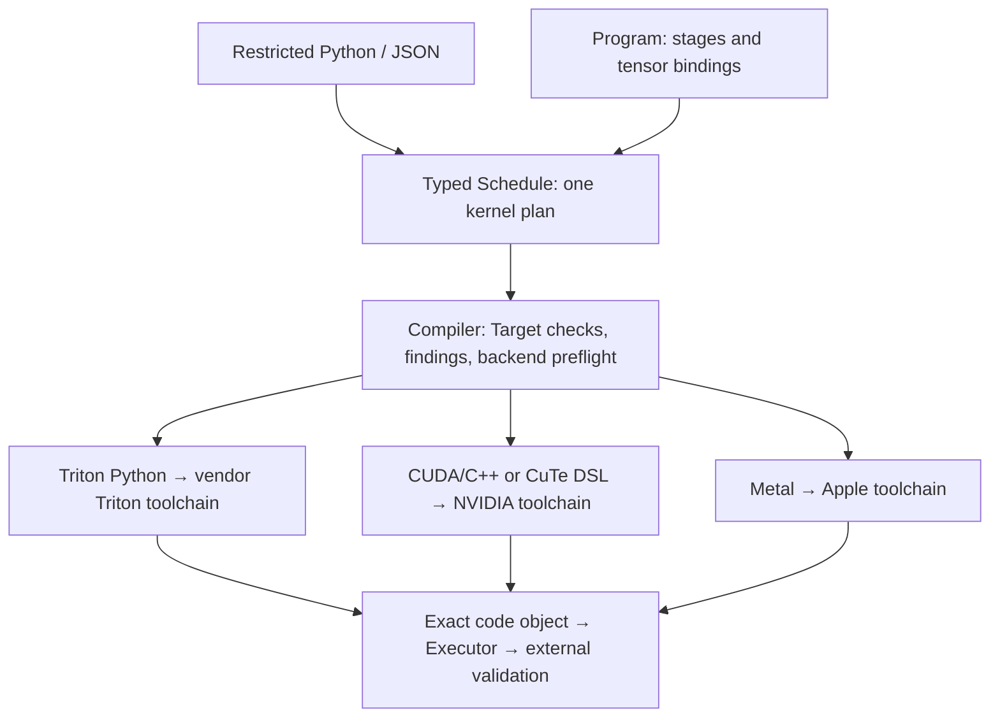

# The system: from an idea to a verifiable GPU program

[中文原文](../ARCHITECTURE.md) · [English home](README.md)

open-cake-ir makes computation choices explicit, locates errors, and preserves evidence for improvements. This page explains stable responsibilities. Read the [generated status](../../reports/current/STATUS.md) for released identities.

## Why write a Schedule?

Even summing each row of a table involves choices: which threads handle a row, how large each tile is, whether data can be reused, and whether writers collide. A Schedule describes those choices between the mathematical task and final machine code. The Compiler checks it and generates source; external checks and GPU measurements decide correctness and speed.

| Part | Responsibility | Main flow |
| --- | --- | --- |
| Compiler | Check complete programs and leaf schedules, apply explicit rewrites, generate source | Program / Schedule → assessment and lowering |
| Research Lab | Execute frozen permissions and budgets; allocate and analyze research conditions | Workload + RunSpecification → Run |
| Evaluation | Check answers, measure, and collect diagnostics | Sealed candidate → receipts |
| Evidence | Preserve observations and rebuild conclusions | Objects → audit → report |

The Compiler works independently. Lab uses it, Evaluation, and Evidence; the Compiler never imports experimental or provider logic.

## Separate task, implementation, execution and research ownership

For row normalization, Workload fixes mathematics, reference and tolerance. Schedule assigns threads, storage and operations; Program owns complete stage order, public tensors and bindings. RunSpecification freezes one optimization's versions, authoring environment, material and transform permissions, budgets and evaluation. Engineering Runs need no Study. Study preassigns the same Runs to conditions and owns their statistical analysis. Changing an implementation need not change the problem; changing scoring rules after results destroys comparability.

## The compiler path

### Cake IR, DSL, and Triton layers

Cake IR is a **typed, hardware-explicit schedule representation**. The restricted Python
frontend is a DSL authoring surface for the same Schedule document; JSON and Python reach one
typed IR, and the Python frontend does not compile arbitrary Python control flow. The whole
open-cake-ir project is larger than this DSL: it also contains the Compiler, Lab, Evaluation,
and Evidence layers. This repository independently explores ideas from the
[CAKE paper](https://arxiv.org/html/2608.12629v1); the description here is of this repository,
not an attribution of the paper's implementation or results to it.

| Layer | Representation and owned decisions | What remains open |
| --- | --- | --- |
| Workload semantics | Workload and oracle fix inputs, mathematics, and numerical acceptance | Tiling, fusion, and scheduling |
| Complete-program IR | Program fixes public tensors, stage order, and bindings; each stage contains a Schedule | It is not an automatic model-graph optimizer; current composition is static and same-stream |
| Kernel schedule IR | Schedule declares operations, buffers, execution groups, access coordinates, loops, storage, and synchronization | All physical registers, final machine instructions, and measured latency |
| Generated source | A backend translates an eligible Schedule to Triton Python, CUDA/C++, CuTe DSL, or Metal | Toolchain compilation is still required |
| Toolchain and execution | The target toolchain produces the exact code object, which the Executor loads and evaluates | Compilation does not replace external correctness or performance evidence |

Schedule is therefore a **kernel-scheduling IR**: more concrete than a mathematical operator
graph and more abstract than final machine code. It is not simply higher-level than Triton in
every dimension. The Triton route leaves parts of physical layout, register allocation, and
instruction selection to Triton; a native route can expose finer target instruction, storage,
and synchronization commitments. The shared boundary is the representation and verification
interface, not equal control or capability across all backends.

**Triton is an optional source-generation route and downstream compiler foundation, not the
Cake IR format.** `Compiler.lower()` first emits inspectable source. The Triton route then uses
`ASTSource` and `GPUTarget` in `compile_triton()`; Cake IR is not passed directly to Triton, nor
is this repository a direct producer of Triton's internal MLIR dialect. NVIDIA routes retain
TTIR, TTGIR, LLIR, PTX, and CUBIN where the toolchain provides them; other vendors retain the
artifacts their own toolchain actually produces and must not be assumed to pass through PTX.

Using Triton lets CAKE focus on explicit plans, legality, rewrites, and diagnostics while
reusing an existing block-program implementation and machine-code path. The trade-off is that
the route is bounded by the selected Triton/backend version: for example, `triton.dot` owns
physical placement in that route, so Cake cannot promise placement that the backend does not
honor. Finer control belongs in a native route when a real use case and evidence justify it;
the four backends are not interchangeable implementations.

See the [Python frontend](../../src/open_cake_ir/compiler/frontend.py),
[Program](../../src/open_cake_ir/compiler/ir/program.py), [Schedule](../../src/open_cake_ir/compiler/ir/schedule.py),
[backend inventory](../../src/open_cake_ir/compiler/backends/__init__.py),
[Triton emitter](../../src/open_cake_ir/compiler/backends/triton.py), and
[toolchain](../../src/open_cake_ir/compiler/toolchain.py). The [transfer chapter](OPTIMIZATION_TRANSFER.md#porting-to-domestic-accelerators-and-co-optimizing-the-target-architecture)
defines the domestic-accelerator stages and evidence boundaries.

Format/type checks precede dependency, address, resource, and hardware checks. Assessment separates structural acceptance from backend eligibility and contains localized Findings. Each Finding retains its contract category, severity, and separate acceptance/lowering dispositions. `Assessment.findings` retains the blocking/report observations checked by the existing Corpus Gate; `Assessment.guidance` carries nonblocking hints. CLI, Lab, and profile reports expose both without treating hints as acceptance evidence or GPU measurements. Eligible plans generate source through `triton`, `cutlass_cute_dsl`, `native_cuda`, or `metal`.

The dedicated `checked_cuda_asset` route is retired. Its original TinyGEMM2 Schedules remain explicit structure-refusal cases; replay old fixed-source observations at their pinned Git revision. Current `Lowering.generated` is true, while historical values retain their meaning. Analysis covers declared rules only: backend registers or implicit shared memory require compiled or device evidence.

### Internal ownership and adding a backend

`core.py` connects the public interface and composes lowering; `ir/program.py` owns typed composition and dataflow, `program.py` owns LoweredProgram and its code binding, and `program_passes.py` owns complete-program rewrites. `revision.py` admits a Revision and `corpus.py` compares observed cases with expectations. Diagnostic types belong to `diagnostics.py`. The four common rule classes belong to `verifier/`; each backend owns its representation and control refusals without turning an expressible Schedule into an IR rejection.

[BACKENDS](../../src/open_cake_ir/compiler/backends/__init__.py) is the single static backend inventory. A backend implements `requirements`, `preflight`, and `emit`; Triton owns `pointer_type(DType)` for its compile signature. To add a backend, define its target, supported inputs and refusal conditions, implement that protocol, and register it once. Test actual supported and refused combinations. The CLI vocabulary view reads this same inventory. Full Corpus gates a successor commit; integration and independent review follow the [branch workflow](../DEVELOPMENT_BRANCHES.md). Registration alone establishes no device support.

[performance](../../src/open_cake_ir/compiler/performance/__init__.py) owns work, residency, profiling, compiled resources, empirical cost, ranking and utilization. Same-input intermediate results are derived once and passed explicitly without a global cache. New `tools/profile_lowered_kernel.py` reports use schema 2: `predicted.registers_per_thread_lower_bound` and `verdict.register_floor_sound` are removed; the measured physical-register occupancy-limit label is `registers`. Values, units and evidence domains remain unchanged, and historical schema 1 reports are not rewritten.

## The agent and evidence loops

Lab freezes task material, rendered as TASK.md and AGENTS.md for CLI authors. A confined message author receives only permitted material and its own Run history. An external Ralph controller supplies evidence-derived state and enforces budgets. AI submits candidates or explicit transformation requests; the evaluator independently checks the resulting candidates. Earlier immutable candidates survive later edits.

Engineering optimization directly prepares a Run. A `matched_search` Study preassigns Runs; the legacy CampaignLock is an input adapter to the same search, budget, confirmation and audit engine. The former `portfolio` Study is retired under ADR 0071; historical replay uses its original commit. Serving needs later integration and evaluation.

### Why the interface is agent-facing

“Agent-friendly” here names testable interface properties: a bounded authoring contract,
editable execution decisions, localized reasons for refusal, pre-device filtering, and
feedback tied to actual evaluation. It does not assert that every model becomes a better
kernel author.

| Agent decision | Implemented interface | Next action it supports |
| --- | --- | --- |
| What is the task, permitted reference and budget? | Workload owns semantics and oracle; RunSpecification freezes target, reference access, material, transform grants, evaluation and budget; the [task package](../../src/open_cake_ir/lab/task_package.py) delivers `TASK.md` and `AGENTS.md` | Construct a candidate within one stable contract |
| Which GPU choice can change? | The restricted [Python frontend](../../src/open_cake_ir/compiler/frontend.py) builds the same canonical Schedule as JSON; [Schedule IR](IR_GUIDE.md) exposes groups, tiling, storage, addresses, operations and synchronization; an explicit pass returns a complete candidate or refusal | Relate one edit to a visible execution choice and its preconditions |
| Why was the candidate refused? | `Compiler.assess` separates structural acceptance from lowering eligibility; [Finding](../../src/open_cake_ir/compiler/diagnostics.py) carries code, field path, contract category, severity and blocking scope; Python authoring retains source locations | Repair the named data edge or capability gap before device work |
| Is device time warranted? | IR, Verifier and backend preflight filter first; only an explicitly bound empirical model covering the current context may reorder candidates, otherwise author order remains | Avoid invalid trials without treating an uncovered estimate as a performance verdict |
| What did the last turn establish? | External Evaluation separates complete correctness, timing quality, baseline comparison and optional profiler attribution; [Ralph feedback](../../src/open_cake_ir/lab/execution.py) carries those observations with Findings and budget state, while Evidence retains the delivered material and raw samples | Choose a repair based on the actual failure class and preserve a replayable history |

For a concrete example, the [FMA counterexample](../../corpus/schedules/fma-b8-smoke-arity-drift.json)
omits one operand. The current assessment reports `ELEMENTWISE_ARITY` at
`operations[3].reads`: FMA requires three operands and the candidate supplies two.
`RESIDENCY_BOUND` in the same Assessment is a resource report, not that defect. The agent
can repair the read edge before a GPU attempt. For eligible candidates, lowered source also
maps operations to source lines for later compile and profiler investigation. The
[getting-started guide](../GETTING_STARTED.md) keeps the accepted and refused siblings together.

Recurring failures may be promoted by a maintainer from retained Findings and run evidence
to a Verifier rule, IR capability, backend implementation or guarded explicit rewrite
**outside the frozen Run**. A successor commit and Corpus check precede a new Run. Existing
[DCU campaigns](../dcu-gfx938-results.md) show that the candidate–diagnosis–confirmation loop
operates on one target and can produce local gains. They are not a same-target, matched-budget
comparison against direct Triton/HIP authoring. Whether extra mechanism material or callable
passes improve cross-hardware agent search remains an unmeasured
[E/P study](../OPTIMIZATION_TRANSFER_ABLATION.md).

Correctness, measurement stability, and application benefit are different facts. Faster operator code does not by itself make a model or service faster. Compiler changes happen between frozen Campaigns and update types, verification, analysis, and lowering together, followed by the full Corpus and the integration review specified by the [branch workflow](../DEVELOPMENT_BRANCHES.md). Executor fixes a different closure: Lab, evaluation, evidence tools, and environment. Read the [Glossary](GLOSSARY.md) and [maintenance guide](wiki/maintaining.md) for exact ownership.

Concrete implementations live under `src/open_cake_ir/tasks/`. Tasks supply contract validation, oracles and preparation; the common Lab and Evaluation never import concrete tasks. See [task ownership](TASKS.md).

## Executable optimization knowledge across hardware

The framework proposes turning agent-discovered fusion, tiling and memory-hierarchy
mechanisms into explicit guarded rewrites. Destination backends supply hardware-specific
implementations; Lab retunes parameters and verifies benefit. Extra mechanism material and
callable rewrites are separate experimental factors while base capabilities and validation
remain fixed. Complete Programs, independent Runs, controlled material/pass access and E/P
allocation have software implementations; cross-hardware effects remain unverified.
See the [mechanism and ablation design](OPTIMIZATION_TRANSFER.md).

## Lab lifecycle ownership

`lab/core.py` connects the public API and retains its six existing dependencies: project
root, clock, workload loader, schedule preparation, authoring validation and manifest
parser. Phase functions receive what they use directly, without a second context object.

See the [Lab implementation map](../../src/open_cake_ir/lab/README.md) for module ownership.

Execution records observations; replay independently checks their raw support. Shared
pure calculations do not replace either trust boundary. A first-provider fault returns
before task-package or empirical-model resolution. Authority checks precede Evidence
creation, and reporting invokes replay callbacks only when needed. Concrete tasks and
task wiring remains in `TaskLab`; public imports remain `open_cake_ir.lab`.

## Platform capabilities and representative evidence

This is a reading projection of the 2026-09-21 report snapshot. Declared targets, source
lowering, device correctness, valid timing and complete agent optimization runs have separate
qualification boundaries. Device observations retain their own source commits and fixed
workloads; they are not reruns of every platform at the current report commit.

| Platform | Execution and measurement evidence | Remaining boundary / owner |
| --- | --- | --- |
| NVIDIA | B300 single kernels and selected complete Programs; agent Runs, paired confirmation and separate NCU; B200 records remain separate | Admission is per route and task, with failed timing edges retained; [NVIDIA status](../results/nvidia/FLASHINFER_STATUS.md) |
| Apple | Fixed operators on qualified devices and TaskLab optimization records | No claim for every Apple family; complete Program composition remains unavailable; [Metal results](../results/metal/README.md) |
| Hygon DCU | BW1101 task records include gains, regressions, null results and timing-resolution limitations | Short-kernel limitations prevent some performance comparisons; [DCU results](../results/dcu/README.md) |
| AMD | gfx1151 device survey and smoke evidence | Absolute readings from two device timers remain unaligned; published records establish no qualified speedup or full agent-loop result; [AMD results](../results/amd/README.md) |
| MetaX | Fixed single-kernel correctness, complete GQA/MLA/MoE and indexed-gather outputs; single-kernel MCPTI paired timing and profiling, bounded tile optimization, separate Program attribution | Ordinary whole-Program performance Runs and a complete C550 provider/Ralph loop still require qualification; [C550 chapter](../metax-c550.md) |

Three cases illustrate different claims:

- **Explicit tiling on C550.** At `8c0cad53`, FP16 GEMM M17/N128/K2048 changed M tile
  64 to 32. Independent confirmation measured 72.448 versus 58.368 μs (1.241×), within
  the fixed baseline and `local_serialized` scope. This is an authoring comparison, not
  a complete agent Run or knowledge-transfer result; see the [C550 record](../metax-c550.md).
- **Guarded alignment on B300.** The 026 RMSNorm aligned artifact achieved a qualified
  1.081× against its fixed generic sliced-w8 control with the same source/constants/grid.
  Its external-reference edge failed CV. This supports a bounded compiler/execution
  improvement, not external parity; see [F-2026-09-20-011](../../findings/2026-09-20-011-triton-aot-pointer-alignment.json).
- **Complete programs without a speedup claim.** The 008 two-stage B300 Program passed
  complete-output checks, while multiple candidate/control timing edges failed quality.
  Expressibility and execution do not establish a performance benefit; see the
  [task-level evidence](../results/nvidia/FLASHINFER_STATUS.md).

## Limitations and remaining research

Platform support and local improvements establish an experimental foundation. Controlled E/P
comparisons, independent repetitions and held-out tasks are still needed to establish whether
mechanism explanations or callable passes reduce search cost on another architecture.
Automatic mechanism extraction is not implemented.

Compiler evolution occurs outside frozen Runs under a maintenance agent or researcher.
Candidate errors return to candidate authoring; demonstrated expressibility/lowering gaps
motivate changes whose typing and analyses must evolve together. A performance gap alone
is not a reason to add a primitive or pass; `No promotion` is a valid recorded disposition.

Remaining boundaries include whole-Program measurement across platforms, particular dtypes
and instructions, profiler coverage, broader shapes and target-framework end-to-end checks.
Queue state, provider success and source/component checks are not final experimental results.
Engineering launches default to token accounting without a token cap; Studies preregister
common resource constraints under the [method appendix](../OPTIMIZATION_TRANSFER_ABLATION.md).
