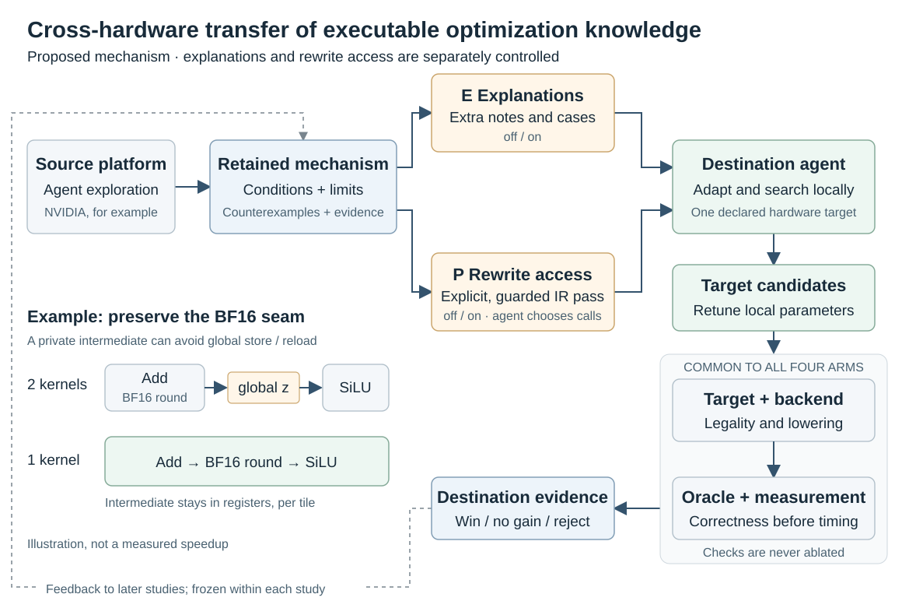
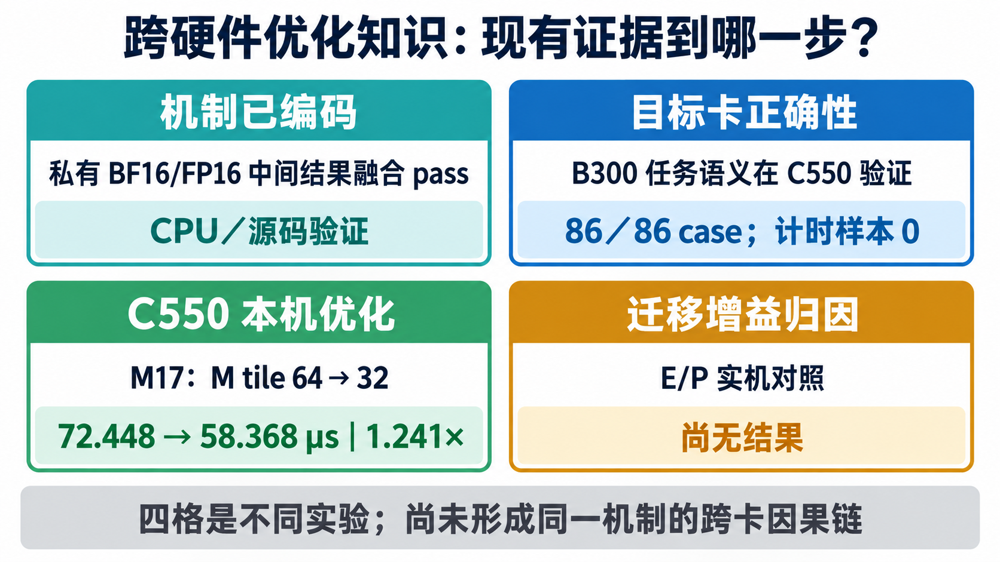

# Cross-hardware transfer of executable optimization knowledge

[Technical report](../README.md) · [中文](../OPTIMIZATION_TRANSFER.md) · [Ablation protocol](../OPTIMIZATION_TRANSFER_ABLATION.md)

We propose **optimization mechanisms with explicit applicability conditions** as the unit
of cross-hardware knowledge transfer. An agent explores operator fusion, tiling and memory
hierarchy optimization on a source platform. Deterministic semantic rewrites become explicit
Compiler passes; when to apply them and how to choose parameters remain Lab decisions.
Destination Targets and backends determine realizability, and destination measurements
determine correctness and benefit.

The research contribution is the loop from **experience discovery to executable rewrites,
destination validation and feedback**. Experience can inform agent reasoning or provide a
callable optimization tool. Rejections and negative transfer constrain subsequent reuse.
The question is whether this accumulation reduces search cost on new hardware, and how much
of the effect comes from extra explanations versus callable transformations.

*E/P are separately allocated experimental factors over a shared Run execution path.
The diagram contains no measured transfer results.*

A shared IR rewrite is reused when destination lowering supports it. Hardware-specific
instructions, storage and synchronization remain backend responsibilities. For example,
fusing Add and SiLU may eliminate a private BF16 intermediate's global store/reload while
preserving its rounding boundary. Tile sizes and execution groups are selected again on
the destination; a source speedup is not a destination result.

### Porting to domestic accelerators and co-optimizing the target architecture

**The endpoint of porting is a target-owned Kernel–Compiler optimization loop.** NVIDIA
knowledge is a useful starting input, not a prerequisite that every target must complete first.
Platform admission, benefit from transferred mechanisms, and discovery of new target-specific
optimizations are separate claims and require separate evidence.

#### What a new domestic target must own

The [architecture chapter](ARCHITECTURE.md#cake-ir-dsl-and-triton-layers) separates Program,
Schedule, generated source, and toolchain. A new target should reuse common Workloads, typed IR,
general legality rules, and experiment protocols where possible. It must declare and validate its
exact Target, instruction and numerical contracts, code object, compiler, loader/launch ABI,
host admission, timer, profiler, and measurement quality rules. A Target document does not create
those implementations by itself.

| Existing target | Current route | Facts that cannot be inferred from compatibility |
| --- | --- | --- |
| Hygon BW1101, `gfx938` | Schedule → Triton source → DTK/HCU Triton → AMDGCN/HSACO → HIP | Sharing parts of HIP/HSACO with AMD does not share limits, numerical qualification, timing calibration, or performance |
| MetaX C550, `xcore1002` | Schedule → Triton source → MACA Triton → native ELF in MCFATBIN → MACA loader | `GPUTarget("maca", 80, 64)` uses a compatibility API value; `80` is not NVIDIA SM80; physical target, codegen family, and API identity are checked separately |

These routes use the existing Triton emitter but invoke each vendor's compiler and runtime; they
do **not** copy NVIDIA PTX/CUBIN onto a domestic device. The MetaX route retains TTIR, TTGIR,
and mcfatbin where those artifacts are supplied and does not invent LLVM/PTX files. A new target
may add a Target and platform adapter when the existing emitter expresses the needed behavior;
when it does not, a new generation mechanism needs an evidence-backed use case. Triton is not a
mandatory path for every future device.

#### What transfers from NVIDIA, and what must be redone

| Knowledge or artifact | Transfer treatment | Must be reselected or revalidated on the target |
| --- | --- | --- |
| Algorithm and semantics | Reuse workload mathematics, dependencies, oracle, and numerical obligations | Target dtype, rounding, atomic behavior, and complete outputs |
| Fusion, tiling, and reuse mechanisms | Supply mechanism explanations or guarded transformation passes | Privacy/lifetime, legality, resource realization, and benefit against the local baseline |
| Tuned parameters | Use as hypotheses or search candidates | Tile, execution groups, pipeline depth, and fusion boundary |
| NVIDIA instruction/resource protocol | Preserve intent and re-express it with target capabilities; otherwise refuse | `tcgen05`, TMA, TMEM, and `setmaxnreg` do not become domestic instructions by renaming a Target |
| Diagnostics | Reuse the method of locating dataflow, synchronization, and bottlenecks | Metric definitions, observability, timer interval, and cache/state reset |
| Source performance | Retain as provenance and context | Target correctness, measurement quality, local baseline, and performance |

For example, “fuse a private intermediate to remove a global store/reload” can transfer as a
dataflow rewrite with its rounding, consumer, and lifetime conditions. On C550 or DCU it may
increase register pressure and reduce occupancy, so the unfused incumbent must remain available.
The direction is not permanently NVIDIA-to-domestic: a target can discover a mechanism that later
becomes another platform's candidate.

#### From admission to direct target optimization

The sequence below refines the roadmap without adding a second runtime mode. Existing evidence
is reused at its stated scope; the table is not a claim that every step is complete everywhere.

| Stage | Work | Question answered |
| --- | --- | --- |
| 1. Baseline and observability | Compile, load, and check complete outputs; declare timer interval, reset, noise gate, and profiler coverage | Can this workload run and be compared reliably on this target? |
| 2. Mechanism instantiation | Import an allowed mechanism or guarded pass, reselect parameters, and run Target/backend preflight | Is this mechanism expressible and correct on this target? |
| 3. Direct target search | Freeze Compiler, Workload, and toolchain; generate distinct Schedules/Programs; filter statically; validate, measure, profile, and confirm independently | Does the local kernel improve over the local baseline, at what cost, and why? |
| 4. System evolution | Outside the frozen Run, update Target, lowering, verifier, calibration, or a reusable pass in a successor commit | Which observed gap did the system change resolve? |
| 5. Application expansion | Validate more shapes, tails, dispatch/fallback, then the target framework | Does a complete Program, model, or service benefit? |

Stages 3 and 4 alternate as two loops: the inner loop optimizes programs on the target hardware;
the outer loop improves the system that makes those optimizations expressible, diagnosable, and
verifiable. Direct target optimization therefore does not wait for every NVIDIA mechanism to be
ported. A target may begin from its own workload and hardware evidence.

The earliest divergence chooses the owner: candidate parameters return to Schedule/Program;
backend expressibility to lowering and preflight; recurring illegal behavior to the verifier;
missing vocabulary to a jointly typed primitive, effect, analysis, and lowering; systematic model
error to target calibration; and a repeatable semantic rewrite to a guarded pass. A performance
gap alone does not justify a new IR primitive. Hardware-specific facts stay with the Target,
backend, platform implementation, and evidence that admits them; the shared Compiler is not
copied per vendor. Changes to a vendor's Triton/SDK are separate toolchain work and version
identity, not an automatic capability of this repository.

The current snapshot provides substantial DCU execution and local optimization records, with
short-kernel timing-resolution limits, and C550 fixed-kernel/selected Program correctness plus
single-kernel timing/profiling and a bounded M17 tile case. Those observations establish platform
paths and local examples, not completed full-program optimization or effective knowledge transfer.

### Four separate evidence scopes

*The four cards refer to different tasks and receipts; they do not form one NVIDIA-to-C550
mechanism trajectory. The M17 time is paired single-kernel timing. The 86 complete-Program
correctness receipts contain no timing samples. No cross-device performance ratio is inferred.*

The [private BF16/FP16 epilogue fusion pass](../EPILOGUE_FUSION_PASS.md) composes two Schedules
and has typed, source and CPU-model checks, while its [Finding](../../findings/2026-09-10-006-explicit-private-epilogue-fusion.json)
still has no GPU capability verification. On C550, 17 precisely bound GQA/MLA/MoE Workload
variants retain the B300 contracts' mathematics, shapes, cases, inputs, oracle and tolerances;
all 86 complete-output cases passed independent replay with zero mismatches and zero timing
samples ([C550 evidence](../metax-c550.md)). That is target correctness, not transfer of an
unchanged NVIDIA Schedule or its performance.

Separately, the C550 `M17/N128/K2048` GEMM changed only the M tile from 64 to 32. The exact
`matrix-fib-m17-tile32-confirmatory-8c0cad53-v1/result.json` receipt accepted all five
correctness cases and the timing quality gate: baseline/candidate medians were
72.448/58.368 μs, or 1.241228×, under `local_serialized`. The similarly named
`matrix-fib-m17-confirmatory-8c0cad53-v1` is an incumbent self-comparison classified
`close_null`; it must not be substituted for the tile32 result. This is a local authoring
comparison, not a provider Run or an explanation-versus-pass transfer experiment.

**The actual boundary of one source mechanism across targets.** In the B300-M2
FP32 `pairwise_sqdist` Run (`R=1024,K=1024,N=64`), the candidate tiles K by
256. Its event 17 independently confirmed five-case preflight and postflight
correctness for both arms and a quality-passing CUPTI pair: 411.7945/53.856
μs (7.646×) **on B300**. Each target Workload retains the same operator,
tensors, cases, oracle and tolerances. The historical Schedule v1 `warps`
field was adapted explicitly to v2 `execution_groups`; admission did not
silently reinterpret it.

| Destination and source K=256 Schedule | Observed boundary | Claim still unavailable |
| --- | --- | --- |
| Hygon BW1101 `gfx938` | The original `bw1100` had external GLM processes on all eight cards, so it reached only HSACO and CPU admission. On the idle `bw1100-1`, a separately captured Executor accounts for its different host kernel and environment. At clean source `4c9f4cc0`, all five cases pass before and after timing. Fresh, quality-passing `hip_dispatch` confirmation reports **517.9645/748.749 μs** for starter/candidate, with all ten pairs favoring the starter | A **confirmed negative transfer** on this host, not B300's 7.646× on Hygon. `local_serialized` does not exclude external jobs that ignore its lock, and absolute CUPTI/HIP times are not compared |
| infplane AMD `gfx1151` | All five cases pass before and after timing; a fresh, quality-passing same-card `hip_dispatch` confirmation reports **191.954/466.222 μs** for starter/candidate, with all ten pairs favoring the starter | A **confirmed negative transfer** within this assay, not a replay of B300's 7.646×. Two gfx1151 timers still disagree on absolute values, so no cross-timer calibration is inferred |
| MetaX C550 `xcore1002` | Frozen draft source `023d0db4` admits and lowers both arms; MetaX Triton 3.6 emits MCFATBINs with two native hidden pointers each; kernel projection enables sealing and CPU pair admission | No five-case device correctness or MCPTI timing while five containers have private MACA locks; the draft also awaits independent review |
| Apple M2 `apple_gpu_family8`, same `pairwise_sqdist` | The Compiler identifies missing Metal tile-loop, K-indexing and loop-carried reduction support | No Metal binary or device result for this mechanism; changing the target name cannot supply missing lowering |

Two preregistered AMD target-local parameter successors did not yield a
qualified gain: K=128 passed full correctness and timing quality but was
slower than the same starter; K=64 passed correctness but exceeded the 0.05
candidate CV limit, so its displayed median is descriptive only. The K=256
AMD K=256 build reports 256 VGPR and 260 bytes of per-workitem scratch
against 126 VGPR and no scratch for the starter. The corresponding Hygon
build reports 256/256 VGPR and 608/620 bytes of scratch. These target-specific
resource readings suggest pressure; they do not establish its causal role.
Source and raw target artifacts remain outside the checkout under
`open-cake-ir-evidence/transfer-b300-bw1101-20260923/`,
`open-cake-ir-evidence/transfer-b300-bw1101-node4-20260923/`,
`open-cake-ir-experiments/transfer-b300-gfx1151-20260923/` and
`open-cake-ir-experiments/transfer-b300-c550-pairwise-20260923/`.

**A confirmed Hygon target-local successor exists, but it is not an Agent
knowledge-treatment effect.** Before further device time on `bw1100-1`, the
plan froze only K=128 and K=64 replacements for the source K=256 tile. Both
offline builds used zero scratch; K=128 used 252 VGPR and K=64 used 148.
The preregistered rule (least scratch, then least VGPR) sent only K=64 to the
GPU. The generated sources differ from K=256 only in the tile value and
schedule identity. With the same five cases, whole-K starter and HIP pairing,
the fresh K=64 confirmation passed correctness and timing quality at
**518.524/189.586 μs (2.735×)** for starter/candidate, with all ten pairs
favoring the candidate. K=128 received no GPU timing. Thus the B300-derived
*K-tiling idea* can produce a benefit on this exact Hygon workload after
target-side parameter selection, while its original K=256 setting is harmful.
To avoid relying on one shape, a second same-operator shape was frozen
**before device work**: `R=1024,K=512,N=64`, with the already selected K=64
against its canonical whole-K starter and no further tile search. All five
cases passed without mismatches in both the search and fresh confirmation;
timing quality passed. The confirmatory starter/candidate medians were
**106.232/97.593 μs (1.0885×)**, with ten candidate pair wins and 250 samples
per arm. This supports limited shape generalization on the same Hygon target,
but the gain is much smaller than 2.735× at K=1024. There is no B300 source
gain measured at this new shape, nor cross-operator or model result. The
frozen stop rule and raw receipts are under
`open-cake-ir-evidence/transfer-b300-bw1101-node4-holdout-20260923/`.
This bounded manual mechanism example does not compare Agents with and without
NVIDIA-derived material under a matched budget; it cannot estimate E or P.

The challenge has distinct, observed layers. Metal cannot currently express
this loop-carried reduction Schedule. Triton can emit on AMD and Hygon yet
does not preserve the source tile's resource allocation or performance.
Another `gfx938` host needs its own Executor identity. C550's container locks
do not yet support a shared exclusive claim, and the short M2 kernel failed
its timing-quality gate. Expressibility, target code and parameter selection,
host identity, measurement and causal attribution each require their own
evidence. These few fixed shapes do not establish broad domestic-accelerator
or full-model gains.

A second source mechanism that Metal can express is B300 `silu`'s one-to-four
execution-group change. Its B300 confirmation was 2.432/2.112 μs (1.1515×)
on that card. The same-math Apple M2 Schedule builds a Metal archive and
passes all five cases before and after timing for both arms, but
`fixed_baseline_paired_metal_v2` cohort CV far exceeds the fixed 0.05 gate.
**There is no qualified M2 speedup.** Its raw record is under
`open-cake-ir-experiments/transfer-b300-m2-silu-20260923/`. These examples
establish expressibility, correctness or negative transfer separately;
none estimates the causal value of E/P material or pass access to an Agent.

The [E/P method appendix](../OPTIMIZATION_TRANSFER_ABLATION.md) has software-tested allocation
and audit rules but explicitly reports no real-device transfer-effect study. Establishing the
incremental value of NVIDIA-derived material still requires matched target Runs with a shared
Compiler, toolchain, local baseline, author and budget. The raw C550 receipts and Program
replay are retained outside the checkout under `open-cake-ir-evidence/metax-parity-20260920/`.

The protocol below separates that attribution from ordinary local optimization and later
compiler-capability work.

## The proposed 2×2 study controls **E**, extra mechanism explanations and cases, and **P**,
permission to invoke a frozen transformation. E0P0 supplies neither; E1P0 supplies explanations
for manual rewriting; E0P1 supplies only the callable interface and its necessary contract;
E1P1 supplies both. P1 inherently carries some knowledge, so E estimates the incremental
value of explanatory material, not the presence of all knowledge. All groups share the same
base IR/lowering capabilities, oracle, numerical constraints and measurement gates.

The primary outcome is qualified optimization success within a matched budget. Secondary
outcomes include search cost and destination-baseline-relative performance. Discovery and
adaptation cost are reported separately. The [method appendix](../OPTIMIZATION_TRANSFER_ABLATION.md)
owns assignment, isolation, estimands and failure handling; these are proposed experiments,
not results of existing artifact-only campaigns.

Matched resource limits default to turns, time, and compilation/evaluation counts, with
tokens retained as observed search cost. A Study may instead explicitly add the same token
cap and checkpoints to every condition; uncapped comparisons do not imply equal token use.
Existing device correctness or local optimization gains establish destination execution
evidence, not E/P treatment effects or cross-hardware knowledge-transfer benefits.

Existing [bounded passes](../../src/open_cake_ir/compiler/passes.py) and
[experience-material preparation](../OMOE_TRANSFER.md) provide implementation foundations.
The prototype now connects complete Programs, independent Runs, controlled material/pass
access, shared Run runtime assembly, preassigned E/P Studies and audited analysis. Software tests exercise these protocol
paths. Ordinary tasks, incumbents and QSA Cake candidates now use the common path.
The shared correctness-only composition path now binds CUBIN, HSACO and MCFATBIN modules.
MACA has a separate complete-Program attribution entry with bounded device observations
in the [C550 report](../metax-c550.md). Whole-program measurement in ordinary optimization
Runs remains limited to Triton/CUDA, and Metal composition is not yet implemented.
Controlled cross-hardware transfer benefits and automatic mechanism extraction remain outstanding.
The design builds on explicit transformations such as
[MLIR Transform](https://mlir.llvm.org/docs/Tutorials/transform/) and prior schedule reuse such
as [Transfer-Tuning](https://arxiv.org/abs/2201.05587v2), focusing on agent-produced experience,
destination qualification and controlled attribution of its effects.

The [Croqtile engineering comparison](CROQTILE_COMPARISON.md) recognizes its DSL, compiler
transformations, agent tuner and skill/example reuse. These shared capabilities alone do not
establish novelty here. Our proposed study separates material and callable-transform access,
and tests destination applicability, benefit and cost under common validation. Implemented
protocols are not evidence of superior performance or effective cross-hardware transfer.
