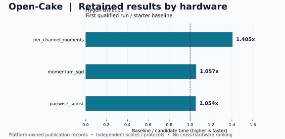

# Hygon DCU 实验结果

由 `tools/render_hardware_results.py` 从各平台发布数据生成。原始报告与 Finding 保留权威。

[交互目录](index.html) · [发布数据](records.json) · [main 汇总](https://github.com/qhy991/open-cake-ir/blob/main/docs/RESULTS.md) · [维护流程](../../RESULTS_MAINTENANCE.md)

**加速比 = 基线耗时 ÷ 候选耗时，超过 1× 表示更快。** 各行仅在自己的硬件、Workload、版本与计时协议内比较，不求跨平台平均值。

平台分支分别更新自己的发布数据；main 展示已经合入当前检出的版本。这里不会在线抓取平台分支最新值，也不是实时冠军榜。失败、无显著差异与未实测记录均保留。

## 数据归属

| 平台 | 维护分支 | 数据日期 | 观察条目 | 发布数据 |
|---|---|---|---:|---|
| Hygon DCU | [dcu](https://github.com/qhy991/open-cake-ir/tree/dcu/docs/results/dcu) | 2026-09-20 | 32 | [dcu/records.json](records.json) |

观察条目数不等于任务数：同一任务可以有不同形状、实验集合和历史尝试。

## Hygon DCU

BW1101 / gfx938：保留首个合格结果，同时展示未合格任务和后续重复运行。首个合格结果不等于历史最快；使用原记录的分类，不从显示的小数重新判定晋升。

- 每个任务取保留 sweep 的首个合格结果，并展示后续重复；不作最快结果选择。
- 原主机在 2026-09-20 整理时 SSH 超时，未重新提取形状；缺失字段明确保留。

| 设备 / 集合 | Task | 输入 / Workload | 基线 µs | 候选 µs | 加速比 | 状态 | 详情 |
|---|---|---|---:|---:|---:|---|---|
| BW1101 | `absmax_rescale` | 原 Campaign 的固定形状（汇总未转录尺寸） | 5.439 | 5.439 | — | 测量分辨能力待查 | [dcu-result-048](#dcu-result-048) |
| BW1101 | `adadelta` | 原 Campaign 的固定形状（汇总未转录尺寸） | 6.719 | 6.719 | 1.000× | 未检出显著差异 | [dcu-result-049](#dcu-result-049) |
| BW1101 | `adamw` | 原 Campaign 的固定形状（汇总未转录尺寸） | 7.839 | 7.839 | 1.000× | 未检出显著差异 | [dcu-result-050](#dcu-result-050) |
| BW1101 | `attention_decode` | 原 Campaign 的固定形状（汇总未转录尺寸） | 138.559 | 219.519 | 0.631× | 确认变慢 | [dcu-result-051](#dcu-result-051) |
| BW1101 | `bias_gradient_reduction` | 原 Campaign 的固定形状（汇总未转录尺寸） | 10.079 | 10.399 | 0.969× | 未检出显著差异 | [dcu-result-052](#dcu-result-052) |
| BW1101 | `channel_absmax_scale` | 原 Campaign 的固定形状（汇总未转录尺寸） | 9.599 | 9.599 | 1.000× | 未检出显著差异 | [dcu-result-053](#dcu-result-053) |
| BW1101 | `cosine_similarity` | 原 Campaign 的固定形状（汇总未转录尺寸） | 5.439 | 5.439 | — | 测量分辨能力待查 | [dcu-result-054](#dcu-result-054) |
| BW1101 | `gelu_tanh` | 原 Campaign 的固定形状（汇总未转录尺寸） | 6.399 | 6.239 | 1.026× | 未检出显著差异 | [dcu-result-055](#dcu-result-055) |
| BW1101 | `gelu_tanh_backward` | 原 Campaign 的固定形状（汇总未转录尺寸） | 6.719 | 12.639 | 0.532× | 确认变慢 | [dcu-result-056](#dcu-result-056) |
| BW1101 | `gemm` | 原 Campaign 的固定形状（汇总未转录尺寸） | 305.599 | 409.279 | 0.747× | 确认变慢 | [dcu-result-057](#dcu-result-057) |
| BW1101 | `layernorm` | 原 Campaign 的固定形状（汇总未转录尺寸） | 5.439 | 5.439 | — | 测量分辨能力待查 | [dcu-result-058](#dcu-result-058) |
| BW1101 | `layernorm_backward_input` | 原 Campaign 的固定形状（汇总未转录尺寸） | 5.439 | 5.439 | — | 测量分辨能力待查 | [dcu-result-059](#dcu-result-059) |
| BW1101 | `layernorm_gamma_beta_backward` | 原 Campaign 的固定形状（汇总未转录尺寸） | 14.879 | 15.199 | 0.979× | 未检出显著差异 | [dcu-result-060](#dcu-result-060) |
| BW1101 | `momentum_sgd` | 原 Campaign 的固定形状（汇总未转录尺寸） | 5.919 | 5.599 | 1.057× | 确认加速 | [dcu-result-061](#dcu-result-061) |
| BW1101 | `pairwise_sqdist` | 原 Campaign 的固定形状（汇总未转录尺寸） | 24.959 | 23.679 | 1.054× | 确认加速 | [dcu-result-062](#dcu-result-062) |
| BW1101 | `per_channel_moments` | 原 Campaign 的固定形状（汇总未转录尺寸） | 9.439 | 6.719 | 1.405× | 确认加速 | [dcu-result-063](#dcu-result-063) |
| BW1101 | `prelu` | 原 Campaign 的固定形状（汇总未转录尺寸） | 5.439 | 9.759 | 0.557× | 确认变慢 | [dcu-result-064](#dcu-result-064) |
| BW1101 | `residual_rmsnorm` | 原 Campaign 的固定形状（汇总未转录尺寸） | 5.439 | 5.439 | — | 测量分辨能力待查 | [dcu-result-065](#dcu-result-065) |
| BW1101 | `rmsnorm` | 原 Campaign 的固定形状（汇总未转录尺寸） | 5.439 | 5.439 | — | 测量分辨能力待查 | [dcu-result-066](#dcu-result-066) |
| BW1101 | `rmsnorm_input_gradient` | 原 Campaign 的固定形状（汇总未转录尺寸） | 5.439 | 5.439 | — | 测量分辨能力待查 | [dcu-result-067](#dcu-result-067) |
| BW1101 | `selu` | 原 Campaign 的固定形状（汇总未转录尺寸） | 5.439 | 5.439 | — | 测量分辨能力待查 | [dcu-result-068](#dcu-result-068) |
| BW1101 | `silu` | 原 Campaign 的固定形状（汇总未转录尺寸） | 5.439 | 5.439 | — | 测量分辨能力待查 | [dcu-result-069](#dcu-result-069) |
| BW1101 | `softmax` | 原 Campaign 的固定形状（汇总未转录尺寸） | 5.439 | 5.439 | — | 测量分辨能力待查 | [dcu-result-070](#dcu-result-070) |
| BW1101 | `softmax_backward` | 原 Campaign 的固定形状（汇总未转录尺寸） | 5.439 | 5.439 | — | 测量分辨能力待查 | [dcu-result-071](#dcu-result-071) |
| BW1101 | `softplus_gradient` | 原 Campaign 的固定形状（汇总未转录尺寸） | 5.439 | 5.439 | — | 测量分辨能力待查 | [dcu-result-072](#dcu-result-072) |
| BW1101 | `softsign` | 原 Campaign 的固定形状（汇总未转录尺寸） | 5.439 | 5.439 | — | 测量分辨能力待查 | [dcu-result-073](#dcu-result-073) |
| BW1101 | `swiglu` | 原 Campaign 的固定形状（汇总未转录尺寸） | 5.599 | 5.439 | 1.029× | 未检出显著差异 | [dcu-result-074](#dcu-result-074) |
| BW1101 | `gemm_bias` | 保留 sweep 的验证形状 | — | — | — | 基线未通过 | [dcu-result-075](#dcu-result-075) |
| BW1101 | `gemm_silu` | 保留 sweep 的验证形状 | — | — | — | 候选未通过 | [dcu-result-076](#dcu-result-076) |
| BW1101 · 后续重复 | `gelu_tanh` | 原 Campaign 的固定形状（汇总未转录尺寸） | 6.399 | 5.439 | — | 保留的后续运行 | [dcu-result-077](#dcu-result-077) |
| BW1101 · 后续重复 | `gemm` | 原 Campaign 的固定形状（汇总未转录尺寸） | 305.759 | 409.279 | — | 保留的后续运行 | [dcu-result-078](#dcu-result-078) |
| BW1101 · 后续重复 | `rmsnorm` | 原 Campaign 的固定形状（汇总未转录尺寸） | 5.439 | 5.439 | — | 保留的后续运行 | [dcu-result-079](#dcu-result-079) |

## 演进与更新

交互页保留同一 Campaign 内已通过确认的候选时间序列，包括变慢点。它不把不同形状、版本和计时协议拼成长期晋升曲线。
历史晋升记录不等于当前 registry 冠军。跨编译器版本时分别看固定基线的变化与候选相对基线的改善；完整失败过程见来源。
新增实验先在对应平台的 records.json 追加有稳定 id 和固定来源提交的观察，再生成该平台页面。合入 main 的集成分支重建总览；不要手工改生成表格。具体命令见维护流程。

## 逐项来源

### dcu-result-048

**BW1101 · absmax_rescale** — 2026-09-18 / 测量分辨能力待查

- Workload：`原 Campaign 的固定形状（汇总未转录尺寸）`；目标：`gfx938`；版本：`open-cake-ir@0970a36e`。
- 基线：任务固定初始基线；比值口径：`ratio_of_medians`。
- 来源：[findings/data/2026-09-18-dcu-confirmatory-medians.json](https://github.com/qhy991/open-cake-ir/blob/f95af8005619a9356d5891873b38a9322d32f102/findings/data/2026-09-18-dcu-confirmatory-medians.json)。
- 原记录 / 实现定位：`bw1100:/home/testuser01/oci-dcu-runs/absmax_rescale-20260918-002242/campaign-evidence/objects/sha256/93/936ba860b59b2716f843de288526fa8659f6915fdb121d537108108d9d0cca66`。
- 每任务首个合格运行，不是 fastest-of-all。两者均读到 5.439 µs；不写成 1× 性能持平。

### dcu-result-049

**BW1101 · adadelta** — 2026-09-18 / 未检出显著差异

- Workload：`原 Campaign 的固定形状（汇总未转录尺寸）`；目标：`gfx938`；版本：`open-cake-ir@0970a36e`。
- 基线：任务固定初始基线；比值口径：`ratio_of_medians`。
- 来源：[findings/data/2026-09-18-dcu-confirmatory-medians.json](https://github.com/qhy991/open-cake-ir/blob/f95af8005619a9356d5891873b38a9322d32f102/findings/data/2026-09-18-dcu-confirmatory-medians.json)。
- 原记录 / 实现定位：`bw1100:/home/testuser01/oci-dcu-runs/adadelta-20260918-015416/campaign-evidence/objects/sha256/5a/5a8ca7e823848cd2623dde3178f95d9da3e7198fdb68d6433107a40debeab742`。
- 每任务首个合格运行，不是 fastest-of-all。比值来自确认中位数；是否超过提升门槛沿用原 classification。

### dcu-result-050

**BW1101 · adamw** — 2026-09-18 / 未检出显著差异

- Workload：`原 Campaign 的固定形状（汇总未转录尺寸）`；目标：`gfx938`；版本：`open-cake-ir@5151954e`。
- 基线：任务固定初始基线；比值口径：`ratio_of_medians`。
- 来源：[findings/data/2026-09-18-dcu-confirmatory-medians.json](https://github.com/qhy991/open-cake-ir/blob/f95af8005619a9356d5891873b38a9322d32f102/findings/data/2026-09-18-dcu-confirmatory-medians.json)。
- 原记录 / 实现定位：`bw1100:/home/testuser01/oci-dcu-runs/adamw-20260917-195709/campaign-evidence/objects/sha256/de/de177a4c4a0ae0866d2a63ab2117d09142ebf2f57f43287a9bd9e1bae2eef9e4`。
- 每任务首个合格运行，不是 fastest-of-all。比值来自确认中位数；是否超过提升门槛沿用原 classification。

### dcu-result-051

**BW1101 · attention_decode** — 2026-09-18 / 确认变慢

- Workload：`原 Campaign 的固定形状（汇总未转录尺寸）`；目标：`gfx938`；版本：`open-cake-ir@4278caf2`。
- 基线：任务固定初始基线；比值口径：`ratio_of_medians`。
- 来源：[findings/data/2026-09-18-dcu-confirmatory-medians.json](https://github.com/qhy991/open-cake-ir/blob/f95af8005619a9356d5891873b38a9322d32f102/findings/data/2026-09-18-dcu-confirmatory-medians.json)。
- 原记录 / 实现定位：`bw1100:/home/testuser01/oci-dcu-runs/attention_decode-20260918-070030/campaign-evidence/objects/sha256/40/4098e094b242916b4edcadb7f8cf096e3bbbed5d765673eb35a02667f0b4bb0a`。
- 每任务首个合格运行，不是 fastest-of-all。比值来自确认中位数；是否超过提升门槛沿用原 classification。

### dcu-result-052

**BW1101 · bias_gradient_reduction** — 2026-09-18 / 未检出显著差异

- Workload：`原 Campaign 的固定形状（汇总未转录尺寸）`；目标：`gfx938`；版本：`open-cake-ir@0970a36e`。
- 基线：任务固定初始基线；比值口径：`ratio_of_medians`。
- 来源：[findings/data/2026-09-18-dcu-confirmatory-medians.json](https://github.com/qhy991/open-cake-ir/blob/f95af8005619a9356d5891873b38a9322d32f102/findings/data/2026-09-18-dcu-confirmatory-medians.json)。
- 原记录 / 实现定位：`bw1100:/home/testuser01/oci-dcu-runs/bias_gradient_reduction-20260918-011329/campaign-evidence/objects/sha256/60/60268d83cf58bc39f68d44f68c6cd850331fd9ee7f11418c1fa212b45d9e1121`。
- 每任务首个合格运行，不是 fastest-of-all。比值来自确认中位数；是否超过提升门槛沿用原 classification。

### dcu-result-053

**BW1101 · channel_absmax_scale** — 2026-09-18 / 未检出显著差异

- Workload：`原 Campaign 的固定形状（汇总未转录尺寸）`；目标：`gfx938`；版本：`open-cake-ir@4278caf2`。
- 基线：任务固定初始基线；比值口径：`ratio_of_medians`。
- 来源：[findings/data/2026-09-18-dcu-confirmatory-medians.json](https://github.com/qhy991/open-cake-ir/blob/f95af8005619a9356d5891873b38a9322d32f102/findings/data/2026-09-18-dcu-confirmatory-medians.json)。
- 原记录 / 实现定位：`bw1100:/home/testuser01/oci-dcu-runs/channel_absmax_scale-20260918-074053/campaign-evidence/objects/sha256/39/39e552743464224b12d914af1d2a716bfb5ac468d4d763248be0e961b26f7942`。
- 每任务首个合格运行，不是 fastest-of-all。比值来自确认中位数；是否超过提升门槛沿用原 classification。

### dcu-result-054

**BW1101 · cosine_similarity** — 2026-09-18 / 测量分辨能力待查

- Workload：`原 Campaign 的固定形状（汇总未转录尺寸）`；目标：`gfx938`；版本：`open-cake-ir@4278caf2`。
- 基线：任务固定初始基线；比值口径：`ratio_of_medians`。
- 来源：[findings/data/2026-09-18-dcu-confirmatory-medians.json](https://github.com/qhy991/open-cake-ir/blob/f95af8005619a9356d5891873b38a9322d32f102/findings/data/2026-09-18-dcu-confirmatory-medians.json)。
- 原记录 / 实现定位：`bw1100:/home/testuser01/oci-dcu-runs/cosine_similarity-20260918-052136/campaign-evidence/objects/sha256/73/73a5efe324e6974474d66691f18458010d973221f007a12c076f3a40b0afda51`。
- 每任务首个合格运行，不是 fastest-of-all。两者均读到 5.439 µs；不写成 1× 性能持平。

### dcu-result-055

**BW1101 · gelu_tanh** — 2026-09-18 / 未检出显著差异

- Workload：`原 Campaign 的固定形状（汇总未转录尺寸）`；目标：`gfx938`；版本：`open-cake-ir@0970a36e`。
- 基线：任务固定初始基线；比值口径：`ratio_of_medians`。
- 来源：[findings/data/2026-09-18-dcu-confirmatory-medians.json](https://github.com/qhy991/open-cake-ir/blob/f95af8005619a9356d5891873b38a9322d32f102/findings/data/2026-09-18-dcu-confirmatory-medians.json)。
- 原记录 / 实现定位：`bw1100:/home/testuser01/oci-dcu-runs/gelu_tanh-20260917-224115/campaign-evidence/objects/sha256/87/87033d2251a648103290097aeea51f78b07166b7185804835eb3be2a557ef252`。
- 每任务首个合格运行，不是 fastest-of-all。比值来自确认中位数；是否超过提升门槛沿用原 classification。

### dcu-result-056

**BW1101 · gelu_tanh_backward** — 2026-09-18 / 确认变慢

- Workload：`原 Campaign 的固定形状（汇总未转录尺寸）`；目标：`gfx938`；版本：`open-cake-ir@0970a36e`。
- 基线：任务固定初始基线；比值口径：`ratio_of_medians`。
- 来源：[findings/data/2026-09-18-dcu-confirmatory-medians.json](https://github.com/qhy991/open-cake-ir/blob/f95af8005619a9356d5891873b38a9322d32f102/findings/data/2026-09-18-dcu-confirmatory-medians.json)。
- 原记录 / 实现定位：`bw1100:/home/testuser01/oci-dcu-runs/gelu_tanh_backward-20260917-213519/campaign-evidence/objects/sha256/fd/fddc68b73a893a3135d7cbab7d78752217011d5fdd9f4f039169fc975526b901`。
- 每任务首个合格运行，不是 fastest-of-all。比值来自确认中位数；是否超过提升门槛沿用原 classification。

### dcu-result-057

**BW1101 · gemm** — 2026-09-18 / 确认变慢

- Workload：`原 Campaign 的固定形状（汇总未转录尺寸）`；目标：`gfx938`；版本：`open-cake-ir@0970a36e`。
- 基线：任务固定初始基线；比值口径：`ratio_of_medians`。
- 来源：[findings/data/2026-09-18-dcu-confirmatory-medians.json](https://github.com/qhy991/open-cake-ir/blob/f95af8005619a9356d5891873b38a9322d32f102/findings/data/2026-09-18-dcu-confirmatory-medians.json)。
- 原记录 / 实现定位：`bw1100:/home/testuser01/oci-dcu-runs/gemm-20260917-225918/campaign-evidence/objects/sha256/29/293418506b77308dd35947557b6bc7899846a2714bba71af1c2a2f83aca12aaa`。
- 每任务首个合格运行，不是 fastest-of-all。比值来自确认中位数；是否超过提升门槛沿用原 classification。

### dcu-result-058

**BW1101 · layernorm** — 2026-09-18 / 测量分辨能力待查

- Workload：`原 Campaign 的固定形状（汇总未转录尺寸）`；目标：`gfx938`；版本：`open-cake-ir@0970a36e`。
- 基线：任务固定初始基线；比值口径：`ratio_of_medians`。
- 来源：[findings/data/2026-09-18-dcu-confirmatory-medians.json](https://github.com/qhy991/open-cake-ir/blob/f95af8005619a9356d5891873b38a9322d32f102/findings/data/2026-09-18-dcu-confirmatory-medians.json)。
- 原记录 / 实现定位：`bw1100:/home/testuser01/oci-dcu-runs/layernorm-20260917-222113/campaign-evidence/objects/sha256/52/529ff05598a641f3a4719abbdc9146f0848e5d3d7e1830eea33275653a6373cb`。
- 每任务首个合格运行，不是 fastest-of-all。两者均读到 5.439 µs；不写成 1× 性能持平。

### dcu-result-059

**BW1101 · layernorm_backward_input** — 2026-09-18 / 测量分辨能力待查

- Workload：`原 Campaign 的固定形状（汇总未转录尺寸）`；目标：`gfx938`；版本：`open-cake-ir@0970a36e`。
- 基线：任务固定初始基线；比值口径：`ratio_of_medians`。
- 来源：[findings/data/2026-09-18-dcu-confirmatory-medians.json](https://github.com/qhy991/open-cake-ir/blob/f95af8005619a9356d5891873b38a9322d32f102/findings/data/2026-09-18-dcu-confirmatory-medians.json)。
- 原记录 / 实现定位：`bw1100:/home/testuser01/oci-dcu-runs/layernorm_backward_input-20260918-005411/campaign-evidence/objects/sha256/a9/a965a96d2f1fed63a12cf28e045845bb53e16c884103cb9b0ec0281966314aad`。
- 每任务首个合格运行，不是 fastest-of-all。两者均读到 5.439 µs；不写成 1× 性能持平。

### dcu-result-060

**BW1101 · layernorm_gamma_beta_backward** — 2026-09-18 / 未检出显著差异

- Workload：`原 Campaign 的固定形状（汇总未转录尺寸）`；目标：`gfx938`；版本：`open-cake-ir@4278caf2`。
- 基线：任务固定初始基线；比值口径：`ratio_of_medians`。
- 来源：[findings/data/2026-09-18-dcu-confirmatory-medians.json](https://github.com/qhy991/open-cake-ir/blob/f95af8005619a9356d5891873b38a9322d32f102/findings/data/2026-09-18-dcu-confirmatory-medians.json)。
- 原记录 / 实现定位：`bw1100:/home/testuser01/oci-dcu-runs/layernorm_gamma_beta_backward-20260918-062624/campaign-evidence/objects/sha256/9c/9ce5553d9c030a548d4b0d7759be7d83bbe67275edfc94b7138f20df567b2226`。
- 每任务首个合格运行，不是 fastest-of-all。比值来自确认中位数；是否超过提升门槛沿用原 classification。

### dcu-result-061

**BW1101 · momentum_sgd** — 2026-09-18 / 确认加速

- Workload：`原 Campaign 的固定形状（汇总未转录尺寸）`；目标：`gfx938`；版本：`open-cake-ir@0970a36e`。
- 基线：任务固定初始基线；比值口径：`ratio_of_medians`。
- 来源：[findings/data/2026-09-18-dcu-confirmatory-medians.json](https://github.com/qhy991/open-cake-ir/blob/f95af8005619a9356d5891873b38a9322d32f102/findings/data/2026-09-18-dcu-confirmatory-medians.json)。
- 原记录 / 实现定位：`bw1100:/home/testuser01/oci-dcu-runs/momentum_sgd-20260918-022953/campaign-evidence/objects/sha256/cb/cb1ad30f1dc8eaf56071d45203d0c57dbea7c6b8c695e75846c3e8e2d496526c`。
- 每任务首个合格运行，不是 fastest-of-all。比值来自确认中位数；是否超过提升门槛沿用原 classification。

### dcu-result-062

**BW1101 · pairwise_sqdist** — 2026-09-18 / 确认加速

- Workload：`原 Campaign 的固定形状（汇总未转录尺寸）`；目标：`gfx938`；版本：`open-cake-ir@4278caf2`。
- 基线：任务固定初始基线；比值口径：`ratio_of_medians`。
- 来源：[findings/data/2026-09-18-dcu-confirmatory-medians.json](https://github.com/qhy991/open-cake-ir/blob/f95af8005619a9356d5891873b38a9322d32f102/findings/data/2026-09-18-dcu-confirmatory-medians.json)。
- 原记录 / 实现定位：`bw1100:/home/testuser01/oci-dcu-runs/pairwise_sqdist-20260918-045643/campaign-evidence/objects/sha256/26/264e9c4a30b4183bf6494aff778434daee991b233cd4918a748ccbaabf18d1c9`。
- 每任务首个合格运行，不是 fastest-of-all。比值来自确认中位数；是否超过提升门槛沿用原 classification。

### dcu-result-063

**BW1101 · per_channel_moments** — 2026-09-18 / 确认加速

- Workload：`原 Campaign 的固定形状（汇总未转录尺寸）`；目标：`gfx938`；版本：`open-cake-ir@4278caf2`。
- 基线：任务固定初始基线；比值口径：`ratio_of_medians`。
- 来源：[findings/data/2026-09-18-dcu-confirmatory-medians.json](https://github.com/qhy991/open-cake-ir/blob/f95af8005619a9356d5891873b38a9322d32f102/findings/data/2026-09-18-dcu-confirmatory-medians.json)。
- 原记录 / 实现定位：`bw1100:/home/testuser01/oci-dcu-runs/per_channel_moments-20260918-060857/campaign-evidence/objects/sha256/12/122489d13e79061e068d709b428a80e7ac039f7efeaa5a2c9242dfac13c133ef`。
- 每任务首个合格运行，不是 fastest-of-all。比值来自确认中位数；是否超过提升门槛沿用原 classification。

### dcu-result-064

**BW1101 · prelu** — 2026-09-18 / 确认变慢

- Workload：`原 Campaign 的固定形状（汇总未转录尺寸）`；目标：`gfx938`；版本：`open-cake-ir@0970a36e`。
- 基线：任务固定初始基线；比值口径：`ratio_of_medians`。
- 来源：[findings/data/2026-09-18-dcu-confirmatory-medians.json](https://github.com/qhy991/open-cake-ir/blob/f95af8005619a9356d5891873b38a9322d32f102/findings/data/2026-09-18-dcu-confirmatory-medians.json)。
- 原记录 / 实现定位：`bw1100:/home/testuser01/oci-dcu-runs/prelu-20260917-232247/campaign-evidence/objects/sha256/10/10d7db433322f8dfa54c0d66aa1d81a207832ae8092358be9319ed2320a58404`。
- 每任务首个合格运行，不是 fastest-of-all。比值来自确认中位数；是否超过提升门槛沿用原 classification。

### dcu-result-065

**BW1101 · residual_rmsnorm** — 2026-09-18 / 测量分辨能力待查

- Workload：`原 Campaign 的固定形状（汇总未转录尺寸）`；目标：`gfx938`；版本：`open-cake-ir@4278caf2`。
- 基线：任务固定初始基线；比值口径：`ratio_of_medians`。
- 来源：[findings/data/2026-09-18-dcu-confirmatory-medians.json](https://github.com/qhy991/open-cake-ir/blob/f95af8005619a9356d5891873b38a9322d32f102/findings/data/2026-09-18-dcu-confirmatory-medians.json)。
- 原记录 / 实现定位：`bw1100:/home/testuser01/oci-dcu-runs/residual_rmsnorm-20260918-053055/campaign-evidence/objects/sha256/5e/5e0889655e4306927b8f750728613fb933806170899e8220a0cf0715f975d506`。
- 每任务首个合格运行，不是 fastest-of-all。两者均读到 5.439 µs；不写成 1× 性能持平。

### dcu-result-066

**BW1101 · rmsnorm** — 2026-09-18 / 测量分辨能力待查

- Workload：`原 Campaign 的固定形状（汇总未转录尺寸）`；目标：`gfx938`；版本：`open-cake-ir@5151954e`。
- 基线：任务固定初始基线；比值口径：`ratio_of_medians`。
- 来源：[findings/data/2026-09-18-dcu-confirmatory-medians.json](https://github.com/qhy991/open-cake-ir/blob/f95af8005619a9356d5891873b38a9322d32f102/findings/data/2026-09-18-dcu-confirmatory-medians.json)。
- 原记录 / 实现定位：`bw1100:/home/testuser01/oci-dcu-runs/rmsnorm-20260917-174616/campaign-evidence/objects/sha256/2b/2b07b39b143778658c71feb364c710b0b460647a5d2970d5dbd5745e34f66818`。
- 每任务首个合格运行，不是 fastest-of-all。两者均读到 5.439 µs；不写成 1× 性能持平。

### dcu-result-067

**BW1101 · rmsnorm_input_gradient** — 2026-09-18 / 测量分辨能力待查

- Workload：`原 Campaign 的固定形状（汇总未转录尺寸）`；目标：`gfx938`；版本：`open-cake-ir@5151954e`。
- 基线：任务固定初始基线；比值口径：`ratio_of_medians`。
- 来源：[findings/data/2026-09-18-dcu-confirmatory-medians.json](https://github.com/qhy991/open-cake-ir/blob/f95af8005619a9356d5891873b38a9322d32f102/findings/data/2026-09-18-dcu-confirmatory-medians.json)。
- 原记录 / 实现定位：`bw1100:/home/testuser01/oci-dcu-runs/rmsnorm_input_gradient-20260917-192819/campaign-evidence/objects/sha256/78/78b89806977d0387aadcff006ae95a538254240f20750322f8616bbea774d8ed`。
- 每任务首个合格运行，不是 fastest-of-all。两者均读到 5.439 µs；不写成 1× 性能持平。

### dcu-result-068

**BW1101 · selu** — 2026-09-18 / 测量分辨能力待查

- Workload：`原 Campaign 的固定形状（汇总未转录尺寸）`；目标：`gfx938`；版本：`open-cake-ir@0970a36e`。
- 基线：任务固定初始基线；比值口径：`ratio_of_medians`。
- 来源：[findings/data/2026-09-18-dcu-confirmatory-medians.json](https://github.com/qhy991/open-cake-ir/blob/f95af8005619a9356d5891873b38a9322d32f102/findings/data/2026-09-18-dcu-confirmatory-medians.json)。
- 原记录 / 实现定位：`bw1100:/home/testuser01/oci-dcu-runs/selu-20260917-234230/campaign-evidence/objects/sha256/74/74e244f32261efc0b57817644eccc5f3b2f89d8674de7be6f03f86993e2be98f`。
- 每任务首个合格运行，不是 fastest-of-all。两者均读到 5.439 µs；不写成 1× 性能持平。

### dcu-result-069

**BW1101 · silu** — 2026-09-18 / 测量分辨能力待查

- Workload：`原 Campaign 的固定形状（汇总未转录尺寸）`；目标：`gfx938`；版本：`open-cake-ir@5151954e`。
- 基线：任务固定初始基线；比值口径：`ratio_of_medians`。
- 来源：[findings/data/2026-09-18-dcu-confirmatory-medians.json](https://github.com/qhy991/open-cake-ir/blob/f95af8005619a9356d5891873b38a9322d32f102/findings/data/2026-09-18-dcu-confirmatory-medians.json)。
- 原记录 / 实现定位：`bw1100:/home/testuser01/oci-dcu-runs/silu-20260917-184123/campaign-evidence/objects/sha256/25/25a10f330efbf8bd169e8ad1415198b9108b4ba5b33586fff3bdf790ca5fbd91`。
- 每任务首个合格运行，不是 fastest-of-all。两者均读到 5.439 µs；不写成 1× 性能持平。

### dcu-result-070

**BW1101 · softmax** — 2026-09-18 / 测量分辨能力待查

- Workload：`原 Campaign 的固定形状（汇总未转录尺寸）`；目标：`gfx938`；版本：`open-cake-ir@4278caf2`。
- 基线：任务固定初始基线；比值口径：`ratio_of_medians`。
- 来源：[findings/data/2026-09-18-dcu-confirmatory-medians.json](https://github.com/qhy991/open-cake-ir/blob/f95af8005619a9356d5891873b38a9322d32f102/findings/data/2026-09-18-dcu-confirmatory-medians.json)。
- 原记录 / 实现定位：`bw1100:/home/testuser01/oci-dcu-runs/softmax-20260918-073121/campaign-evidence/objects/sha256/09/09a45892d4a2d420ebd999610cc41cc9df9c973e4ffc0423646bee19fd72109a`。
- 每任务首个合格运行，不是 fastest-of-all。两者均读到 5.439 µs；不写成 1× 性能持平。

### dcu-result-071

**BW1101 · softmax_backward** — 2026-09-18 / 测量分辨能力待查

- Workload：`原 Campaign 的固定形状（汇总未转录尺寸）`；目标：`gfx938`；版本：`open-cake-ir@5151954e`。
- 基线：任务固定初始基线；比值口径：`ratio_of_medians`。
- 来源：[findings/data/2026-09-18-dcu-confirmatory-medians.json](https://github.com/qhy991/open-cake-ir/blob/f95af8005619a9356d5891873b38a9322d32f102/findings/data/2026-09-18-dcu-confirmatory-medians.json)。
- 原记录 / 实现定位：`bw1100:/home/testuser01/oci-dcu-runs/softmax_backward-20260917-191303/campaign-evidence/objects/sha256/68/68dbdcaba2946f42d631f862943f467f2e1eb9b1732ed04447eeaec9103fd425`。
- 每任务首个合格运行，不是 fastest-of-all。两者均读到 5.439 µs；不写成 1× 性能持平。

### dcu-result-072

**BW1101 · softplus_gradient** — 2026-09-18 / 测量分辨能力待查

- Workload：`原 Campaign 的固定形状（汇总未转录尺寸）`；目标：`gfx938`；版本：`open-cake-ir@0970a36e`。
- 基线：任务固定初始基线；比值口径：`ratio_of_medians`。
- 来源：[findings/data/2026-09-18-dcu-confirmatory-medians.json](https://github.com/qhy991/open-cake-ir/blob/f95af8005619a9356d5891873b38a9322d32f102/findings/data/2026-09-18-dcu-confirmatory-medians.json)。
- 原记录 / 实现定位：`bw1100:/home/testuser01/oci-dcu-runs/softplus_gradient-20260917-235820/campaign-evidence/objects/sha256/84/846fbbfc6d668811b686158d772ef05a2cbfc5b2855fbad8cd8a8955dd831e57`。
- 每任务首个合格运行，不是 fastest-of-all。两者均读到 5.439 µs；不写成 1× 性能持平。

### dcu-result-073

**BW1101 · softsign** — 2026-09-18 / 测量分辨能力待查

- Workload：`原 Campaign 的固定形状（汇总未转录尺寸）`；目标：`gfx938`；版本：`open-cake-ir@4278caf2`。
- 基线：任务固定初始基线；比值口径：`ratio_of_medians`。
- 来源：[findings/data/2026-09-18-dcu-confirmatory-medians.json](https://github.com/qhy991/open-cake-ir/blob/f95af8005619a9356d5891873b38a9322d32f102/findings/data/2026-09-18-dcu-confirmatory-medians.json)。
- 原记录 / 实现定位：`bw1100:/home/testuser01/oci-dcu-runs/softsign-20260918-054910/campaign-evidence/objects/sha256/4a/4a332cf3b614046addbcea3e8258cde774b690d195112db039a687e5d8d5f913`。
- 每任务首个合格运行，不是 fastest-of-all。两者均读到 5.439 µs；不写成 1× 性能持平。

### dcu-result-074

**BW1101 · swiglu** — 2026-09-18 / 未检出显著差异

- Workload：`原 Campaign 的固定形状（汇总未转录尺寸）`；目标：`gfx938`；版本：`open-cake-ir@5151954e`。
- 基线：任务固定初始基线；比值口径：`ratio_of_medians`。
- 来源：[findings/data/2026-09-18-dcu-confirmatory-medians.json](https://github.com/qhy991/open-cake-ir/blob/f95af8005619a9356d5891873b38a9322d32f102/findings/data/2026-09-18-dcu-confirmatory-medians.json)。
- 原记录 / 实现定位：`bw1100:/home/testuser01/oci-dcu-runs/swiglu-20260917-185702/campaign-evidence/objects/sha256/54/5491c5924ad5437ee20ec11f63cf3d88452252db9e0c8990b469c1e437889045`。
- 每任务首个合格运行，不是 fastest-of-all。比值来自确认中位数；是否超过提升门槛沿用原 classification。

### dcu-result-075

**BW1101 · gemm_bias** — 2026-09-18 / 基线未通过

- Workload：`保留 sweep 的验证形状`；目标：`gfx938`；版本：`见来源`。
- 基线：任务固定初始基线；比值口径：`paired`。
- 来源：[docs/dcu-gfx938-results.md](https://github.com/qhy991/open-cake-ir/blob/f95af8005619a9356d5891873b38a9322d32f102/docs/dcu-gfx938-results.md)。
- 原记录 / 实现定位：`见来源所引用的原始实验`。
- 本集合无合格终点；保留在任务覆盖分母中。

### dcu-result-076

**BW1101 · gemm_silu** — 2026-09-18 / 候选未通过

- Workload：`保留 sweep 的验证形状`；目标：`gfx938`；版本：`见来源`。
- 基线：任务固定初始基线；比值口径：`paired`。
- 来源：[docs/dcu-gfx938-results.md](https://github.com/qhy991/open-cake-ir/blob/f95af8005619a9356d5891873b38a9322d32f102/docs/dcu-gfx938-results.md)。
- 原记录 / 实现定位：`见来源所引用的原始实验`。
- 本集合无合格终点；保留在任务覆盖分母中。

### dcu-result-077

**BW1101 · 后续重复 · gelu_tanh** — 2026-09-18 / 保留的后续运行

- Workload：`原 Campaign 的固定形状（汇总未转录尺寸）`；目标：`gfx938`；版本：`open-cake-ir@a8a4885d`。
- 基线：任务固定初始基线；比值口径：`paired`。
- 来源：[findings/data/2026-09-18-dcu-confirmatory-medians.json](https://github.com/qhy991/open-cake-ir/blob/f95af8005619a9356d5891873b38a9322d32f102/findings/data/2026-09-18-dcu-confirmatory-medians.json)。
- 原记录 / 实现定位：`gelu_tanh-20260918-104531/campaign-evidence/objects/sha256/94/94f0cc691770709577e02094c39a51b1dd6aea7abf62d53bf818f9d6aa546d02`。
- 按原汇总的首个合格选择规则未替换主行；不作为新的最佳实现。gelu_tanh 后继落在待查的 5.439 µs 读数。

### dcu-result-078

**BW1101 · 后续重复 · gemm** — 2026-09-18 / 保留的后续运行

- Workload：`原 Campaign 的固定形状（汇总未转录尺寸）`；目标：`gfx938`；版本：`open-cake-ir@4278caf2`。
- 基线：任务固定初始基线；比值口径：`paired`。
- 来源：[findings/data/2026-09-18-dcu-confirmatory-medians.json](https://github.com/qhy991/open-cake-ir/blob/f95af8005619a9356d5891873b38a9322d32f102/findings/data/2026-09-18-dcu-confirmatory-medians.json)。
- 原记录 / 实现定位：`gemm-20260918-042832/campaign-evidence/objects/sha256/59/59cf80cd04c6e9a6d4f4d3f11f2a5a037566b4174a5627c6b21305a207c1483a`。
- 按原汇总的首个合格选择规则未替换主行；不作为新的最佳实现。gelu_tanh 后继落在待查的 5.439 µs 读数。

### dcu-result-079

**BW1101 · 后续重复 · rmsnorm** — 2026-09-18 / 保留的后续运行

- Workload：`原 Campaign 的固定形状（汇总未转录尺寸）`；目标：`gfx938`；版本：`open-cake-ir@5151954e`。
- 基线：任务固定初始基线；比值口径：`paired`。
- 来源：[findings/data/2026-09-18-dcu-confirmatory-medians.json](https://github.com/qhy991/open-cake-ir/blob/f95af8005619a9356d5891873b38a9322d32f102/findings/data/2026-09-18-dcu-confirmatory-medians.json)。
- 原记录 / 实现定位：`rmsnorm-20260917-181121/campaign-evidence/objects/sha256/6b/6b31786a9cc813648dc1e386c47bd25656cd536e93dab084b1554a22dde3f9d7`。
- 按原汇总的首个合格选择规则未替换主行；不作为新的最佳实现。gelu_tanh 后继落在待查的 5.439 µs 读数。
