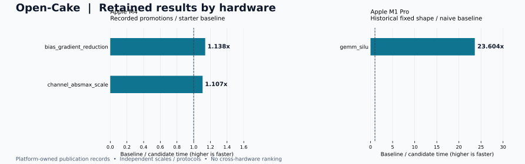

# Apple 实验结果

由 `tools/render_hardware_results.py` 从各平台发布数据生成。原始报告与 Finding 保留权威。

[交互目录](index.html) · [发布数据](records.json) · [main 汇总](https://github.com/qhy991/open-cake-ir/blob/main/docs/RESULTS.md) · [维护流程](../../RESULTS_MAINTENANCE.md)

**加速比 = 基线耗时 ÷ 候选耗时，超过 1× 表示更快。** 各行仅在自己的硬件、Workload、版本与计时协议内比较，不求跨平台平均值。

平台分支分别更新自己的发布数据；main 展示已经合入当前检出的版本。这里不会在线抓取平台分支最新值，也不是实时冠军榜。失败、无显著差异与未实测记录均保留。

## 数据归属

| 平台 | 维护分支 | 数据日期 | 观察条目 | 发布数据 |
|---|---|---|---:|---|
| Apple | [metal](https://github.com/qhy991/open-cake-ir/tree/metal/docs/results/metal) | 2026-09-20 | 4 | [metal/records.json](records.json) |

观察条目数不等于任务数：同一任务可以有不同形状、实验集合和历史尝试。

## Apple

M1 Pro、M4、M2 分开。Metal 测量整个 command buffer，并按重复 dispatch 均摊；不能与 CUPTI 绝对耗时横比。晋升标签仅表示保留记录记载过晋升，未重新读取远端 registry 的当前代。

- M4 晋升记录来自历史 Finding，本次未刷新 registry 当前代。
- M1 Pro 后继实验的搜索高分和合格 K-split 终点不构成单调加速曲线。

| 设备 / 集合 | Task | 输入 / Workload | 基线 µs | 候选 µs | 加速比 | 状态 | 详情 |
|---|---|---|---:|---:|---:|---|---|
| M4 | `channel_absmax_scale` | FP32 · R=2；完整 C/协议由原 Workload 固定 | 0.788 | 0.712 | 1.107× | 有晋升记录 | [metal-result-044](#metal-result-044) |
| M4 | `bias_gradient_reduction` | FP32 · R=2；完整 C/协议由原 Workload 固定 | 0.772 | 0.678 | 1.138× | 有晋升记录 | [metal-result-045](#metal-result-045) |
| M1 Pro | `gemm_silu` | FP32 · M=128, K=256, N=32 | 1878.596 | 79.588 | 23.604× | 历史确认 | [metal-result-046](#metal-result-046) |
| M2 | `gemm` | 原记录的三个 GEMM 候选 | — | — | — | 计时未通过 | [metal-result-047](#metal-result-047) |

## 演进与更新

交互页保留同一 Campaign 内已通过确认的候选时间序列，包括变慢点。它不把不同形状、版本和计时协议拼成长期晋升曲线。
历史晋升记录不等于当前 registry 冠军。跨编译器版本时分别看固定基线的变化与候选相对基线的改善；完整失败过程见来源。
新增实验先在对应平台的 records.json 追加有稳定 id 和固定来源提交的观察，再生成该平台页面。合入 main 的集成分支重建总览；不要手工改生成表格。具体命令见维护流程。

## 逐项来源

### metal-result-044

**M4 · channel_absmax_scale** — 2026-09-12 / 有晋升记录

- Workload：`FP32 · R=2；完整 C/协议由原 Workload 固定`；目标：`apple_gpu_family9`；版本：`v74/v104`。
- 基线：任务固定初始基线；比值口径：`paired`。
- 来源：[findings/2026-09-12-001-r2-row-reduction-scalarization.json](https://github.com/qhy991/open-cake-ir/blob/f95af8005619a9356d5891873b38a9322d32f102/findings/2026-09-12-001-r2-row-reduction-scalarization.json)。
- 原记录 / 实现定位：`open-cake-ir-experiments:m4-family9/matrix-kimi-k3-high-v104-20260911/channel_absmax_scale; open_cake-1; event 13`。
- 记录中的 generation 0；并非本轮重新查询的当前冠军。channel_absmax 的晋升另见 F-2026-09-12-003。

### metal-result-045

**M4 · bias_gradient_reduction** — 2026-09-13 / 有晋升记录

- Workload：`FP32 · R=2；完整 C/协议由原 Workload 固定`；目标：`apple_gpu_family9`；版本：`v78/v113`。
- 基线：任务固定初始基线；比值口径：`paired`。
- 来源：[findings/2026-09-12-001-r2-row-reduction-scalarization.json](https://github.com/qhy991/open-cake-ir/blob/f95af8005619a9356d5891873b38a9322d32f102/findings/2026-09-12-001-r2-row-reduction-scalarization.json)。
- 原记录 / 实现定位：`open-cake-ir-experiments:m4-family9/matrix-kimi-k3-high-v78-v113-incumbent-20260913/bias_gradient_reduction; open_cake-1; event 13`。
- 记录中的 generation 0；并非本轮重新查询的当前冠军。channel_absmax 的晋升另见 F-2026-09-12-003。

### metal-result-046

**M1 Pro · gemm_silu** — 2026-09-11 / 历史确认

- Workload：`FP32 · M=128, K=256, N=32`；目标：`apple_gpu_family7`；版本：`v73/v98`。
- 基线：任务固定初始基线；比值口径：`paired`。
- 来源：[findings/2026-09-11-004-metal-output-column-specialization.json](https://github.com/qhy991/open-cake-ir/blob/f95af8005619a9356d5891873b38a9322d32f102/findings/2026-09-11-004-metal-output-column-specialization.json)。
- 原记录 / 实现定位：`open-cake-ir-experiments:m1pro-family7/gemm-silu-glm53-high-20260910n32; confirmatory event 37; candidate 450d8350`。
- 固定小形状相对朴素基线；后继合格候选为另一种 K-split 机制，未证明跨版本持续加速。

### metal-result-047

**M2 · gemm** — 2026-09-10 / 计时未通过

- Workload：`原记录的三个 GEMM 候选`；目标：`apple_gpu_family8`；版本：`见来源`。
- 基线：任务固定初始基线；比值口径：`paired`。
- 来源：[findings/2026-09-10-010-contraction-regime-shows-material-headroom.json](https://github.com/qhy991/open-cake-ir/blob/f95af8005619a9356d5891873b38a9322d32f102/findings/2026-09-10-010-contraction-regime-shows-material-headroom.json)。
- 原记录 / 实现定位：`见来源所引用的原始实验`。
- 搜索曾观察 6–7×，均未通过测量稳定性门；不列入性能图。
