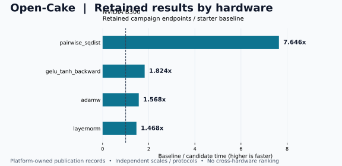

# NVIDIA 实验结果

由 `tools/render_hardware_results.py` 从各平台发布数据生成。原始报告与 Finding 保留权威。

[交互目录](index.html) · [发布数据](records.json) · [main 汇总](https://github.com/qhy991/open-cake-ir/blob/main/docs/RESULTS.md) · [维护流程](../../RESULTS_MAINTENANCE.md)

**加速比 = 基线耗时 ÷ 候选耗时，超过 1× 表示更快。** 各行仅在自己的硬件、Workload、版本与计时协议内比较，不求跨平台平均值。

平台分支分别更新自己的发布数据；main 展示已经合入当前检出的版本。这里不会在线抓取平台分支最新值，也不是实时冠军榜。失败、无显著差异与未实测记录均保留。

## 数据归属

| 平台 | 维护分支 | 数据日期 | 观察条目 | 发布数据 |
|---|---|---|---:|---|
| NVIDIA | [nvidia](https://github.com/qhy991/open-cake-ir/tree/nvidia/docs/results/nvidia) | 2026-09-20 | 51 | [nvidia/records.json](records.json) |

观察条目数不等于任务数：同一任务可以有不同形状、实验集合和历史尝试。

## NVIDIA

B300 的服务实验、CTA 宽度验证与 CAKE 改写各自保留基线和版本，不混成一个榜。B200 单列正确性证据。

- B300 服务实验投影保留每个 Campaign 的最佳合格候选及确认历史；不是远端 registry 的当前冠军。
- CTA 宽度验证与 CAKE 对照分别保留自身基线、版本及协议。
- FlashInfer新增7项固定shape三方对比：210/210数值检查通过。003仍比派生外部参考慢4.73倍；其余外部候选边保留CV失败，不发布合格加速比。022的原starter另以质量通过的1.151倍胜过外部参考。
- 六项三方NCU均为单kernel且未观察到local-memory sectors。003/022优先检查工作分配与并行度；001/002/025对齐launch几何后继续核对访存。详见F-2026-09-20-007。
- F-2026-09-20-008隔离了AOT对齐信息机制：仅CPU编译、假设16字节pointer alignment，三项kernel由标量b16变为128位向量访存。当前ABI未保证该假设；未做GPU运行、速度或晋升声明。002原有.cg提示并未解决该向量化信息缺口。

| 设备 / 集合 | Task | 输入 / Workload | 基线 µs | 候选 µs | 加速比 | 状态 | 详情 |
|---|---|---|---:|---:|---:|---|---|
| B300 · 服务实验 | `absmax_rescale` | absmax-rescale-fp32-triton-b300-r128-c1024-v1 | 2.320 | 2.272 | 1.021× | 报告已确认 | [nvidia-result-001](#nvidia-result-001) |
| B300 · 服务实验 | `adadelta` | adadelta-fp32-triton-b300-r128-c1024-v1 | 4.160 | 4.096 | 1.016× | 报告已确认 | [nvidia-result-002](#nvidia-result-002) |
| B300 · 服务实验 | `adamw` | adamw-fp32-triton-b300-r128-c1024-v1 | 4.064 | 2.592 | 1.568× | 报告已确认 | [nvidia-result-003](#nvidia-result-003) |
| B300 · 服务实验 | `attention_decode` | contraction-attention-decode-fp32-triton-b300-r1024-k1024-n64-v1 | 339.874 | 230.769 | 1.473× | 报告已确认 | [nvidia-result-004](#nvidia-result-004) |
| B300 · 服务实验 | `bias_gradient_reduction` | bias-gradient-reduction-fp32-triton-b300-r128-c1024-v1 | — | — | — | 未合格终点 | [nvidia-result-005](#nvidia-result-005) |
| B300 · 服务实验 | `bias_gradient_reduction` | bias-gradient-reduction-fp32-triton-b300-r128-c1024-v1 | 2.784 | 2.752 | 1.012× | 报告已确认 | [nvidia-result-006](#nvidia-result-006) |
| B300 · 服务实验 | `channel_absmax_scale` | channel-absmax-scale-fp32-triton-b300-r128-c1024-v1 | 2.784 | 2.783 | 1.000× | 报告已确认 | [nvidia-result-007](#nvidia-result-007) |
| B300 · 服务实验 | `cosine_similarity` | cosine-similarity-fp32-triton-b300-r128-c1024-v1 | 2.976 | 2.977 | 1.000× | 报告已确认 | [nvidia-result-008](#nvidia-result-008) |
| B300 · 服务实验 | `gelu_tanh` | gelu-tanh-fp32-triton-b300-r128-c1024-v1 | 4.415 | 4.352 | 1.014× | 报告已确认 | [nvidia-result-009](#nvidia-result-009) |
| B300 · 服务实验 | `gelu_tanh_backward` | gelu-tanh-backward-fp32-triton-b300-r128-c1024-v1 | 4.960 | 2.720 | 1.824× | 报告已确认 | [nvidia-result-010](#nvidia-result-010) |
| B300 · 服务实验 | `gemm` | contraction-gemm-fp32-triton-b300-r1024-k1024-n64-v1 | 169.249 | 154.945 | 1.092× | 报告已确认 | [nvidia-result-011](#nvidia-result-011) |
| B300 · 服务实验 | `gemm_silu` | contraction-gemm-silu-fp32-triton-b300-r1024-k1024-n64-v1 | 166.081 | 178.305 | 0.931× | 报告已确认 | [nvidia-result-012](#nvidia-result-012) |
| B300 · 服务实验 | `layernorm` | layernorm-fp32-triton-b300-r128-c1024-v1 | 3.616 | 2.464 | 1.468× | 报告已确认 | [nvidia-result-013](#nvidia-result-013) |
| B300 · 服务实验 | `layernorm_backward_input` | layernorm-backward-input-fp32-triton-b300-r128-c1024-v2 | 3.168 | 3.040 | 1.042× | 报告已确认 | [nvidia-result-014](#nvidia-result-014) |
| B300 · 服务实验 | `momentum_sgd` | momentum-sgd-fp32-triton-b300-r128-c1024-v1 | 3.520 | 3.520 | 1.000× | 报告已确认 | [nvidia-result-015](#nvidia-result-015) |
| B300 · 服务实验 | `pairwise_sqdist` | contraction-pairwise-sqdist-fp32-triton-b300-r1024-k1024-n64-v1 | 411.795 | 53.856 | 7.646× | 报告已确认 | [nvidia-result-016](#nvidia-result-016) |
| B300 · 服务实验 | `per_channel_moments` | per-channel-moments-fp32-triton-b300-r128-c1024-v1 | 2.784 | 2.784 | 1.000× | 报告已确认 | [nvidia-result-017](#nvidia-result-017) |
| B300 · 服务实验 | `prelu` | prelu-fp32-triton-b300-r128-c1024-v1 | 2.896 | 2.832 | 1.023× | 报告已确认 | [nvidia-result-018](#nvidia-result-018) |
| B300 · 服务实验 | `residual_rmsnorm` | residual-rmsnorm-fp32-triton-b300-r128-c1024-v1 | 3.264 | 2.400 | 1.360× | 报告已确认 | [nvidia-result-019](#nvidia-result-019) |
| B300 · 服务实验 | `rmsnorm` | rmsnorm-fp32-triton-b300-r128-c1024-v3 | — | — | — | 未合格终点 | [nvidia-result-020](#nvidia-result-020) |
| B300 · 服务实验 | `rmsnorm` | rmsnorm-fp32-triton-b300-r128-c1024-v3 | 2.575 | 2.272 | 1.134× | 报告已确认 | [nvidia-result-021](#nvidia-result-021) |
| B300 · 服务实验 | `rmsnorm_input_gradient` | rmsnorm-input-gradient-fp32-triton-b300-r128-c1024-v2 | 3.040 | 2.432 | 1.250× | 报告已确认 | [nvidia-result-022](#nvidia-result-022) |
| B300 · 服务实验 | `selu` | selu-fp32-triton-b300-r128-c1024-v1 | 2.368 | 2.096 | 1.130× | 报告已确认 | [nvidia-result-023](#nvidia-result-023) |
| B300 · 服务实验 | `silu` | silu-fp32-triton-b300-r128-c1024-v1 | 2.432 | 2.112 | 1.152× | 报告已确认 | [nvidia-result-024](#nvidia-result-024) |
| B300 · 服务实验 | `softmax` | softmax-fp32-triton-b300-r128-c1024-v1 | 2.495 | 2.464 | 1.013× | 报告已确认 | [nvidia-result-025](#nvidia-result-025) |
| B300 · 服务实验 | `softmax_backward` | softmax-backward-fp32-triton-b300-r128-c1024-v1 | 2.944 | 2.592 | 1.136× | 报告已确认 | [nvidia-result-026](#nvidia-result-026) |
| B300 · 服务实验 | `softplus_gradient` | softplus-gradient-fp32-triton-b300-r128-c1024-v2 | 2.977 | 2.208 | 1.348× | 报告已确认 | [nvidia-result-027](#nvidia-result-027) |
| B300 · 服务实验 | `softsign` | softsign-fp32-triton-b300-r128-c1024-v1 | 2.432 | 2.400 | 1.013× | 报告已确认 | [nvidia-result-028](#nvidia-result-028) |
| B300 · 服务实验 | `swiglu` | swiglu-fp32-triton-b300-r128-c1024-v1 | 3.520 | 3.232 | 1.089× | 报告已确认 | [nvidia-result-029](#nvidia-result-029) |
| B300 · CTA 宽度验证 | `rmsnorm_input_gradient` | FP32 · R=128, C=1024 | 3.104 | 2.497 | 1.243× | 已确认 | [nvidia-result-030](#nvidia-result-030) |
| B300 · CTA 宽度验证 | `swiglu` | FP32 · R=128, C=1024 | 3.648 | 2.208 | 1.652× | 已确认 | [nvidia-result-031](#nvidia-result-031) |
| B300 · CTA 宽度验证 | `softmax_backward` | FP32 · R=128, C=1024 | 2.927 | 2.560 | 1.144× | 已确认 | [nvidia-result-032](#nvidia-result-032) |
| B300 · CTA 宽度验证 | `cosine_similarity` | FP32 · R=128, C=1024 | 2.976 | 2.528 | 1.177× | 已确认 | [nvidia-result-033](#nvidia-result-033) |
| B300 · CAKE 对照 | `TinyGEMM2 s2` | BF16+bias · B/N/K=1 / 128 / 720 | 2.720 | 99.969 | 0.027× | 正确；性能落后 | [nvidia-result-034](#nvidia-result-034) |
| B300 · CAKE 对照 | `TinyGEMM2 s4` | BF16+bias · B/N/K=1 / 128 / 720 | 2.720 | 100.192 | 0.027× | 正确；性能落后 | [nvidia-result-035](#nvidia-result-035) |
| B300 · CAKE 对照 | `TinyGEMM2 s2` | BF16+bias · B/N/K=16 / 1024 / 1024 | 3.040 | 106.016 | 0.029× | 正确；性能落后 | [nvidia-result-036](#nvidia-result-036) |
| B300 · CAKE 对照 | `TinyGEMM2 s4` | BF16+bias · B/N/K=16 / 1024 / 1024 | 3.040 | 105.825 | 0.029× | 正确；性能落后 | [nvidia-result-037](#nvidia-result-037) |
| B300 · CAKE 对照 | `TinyGEMM2 s2` | BF16+bias · B/N/K=64 / 4096 / 3072 | 21.216 | 239.969 | 0.088× | 正确；性能落后 | [nvidia-result-038](#nvidia-result-038) |
| B300 · CAKE 对照 | `TinyGEMM2 s4` | BF16+bias · B/N/K=64 / 4096 / 3072 | 21.216 | 289.186 | 0.073× | 正确；性能落后 | [nvidia-result-039](#nvidia-result-039) |
| B300 · CAKE 对照 | `KDA prefill` | 完整任务尚未完成 | — | — | — | 未实测 | [nvidia-result-040](#nvidia-result-040) |
| B300 · CAKE 对照 | `KDA decode` | 完整任务尚未完成 | — | — | — | 未实测 | [nvidia-result-041](#nvidia-result-041) |
| B300 · CAKE 对照 | `Alpha-MoE` | 完整任务尚未完成 | — | — | — | 未实测 | [nvidia-result-042](#nvidia-result-042) |
| B200 | `FMA / affine / state-store` | 固定正确性实例，详见各报告 | — | — | — | 仅正确性 | [nvidia-result-043](#nvidia-result-043) |
| B300 · FlashInfer外部对照 | `001_fused_add_rmsnorm_h2048` | fib_fused_add_rmsnorm_h2048 / R=79, C=2048 / BF16 | 2.336 | 2.496 | — | 正确；计时质量未通过 | [nvidia-fib-external-001-20260920](#nvidia-fib-external-001-20260920) |
| B300 · FlashInfer外部对照 | `002_fused_add_rmsnorm_h4096` | fib_fused_add_rmsnorm_h4096 / R=170, C=4096 / BF16 | 3.296 | 3.712 | — | 正确；计时质量未通过 | [nvidia-fib-external-002-20260920](#nvidia-fib-external-002-20260920) |
| B300 · FlashInfer外部对照 | `003_fused_add_rmsnorm_h7168` | fib_fused_add_rmsnorm_h7168 / R=64, C=7168 / BF16 | 3.040 | 14.368 | 0.212× | 正确；外部参考更快（质量通过） | [nvidia-fib-external-003-20260920](#nvidia-fib-external-003-20260920) |
| B300 · FlashInfer外部对照 | `004_gemm_n128_k2048` | fib_gemm_n128_k2048 / R=1, C=128 / FP16 | 2.368 | 2.688 | — | 正确；计时质量未通过 | [nvidia-fib-external-004-20260920](#nvidia-fib-external-004-20260920) |
| B300 · FlashInfer外部对照 | `021_rmsnorm_h128` | fib_rmsnorm_h128 / R=2528, C=128 / BF16 | 2.560 | 2.912 | — | 正确；计时质量未通过 | [nvidia-fib-external-021-20260920](#nvidia-fib-external-021-20260920) |
| B300 · FlashInfer外部对照 | `022_rmsnorm_h512` | fib_rmsnorm_h512 / R=539, C=512 / BF16 | 2.720 | 5.152 | — | 正确；计时质量未通过 | [nvidia-fib-external-022-20260920](#nvidia-fib-external-022-20260920) |
| B300 · FlashInfer外部对照 | `025_rmsnorm_h4096` | fib_rmsnorm_h4096 / R=170, C=4096 / BF16 | 2.752 | 3.168 | — | 正确；计时质量未通过 | [nvidia-fib-external-025-20260920](#nvidia-fib-external-025-20260920) |
| B300 · FlashInfer外部对照 | `022_rmsnorm_h512_starter` | fib_rmsnorm_h512 / R=539, C=512 / BF16 | 2.688 | 2.336 | 1.151× | 正确；starter更快（质量通过） | [nvidia-fib-external-022-starter-20260920](#nvidia-fib-external-022-starter-20260920) |

## 演进与更新

交互页保留同一 Campaign 内已通过确认的候选时间序列，包括变慢点。它不把不同形状、版本和计时协议拼成长期晋升曲线。
历史晋升记录不等于当前 registry 冠军。跨编译器版本时分别看固定基线的变化与候选相对基线的改善；完整失败过程见来源。
新增实验先在对应平台的 records.json 追加有稳定 id 和固定来源提交的观察，再生成该平台页面。合入 main 的集成分支重建总览；不要手工改生成表格。具体命令见维护流程。

## 逐项来源

### nvidia-result-001

**B300 · 服务实验 · absmax_rescale** — 2026-09-16 / 报告已确认

- Workload：`absmax-rescale-fp32-triton-b300-r128-c1024-v1`；目标：`sm_103a`；版本：`open-cake-ir-sm100a-v84`。
- 基线：任务固定初始基线；比值口径：`paired`。
- 来源：[docs/results/b300-service-20260920.json](https://github.com/qhy991/open-cake-ir/blob/f95af8005619a9356d5891873b38a9322d32f102/docs/results/b300-service-20260920.json)。
- 原记录 / 实现定位：`B300-M2:/mnt/b300-shared/home/qinhaiyan/oci-service-runs/absmax_rescale-20260916-100813/report.json; open_cake-1; event=17; candidate=a363e12177e7c493ca3748b23b5fad0515f84efc761d0bd62d6c37e02fa2adb5`。
- 该 Campaign 记录的最佳合格候选；基线选择=starter_reference。仅投影原审计结果，不是当前 registry 冠军。

| 确认轮次 | 事件 | 候选 µs | 该轮配对加速比 |
|---|---|---:|---:|
| 2 | 17 | 2.272 | 1.021× |

### nvidia-result-002

**B300 · 服务实验 · adadelta** — 2026-09-16 / 报告已确认

- Workload：`adadelta-fp32-triton-b300-r128-c1024-v1`；目标：`sm_103a`；版本：`open-cake-ir-sm100a-v84`。
- 基线：任务固定初始基线；比值口径：`paired`。
- 来源：[docs/results/b300-service-20260920.json](https://github.com/qhy991/open-cake-ir/blob/f95af8005619a9356d5891873b38a9322d32f102/docs/results/b300-service-20260920.json)。
- 原记录 / 实现定位：`B300-M2:/mnt/b300-shared/home/qinhaiyan/oci-service-runs/adadelta-20260916-060824/report.json; open_cake-1; event=17; candidate=1eb5ed817fcf0ddc63179af3c7eed9d6cda9354e7d6e3ebed6506e8f08960904`。
- 该 Campaign 记录的最佳合格候选；基线选择=starter_reference。仅投影原审计结果，不是当前 registry 冠军。

| 确认轮次 | 事件 | 候选 µs | 该轮配对加速比 |
|---|---|---:|---:|
| 2 | 17 | 4.096 | 1.016× |

### nvidia-result-003

**B300 · 服务实验 · adamw** — 2026-09-16 / 报告已确认

- Workload：`adamw-fp32-triton-b300-r128-c1024-v1`；目标：`sm_103a`；版本：`open-cake-ir-sm100a-v84`。
- 基线：任务固定初始基线；比值口径：`paired`。
- 来源：[docs/results/b300-service-20260920.json](https://github.com/qhy991/open-cake-ir/blob/f95af8005619a9356d5891873b38a9322d32f102/docs/results/b300-service-20260920.json)。
- 原记录 / 实现定位：`B300-M2:/mnt/b300-shared/home/qinhaiyan/oci-service-runs/adamw-20260916-053018/report.json; open_cake-1; event=26; candidate=398044880e6094b2c0e585775b7d0753650db52ad51d2aecc6aa0200ea09cc4f`。
- 该 Campaign 记录的最佳合格候选；基线选择=starter_reference。仅投影原审计结果，不是当前 registry 冠军。

| 确认轮次 | 事件 | 候选 µs | 该轮配对加速比 |
|---|---|---:|---:|
| 1 | 13 | 4.000 | 1.016× |
| 2 | 26 | 2.592 | 1.568× |

### nvidia-result-004

**B300 · 服务实验 · attention_decode** — 2026-09-16 / 报告已确认

- Workload：`contraction-attention-decode-fp32-triton-b300-r1024-k1024-n64-v1`；目标：`sm_103a`；版本：`open-cake-ir-sm100a-v84`。
- 基线：任务固定初始基线；比值口径：`paired`。
- 来源：[docs/results/b300-service-20260920.json](https://github.com/qhy991/open-cake-ir/blob/f95af8005619a9356d5891873b38a9322d32f102/docs/results/b300-service-20260920.json)。
- 原记录 / 实现定位：`B300-M2:/mnt/b300-shared/home/qinhaiyan/oci-service-runs/attention_decode-20260916-184301/report.json; open_cake-1; event=13; candidate=62bc95ec21df257e1f1f7f7b28d6845dc47a6af5d32c5d970b1f840af27ad5bf`。
- 该 Campaign 记录的最佳合格候选；基线选择=starter_reference。仅投影原审计结果，不是当前 registry 冠军。

| 确认轮次 | 事件 | 候选 µs | 该轮配对加速比 |
|---|---|---:|---:|
| 1 | 13 | 230.769 | 1.473× |

### nvidia-result-005

**B300 · 服务实验 · bias_gradient_reduction** — 2026-09-16 / 未合格终点

- Workload：`bias-gradient-reduction-fp32-triton-b300-r128-c1024-v1`；目标：`sm_103a`；版本：`open-cake-ir-sm100a-v84`。
- 基线：任务固定初始基线；比值口径：`paired`。
- 来源：[docs/results/b300-service-20260920.json](https://github.com/qhy991/open-cake-ir/blob/f95af8005619a9356d5891873b38a9322d32f102/docs/results/b300-service-20260920.json)。
- 原记录 / 实现定位：`B300-M2:/mnt/b300-shared/home/qinhaiyan/oci-service-runs/bias_gradient_reduction-20260916-065950/report.json; open_cake-1; event=None; candidate=None`。
- provider_fault; missing; None

### nvidia-result-006

**B300 · 服务实验 · bias_gradient_reduction** — 2026-09-16 / 报告已确认

- Workload：`bias-gradient-reduction-fp32-triton-b300-r128-c1024-v1`；目标：`sm_103a`；版本：`open-cake-ir-sm100a-v84`。
- 基线：任务固定初始基线；比值口径：`paired`。
- 来源：[docs/results/b300-service-20260920.json](https://github.com/qhy991/open-cake-ir/blob/f95af8005619a9356d5891873b38a9322d32f102/docs/results/b300-service-20260920.json)。
- 原记录 / 实现定位：`B300-M2:/mnt/b300-shared/home/qinhaiyan/oci-service-runs/bias_gradient_reduction-20260916-130258/report.json; open_cake-1; event=13; candidate=1f9b4ad199fc61c3ae923d998bd1ac59d1fbcde65649725e66f64e989b791df8`。
- 该 Campaign 记录的最佳合格候选；基线选择=starter_reference。仅投影原审计结果，不是当前 registry 冠军。

| 确认轮次 | 事件 | 候选 µs | 该轮配对加速比 |
|---|---|---:|---:|
| 1 | 13 | 2.752 | 1.012× |

### nvidia-result-007

**B300 · 服务实验 · channel_absmax_scale** — 2026-09-16 / 报告已确认

- Workload：`channel-absmax-scale-fp32-triton-b300-r128-c1024-v1`；目标：`sm_103a`；版本：`open-cake-ir-sm100a-v84`。
- 基线：任务固定初始基线；比值口径：`paired`。
- 来源：[docs/results/b300-service-20260920.json](https://github.com/qhy991/open-cake-ir/blob/f95af8005619a9356d5891873b38a9322d32f102/docs/results/b300-service-20260920.json)。
- 原记录 / 实现定位：`B300-M2:/mnt/b300-shared/home/qinhaiyan/oci-service-runs/channel_absmax_scale-20260916-124804/report.json; open_cake-1; event=26; candidate=bb02cc80ae5a1785f89440d86203f1d058c61b80074629edf8a0d7f4c915e743`。
- 该 Campaign 记录的最佳合格候选；基线选择=starter_reference。仅投影原审计结果，不是当前 registry 冠军。

| 确认轮次 | 事件 | 候选 µs | 该轮配对加速比 |
|---|---|---:|---:|
| 1 | 13 | 2.784 | 1.000× |
| 2 | 26 | 2.783 | 1.000× |

### nvidia-result-008

**B300 · 服务实验 · cosine_similarity** — 2026-09-16 / 报告已确认

- Workload：`cosine-similarity-fp32-triton-b300-r128-c1024-v1`；目标：`sm_103a`；版本：`open-cake-ir-sm100a-v84`。
- 基线：任务固定初始基线；比值口径：`paired`。
- 来源：[docs/results/b300-service-20260920.json](https://github.com/qhy991/open-cake-ir/blob/f95af8005619a9356d5891873b38a9322d32f102/docs/results/b300-service-20260920.json)。
- 原记录 / 实现定位：`B300-M2:/mnt/b300-shared/home/qinhaiyan/oci-service-runs/cosine_similarity-20260916-102543/report.json; open_cake-1; event=13; candidate=f739fb48dec1050ae77b2abbe731a106d055be484eb657fada04e1b108a4fea4`。
- 该 Campaign 记录的最佳合格候选；基线选择=starter_reference。仅投影原审计结果，不是当前 registry 冠军。

| 确认轮次 | 事件 | 候选 µs | 该轮配对加速比 |
|---|---|---:|---:|
| 1 | 13 | 2.977 | 1.000× |

### nvidia-result-009

**B300 · 服务实验 · gelu_tanh** — 2026-09-16 / 报告已确认

- Workload：`gelu-tanh-fp32-triton-b300-r128-c1024-v1`；目标：`sm_103a`；版本：`open-cake-ir-sm100a-v84`。
- 基线：任务固定初始基线；比值口径：`paired`。
- 来源：[docs/results/b300-service-20260920.json](https://github.com/qhy991/open-cake-ir/blob/f95af8005619a9356d5891873b38a9322d32f102/docs/results/b300-service-20260920.json)。
- 原记录 / 实现定位：`B300-M2:/mnt/b300-shared/home/qinhaiyan/oci-service-runs/gelu_tanh-20260916-042956/report.json; open_cake-1; event=17; candidate=f42e4152b65487a489d44963da52469166425ebf2e7862416ff128272dbc65b8`。
- 该 Campaign 记录的最佳合格候选；基线选择=starter_reference。仅投影原审计结果，不是当前 registry 冠军。

| 确认轮次 | 事件 | 候选 µs | 该轮配对加速比 |
|---|---|---:|---:|
| 2 | 17 | 4.352 | 1.014× |

### nvidia-result-010

**B300 · 服务实验 · gelu_tanh_backward** — 2026-09-16 / 报告已确认

- Workload：`gelu-tanh-backward-fp32-triton-b300-r128-c1024-v1`；目标：`sm_103a`；版本：`open-cake-ir-sm100a-v84`。
- 基线：任务固定初始基线；比值口径：`paired`。
- 来源：[docs/results/b300-service-20260920.json](https://github.com/qhy991/open-cake-ir/blob/f95af8005619a9356d5891873b38a9322d32f102/docs/results/b300-service-20260920.json)。
- 原记录 / 实现定位：`B300-M2:/mnt/b300-shared/home/qinhaiyan/oci-service-runs/gelu_tanh_backward-20260916-120441/report.json; open_cake-1; event=17; candidate=62aca837508c4a2dbd5cc1c14235d6833b26cbc858dad707288bec74f48c92aa`。
- 该 Campaign 记录的最佳合格候选；基线选择=starter_reference。仅投影原审计结果，不是当前 registry 冠军。

| 确认轮次 | 事件 | 候选 µs | 该轮配对加速比 |
|---|---|---:|---:|
| 2 | 17 | 2.720 | 1.824× |

### nvidia-result-011

**B300 · 服务实验 · gemm** — 2026-09-16 / 报告已确认

- Workload：`contraction-gemm-fp32-triton-b300-r1024-k1024-n64-v1`；目标：`sm_103a`；版本：`open-cake-ir-sm100a-v84`。
- 基线：任务固定初始基线；比值口径：`paired`。
- 来源：[docs/results/b300-service-20260920.json](https://github.com/qhy991/open-cake-ir/blob/f95af8005619a9356d5891873b38a9322d32f102/docs/results/b300-service-20260920.json)。
- 原记录 / 实现定位：`B300-M2:/mnt/b300-shared/home/qinhaiyan/oci-service-runs/gemm-20260916-170620/report.json; open_cake-1; event=17; candidate=445d2727b4e39d3aae77f38415ea7ebc40190db07ffd325674ebb05c380fd454`。
- 该 Campaign 记录的最佳合格候选；基线选择=starter_reference。仅投影原审计结果，不是当前 registry 冠军。

| 确认轮次 | 事件 | 候选 µs | 该轮配对加速比 |
|---|---|---:|---:|
| 2 | 17 | 154.945 | 1.092× |

### nvidia-result-012

**B300 · 服务实验 · gemm_silu** — 2026-09-16 / 报告已确认

- Workload：`contraction-gemm-silu-fp32-triton-b300-r1024-k1024-n64-v1`；目标：`sm_103a`；版本：`open-cake-ir-sm100a-v84`。
- 基线：任务固定初始基线；比值口径：`paired`。
- 来源：[docs/results/b300-service-20260920.json](https://github.com/qhy991/open-cake-ir/blob/f95af8005619a9356d5891873b38a9322d32f102/docs/results/b300-service-20260920.json)。
- 原记录 / 实现定位：`B300-M2:/mnt/b300-shared/home/qinhaiyan/oci-service-runs/gemm_silu-20260916-172338/report.json; open_cake-1; event=26; candidate=0cfa7400e15901e6e39968f14f956117ca8ca6c9d622cceae04e339f6ea34860`。
- 该 Campaign 记录的最佳合格候选；基线选择=starter_reference。仅投影原审计结果，不是当前 registry 冠军。

| 确认轮次 | 事件 | 候选 µs | 该轮配对加速比 |
|---|---|---:|---:|
| 1 | 13 | 324.274 | 0.509× |
| 2 | 26 | 178.305 | 0.931× |

### nvidia-result-013

**B300 · 服务实验 · layernorm** — 2026-09-16 / 报告已确认

- Workload：`layernorm-fp32-triton-b300-r128-c1024-v1`；目标：`sm_103a`；版本：`open-cake-ir-sm100a-v84`。
- 基线：任务固定初始基线；比值口径：`paired`。
- 来源：[docs/results/b300-service-20260920.json](https://github.com/qhy991/open-cake-ir/blob/f95af8005619a9356d5891873b38a9322d32f102/docs/results/b300-service-20260920.json)。
- 原记录 / 实现定位：`B300-M2:/mnt/b300-shared/home/qinhaiyan/oci-service-runs/layernorm-20260916-034037/report.json; open_cake-1; event=13; candidate=d110d259af65053f62a441195bd51dd4d3827ad3210324e3be89ffa87c6ebf9c`。
- 该 Campaign 记录的最佳合格候选；基线选择=starter_reference。仅投影原审计结果，不是当前 registry 冠军。

| 确认轮次 | 事件 | 候选 µs | 该轮配对加速比 |
|---|---|---:|---:|
| 1 | 13 | 2.464 | 1.468× |
| 2 | 26 | 2.465 | 1.467× |

### nvidia-result-014

**B300 · 服务实验 · layernorm_backward_input** — 2026-09-16 / 报告已确认

- Workload：`layernorm-backward-input-fp32-triton-b300-r128-c1024-v2`；目标：`sm_103a`；版本：`open-cake-ir-sm100a-v84`。
- 基线：任务固定初始基线；比值口径：`paired`。
- 来源：[docs/results/b300-service-20260920.json](https://github.com/qhy991/open-cake-ir/blob/f95af8005619a9356d5891873b38a9322d32f102/docs/results/b300-service-20260920.json)。
- 原记录 / 实现定位：`B300-M2:/mnt/b300-shared/home/qinhaiyan/oci-service-runs/layernorm_backward_input-20260916-094015/report.json; open_cake-1; event=26; candidate=b123db1855356f93ed21bb3063101963857e893d120c33dd837b05b0bcb9819b`。
- 该 Campaign 记录的最佳合格候选；基线选择=starter_reference。仅投影原审计结果，不是当前 registry 冠军。

| 确认轮次 | 事件 | 候选 µs | 该轮配对加速比 |
|---|---|---:|---:|
| 1 | 13 | 3.200 | 0.990× |
| 2 | 26 | 3.040 | 1.042× |

### nvidia-result-015

**B300 · 服务实验 · momentum_sgd** — 2026-09-16 / 报告已确认

- Workload：`momentum-sgd-fp32-triton-b300-r128-c1024-v1`；目标：`sm_103a`；版本：`open-cake-ir-sm100a-v84`。
- 基线：任务固定初始基线；比值口径：`paired`。
- 来源：[docs/results/b300-service-20260920.json](https://github.com/qhy991/open-cake-ir/blob/f95af8005619a9356d5891873b38a9322d32f102/docs/results/b300-service-20260920.json)。
- 原记录 / 实现定位：`B300-M2:/mnt/b300-shared/home/qinhaiyan/oci-service-runs/momentum_sgd-20260916-051315/report.json; open_cake-1; event=26; candidate=a17d866faea721d4a7ea9ee3579af848a649d0625d7470b64430d3256f80d62f`。
- 该 Campaign 记录的最佳合格候选；基线选择=starter_reference。仅投影原审计结果，不是当前 registry 冠军。

| 确认轮次 | 事件 | 候选 µs | 该轮配对加速比 |
|---|---|---:|---:|
| 1 | 13 | 4.864 | 0.727× |
| 2 | 26 | 3.520 | 1.000× |

### nvidia-result-016

**B300 · 服务实验 · pairwise_sqdist** — 2026-09-16 / 报告已确认

- Workload：`contraction-pairwise-sqdist-fp32-triton-b300-r1024-k1024-n64-v1`；目标：`sm_103a`；版本：`open-cake-ir-sm100a-v84`。
- 基线：任务固定初始基线；比值口径：`paired`。
- 来源：[docs/results/b300-service-20260920.json](https://github.com/qhy991/open-cake-ir/blob/f95af8005619a9356d5891873b38a9322d32f102/docs/results/b300-service-20260920.json)。
- 原记录 / 实现定位：`B300-M2:/mnt/b300-shared/home/qinhaiyan/oci-service-runs/pairwise_sqdist-20260916-180016/report.json; open_cake-1; event=17; candidate=1c24a27ae8410b36407e837607d0349d0d152634f6759da19283697afccc0962`。
- 该 Campaign 记录的最佳合格候选；基线选择=starter_reference。仅投影原审计结果，不是当前 registry 冠军。

| 确认轮次 | 事件 | 候选 µs | 该轮配对加速比 |
|---|---|---:|---:|
| 2 | 17 | 53.856 | 7.646× |

### nvidia-result-017

**B300 · 服务实验 · per_channel_moments** — 2026-09-16 / 报告已确认

- Workload：`per-channel-moments-fp32-triton-b300-r128-c1024-v1`；目标：`sm_103a`；版本：`open-cake-ir-sm100a-v84`。
- 基线：任务固定初始基线；比值口径：`paired`。
- 来源：[docs/results/b300-service-20260920.json](https://github.com/qhy991/open-cake-ir/blob/f95af8005619a9356d5891873b38a9322d32f102/docs/results/b300-service-20260920.json)。
- 原记录 / 实现定位：`B300-M2:/mnt/b300-shared/home/qinhaiyan/oci-service-runs/per_channel_moments-20260916-104523/report.json; open_cake-1; event=13; candidate=b087e9645f5ba0d469c650fde3fc65fda1f79c50b8d150c0f5c633feee3ad3df`。
- 该 Campaign 记录的最佳合格候选；基线选择=starter_reference。仅投影原审计结果，不是当前 registry 冠军。

| 确认轮次 | 事件 | 候选 µs | 该轮配对加速比 |
|---|---|---:|---:|
| 1 | 13 | 2.784 | 1.000× |

### nvidia-result-018

**B300 · 服务实验 · prelu** — 2026-09-16 / 报告已确认

- Workload：`prelu-fp32-triton-b300-r128-c1024-v1`；目标：`sm_103a`；版本：`open-cake-ir-sm100a-v84`。
- 基线：任务固定初始基线；比值口径：`paired`。
- 来源：[docs/results/b300-service-20260920.json](https://github.com/qhy991/open-cake-ir/blob/f95af8005619a9356d5891873b38a9322d32f102/docs/results/b300-service-20260920.json)。
- 原记录 / 实现定位：`B300-M2:/mnt/b300-shared/home/qinhaiyan/oci-service-runs/prelu-20260916-122027/report.json; open_cake-1; event=13; candidate=56e850a984d225bdc58d359bc91fd12a28074af6c56aba9df64ee1a77591ebcf`。
- 该 Campaign 记录的最佳合格候选；基线选择=starter_reference。仅投影原审计结果，不是当前 registry 冠军。

| 确认轮次 | 事件 | 候选 µs | 该轮配对加速比 |
|---|---|---:|---:|
| 1 | 13 | 2.832 | 1.023× |

### nvidia-result-019

**B300 · 服务实验 · residual_rmsnorm** — 2026-09-16 / 报告已确认

- Workload：`residual-rmsnorm-fp32-triton-b300-r128-c1024-v1`；目标：`sm_103a`；版本：`open-cake-ir-sm100a-v84`。
- 基线：任务固定初始基线；比值口径：`paired`。
- 来源：[docs/results/b300-service-20260920.json](https://github.com/qhy991/open-cake-ir/blob/f95af8005619a9356d5891873b38a9322d32f102/docs/results/b300-service-20260920.json)。
- 原记录 / 实现定位：`B300-M2:/mnt/b300-shared/home/qinhaiyan/oci-service-runs/residual_rmsnorm-20260916-044120/report.json; open_cake-1; event=26; candidate=533df099cbd8ced4e5be0305fa946ea1691c7249797ff9917f194c92aa35c999`。
- 该 Campaign 记录的最佳合格候选；基线选择=starter_reference。仅投影原审计结果，不是当前 registry 冠军。

| 确认轮次 | 事件 | 候选 µs | 该轮配对加速比 |
|---|---|---:|---:|
| 1 | 13 | 3.232 | 1.000× |
| 2 | 26 | 2.400 | 1.360× |

### nvidia-result-020

**B300 · 服务实验 · rmsnorm** — 2026-09-16 / 未合格终点

- Workload：`rmsnorm-fp32-triton-b300-r128-c1024-v3`；目标：`sm_103a`；版本：`open-cake-ir-sm100a-v84`。
- 基线：任务固定初始基线；比值口径：`paired`。
- 来源：[docs/results/b300-service-20260920.json](https://github.com/qhy991/open-cake-ir/blob/f95af8005619a9356d5891873b38a9322d32f102/docs/results/b300-service-20260920.json)。
- 原记录 / 实现定位：`B300-M2:/mnt/b300-shared/home/qinhaiyan/oci-service-runs/rmsnorm-20260916-031407/report.json; open_cake-1; event=None; candidate=None`。
- broker_fault; missing; None

### nvidia-result-021

**B300 · 服务实验 · rmsnorm** — 2026-09-16 / 报告已确认

- Workload：`rmsnorm-fp32-triton-b300-r128-c1024-v3`；目标：`sm_103a`；版本：`open-cake-ir-sm100a-v84`。
- 基线：任务固定初始基线；比值口径：`paired`。
- 来源：[docs/results/b300-service-20260920.json](https://github.com/qhy991/open-cake-ir/blob/f95af8005619a9356d5891873b38a9322d32f102/docs/results/b300-service-20260920.json)。
- 原记录 / 实现定位：`B300-M2:/mnt/b300-shared/home/qinhaiyan/oci-service-runs/rmsnorm-20260916-032057/report.json; open_cake-1; event=26; candidate=3d9385205d3413906415268c8c6e2b85cc82a8de9dfa213708f0870989f77802`。
- 该 Campaign 记录的最佳合格候选；基线选择=starter_reference。仅投影原审计结果，不是当前 registry 冠军。

| 确认轮次 | 事件 | 候选 µs | 该轮配对加速比 |
|---|---|---:|---:|
| 1 | 13 | 2.400 | 1.080× |
| 2 | 26 | 2.272 | 1.134× |

### nvidia-result-022

**B300 · 服务实验 · rmsnorm_input_gradient** — 2026-09-16 / 报告已确认

- Workload：`rmsnorm-input-gradient-fp32-triton-b300-r128-c1024-v2`；目标：`sm_103a`；版本：`open-cake-ir-sm100a-v84`。
- 基线：任务固定初始基线；比值口径：`paired`。
- 来源：[docs/results/b300-service-20260920.json](https://github.com/qhy991/open-cake-ir/blob/f95af8005619a9356d5891873b38a9322d32f102/docs/results/b300-service-20260920.json)。
- 原记录 / 实现定位：`B300-M2:/mnt/b300-shared/home/qinhaiyan/oci-service-runs/rmsnorm_input_gradient-20260916-064534/report.json; open_cake-1; event=26; candidate=77fdf24695c20187bd7e22ccb6bb332c329d425498f1a098c1c38950952fc940`。
- 该 Campaign 记录的最佳合格候选；基线选择=starter_reference。仅投影原审计结果，不是当前 registry 冠军。

| 确认轮次 | 事件 | 候选 µs | 该轮配对加速比 |
|---|---|---:|---:|
| 1 | 13 | 2.688 | 1.095× |
| 2 | 26 | 2.432 | 1.250× |

### nvidia-result-023

**B300 · 服务实验 · selu** — 2026-09-16 / 报告已确认

- Workload：`selu-fp32-triton-b300-r128-c1024-v1`；目标：`sm_103a`；版本：`open-cake-ir-sm100a-v84`。
- 基线：任务固定初始基线；比值口径：`paired`。
- 来源：[docs/results/b300-service-20260920.json](https://github.com/qhy991/open-cake-ir/blob/f95af8005619a9356d5891873b38a9322d32f102/docs/results/b300-service-20260920.json)。
- 原记录 / 实现定位：`B300-M2:/mnt/b300-shared/home/qinhaiyan/oci-service-runs/selu-20260916-112941/report.json; open_cake-1; event=13; candidate=8bc67babc39b24758c111e18d6f669c04940077f4fef70c965945aee5bec83fa`。
- 该 Campaign 记录的最佳合格候选；基线选择=starter_reference。仅投影原审计结果，不是当前 registry 冠军。

| 确认轮次 | 事件 | 候选 µs | 该轮配对加速比 |
|---|---|---:|---:|
| 1 | 13 | 2.096 | 1.130× |
| 2 | 26 | 2.112 | 1.121× |

### nvidia-result-024

**B300 · 服务实验 · silu** — 2026-09-16 / 报告已确认

- Workload：`silu-fp32-triton-b300-r128-c1024-v1`；目标：`sm_103a`；版本：`open-cake-ir-sm100a-v84`。
- 基线：任务固定初始基线；比值口径：`paired`。
- 来源：[docs/results/b300-service-20260920.json](https://github.com/qhy991/open-cake-ir/blob/f95af8005619a9356d5891873b38a9322d32f102/docs/results/b300-service-20260920.json)。
- 原记录 / 实现定位：`B300-M2:/mnt/b300-shared/home/qinhaiyan/oci-service-runs/silu-20260916-040643/report.json; open_cake-1; event=26; candidate=282f390f27dc28fcb86e9bafad4c5d1aeb1ee77bf86c135d6bee41e4fb3d5ddc`。
- 该 Campaign 记录的最佳合格候选；基线选择=starter_reference。仅投影原审计结果，不是当前 registry 冠军。

| 确认轮次 | 事件 | 候选 µs | 该轮配对加速比 |
|---|---|---:|---:|
| 1 | 13 | 2.432 | 1.000× |
| 2 | 26 | 2.112 | 1.152× |

### nvidia-result-025

**B300 · 服务实验 · softmax** — 2026-09-16 / 报告已确认

- Workload：`softmax-fp32-triton-b300-r128-c1024-v1`；目标：`sm_103a`；版本：`open-cake-ir-sm100a-v84`。
- 基线：任务固定初始基线；比值口径：`paired`。
- 来源：[docs/results/b300-service-20260920.json](https://github.com/qhy991/open-cake-ir/blob/f95af8005619a9356d5891873b38a9322d32f102/docs/results/b300-service-20260920.json)。
- 原记录 / 实现定位：`B300-M2:/mnt/b300-shared/home/qinhaiyan/oci-service-runs/softmax-20260916-035525/report.json; open_cake-1; event=17; candidate=4484a1e9ff3a2b46bf87bf1971d1c824321c225f3c0ab3c3f3ab6bd67edea845`。
- 该 Campaign 记录的最佳合格候选；基线选择=starter_reference。仅投影原审计结果，不是当前 registry 冠军。

| 确认轮次 | 事件 | 候选 µs | 该轮配对加速比 |
|---|---|---:|---:|
| 2 | 17 | 2.464 | 1.013× |

### nvidia-result-026

**B300 · 服务实验 · softmax_backward** — 2026-09-16 / 报告已确认

- Workload：`softmax-backward-fp32-triton-b300-r128-c1024-v1`；目标：`sm_103a`；版本：`open-cake-ir-sm100a-v84`。
- 基线：任务固定初始基线；比值口径：`paired`。
- 来源：[docs/results/b300-service-20260920.json](https://github.com/qhy991/open-cake-ir/blob/f95af8005619a9356d5891873b38a9322d32f102/docs/results/b300-service-20260920.json)。
- 原记录 / 实现定位：`B300-M2:/mnt/b300-shared/home/qinhaiyan/oci-service-runs/softmax_backward-20260916-062444/report.json; open_cake-1; event=13; candidate=9a920f573083bc5a81c073abcd497aeafe1a2ac7371477e51b600b2673a5ac79`。
- 该 Campaign 记录的最佳合格候选；基线选择=starter_reference。仅投影原审计结果，不是当前 registry 冠军。

| 确认轮次 | 事件 | 候选 µs | 该轮配对加速比 |
|---|---|---:|---:|
| 1 | 13 | 2.592 | 1.136× |
| 2 | 26 | 2.592 | 1.136× |

### nvidia-result-027

**B300 · 服务实验 · softplus_gradient** — 2026-09-16 / 报告已确认

- Workload：`softplus-gradient-fp32-triton-b300-r128-c1024-v2`；目标：`sm_103a`；版本：`open-cake-ir-sm100a-v84`。
- 基线：任务固定初始基线；比值口径：`paired`。
- 来源：[docs/results/b300-service-20260920.json](https://github.com/qhy991/open-cake-ir/blob/f95af8005619a9356d5891873b38a9322d32f102/docs/results/b300-service-20260920.json)。
- 原记录 / 实现定位：`B300-M2:/mnt/b300-shared/home/qinhaiyan/oci-service-runs/softplus_gradient-20260916-114305/report.json; open_cake-1; event=26; candidate=7c347746d32c355786837f6905864de79bcd3cafa34fbf92642a91ac10bb6d8a`。
- 该 Campaign 记录的最佳合格候选；基线选择=starter_reference。仅投影原审计结果，不是当前 registry 冠军。

| 确认轮次 | 事件 | 候选 µs | 该轮配对加速比 |
|---|---|---:|---:|
| 1 | 13 | 2.944 | 1.000× |
| 2 | 26 | 2.208 | 1.348× |

### nvidia-result-028

**B300 · 服务实验 · softsign** — 2026-09-16 / 报告已确认

- Workload：`softsign-fp32-triton-b300-r128-c1024-v1`；目标：`sm_103a`；版本：`open-cake-ir-sm100a-v84`。
- 基线：任务固定初始基线；比值口径：`paired`。
- 来源：[docs/results/b300-service-20260920.json](https://github.com/qhy991/open-cake-ir/blob/f95af8005619a9356d5891873b38a9322d32f102/docs/results/b300-service-20260920.json)。
- 原记录 / 实现定位：`B300-M2:/mnt/b300-shared/home/qinhaiyan/oci-service-runs/softsign-20260916-111344/report.json; open_cake-1; event=13; candidate=c980c8bfc21b13b7e500597320d127c21771cd0bc8131b77e671c1c66493d142`。
- 该 Campaign 记录的最佳合格候选；基线选择=starter_reference。仅投影原审计结果，不是当前 registry 冠军。

| 确认轮次 | 事件 | 候选 µs | 该轮配对加速比 |
|---|---|---:|---:|
| 1 | 13 | 2.400 | 1.013× |

### nvidia-result-029

**B300 · 服务实验 · swiglu** — 2026-09-16 / 报告已确认

- Workload：`swiglu-fp32-triton-b300-r128-c1024-v1`；目标：`sm_103a`；版本：`open-cake-ir-sm100a-v84`。
- 基线：任务固定初始基线；比值口径：`paired`。
- 来源：[docs/results/b300-service-20260920.json](https://github.com/qhy991/open-cake-ir/blob/f95af8005619a9356d5891873b38a9322d32f102/docs/results/b300-service-20260920.json)。
- 原记录 / 实现定位：`B300-M2:/mnt/b300-shared/home/qinhaiyan/oci-service-runs/swiglu-20260916-041831/report.json; open_cake-1; event=13; candidate=312b3a5636d5fef356c884dfc408b0e2d062467d3e7ea04e748ae6e002e14fd2`。
- 该 Campaign 记录的最佳合格候选；基线选择=starter_reference。仅投影原审计结果，不是当前 registry 冠军。

| 确认轮次 | 事件 | 候选 µs | 该轮配对加速比 |
|---|---|---:|---:|
| 1 | 13 | 3.232 | 1.089× |
| 2 | 26 | 4.544 | 0.796× |

### nvidia-result-030

**B300 · CTA 宽度验证 · rmsnorm_input_gradient** — 2026-09-15 / 已确认

- Workload：`FP32 · R=128, C=1024`；目标：`sm_103a`；版本：`6198976b`。
- 基线：任务固定初始基线；比值口径：`paired`。
- 来源：[findings/2026-09-15-005-explicit-triton-cta-width.json](https://github.com/qhy991/open-cake-ir/blob/f95af8005619a9356d5891873b38a9322d32f102/findings/2026-09-15-005-explicit-triton-cta-width.json)。
- 原记录 / 实现定位：`B300-M2:/mnt/b300-shared/home/qinhaiyan/oc-width-ticktock-20260915-DBihzZ/evaluation/rmsnorm_input_gradient/w8/confirmatory/receipt.json`。
- 显式选择 8 warps；10/10 配对胜出，五种输入与稳定性通过，保留 NCU。无通用最优宽度结论。

### nvidia-result-031

**B300 · CTA 宽度验证 · swiglu** — 2026-09-15 / 已确认

- Workload：`FP32 · R=128, C=1024`；目标：`sm_103a`；版本：`6198976b`。
- 基线：任务固定初始基线；比值口径：`paired`。
- 来源：[findings/2026-09-15-005-explicit-triton-cta-width.json](https://github.com/qhy991/open-cake-ir/blob/f95af8005619a9356d5891873b38a9322d32f102/findings/2026-09-15-005-explicit-triton-cta-width.json)。
- 原记录 / 实现定位：`B300-M2:/mnt/b300-shared/home/qinhaiyan/oc-width-ticktock-20260915-DBihzZ/evaluation/swiglu/w16/confirmatory/receipt.json`。
- 显式选择 16 warps；10/10 配对胜出，五种输入与稳定性通过，保留 NCU。无通用最优宽度结论。

### nvidia-result-032

**B300 · CTA 宽度验证 · softmax_backward** — 2026-09-15 / 已确认

- Workload：`FP32 · R=128, C=1024`；目标：`sm_103a`；版本：`a5734239`。
- 基线：任务固定初始基线；比值口径：`paired`。
- 来源：[findings/2026-09-15-005-explicit-triton-cta-width.json](https://github.com/qhy991/open-cake-ir/blob/f95af8005619a9356d5891873b38a9322d32f102/findings/2026-09-15-005-explicit-triton-cta-width.json)。
- 原记录 / 实现定位：`B300-M2:/mnt/b300-shared/home/qinhaiyan/oc-width-transfer-20260915-KoekDV/evaluation/softmax_backward/w16/confirmatory/receipt.json`。
- 显式选择 16 warps；10/10 配对胜出，五种输入与稳定性通过，保留 NCU。无通用最优宽度结论。

### nvidia-result-033

**B300 · CTA 宽度验证 · cosine_similarity** — 2026-09-15 / 已确认

- Workload：`FP32 · R=128, C=1024`；目标：`sm_103a`；版本：`a5734239`。
- 基线：任务固定初始基线；比值口径：`paired`。
- 来源：[findings/2026-09-15-005-explicit-triton-cta-width.json](https://github.com/qhy991/open-cake-ir/blob/f95af8005619a9356d5891873b38a9322d32f102/findings/2026-09-15-005-explicit-triton-cta-width.json)。
- 原记录 / 实现定位：`B300-M2:/mnt/b300-shared/home/qinhaiyan/oc-width-transfer-20260915-KoekDV/evaluation/cosine_similarity/w8/confirmatory/receipt.json`。
- 显式选择 8 warps；10/10 配对胜出，五种输入与稳定性通过，保留 NCU。无通用最优宽度结论。

### nvidia-result-034

**B300 · CAKE 对照 · TinyGEMM2 s2** — 2026-09-20 / 正确；性能落后

- Workload：`BF16+bias · B/N/K=1 / 128 / 720`；目标：`sm_103a`；版本：`539c6c81`。
- 基线：官方 CAKE stage4 固定导出；比值口径：`inverse_rounded_slowdown`。
- 来源：[docs/NVIDIA_CAKE_REPRODUCTION.md](https://github.com/qhy991/open-cake-ir/blob/f95af8005619a9356d5891873b38a9322d32f102/docs/NVIDIA_CAKE_REPRODUCTION.md)。
- 原记录 / 实现定位：`B300-M2:cake-tinygemm-compare-b300-539c6c81-a98903082f5c/stages/comparison/checks/report.json`。
- 30/30 Open-Cake 与 15/15 CAKE 检查通过。此加速比由报告中四舍五入的 36.72x 耗时倍数取倒数，约数；非新配对计算。s2/s4 在短 K 无循环时不是两种流水线。

### nvidia-result-035

**B300 · CAKE 对照 · TinyGEMM2 s4** — 2026-09-20 / 正确；性能落后

- Workload：`BF16+bias · B/N/K=1 / 128 / 720`；目标：`sm_103a`；版本：`539c6c81`。
- 基线：官方 CAKE stage4 固定导出；比值口径：`inverse_rounded_slowdown`。
- 来源：[docs/NVIDIA_CAKE_REPRODUCTION.md](https://github.com/qhy991/open-cake-ir/blob/f95af8005619a9356d5891873b38a9322d32f102/docs/NVIDIA_CAKE_REPRODUCTION.md)。
- 原记录 / 实现定位：`B300-M2:cake-tinygemm-compare-b300-539c6c81-a98903082f5c/stages/comparison/checks/report.json`。
- 30/30 Open-Cake 与 15/15 CAKE 检查通过。此加速比由报告中四舍五入的 36.77x 耗时倍数取倒数，约数；非新配对计算。s2/s4 在短 K 无循环时不是两种流水线。

### nvidia-result-036

**B300 · CAKE 对照 · TinyGEMM2 s2** — 2026-09-20 / 正确；性能落后

- Workload：`BF16+bias · B/N/K=16 / 1024 / 1024`；目标：`sm_103a`；版本：`539c6c81`。
- 基线：官方 CAKE stage4 固定导出；比值口径：`inverse_rounded_slowdown`。
- 来源：[docs/NVIDIA_CAKE_REPRODUCTION.md](https://github.com/qhy991/open-cake-ir/blob/f95af8005619a9356d5891873b38a9322d32f102/docs/NVIDIA_CAKE_REPRODUCTION.md)。
- 原记录 / 实现定位：`B300-M2:cake-tinygemm-compare-b300-539c6c81-a98903082f5c/stages/comparison/checks/report.json`。
- 30/30 Open-Cake 与 15/15 CAKE 检查通过。此加速比由报告中四舍五入的 34.87x 耗时倍数取倒数，约数；非新配对计算。s2/s4 在短 K 无循环时不是两种流水线。

### nvidia-result-037

**B300 · CAKE 对照 · TinyGEMM2 s4** — 2026-09-20 / 正确；性能落后

- Workload：`BF16+bias · B/N/K=16 / 1024 / 1024`；目标：`sm_103a`；版本：`539c6c81`。
- 基线：官方 CAKE stage4 固定导出；比值口径：`inverse_rounded_slowdown`。
- 来源：[docs/NVIDIA_CAKE_REPRODUCTION.md](https://github.com/qhy991/open-cake-ir/blob/f95af8005619a9356d5891873b38a9322d32f102/docs/NVIDIA_CAKE_REPRODUCTION.md)。
- 原记录 / 实现定位：`B300-M2:cake-tinygemm-compare-b300-539c6c81-a98903082f5c/stages/comparison/checks/report.json`。
- 30/30 Open-Cake 与 15/15 CAKE 检查通过。此加速比由报告中四舍五入的 34.81x 耗时倍数取倒数，约数；非新配对计算。s2/s4 在短 K 无循环时不是两种流水线。

### nvidia-result-038

**B300 · CAKE 对照 · TinyGEMM2 s2** — 2026-09-20 / 正确；性能落后

- Workload：`BF16+bias · B/N/K=64 / 4096 / 3072`；目标：`sm_103a`；版本：`539c6c81`。
- 基线：官方 CAKE stage4 固定导出；比值口径：`inverse_rounded_slowdown`。
- 来源：[docs/NVIDIA_CAKE_REPRODUCTION.md](https://github.com/qhy991/open-cake-ir/blob/f95af8005619a9356d5891873b38a9322d32f102/docs/NVIDIA_CAKE_REPRODUCTION.md)。
- 原记录 / 实现定位：`B300-M2:cake-tinygemm-compare-b300-539c6c81-a98903082f5c/stages/comparison/checks/report.json`。
- 30/30 Open-Cake 与 15/15 CAKE 检查通过。此加速比由报告中四舍五入的 11.31x 耗时倍数取倒数，约数；非新配对计算。s2/s4 在短 K 无循环时不是两种流水线。

### nvidia-result-039

**B300 · CAKE 对照 · TinyGEMM2 s4** — 2026-09-20 / 正确；性能落后

- Workload：`BF16+bias · B/N/K=64 / 4096 / 3072`；目标：`sm_103a`；版本：`539c6c81`。
- 基线：官方 CAKE stage4 固定导出；比值口径：`inverse_rounded_slowdown`。
- 来源：[docs/NVIDIA_CAKE_REPRODUCTION.md](https://github.com/qhy991/open-cake-ir/blob/f95af8005619a9356d5891873b38a9322d32f102/docs/NVIDIA_CAKE_REPRODUCTION.md)。
- 原记录 / 实现定位：`B300-M2:cake-tinygemm-compare-b300-539c6c81-a98903082f5c/stages/comparison/checks/report.json`。
- 30/30 Open-Cake 与 15/15 CAKE 检查通过。此加速比由报告中四舍五入的 13.63x 耗时倍数取倒数，约数；非新配对计算。s2/s4 在短 K 无循环时不是两种流水线。

### nvidia-result-040

**B300 · CAKE 对照 · KDA prefill** — 2026-09-20 / 未实测

- Workload：`完整任务尚未完成`；目标：`sm_103a`；版本：`见来源`。
- 基线：官方 CAKE 导出；比值口径：`paired`。
- 来源：[docs/NVIDIA_CAKE_REPRODUCTION.md](https://github.com/qhy991/open-cake-ir/blob/f95af8005619a9356d5891873b38a9322d32f102/docs/NVIDIA_CAKE_REPRODUCTION.md)。
- 原记录 / 实现定位：`见来源所引用的原始实验`。
- 已有源参考与准备规格；尚无完整合格候选。

### nvidia-result-041

**B300 · CAKE 对照 · KDA decode** — 2026-09-20 / 未实测

- Workload：`完整任务尚未完成`；目标：`sm_103a`；版本：`见来源`。
- 基线：官方 CAKE 导出；比值口径：`paired`。
- 来源：[docs/NVIDIA_CAKE_REPRODUCTION.md](https://github.com/qhy991/open-cake-ir/blob/f95af8005619a9356d5891873b38a9322d32f102/docs/NVIDIA_CAKE_REPRODUCTION.md)。
- 原记录 / 实现定位：`见来源所引用的原始实验`。
- 已有源参考与准备规格；尚无完整合格候选。

### nvidia-result-042

**B300 · CAKE 对照 · Alpha-MoE** — 2026-09-20 / 未实测

- Workload：`完整任务尚未完成`；目标：`sm_103a`；版本：`见来源`。
- 基线：官方 CAKE 导出；比值口径：`paired`。
- 来源：[docs/NVIDIA_CAKE_REPRODUCTION.md](https://github.com/qhy991/open-cake-ir/blob/f95af8005619a9356d5891873b38a9322d32f102/docs/NVIDIA_CAKE_REPRODUCTION.md)。
- 原记录 / 实现定位：`见来源所引用的原始实验`。
- 已有源参考与准备规格；尚无完整合格候选。

### nvidia-result-043

**B200 · FMA / affine / state-store** — 2026-09-06 / 仅正确性

- Workload：`固定正确性实例，详见各报告`；目标：`sm_100a`；版本：`见来源`。
- 基线：任务固定初始基线；比值口径：`paired`。
- 来源：[docs/AKA_FMA_B200_CORRECTNESS_20260904.md](https://github.com/qhy991/open-cake-ir/blob/f95af8005619a9356d5891873b38a9322d32f102/docs/AKA_FMA_B200_CORRECTNESS_20260904.md)。
- 原记录 / 实现定位：`见来源所引用的原始实验`。
- 没有此组实例的合格计时；另见 AFFINE_PARENT_B200_CANARY_20260906 与 STATE_STORE_B200_CORRECTNESS_20260903。

### nvidia-fib-external-001-20260920

**B300 · FlashInfer外部对照 · 001_fused_add_rmsnorm_h2048** — 2026-09-20 / 正确；计时质量未通过

- Workload：`fib_fused_add_rmsnorm_h2048 / R=79, C=2048 / BF16`；目标：`sm_103a`；版本：`candidate 2812dd95; judge cb673fba`。
- 基线：用户提供的外部优秀实现（对应固定shape）；比值口径：`descriptive_quality_failed`。
- 来源：[findings/2026-09-20-007-rewrite-external-performance-gap.json](https://github.com/qhy991/open-cake-ir/blob/be5e3e879b21ea782cdd0db0767a708d8d3ddda5/findings/2026-09-20-007-rewrite-external-performance-gap.json)。
- 原记录 / 实现定位：`B300-M3:/mnt/b300-shared/home/qinhaiyan/workspace/aka-gpu-infra-b300-m3-20260908/state/runs/cake-reference-cxx20-20260920-e34e7a1aeb6a/stages/comparison/comparison-report.json`。
- 五种输入pre/postflight共30项全部通过。CUPTI device-activity、cold L2、10对×25样本、每cohort42次调用；最大CV=5.186%，1/20个cohort超出5%上限。不计host dispatch/编译/准备成本，不是模型端到端、官方多shape总榜或晋升。延迟仅为描述性中位数，发布加速比留空，不放宽CV门禁。外部源码不变，C++20为显式构建兼容条件。

### nvidia-fib-external-002-20260920

**B300 · FlashInfer外部对照 · 002_fused_add_rmsnorm_h4096** — 2026-09-20 / 正确；计时质量未通过

- Workload：`fib_fused_add_rmsnorm_h4096 / R=170, C=4096 / BF16`；目标：`sm_103a`；版本：`candidate 2812dd95; judge 1848f80d`。
- 基线：用户提供的外部优秀实现（对应固定shape）；比值口径：`descriptive_quality_failed`。
- 来源：[findings/2026-09-20-007-rewrite-external-performance-gap.json](https://github.com/qhy991/open-cake-ir/blob/be5e3e879b21ea782cdd0db0767a708d8d3ddda5/findings/2026-09-20-007-rewrite-external-performance-gap.json)。
- 原记录 / 实现定位：`B300-M3:/mnt/b300-shared/home/qinhaiyan/workspace/aka-gpu-infra-b300-m3-20260908/state/runs/cake-native-isolation-comparison-20260920-0fc73116ae8d/stages/comparison/comparison-report.json`。
- 五种输入pre/postflight共30项全部通过。CUPTI device-activity、cold L2、10对×25样本、每cohort42次调用；最大CV=5.134%，1/20个cohort超出5%上限。不计host dispatch/编译/准备成本，不是模型端到端、官方多shape总榜或晋升。延迟仅为描述性中位数，发布加速比留空，不放宽CV门禁。外部源码不变，C++20为显式构建兼容条件。

### nvidia-fib-external-003-20260920

**B300 · FlashInfer外部对照 · 003_fused_add_rmsnorm_h7168** — 2026-09-20 / 正确；外部参考更快（质量通过）

- Workload：`fib_fused_add_rmsnorm_h7168 / R=64, C=7168 / BF16`；目标：`sm_103a`；版本：`candidate 2812dd95; judge 1848f80d`。
- 基线：003派生修正外部参考；比值口径：`paired_external`。
- 来源：[findings/2026-09-20-007-rewrite-external-performance-gap.json](https://github.com/qhy991/open-cake-ir/blob/be5e3e879b21ea782cdd0db0767a708d8d3ddda5/findings/2026-09-20-007-rewrite-external-performance-gap.json)。
- 原记录 / 实现定位：`B300-M3:/mnt/b300-shared/home/qinhaiyan/workspace/aka-gpu-infra-b300-m3-20260908/state/runs/cake-native-isolation-comparison-20260920-167e275db2a8/stages/comparison/comparison-report.json`。
- 五种输入pre/postflight共30项全部通过。CUPTI device-activity、cold L2、10对×25样本、每cohort42次调用；最大CV=4.899%，0/20个cohort超出5%上限。不计host dispatch/编译/准备成本，不是模型端到端、官方多shape总榜或晋升。外部为修正host Graph参数ABI的派生参考，device kernel不变；原始参考失败记录保留。

### nvidia-fib-external-004-20260920

**B300 · FlashInfer外部对照 · 004_gemm_n128_k2048** — 2026-09-20 / 正确；计时质量未通过

- Workload：`fib_gemm_n128_k2048 / R=1, C=128 / FP16`；目标：`sm_103a`；版本：`candidate 1848f80d; judge beb875df`。
- 基线：用户提供的外部优秀实现（对应固定shape）；比值口径：`descriptive_quality_failed`。
- 来源：[findings/2026-09-20-007-rewrite-external-performance-gap.json](https://github.com/qhy991/open-cake-ir/blob/be5e3e879b21ea782cdd0db0767a708d8d3ddda5/findings/2026-09-20-007-rewrite-external-performance-gap.json)。
- 原记录 / 实现定位：`B300-M3:/mnt/b300-shared/home/qinhaiyan/workspace/aka-gpu-infra-b300-m3-20260908/state/runs/nvidia-gap-analysis-20260920-comparison-89bd3818cbba/stages/comparison/comparison-report.json`。
- 五种输入pre/postflight共30项全部通过。CUPTI device-activity、cold L2、10对×25样本、每cohort42次调用；最大CV=6.235%，4/20个cohort超出5%上限。不计host dispatch/编译/准备成本，不是模型端到端、官方多shape总榜或晋升。延迟仅为描述性中位数，发布加速比留空，不放宽CV门禁。外部源码不变，C++20为显式构建兼容条件。

### nvidia-fib-external-021-20260920

**B300 · FlashInfer外部对照 · 021_rmsnorm_h128** — 2026-09-20 / 正确；计时质量未通过

- Workload：`fib_rmsnorm_h128 / R=2528, C=128 / BF16`；目标：`sm_103a`；版本：`candidate 2812dd95; judge 40c4876b`。
- 基线：用户提供的外部优秀实现（对应固定shape）；比值口径：`descriptive_quality_failed`。
- 来源：[findings/2026-09-20-007-rewrite-external-performance-gap.json](https://github.com/qhy991/open-cake-ir/blob/be5e3e879b21ea782cdd0db0767a708d8d3ddda5/findings/2026-09-20-007-rewrite-external-performance-gap.json)。
- 原记录 / 实现定位：`B300-M3:/mnt/b300-shared/home/qinhaiyan/workspace/aka-gpu-infra-b300-m3-20260908/state/runs/cake-full-reference-comparison-20260920-01473a3ec07b/stages/comparison/comparison-report.json`。
- 五种输入pre/postflight共30项全部通过。CUPTI device-activity、cold L2、10对×25样本、每cohort42次调用；最大CV=5.433%，3/20个cohort超出5%上限。不计host dispatch/编译/准备成本，不是模型端到端、官方多shape总榜或晋升。延迟仅为描述性中位数，发布加速比留空，不放宽CV门禁。

### nvidia-fib-external-022-20260920

**B300 · FlashInfer外部对照 · 022_rmsnorm_h512** — 2026-09-20 / 正确；计时质量未通过

- Workload：`fib_rmsnorm_h512 / R=539, C=512 / BF16`；目标：`sm_103a`；版本：`candidate 2812dd95; judge 40c4876b`。
- 基线：用户提供的外部优秀实现（对应固定shape）；比值口径：`descriptive_quality_failed`。
- 来源：[findings/2026-09-20-007-rewrite-external-performance-gap.json](https://github.com/qhy991/open-cake-ir/blob/be5e3e879b21ea782cdd0db0767a708d8d3ddda5/findings/2026-09-20-007-rewrite-external-performance-gap.json)。
- 原记录 / 实现定位：`B300-M3:/mnt/b300-shared/home/qinhaiyan/workspace/aka-gpu-infra-b300-m3-20260908/state/runs/cake-full-reference-comparison-20260920-213dc1d85874/stages/comparison/comparison-report.json`。
- 五种输入pre/postflight共30项全部通过。CUPTI device-activity、cold L2、10对×25样本、每cohort42次调用；最大CV=5.723%，1/20个cohort超出5%上限。不计host dispatch/编译/准备成本，不是模型端到端、官方多shape总榜或晋升。延迟仅为描述性中位数，发布加速比留空，不放宽CV门禁。

### nvidia-fib-external-025-20260920

**B300 · FlashInfer外部对照 · 025_rmsnorm_h4096** — 2026-09-20 / 正确；计时质量未通过

- Workload：`fib_rmsnorm_h4096 / R=170, C=4096 / BF16`；目标：`sm_103a`；版本：`candidate 2812dd95; judge 40c4876b`。
- 基线：用户提供的外部优秀实现（对应固定shape）；比值口径：`descriptive_quality_failed`。
- 来源：[findings/2026-09-20-007-rewrite-external-performance-gap.json](https://github.com/qhy991/open-cake-ir/blob/be5e3e879b21ea782cdd0db0767a708d8d3ddda5/findings/2026-09-20-007-rewrite-external-performance-gap.json)。
- 原记录 / 实现定位：`B300-M3:/mnt/b300-shared/home/qinhaiyan/workspace/aka-gpu-infra-b300-m3-20260908/state/runs/cake-full-reference-comparison-20260920-26982f378ab5/stages/comparison/comparison-report.json`。
- 五种输入pre/postflight共30项全部通过。CUPTI device-activity、cold L2、10对×25样本、每cohort42次调用；最大CV=5.122%，1/20个cohort超出5%上限。不计host dispatch/编译/准备成本，不是模型端到端、官方多shape总榜或晋升。延迟仅为描述性中位数，发布加速比留空，不放宽CV门禁。

### nvidia-fib-external-022-starter-20260920

**B300 · FlashInfer外部对照 · 022_rmsnorm_h512_starter** — 2026-09-20 / 正确；starter更快（质量通过）

- Workload：`fib_rmsnorm_h512 / R=539, C=512 / BF16`；目标：`sm_103a`；版本：`starter 2812dd95; judge 40c4876b`。
- 基线：用户提供的外部优秀实现（对应固定shape）；比值口径：`paired_external`。
- 来源：[findings/2026-09-20-007-rewrite-external-performance-gap.json](https://github.com/qhy991/open-cake-ir/blob/be5e3e879b21ea782cdd0db0767a708d8d3ddda5/findings/2026-09-20-007-rewrite-external-performance-gap.json)。
- 原记录 / 实现定位：`B300-M3:/mnt/b300-shared/home/qinhaiyan/workspace/aka-gpu-infra-b300-m3-20260908/state/runs/cake-full-reference-comparison-20260920-213dc1d85874/stages/comparison/comparison-report.json; starter_vs_external`。
- 一行/CTA的固定starter胜过该外部参考；这不等于四行打包的改写候选也更快。相同shape和精度、五种输入检查通过；10对×25样本、cold L2/CUPTI、CV门禁通过。外部优秀实现不保证每个固定shape最优。
