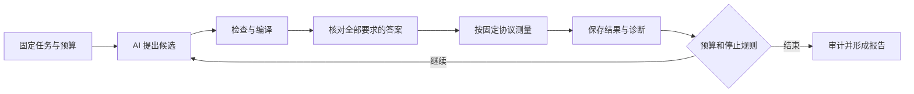

# 一次实验怎样进行

[中文首页](../zh-CN/README.md) · [English](../en/wiki/experiments.md) · [中英文对照](../README.md)

**先固定题目和判分规则，再让 AI 改候选，最后保存可复查的结果。**
这页解释流程；准确的运行参数和工具入口在 [RUNBOOK](../zh-CN/RUNBOOK.md)。

[返回 Wiki](README.md) · [结果解释](results.md)

## 按任务目的选择入口

核心架构区分任务数学、完整实现、单次执行和研究设计：Workload 拥有语义与 oracle，
Compiler 拥有 Program、叶子 Schedule 和显式改写，Run 冻结一次优化的权限与预算，
Study 预分配多个 Run 并分析结果。Evaluation 负责判对、测量和归因，Evidence 保存原始记录。
普通优化和研究分组共用一个 Run 引擎，旧 CampaignLock 只作输入适配。

| 系统入口 | 目的 | 结果边界 |
| --- | --- | --- |
| 固定候选的 Evaluation | 构建、正确性检查或独立 profiler，确认下一步是否能优化 | 封存产物、完整输出及测量/归因记录；不自动形成性能胜出或研究结论 |
| 独立 Run | Agent 在固定 Compiler、权限和预算下，通过 Ralph 搜索、过滤、评测和确认候选 | 经独立确认与审计的产物；按已有规则才可晋升 incumbent |
| Study | 预先固定实验分组、重复次数与统计方法，再执行相同的 Run | 受声明范围约束的研究报告；工程运行不能事后重标为消融组 |

下面是任务用途分类，不是六套执行器，也不是新增的 `mode` 字段。

| 任务用途 | 输入 | 处理目的与验收 |
| --- | --- | --- |
| 已有实现优化 | Workload、Cake starter/incumbent、目标、固定基线与预算 | 探索 fusion、tiling、工作划分和存储；确认在本机基线上是否有可靠改进 |
| 优秀外部实现的 Cake 复现 | 原任务/oracle、参考实现、结构分析；外部比较另需其固定可执行基线 | 恢复关键计算结构，验证语义并解释性能差距；只有 starter 时只能称 starter 优化 |
| 自主生成 | 数学定义、oracle、硬件/API 合同和受限参考材料 | 检查 Agent 在没有完整目标实现时的探索能力；必须满足 clean-start 访问边界 |
| 跨架构工程迁移 | 目标任务、获准使用的机制说明、源证据和可调用 pass | 判断适用性，重选目标参数，在目标设备重新验证；来源加速比不继承 |
| 受控比较与消融 | 冻结 Study、任务划分、模型/预算、处理条件和重复次数 | 区分方法、材料与工具的贡献，保留全部已分配 Run 和失败/缺失结果 |
| 能力摸底与诊断 | 固定 Program、参考机制或最小组件探针 | 定位表达、lowering、工具链、正确性或测量缺口；静态 lowering 不是实机资格 |

日常大量任务优先走独立优化 Run；外部优秀实现先做能力摸底，再进入参考复现。
迁移机制先在源平台发现、在目标开发集适配，冻结后才进入独立测试集消融。
发现 Compiler 缺口时记录 Finding，在运行之外修改并验证后继提交，再启动新 Run。
正在运行的冻结 Compiler、Workload、oracle 和测量规则不随维护工作改变。

参考权限是另一个维度：`clean_start` 不允许读取完整目标低层实现，
`known_kernel_reproduction` 允许读取声明的参考，`direct_low_level` 约束直接低层编写。
当前普通 launcher 提供 starter，默认属于 `known_kernel_reproduction`，不能作为从零生成证据。
显式使用 `--reference-access clean_start` 时，作者改为接收从 Workload ABI 生成的空
Schedule、数学定义和 API 文档；完整 starter 只留在评测侧用于固定基线验证。
该入口检查材料交付权限；实机作者进程还需隔离参考实现、历史会话和其他任务的文件访问。
源代码路径、材料文本和 pass 权限均需实际绑定，提示词本身不证明隔离。

E/P 迁移研究分别控制额外机制材料与显式变换权限，形成 E0P0、E1P0、E0P1、E1P1。
四组保持基础 IR、后端、oracle 与测量一致；P0 仍允许手动构造同样的优化。
E0P1 的接口也携带知识，因此 E 衡量额外说明的作用。具体协议以
[消融设计](../OPTIMIZATION_TRANSFER_ABLATION.md)为准，不在这里复制统计规则。

## 实现与验收范围

单 kernel 使用各目标已有的执行路径。完整 Program 的公共正确性路径覆盖 CUBIN、HSACO
和 MCFATBIN；普通优化 Run 的完整程序测量仍受其实际适配器约束。MACA 的独立 Program
profile 提供归因观察，不能借给单 dispatch timer 或普通 Run 宣称完整程序延迟。
Metal 多 stage、目标测量缺口和跨硬件收益实验的状态分别由平台记录与原始证据负责。

入口与权威对应如下，全部运行输出放在仓库外：

- 普通任务：`tools/launch_task.py`；批量任务：`tools/launch_task_matrix.py`。
- 多节点复现组织：`tools/kernel_experiment.py`，见[复现指南](../KERNEL_REPRODUCTION.md)。
- 已冻结 Run：`open-cake-ir lab run preflight|execute|audit --run ...`。
- E/P Study：`tools/transfer_study.py prepare|execute|audit`。
- 组件能力摸底：`tools/rewrite_collection.py assess`；固定原生 Program：
  `tools/qualify_tensor_program.py build|evaluate|profile`，按实际目标能力准入。

一次系统验收应分别报告：入口是否接通、候选是否正确、测量是否有效、是否优于固定基线、
是否通过最终确认。跨模式接线或少量任务成功，不能代替正式重复实验和迁移效果结论。

## 先区分两种改进

- **改候选：** 算同一道题，调整切块、分工或操作组合，编译器版本保持固定。
- **改编译器：** 已有表达能力或检查规则不足，需要补齐类型、规则、分析和生成能力，再发布后继版本。

一次实验中同时换题目、换编译器、换计时方法，就难以知道速度差来自哪里。

## 一轮候选搜索



检查失败的候选不会进入后续计时。编译器可先过滤不合法方案；
显式绑定匹配的经验模型时才进行成本排序，否则保留作者顺序。估算不能替代真实测量。

AI 看到 `TASK.md` 中的题目和预算，以及 `AGENTS.md` 中的工具与行为规则。
它提交候选后，外部评测器核对答案；Ralph 控制器记录剩余时间、token 和尝试次数。
预算到期可以正常结束，不必靠不断重试掩盖失败。

普通任务默认只按轮数、时间、编译和评测次数停止，token 持续记录但不设上限，
也不作为资格门槛。`--token-budget` 可为确实需要固定 token 额度的实验显式启用；
冻结 Run 中 `budget.limit: null` 与空 `checkpoints` 表示没有 token 限额。
这不会改变已启动 Run 或历史结果的预算和判定。

## 运行前看什么

| 要核对的内容 | 负责它的材料 |
| --- | --- |
| 输入、数学、输出、容差与测试行 | Workload Contract |
| 一次优化的环境、权限、预算、停止规则 | RunSpecification |
| 研究分组、重复次数与统计方法 | 研究时使用的 StudyPlan |
| 当前 Compiler 与完整语料 | clean commit、`compiler/revision.json` 与 Corpus Gate |
| Lab、评测代码和主机环境 | 源码提交与对应 Target 的 host capture |
| 实际 AI 程序与能力是否符合本次设计 | Provider qualification |
| 一次运行具体使用哪些固定版本 | 固定 Run 输入；旧 CampaignLock 只作输入适配 |
| GPU 分配与新输出目录 | 受控运行配置和本次外部证据根 |

在仓库根目录可以先查看 [当前发布状态](../../reports/current/STATUS.md)，再核对它是否过期：

```bash
.venv/bin/python tools/render_current_status.py --check
PYTHONPATH=src .venv/bin/python -m open_cake_ir.cli compiler check-corpus \
  --revision compiler/revision.json
```

这两个命令不会申请 GPU，也不会调用 AI。
GPU 操作需要实际机器、驱动、工具链和受控资源分配；旧教程中的绝对路径不能证明今天的环境可用。
当前 Executor 的机器声明才是需要核对的对象。

## 模板不等于一次已经获准的真实运行

普通优化直接准备 Run；研究模板说明如何预分配多个 Run。旧 Study 入口仍由 preflight
生成 CampaignLock，再转入同一 Run 引擎。
后续主线升级，不会让旧实验自动改用新编译器。

仓库的基础设施测试模板还含模拟 provider 和工具链信息。它们用于验证流程，不能原样冒充真实环境。
[执行手册](../zh-CN/RUNBOOK.md)说明如何从真实的 provider 验收记录构造实机 Study。

## 计时怎样公平

同一任务使用同一输入要求、同一机器、同一计时边界，先过正确性，再按冻结协议采样。
基线与候选的先后顺序也会影响结果，因此要按合同交错或成对测量，并保留原始样本。

Profiler 用于解释“时间花在哪里”，它会带来额外开销，不能把其耗时直接当作普通运行耗时。
更多解释见 [怎样读速度](results.md#怎样读速度)。

## 什么要保存

保存候选的固定内容、实际参数、诊断、编译产物、完整判对记录、原始计时样本和停止原因。
实际运行数据放在仓库外；提交源码和报告引用，避免把大型产物复制进项目。
失败、无效、没有执行和外部环境错误都要保持可区分。

科学比较还要按事先的 Study 规则做汇总，不能从多次尝试中只挑最好的一行来说明某组整体更好。
