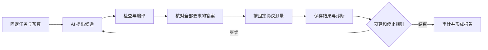

# 一次实验怎样进行

[中文首页](../zh-CN/README.md) · [English](../en/wiki/experiments.md) · [中英文对照](../README.md)

**先固定题目和判分规则，再让 AI 改候选，最后保存可复查的结果。**
这页解释流程；准确的运行参数和工具入口在 [RUNBOOK](../zh-CN/RUNBOOK.md)。

[返回 Wiki](README.md) · [结果解释](results.md)

## 先区分两种改进

- **改候选：** 算同一道题，调整切块、分工或操作组合，编译器版本保持固定。
- **改编译器：** 已有表达能力或检查规则不足，需要补齐类型、规则、分析和生成能力，再发布后继版本。

一次实验中同时换题目、换编译器、换计时方法，就难以知道速度差来自哪里。

## 一轮候选搜索



检查失败的候选不会进入后续计时。编译器可先过滤不合法方案；
只有具备匹配的校准证据时，才可把估算用于对应范围的排序。估算不能替代真实测量。

AI 看到 `TASK.md` 中的题目和预算，以及 `AGENTS.md` 中的工具与行为规则。
它提交候选后，外部评测器核对答案；Ralph 控制器记录剩余时间、token 和尝试次数。
预算到期可以正常结束，不必靠不断重试掩盖失败。

## 运行前看什么

| 要核对的内容 | 负责它的材料 |
| --- | --- |
| 输入、数学、输出、容差与测试行 | Workload Contract |
| 比较的环境、重复次数、预算、停止规则 | Study Contract |
| 当前 Compiler 与完整语料 | 发布 lock 和 Corpus Gate |
| Lab、评测代码和主机环境 | Executor descriptor |
| 实际 AI 程序与能力是否符合本次设计 | Provider qualification |
| 一次运行具体使用哪些固定版本 | preflight 生成的 CampaignLock |
| GPU 分配与新输出目录 | 受控运行配置和本次外部证据根 |

在仓库根目录可以先查看 [当前发布状态](../../reports/current/STATUS.md)，再核对它是否过期：

```bash
.venv/bin/python tools/render_current_status.py --check
.venv/bin/open-cake-ir compiler check-corpus --format text \
  --revision compiler/revision.lock.json
```

这两个命令不会申请 GPU，也不会调用 AI。
GPU 操作需要实际机器、驱动、工具链和受控资源分配；旧教程中的绝对路径不能证明今天的环境可用。
当前 Executor 的机器声明才是需要核对的对象。

## 模板不等于一次已经获准的真实运行

模板说明实验怎样安排；preflight 把其中的版本引用解析成一个固定 CampaignLock。
后续主线升级，不会让旧实验自动改用新编译器。

仓库的基础设施测试模板还含模拟 provider 和工具链信息。它们用于验证流程，不能原样冒充真实环境。
[执行手册](../zh-CN/RUNBOOK.md)说明如何从真实的 provider 验收记录构造实机 Study。

## 计时怎样公平

同一任务使用同一输入要求、同一机器、同一计时边界，先过正确性，再按冻结协议采样。
基线与候选的先后顺序也会影响结果，因此要按合同交错或成对测量，并保留原始样本。

Profiler 用于解释“时间花在哪里”，它会带来额外开销，不能把其耗时直接当作普通运行耗时。
更多解释见 [怎样读速度](results.md#怎样读速度)。

## 什么要保存

保存候选的固定内容、实际参数、诊断、编译产物、完整判对记录、原始计时样本和停止原因。
实际运行数据放在仓库外；提交源码和报告引用，避免把大型产物复制进项目。
失败、无效、没有执行和外部环境错误都要保持可区分。

科学比较还要按事先的 Study 规则做汇总，不能从多次尝试中只挑最好的一行来说明某组整体更好。
