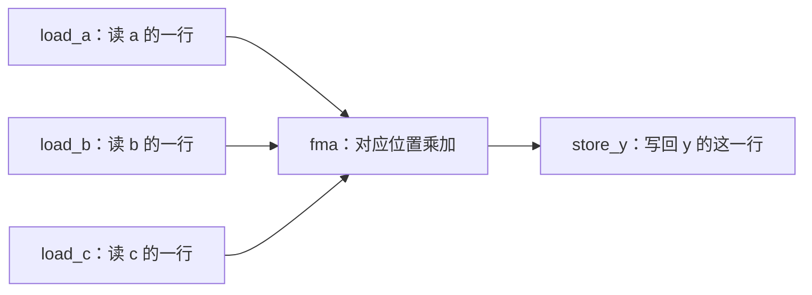

# 读懂一份执行计划

执行计划（Schedule）回答“怎样算”。它把工作分配给 GPU，并写明数据和操作之间的关系。
[入门教程](../GETTING_STARTED.md)已经检查过完整的 [FMA 计划](../../corpus/schedules/fma-b8-smoke.json)，下面沿用同一份文件。

[返回 Wiki](README.md) · [基本操作](primitives.md)

## 1. 数据是一张怎样的表

本例的 `a、b、c、y` 都是 8 行、128 列的表。代码把这种尺寸写作 `shape: [8, 128]`。
`a[2, 5]` 指第 3 行、第 6 个数：程序中的下标从 0 开始。
每个位置计算 `y[i,j] = a[i,j] × b[i,j] + c[i,j]`，不会混到别的位置。

多维数组也叫 **tensor（张量）**。先把它理解成有明确尺寸和顺序的一组数即可。
`dtype` 指每个数怎样存储。浮点数是计算机存小数的一种方式，有些小数只能近似保存。
FP32 每个数占 4 字节，BF16 占 2 字节；少占空间通常也意味着可保存的精度不同。

## 2. Buffer：数放在哪里

| 本例 Buffer | 放在哪里 | 用途 |
| --- | --- | --- |
| `a、b、c` | `global`，GPU 的大容量显存 | 输入，调用后不改变 |
| `a_tile、b_tile、c_tile` | `register`，线程使用的快速小存储 | 暂存正在处理的一行 |
| `y_tile` | `register` | 暂存这一行的答案 |
| `y` | `global` | 输出，保存最终答案 |

本例暂存的一行有 128 个数，但**不是说每个线程各占 128 个寄存器**；
具体怎样分配由后端决定，真实寄存器用量要看编译产物。

一般还有 `shared`（一组线程协作用的共享存储）和 `tensor`（目标硬件的专用存储，此处是存储位置名）。
它们容量较小，不是只改名称就能任意互换。

`mode` 说明用途：`input` 只读，`output` 输出，`scratch` 临时空间，`state` 是调用者传入并要更新的状态。
状态与普通临时变量不同：下一次调用可能继续使用它。见 [store](primitives.md#store)。

## 3. ProgramMap：谁负责哪一行

`program_map.axes[0]` 叫 `batch`，它沿着 `a` 的第 0 个维度分配工作，每份处理一行。
因此这一例中有 8 份行工作，`batch=0` 负责第一行，`batch=7` 负责最后一行。

计划中的 `compute` 角色使用 4 个 warp。warp 是 NVIDIA GPU 上一组 32 个线程。
不要把“一份行工作”“一个 warp”和“一个数”当成同一个东西。

更大的任务会分块处理；块叫 tile。`tile_loops` 描述块之间怎样循环，本例不需要这种循环。

## 4. Operation：这几步怎样接起来

每一步有唯一 `id`。`kind` 是操作种类；`reads` 和 `writes` 指明读、写哪些 Buffer。
`depends_on` 写前置操作：三个输入到齐后才可以算 FMA，算完后才可以写回。
这些依赖是“必须先完成什么”，不是让作者猜机器最后执行了几条指令。

FMA 的 `parameters.op` 是 `fma`，`instruction.contract` 固定舍入规则。
一个参数说明算什么，另一个说明该采用怎样的数值行为。

## 5. AccessMap：读写表里的哪个位置

在 `load_a` 的访问说明中：

- 第一个下标来自当前 `batch`，确定行号。
- 第二个下标来自维度 1，覆盖这一行的列。
- `boundary: mask_tiled_axes` 要求对按块访问的边界作检查。

`b、c、y` 用同样的行号，所以它们的对应元素才能对齐。
如果把一份工作误接到另一行，计算公式再正确也会写错位置。
访问坐标只在 AccessMap 中定义，不能再在其他字段放一份互相矛盾的坐标。

## 6. 最后的几个字段

| 字段 | 本例含义 |
| --- | --- |
| `outputs` | 调用者得到 `y` |
| `target` | 面向明确的 `sm_100a` 目标 |
| `lowering.backend` | 用 Triton 生成源码 |
| `lowering.entry_point` | 生成的入口函数叫什么 |
| `residency` | 对并发工作和寄存器的声明；不是测出的运行速度 |
| `allocations / pipelines / barriers` | 更复杂计划中的存储、流水和同步声明；本例为空 |

## 7. 怎样安全地开始修改

先复制完整示例到仓库外，再改变一个明确的选择，然后重新 `assess`。
不要从教学片段拼出一份缺字段的 JSON，也不要修改正在运行实验所固定的 Compiler。

- 要改变输入的形状或计算答案：先查 Workload 约定是否允许。
- 要调整分块、分工或数据复用：这是 Schedule 的工作，但仍须通过检查。
- 要添加新计算名称：先看 [基本操作](primitives.md)能否组合表达。

精确字段和限制以 [Authoring Contract](../../compiler/AUTHORING_CONTRACT.md)及当前 Compiler 为准。
